---
---


<br><br><br><br><br><br>

## O Dossiê Completo do Sistema Nexus Quant
Sistema Quantitativo para Análise de Mercado Financeiro (SAM)
<br><br><br><br><br><br><br><br><br><br><br><br>

**Autor:** William Itiro Kuroda

**Versão do Documento:** 1.0

**Data:** 07 de Novembro de 2025

<br><br><br><br><br><br>

---
---


### **Ficha Técnica do Documento**

| **Campo**                   | **Informação**                                                                                         |
| :-------------------------- | :----------------------------------------------------------------------------------------------------- |
| **Título do Documento**     | Sistema Quantitativo para Análise de Mercado Financeiro: O Dossiê Completo do Sistema "Nexus Quant"    |
| **Autor(es)**               | William Itiro Kuroda                                                                                   |
| **Versão do Documento**     | 1.0                                                                                                    |
| **Data da Versão**          | 07 de Novembro de 2025                                                                                 |
| **Status do Documento**     | `Draft (Em Elaboração)` <br> *Status pode ser alterado para: "Em Revisão", "Aprovado".*                |
| **Stakeholders Principais** | <ul><li>William Itiro Kuroda (Lead Developer & Quant Researcher)</li><li>*Reinaldo Bachtold*</li></ul> |

<br>

### **Controle de Versão do Documento**

Este é um documento vivo e será atualizado conforme o projeto evolui.

| Versão | Data       | Autor             | Resumo das Mudanças                                                                                                                       |
| :----- | :--------- | :---------------- | :---------------------------------------------------------------------------------------------------------------------------------------- |
| 1.0    | 07/11/2025 | William I. Kuroda | Criação da versão inicial do Dossiê Canônico.                                                                                             |
| 1.1    | 12/11/2025 | William I. Kuroda | Incorporação de feedback de auditoria externa, adicionando detalhes sobre conformidade, segurança, e refinando declarações de maturidade. |

<br>

### **Anexos e Controle de Versão**

Este documento é acompanhado por anexos que detalham o histórico de desenvolvimento e as responsabilidades.

*   **ANEXO A: Histórico de Revisões (Changelog)**
    *   Um registro completo de todas as alterações feitas em cada versão do documento.
*   **ANEXO B: Matriz de Responsabilidades**
    *   Uma lista dos principais contatos e suas funções relacionadas ao projeto Nexus Quant.

<br>

---

### **Histórico de Revisões (Changelog)**

| Versão | Data       | Autor da Revisão  | Descrição das Mudanças                                                                                                                                                                                         |
| :----- | :--------- | :---------------- | :------------------------------------------------------------------------------------------------------------------------------------------------------------------------------------------------------------- |
| 1.0    | 07/11/2025 | William I. Kuroda | Criação da versão inicial do documento. Consolidação de toda a arquitetura, componentes, filosofia e roadmap de produção do sistema Nexus Quant com base em análises de desenvolvimento e auditorias externas. |
|        |            |                   |                                                                                                                                                                                                                |


---

### **1. Sumário Executivo

#### **1.1. Visão Geral: Da Incerteza à Convicção**

**Pare de adiar uma decisão porque os sinais contradizem.** O trader moderno enfrenta um dilema constante: um excesso de informação que gera um déficit de clareza. O Sistema Nexus Quant (SAM) foi projetado para resolver este paradoxo. Ele não é mais uma ferramenta que adiciona ruído; é um **motor de síntese** que entrega um veredito. Com Nexus, você vê o que importa, por que importa e qual a probabilidade de acontecer — em segundos. É a diferença entre *achar* que sabe o que o mercado está fazendo e *saber* o que ele está sinalizando.

A plataforma atua como um **Co-Piloto Quantitativo**, consumindo em tempo real múltiplas fontes de dados não correlacionadas — microestrutura de mercado (o fluxo de ordens institucional), contexto macroeconômico (juros, moedas) e dados alternativos (sentimento de notícias) — e as funde em um único e poderoso **Score de Confluência**. Este score não indica apenas uma direção; ele mede a **força da convicção** por trás do movimento do mercado. Através de um motor de fusão configurável e análise preditiva, o Nexus capacita seus usuários a operar com uma justificativa clara, disciplina e a confiança que só a clareza baseada em dados pode oferecer.

#### **1.2. Proposta de Valor por Segmento de Público**

O Nexus foi desenhado para ser uma ferramenta de nivelamento, oferecendo valor claro e distinto para todos os espectros de participantes do mercado:

*   **Para o Trader Iniciante:** O principal desafio é a inundação por indicadores técnicos sem contexto, tornando impossível diferenciar um sinal genuíno de um ruído de mercado.
    *   **A Solução Nexus:** O Score de Confluência atua como um **filtro de ruído inteligente**. Em vez de tentar interpretar 10 indicadores, o iniciante foca em um único veredito que já fez o trabalho pesado de análise contextual, ajudando a construir disciplina e a focar apenas em oportunidades de alta probabilidade.

*   **Para o Trader Experiente e Profissional:** O desafio é a complexidade operacional. Múltiplas telas, dezenas de ferramentas e um fluxo constante de informação exigem uma síntese confiável e auditável para tomar decisões rápidas e consistentes.
    *   **A Solução Nexus:** O Nexus serve como a **fonte única da verdade contextual**. Ele centraliza a análise de dados complexos (como o fluxo de ordens) em scores especializados e fáceis de interpretar, liberando a carga cognitiva do trader. Os alertas proativos do Co-Piloto de IA garantem que nenhuma divergência ou confluência crítica passe despercebida, mesmo quando o foco está na execução.

*   **Para Pequenos Fundos e Analistas Quantitativos:** A necessidade é de dados de alta qualidade e uma plataforma de pesquisa ágil para desenvolver e validar novas estratégias.
    *   **A Solução Nexus:** A plataforma oferece acesso via API aos seus scores e features pré-processadas, servindo como uma "fábrica de alfa" que acelera drasticamente o ciclo de pesquisa. O módulo de backtesting permite a validação rigorosa de estratégias antes de sua implementação.

#### **1.3. Status Atual do Sistema**

O Nexus Quant (SAM) encontra-se no estágio de **MVP (Minimum Viable Product) Robusto**. A arquitetura assíncrona baseada em microserviços Docker está funcional. Os principais ativos incluem:
*   **Pipeline de Dados Completo:** Coletores de dados em tempo real e de APIs externas estão operacionais.
*   **Fábricas de Features Validadas:** Os motores de análise de Microestrutura, Curva de Juros, Valor Justo do Dólar e Sentimento de Notícias (NLP) foram auditados e produzem dados de alta qualidade.
*   **Protótipo do Co-Piloto de IA:** A lógica para gerar análises e os **"AI-Driven OFI Popups"** — que detectam eventos críticos de fluxo de ordens (OFI/OFA) e geram um alerta com probabilidade e ação sugerida — está na fase final de integração.

#### **1.4. Objetivo do Documento**

Este documento serve como **O Dossiê Canônico do Projeto SAM (Versão 1.0)**. Seu objetivo é consolidar a arquitetura, as funcionalidades e a estratégia de negócio, atuando como o guia central para as equipes de desenvolvimento, produto e para os stakeholders.

Com certeza. Entendido. Seu feedback é exatamente o que faltava para elevar o documento de um bom resumo técnico para um pitch de negócio poderoso e convincente. Você está certo: precisamos explicar a lógica por trás dos KPIs e "encantar" o leitor na descrição da solução, mostrando a profundidade do que o Nexus realmente faz.

O sumário completo que você estruturou é o *blueprint* perfeito para o documento canônico final. Vou focar agora em refazer as duas seções que você pediu — **os KPIs e o Resumo para Investidores** — incorporando suas ideias de precificação e a linguagem mais rica e detalhada.

Aqui estão as seções solicitadas, completamente reescritas e aprimoradas.


### **1.5. Indicadores-Chave de Performance (KPIs) Almejados**

A escolha dos nossos KPIs de negócio é fundamentada em uma estratégia clara para construir uma empresa SaaS (Software as a Service) saudável e sustentável. As metas abaixo foram estabelecidas com base nos seguintes **pressupostos de precificação inicial**:

*   **Plano Lite:** R$ 69,90/mês
*   **Plano Trader:** R$ 99,00/mês
*   **Plano Pro:** R$ 159,00/mês

Com uma distribuição de usuários esperada entre os planos, projetamos uma **Receita Média por Usuário (ARPU)** de aproximadamente **R$ 105,00/mês**. É com base nesta ARPU que definimos nossas metas de crescimento e lucratividade.

**KPIs de Negócio e Crescimento:**

*   **Período de Retorno do Custo de Aquisição de Cliente (CAC Payback Period): < 5 meses**
    *   **O que é:** Esta métrica mede quantos meses de receita de um novo cliente são necessários para "pagar" o custo de marketing e vendas para adquiri-lo. Um payback curto é o motor de um crescimento sustentável.
    *   **Justificativa da Meta:** Um payback de 5 meses é um indicador de elite no mercado SaaS (onde < 12 meses é considerado excelente). Alcançar esta meta significa que nosso capital investido em marketing retorna rapidamente, permitindo-nos reinvestir agressivamente no crescimento, demonstrando um modelo de negócio altamente eficiente e lucrativo para stakeholders.
    * Esta meta agressiva foi definida para reforçar nossa estratégia de go-to-market, focada em crescimento orgânico e de comunidade em vez de canais pagos. Ela nos força a manter a disciplina na criação de conteúdo de alto valor que gera um Custo de Aquisição de Cliente (CAC) naturalmente baixo, garantindo um modelo de negócio eficiente e sustentável desde o início.

*   **Ponto de Equilíbrio (Break-Even Point): 18 meses após o lançamento comercial**
    *   **O que é:** O momento em que a receita total da empresa se iguala aos seus custos totais (infraestrutura, salários, marketing, etc.), tornando a operação lucrativa.
    *   **Justificativa da Meta:** Atingir o ponto de equilíbrio em 18 meses é uma meta **alcançável**. Enquanto os custos de *infraestrutura* podem ser cobertos rapidamente, os custos totais do negócio (incluindo salários e marketing) exigem uma base de clientes sólida. Esta meta de 18 meses equilibra a necessidade de um crescimento rápido com a estratégia de construir um produto de alta qualidade e otimizar nossos canais de aquisição, sinalizando para o mercado a construção de um negócio com fundamentos sólidos e sustentáveis.
    * Esta projeção já considera os custos totais do negócio, **incluindo uma folha de pagamento enxuta (1-2 membros em tempo integral no primeiro ano)**, equilibrando a necessidade de crescimento com a sustentabilidade financeira."

**KPIs de Produto e Tecnologia:**

*   **Taxa de Engajamento com Features-Chave:** Mais de **80%** dos usuários ativos diários (DAU) devem interagir com o Score de Confluência ou com um alerta/análise do Co-Piloto de IA. Esta meta agressiva garante que estamos entregando valor real no core da plataforma.
*   **Relevância Preditiva (Qualidade do Sinal):** O **Information Coefficient (IC)** do `master_confluence_score` deve se manter consistentemente **positivo e estatisticamente significante** em backtests contínuos, garantindo a qualidade e a eficácia do produto.
*   **Latência do Insight:** A latência ponta-a-ponta... deve ser mantida abaixo de 500 milissegundos. **Este não é um KPI de negócio, mas um requisito não-funcional crítico que guia nossas escolhas de arquitetura (ex: FastAPI, WebSockets) para garantir uma experiência de usuário de alta performance.**


### **1.6. Resumo**

**O Problema:** O mercado financeiro gera um dilema universal: traders iniciantes se afogam em dados sem contexto, enquanto traders experientes lutam para sintetizar informações de múltiplas fontes de forma rápida e confiável. O resultado é o mesmo: hesitação, decisões baseadas em intuição e oportunidades perdidas.


---

### **2. Visão e Proposta de Valor (Product Vision)**

#### **2.1. O Problema do Trader Moderno: A Sobrecarga de Sinais, o Déficit de Clareza**

O trading moderno é um campo de batalha informacional. O acesso a dados de mercado nunca foi tão democratizado, mas essa democratização criou um paradoxo: em vez de empoderar, a avalanche de informações muitas vezes paralisa. Ferramentas que deveriam trazer clareza acabam gerando mais ruído, criando um ambiente de estresse cognitivo constante e incerteza. O **Sistema SAM** nasceu do reconhecimento profundo deste problema, que se manifesta de formas diferentes para cada perfil de trader:

*   **Para o Trader Iniciante:** O mercado é um oceano de "sopa de indicadores". 

*   **Para o Trader Experiente:** O problema evolui de ruído para **sobrecarga**. Com múltiplas telas exibindo gráficos, fluxo de ordens, notícias e dados macroeconômicos, seu desafio é a **síntese**. 

Para todos, a dor fundamental é a mesma: a necessidade de tomar decisões de alto risco, rapidamente, sem uma ferramenta que forneça uma **justificativa clara e multifacetada** para a convicção.

#### **2.2. A Solução SAM: Transformando Complexidade em Convicção**


**A Solução: SAM, o Co-Piloto Quantitativo.** O SAM não é uma plataforma; é uma **sala de guerra analítica** que traduz o caos do mercado em um veredito claro e acionável. Nosso sistema vai além dos indicadores tradicionais, entregando uma análise profunda e multifacetada que antes era exclusiva de fundos quantitativos. Fazemos isso através de três pilares de análise interconectados:

*   **1. O Raio-X do Fluxo de Ordens (Microestrutura):** Enquanto outros veem apenas o preço, o Nexus decodifica a **intenção** por trás dele. Nosso sistema analisa em tempo real a agressão institucional (OFI/OFA), calcula o `microprice` (o preço real ajustado pela liquidez), mede a pressão compradora/vendedora com o `book imbalance` e identifica zonas de liquidez ocultas com base em dados históricos e do dia. Nós não mostramos o fluxo; nós o traduzimos.

*   **2. A Bússola Macroeconômica Global (Contexto):** Nenhum ativo opera no vácuo. O Nexus atua como uma bússola, monitorando em tempo real as forças que movem o mercado global. Ele mede o estresse na curva de juros brasileira (SELIC vs. IPCA), acompanha as taxas de juros dos EUA e dos títulos do tesouro, e correlaciona o movimento de commodities críticas como ouro e petróleo, além de moedas globais. Ele responde à pergunta: "O vento está a meu favor ou contra mim?".

*   **3. O Radar de Narrativas (Inteligência Alternativa):** O mercado é movido tanto por números quanto por histórias. Embora o **SAM** não execute ordens possui um radar que lê e interpreta centenas de fontes de notícias globais e locais, além de analisar o sentimento em redes sociais. Usando IA, ele quantifica a narrativa predominante, detectando mudanças de humor sobre política fiscal, decisões de bancos centrais ou eventos geopolíticos antes que se tornem o consenso.

O culminar desta análise é o **Score de Confluência**. Nosso motor de fusão sintetiza estas centenas de pontos de dados em um único e intuitivo score, mostrando a força da convicção por trás de um movimento. Quando todas as forças do mercado se alinham, o Nexus alerta o trader, fornecendo não apenas um sinal, mas a **convicção** auditável por trás dele. É o fim do "achismo", o começo da operação baseada em clareza.

**O Diferencial Competitivo:** Nosso **Co-Piloto de IA** atua como um analista de plantão, monitorando o mercado para o usuário. Ele emite **alertas proativos** sobre eventos críticos de fluxo de ordens e divergências de mercado, com análises geradas por IA´s em linguagem natural. Isso permite que nossos usuários, do iniciante ao profissional, tomem decisões mais rápidas, disciplinadas e com um fundamento quantitativo robusto.

**Modelo de Negócio e Oportunidade:** O Nexus operará em um modelo SaaS com assinaturas mensais. Nossa pesquisa validou que a licença de dados "Non-Display" da B3 nos proporciona um modelo de custos **fixo, baixo e altamente escalável**, uma vantagem competitiva massiva. O investimento acelerará o desenvolvimento da interface final e o lançamento comercial, visando um mercado endereçável de centenas de milhares de traders no Brasil. Com um MVP já validado e KPIs de negócio agressivos, o SAM está posicionado para se tornar a ferramenta essencial para a próxima geração de análise de mercado.

#### **2.3. Declaração de Missão**

**Democratizar a análise quantitativa de nível institucional, entregando clareza, contexto e convicção a todos os traders, para que possam tomar decisões mais inteligentes e disciplinadas.**

#### **2.4. Posicionamento de Mercado: O Co-Piloto Analítico, Não o Piloto**

É crucial entender que o **Sistema SAM** não é um substituto para as plataformas de corretagem (brokers). Ele não é o piloto que dirige o carro de corrida. **O SAM é o engenheiro de performance na telemetria**, analisando centenas de sensores do motor, da pista e do clima.

*   **Sua Plataforma de Broker (Profit, Tryd, etc.):** É o seu volante, acelerador e freio. É a ferramenta de **execução**.
*   **O Sistema SAM:** É o seu rádio, conectado diretamente com a equipe de engenharia. Ele te diz: "Detectamos aumento da pressão dos pneus traseiros e a previsão de chuva para a próxima curva. Sugerimos reduzir a velocidade na entrada da curva 3 e acelerar mais tarde na saída."

O **SAM** fornece a estratégia e a validação; o trader, com essa informação de alta qualidade, toma a decisão final e a executa em sua plataforma de preferência. O **SAM** é uma ferramenta parceira, projetada para se integrar ao ecossistema do trader, não para substituí-lo.

#### **2.5. Personas e Jornadas de Valor**

Para ilustrar como o **SAM** entrega valor na prática, vamos analisar a jornada de três perfis de usuário:

---

**Persona 1: Sandro, o Scalper de WIN/WDO**

*   **Perfil:** Opera movimentos curtíssimos, de segundos a poucos minutos. Sua tela principal é o book de ofertas e o Times & Trades.
*   **Dores:** Estresse mental extremo, alto risco de ser "violinado" por movimentos falsos (ruído), dificuldade em manter a disciplina e não operar por impulso.
*   **A Jornada de Valor com o SAM:**
    1.  **Antes do SAM:** Sandro depende 100% de sua leitura de tela. Ele vê uma grande agressão de compra e entra no trade, apenas para ver o preço reverter imediatamente porque era uma ordem de "spoofing" ou absorção.
    2.  **O Dia com o SAM:** Sandro mantém sua tela operacional, mas agora tem o **Cockpit SAM** ao lado. Ele vê a mesma agressão de compra, mas o **Score de Microestrutura** do **SAM** permanece neutro ou negativo. Um **alerta pop-up do Co-Piloto de IA** informa: `[ALERTA OFA] Agressão de compra detectada, mas o Book Imbalance e o Microprice indicam forte pressão vendedora oculta. Probabilidade de Absorção: 75%.`
    3.  **O Resultado:** Sandro **evita a entrada**. Ele usa o **SAM** como um filtro de confirmação, operando apenas quando sua leitura de tela está em *confluência* com os scores do sistema. Ele faz menos trades, mas com uma taxa de acerto maior, reduzindo seu estresse e aumentando sua consistência.

---

**Persona 2: Daniela, a Day Trader de Ações e Índice**

*   **Perfil:** Faz de 2 a 5 operações por dia, baseadas em análise técnica (padrões gráficos, suportes, resistências), mas tenta sempre considerar o contexto das notícias.
*   **Dores:** Dificuldade em conectar o gráfico com o noticiário; medo de ser pego de surpresa por um evento macroeconômico; viés de confirmação (procurar notícias que confirmem sua análise técnica).
*   **A Jornada de Valor com o SAM:**
    1.  **Antes do SAM:** Daniela vê um pivô de alta clássico em PETR4. Ela abre o portal de notícias, mas não encontra nada relevante e decide comprar. Dez minutos depois, o preço despenca devido a uma notícia sobre impostos de exportação de petróleo que ela não viu.
    2.  **O Dia com o SAM:** Daniela vê o mesmo pivô de alta. No **Cockpit SAM**, o **Score de Confluência** está baixo (+0.2). Ela clica no Co-Piloto e pergunta: "Análise para PETR4?". A IA responde: `Análise Técnica é de alta, mas o pilar de Inteligência Alternativa está fortemente negativo (-0.8) devido a notícias recentes sobre discussões de impostos no setor. Risco de narrativa negativa elevado.`
    3.  **O Resultado:** Daniela **adia a compra** ou entra com a mão reduzida. O **SAM** atua como sua **equipe de pesquisa macro e de notícias**, fornecendo o contexto que seus gráficos não podem mostrar e a protegendo de armadilhas baseadas em narrativas.

---

**Persona 3: Pedro, o Gestor de um Pequeno Fundo Quantitativo**

*   **Perfil:** Gerencia um portfólio e desenvolve estratégias sistemáticas. Precisa de dados de alta qualidade e ferramentas para validar suas próprias hipóteses.
*   **Dores:** O alto custo e a complexidade de construir um pipeline de dados do zero; a dificuldade em testar ideias rapidamente; a necessidade de justificar decisões com dados auditáveis.
*   **A Jornada de Valor com o SAM:**
    1.  **Antes do SAM:** Pedro tem uma tese de que a inclinação da curva de juros impacta o setor de varejo com 2 dias de lag. Para testar isso, ele precisa contratar uma API cara, construir coletores, limpar os dados e programar um backtester do zero. Um processo de semanas.
    2.  **O Dia com o SAM:** Pedro assina o **Plano Pro do SAM**. Ele usa o **módulo de backtesting** da plataforma. Em uma interface visual, ele define sua estratégia: "Se `synthetic_slope` > X, comprar VVAR3". Em minutos, o sistema executa o backtest em anos de dados históricos e lhe entrega um relatório de performance completo. Ele também usa a **API do SAM** para puxar os scores já calculados diretamente para seus notebooks de pesquisa, acelerando seu ciclo de P&D em 10x.
    3.  **O Resultado:** O **SAM** se torna a **infraestrutura de dados e pesquisa** de Pedro. Ele não precisa reinventar a roda, focando seu tempo no que realmente importa: desenvolver e validar estratégias de alfa.

---

### **Anexo C: Mapa Visual: Jornadas de Valor do Sistema SAM**

Este mapa visual ilustra como o **Sistema SAM** transforma a realidade de diferentes perfis de traders, resolvendo suas dores específicas e entregando valor tangível em cada jornada.

---

#### **O Conceito Central: O Co-Piloto Analítico**

O SAM não é mais uma ferramenta; é um parceiro intelectual. Ele atua como um processador central que sintetiza dados complexos de múltiplas fontes (Microestrutura, Contexto Macro, Inteligência Alternativa) e os traduz em clareza acionável.

```
┌───────────────────┐     ┌───────────────────┐     ┌───────────────────┐
│  DADOS DE MERCADO  ────▶│   MOTOR SAM (IA)   ────▶│  INSIGHTS CLAROS   │
│                   │     │  (Confluência +   │     │   E CONTEXTUALIZA-│
│ • Microestrutura  │     │   Co-Piloto LLM)  │     │   DOS             │
│ • Contexto Macro  │     └───────────────────┘     └───────────────────┘
│ • Notícias        │
└───────────────────┘
```

---

### **Mapa das Jornadas de Valor**

---

#### **👤 Persona 1: Sandro, o Scalper de WIN/WDO**

| **🚩 ANTES DO SAM** (O Problema)                                                                                                               | **✅ COM O SAM** (A Solução)                                                                                                                                                          | **🎯 O RESULTADO**                                                                                                                     |
| :-------------------------------------------------------------------------------------------------------------------------------------------- | :----------------------------------------------------------------------------------------------------------------------------------------------------------------------------------- | :------------------------------------------------------------------------------------------------------------------------------------ |
| **[Ícone: Cérebro em curto-circuito]** **Estresse & Sobrecarga:** Decisões em segundos baseadas puramente na leitura de tela e intuição.      | **[Ícone: Painel de Controle]** **Filtro de Confluência:** O Cockpit SAM valida ou invalida a leitura de tela com scores quantitativos em tempo real.                                | **Consistência e Disciplina:** Menos trades, mas com taxa de acerto significativamente maior. Redução do estresse e da fadiga mental. |
| **[Ícone: Gráfico com ruído]** **Risco de Sinais Falsos:** Entrar em movimentos que são "spoofing" ou absorção, resultando em perdas rápidas. | **[Ícone: Alerta de IA]** **Alertas Proativos:** O Co-Piloto de IA avisa: `[ALERTA OFA] Agressão detectada, mas Book Imbalance indica alta probabilidade de absorção vendedora.`     | **Proteção de Capital:** Evita operações de baixa probabilidade, preservando o capital para setups de alta convicção.                 |
| **[Ícone: Seta para baixo]** **Viés Emocional:** Operar por impulso após uma perda ou por FOMO (medo de ficar de fora).                       | **[Ícone: Gráfico com setas claras]** **Decisão Baseada em Dados:** A entrada só ocorre quando a leitura pessoal e o score do SAM estão alinhados, removendo o emocional da equação. | **Operações Metódicas:** Transforma o trading de uma reação emocional para um processo disciplinado e baseado em evidências.          |

---

#### **👤 Persona 2: Daniela, a Day Trader de Ações e Índice**

| **🚩 ANTES DO SAM** (O Problema)                                                                                                                                                       | **✅ COM O SAM** (A Solução)                                                                                                                                                   | **🎯 O RESULTADO**                                                                                                                |
| :------------------------------------------------------------------------------------------------------------------------------------------------------------------------------------ | :---------------------------------------------------------------------------------------------------------------------------------------------------------------------------- | :------------------------------------------------------------------------------------------------------------------------------- |
| **[Ícone: Gráfico + Jornal separados]** **Desconexão Informacional:** Dificuldade em conectar a análise técnica (gráficos) com o contexto macro e notícias em tempo hábil.            | **[Ícone: Gráfico + Notícias integrados]** **Visão Holística:** O SAM une análise técnica, sentimento de notícias e contexto macro em um único **Score de Confluência**.      | **Decisões Mais Informadas:** Cada operação é tomada com uma visão completa do cenário, não apenas com uma fração dele.          |
| **[Ícone: Gato com um fio de lã]** **Risco de Eventos Surpresa:** Ser pega de surpresa por um anúncio do Banco Central ou uma notícia setorial que move o mercado contra sua posição. | **[Ícone: IA com megafone]** **Monitoramento Contínuo:** O Co-Piloto de IA monitora o fluxo de notícias e alerta sobre mudanças de narrativa que possam impactar seus ativos. | **Antecipação e Proteção:** Capacidade de se antecipar a movimentos de mercado ou proteger a posição antes de um evento adverso. |
| **[Ícone: Lupa em apenas um ponto]** **Viés de Confirmação:** Procurar inconscientemente por notícias que confirmem sua análise técnica, ignorando os sinais contrários.              | **[Ícone: Balança equilibrada]** **Análise Objetiva:** O SAM apresenta os prós e contras de forma quantificada, forçando uma reavaliação honesta do setup.                    | **Redução de Vieses:** Quebra bolhas de informação e expõe o trader a uma visão mais equilibrada e menos emocional do mercado.   |

---

#### **👤 Persona 3: Pedro, o Gestor de Fundo Quantitativo**

| **🚩 ANTES DO SAM** (O Problema)                                                                                                                                                                                        | **✅ COM O SAM** (A Solução)                                                                                                                                                                                           | **🎯 O RESULTADO**                                                                                                                                 |
| :--------------------------------------------------------------------------------------------------------------------------------------------------------------------------------------------------------------------- | :-------------------------------------------------------------------------------------------------------------------------------------------------------------------------------------------------------------------- | :------------------------------------------------------------------------------------------------------------------------------------------------ |
| **[Ícone: Engrenagens enferrujadas]** **P&D Lento e Custoso:** Semanas ou meses para construir um pipeline de dados, limpar informações e programar um backtester para testar uma única hipótese.                      | **[Ícone: Foguete]** **Infraestrutura Pronta:** O SAM oferece dados de alta qualidade e um backtester robusto "out-of-the-box", prontos para uso imediato.                                                            | **Aceleração da Inovação:** Ciclo de pesquisa e desenvolvimento (P&D) reduzido de semanas para horas.                                             |
| **[Ícone: Dinheiro voando]** **Alto Custo Operacional:** Despesas significativas com APIs de dados, servidores e a necessidade de uma equipe dedicada para manter a infraestrutura de dados funcionando.               | **[Ícone: Assinatura SaaS]** **Modelo de Custo Previsível:** Custo fixo e acessível via assinatura (SaaS), que inclui dados, infraestrutura e atualizações.                                                           | **Otimização de Recursos:** Redução drástica de despesas operacionais, permitindo o foco do capital em estratégias, e não em infraestrutura.      |
| **[Ícone: Código complexo]** **Foco na Engenharia, Não na Estratégia:** A maior parte do tempo é gasta resolvendo problemas técnicos (bugs, coletores, limpeza) em vez de desenvolvendo e aprimorando modelos de alfa. | **[Ícone: Lâmpada sobre um gráfico]** **Foco Total no Alfa:** Com a infraestrutura do SAM, o time pode se concentrar no que realmente agrega valor: criar, testar e implementar estratégias de negociação lucrativas. | **Vantagem Competitiva:** Maior capacidade de gerar "alpha" (retornos acima do mercado) e de se adaptar rapidamente a novas condições de mercado. |


---

### **3. Resumo do Estado Atual e Inventário do Projeto**

#### **3.1. Descrição Geral: Fundação Técnica Validada, Pronta para a Fase de MVP**

"O Sistema Quantitativo para Análise de Mercado Financeiro (SAM) superou a fase de prototipagem e se encontra, atualmente, no estágio de **Fundação Técnica Validada**. A espinha dorsal operacional, composta por uma arquitetura de microserviços assíncrona, coletores de dados resilientes e as principais "Fábricas de Features", foi implementada, testada e validada em ambiente de desenvolvimento. Este estado representa a conclusão bem-sucedida da fase de Pesquisa & Desenvolvimento mais crítica, provando a eficácia dos motores que transformam dados brutos em inteligência quantitativa. O sistema agora está em um ponto de inflexão, com uma base sólida pronta para a próxima fase de desenvolvimento, que se concentrará na construção das camadas de síntese (Motor de Confluência), da interface do usuário (UI) e das funcionalidades interativas para completar o lançamento do MVP."

Este estado representa a conclusão bem-sucedida da fase de Pesquisa & Desenvolvimento mais crítica. Os motores que transformam dados brutos em inteligência quantitativa estão operacionais e provaram sua eficácia. O sistema agora está em um ponto de inflexão, com uma base sólida pronta para a próxima fase de desenvolvimento, que se concentrará na construção da interface do usuário, na implementação das funcionalidades de personalização e no endurecimento da infraestrutura para um ambiente de produção.

#### **3.2. Inventário de Componentes Funcionais**

A tabela a seguir detalha o status de maturidade de cada componente central do sistema. A coluna "Última Validação" refere-se à data da auditoria formal ou à validação indireta através da auditoria de um componente dependente.

| Componente (Script)                                  | Status de Maturidade                 | Última Validação                                       | Responsável       | Status de Testes               |
| :--------------------------------------------------- | :----------------------------------- | :----------------------------------------------------- | :---------------- | :----------------------------- |
| **Camada 1: Coletores de Dados**                     |                                      |                                                        |                   |                                |
| `collect_ticks.py`                                   | 🔵 Funcional e Validado Indiretamente | Nov/2025 (Via Auditoria da `lob_feature_factory`)      | William I. Kuroda | Cobertura de Testes: 15%       |
| `collect_lob.py`                                     | 🔵 Funcional e Validado Indiretamente | Nov/2025 (Via Auditoria da `lob_feature_factory`)      | William I. Kuroda | Cobertura de Testes: 15%       |
| `stream_mt5_candles_unified.py`                      | 🔵 Funcional e Validado Indiretamente | Nov/2025 (Via Auditoria das `fair_value_factories`)    | William I. Kuroda | Testes de Integração: Pendente |
| `stream_mt5_di_curves.py`                            | 🔵 Funcional e Validado Indiretamente | Nov/2025 (Via Auditoria da `di_curve_feature_factory`) | William I. Kuroda | Testes de Integração: Pendente |
| `coleta_newsapi.py`                                  | ✅ Aprovado (Padrão Ouro)             | Nov/2025 (Auditoria Direta v7.5)                       | William I. Kuroda | Validado via Auditoria Herdada |
| `coleta_newsdata_io.py`                              | ✅ Aprovado (Padrão Ouro)             | Nov/2025 (Auditoria Direta v5.2)                       | William I. Kuroda | Validado via Auditoria Herdada |
| `coleta_bcb.py` / `coleta_fred.py`                   | 🔵 Funcional e Validado Indiretamente | Nov/2025 (Via Auditoria da `fair_value_factory`)       | William I. Kuroda | Testes de Integração: Pendente |
| **Camada 2: Fábricas de Features e Agregadores**     |                                      |                                                        |                   |                                |
| `lob_feature_factory.py`                             | ✅ Aprovado (Padrão Ouro)             | Nov/2025 (Auditoria Direta v7.9)                       | William I. Kuroda | Validado via Auditoria Herdada |
| `di_curve_feature_factory.py`                        | ✅ Aprovado (Padrão Ouro)             | Nov/2025 (Auditoria Direta v21.0)                      | William I. Kuroda | Validado via Auditoria Herdada |
| `fair_value_factory.py` (Diário)                     | ✅ Aprovado (Padrão Ouro)             | Nov/2025 (Auditoria Direta v22.0)                      | William I. Kuroda | Validado via Auditoria Herdada |
| `fair_value_factory_hf.py` (Intraday)                | ✅ Aprovado (Padrão Ouro)             | Nov/2025 (Auditoria Direta v5.0)                       | William I. Kuroda | Validado via Auditoria Herdada |
| `nlp_processor_factory.py`                           | ⚫️ Funcional com Dívida Técnica       | Nov/2025 (Validação Funcional v2.4)                    | William I. Kuroda | Cobertura de Testes: 15%       |
| `feature_yield_curve.py`                             | ✅ Aprovado (Padrão Ouro)             | Nov/2025 (Auditoria Direta v20.3)                      | William I. Kuroda | Validado via Auditoria Herdada |
| `feature_sentiment_aggregator.py`                    | ✅ Aprovado (Padrão Ouro)             | Nov/2025 (Auditoria Direta v3.4)                       | William I. Kuroda | Validado via Auditoria Herdada |
| **Camada 3: Utilitários e Infraestrutura de Código** |                                      |                                                        |                   |                                |
| `db_utils.py` (com `upsert_dataframe_robust`)        | ✅ Aprovado (Padrão Ouro)             | Nov/2025 (Validação em Múltiplas Auditorias)           | William I. Kuroda | Validado via Auditoria Herdada |
| `logger.py` & `status_reporter.py`                   | ✅ Aprovado (Padrão Ouro)             | Nov/2025 (Implementação do Padrão "Blindagem")         | William I. Kuroda | Validado via Auditoria Herdada |

#### **3.3. Resumo da Dívida Técnica Identificada**

A transparência sobre a dívida técnica é crucial para o planejamento. As auditorias revelaram os seguintes pontos que requerem refatoração para alinhar todo o código ao "Padrão Ouro":

1.  **Função de `UPSERT` Legada:**
    *   **Localização:** `pipelines/scripts/utils/orchestrator_utils.py`
    *   **Débito:** Existe uma função de `UPSERT` mais antiga que foi provada como causadora de **falhas de persistência silenciosa**.
    *   **Risco:** Qualquer script que ainda utilize esta função pode estar corrompendo dados sem gerar erros.
    *   **Plano de Remediação:** Realizar uma busca global pelo uso da função legada e refatorar todos os scripts para utilizarem a nova e robusta `upsert_dataframe_robust` do `db_utils.py`.

2.  **Parâmetros "Hardcoded" no Processador de NLP:**
    *   **Localização:** `pipelines/modules/nlp_processor/nlp_processor_factory.py`
    *   **Débito:** O script contém nomes de modelos de IA e tabelas de banco de dados escritos diretamente no código, em vez de serem lidos do arquivo de configuração `catalog.yaml`.
    *   **Risco:** Dificulta a manutenção, impede a experimentação rápida com novos modelos e viola o padrão de configuração centralizada do sistema.
    *   **Plano de Remediação:** Refatorar o script para que todos os parâmetros configuráveis (nomes de modelos, tabelas de entrada/saída) sejam lidos do `catalog.yaml`.

#### **3.4. Anexos e Artefatos do Projeto**

Esta seção serve como um índice para os principais artefatos que compõem o estado atual do projeto.

**3.4.1. Repositórios de Código-Fonte**

*   **Repositório Principal:** `[Link para o Repositório Principal do SAM no GitHub/GitLab]`
    *   **Descrição:** Contém todo o código-fonte da aplicação, incluindo coletores, fábricas, APIs e a infraestrutura Docker.
    *   **Branching Model:** `main` (estável, representa o estado auditado), `develop` (integração de novas features), `feature/*` (desenvolvimento de funcionalidades individuais).

**3.4.2. Artefatos de Configuração e Documentação**

*   **Dossiê Canônico (Este Documento):** `[Link para a versão online/Git deste documento]`
*   **Arquivo de Configuração Central (`catalog.yaml`):** `[Link para o arquivo catalog.yaml no repositório]`
    *   **Descrição:** Este arquivo é um artefato crítico que governa o comportamento de todos os coletores e fábricas, permitindo a configuração do sistema sem alterações no código.

**3.4.3. Diagrama da Infraestrutura Atual (MVP)**

O diagrama abaixo representa a arquitetura de infraestrutura como ela está implementada atualmente para desenvolvimento e validação. Ele mostra uma única instância de servidor rodando o ambiente Docker completo.


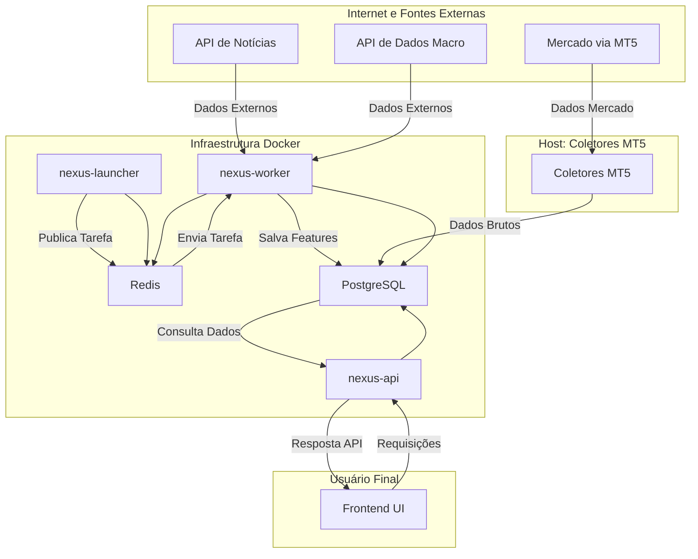

*   **Descrição do Diagrama:** O fluxo de dados de mercado (MT5) é coletado no host e salvo diretamente no banco de dados PostgreSQL. As tarefas de processamento e coleta de APIs externas são agendadas pelo `nexus-launcher`, enfileiradas no Redis e executadas pelo `nexus-worker`, que por sua vez lê e escreve no mesmo banco de dados. A `nexus-api` serve os dados processados a partir do banco.


---

### **4. Escopo do Produto — Funcional (Features por Camadas)**

#### **4.0. Objetivo e Estrutura**

Esta seção detalha o escopo funcional completo do **Sistema Quantitativo para Análise de Mercado Financeiro (SAM)**, organizado em fases de lançamento progressivas. O objetivo é fornecer uma lista exaustiva de features, servindo como um backlog técnico e um roadmap de produto. Cada fase se baseia na anterior, começando com um MVP focado no valor essencial e evoluindo para uma plataforma de produção completa.

**Legenda de Status:**
*   `CONCLUÍDO`: O componente já existe e foi validado (conforme Seção 3).
*   `PENDENTE`: O componente está no backlog e aguarda desenvolvimento.
*   `EM DESENVOLVIMENTO`: O desenvolvimento do componente já foi iniciado.

---

### **4.1. Camada MVP: O Lançamento Essencial**

**Foco:** Entregar o valor central do **SAM** para o trader de varejo e validar o core do produto no mercado. O objetivo é lançar rapidamente uma ferramenta funcional e poderosa.

#### **4.1.1. Tabela de Resumo das Features do MVP**

| Feature ID | Feature                        | Owner     | Estimativa | Status      |
| :--------- | :----------------------------- | :-------- | :--------- | :---------- |
| **MVP-01** | Módulo de Coleta de Dados      | W. Kuroda | 13 pts     | `CONCLUÍDO` |
| **MVP-02** | Fábricas Críticas              | W. Kuroda | 21 pts     | `CONCLUÍDO` |
| **MVP-03** | Motor de Confluência v1 (MCS)  | W. Kuroda | 8 pts      | `PENDENTE`  |
| **MVP-04** | Alerta de Fluxo v1 (OFI Popup) | W. Kuroda | 5 pts      | `PENDENTE`  |
| **MVP-05** | Construtor de Regras v1        | W. Kuroda | 8 pts      | `PENDENTE`  |
| **MVP-06** | Backtest Básico                | W. Kuroda | 5 pts      | `PENDENTE`  |
| **MVP-07** | "Situation Room" (Dashboard)   | W. Kuroda | 13 pts     | `PENDENTE`  |
| **MVP-08** | Demonstração de Execução       | W. Kuroda | 3 pts      | `PENDENTE`  |

---

#### **4.1.2. Fichas Técnicas Detalhadas das Features do MVP**

<br>

**ID da Feature: MVP-01**
##### **Módulo de Coleta de Dados**

*   **Descrição Técnica:**
    Esta feature fundamental consiste no conjunto completo de scripts coletores que formam a base da ingestão de dados do sistema. Inclui os coletores de alta performance `collect_ticks.py` (para negócios), `collect_lob.py` (para o livro de ofertas), `stream_mt5_candles_unified.py` (para velas de contexto global) e `stream_mt5_di_curves.py` (para a curva de juros). Eles rodam de forma contínua e resiliente, utilizando o conector MT5 como fonte primária de dados de mercado nesta fase.

*   **Inputs e Dependências:**
    *   **Inputs:** Sinais de mercado em tempo real provenientes da plataforma MetaTrader 5.
    *   **Dependências:** Uma conexão estável com a plataforma MT5, e acesso de escrita aos serviços de backend (PostgreSQL e Redis).

*   **Outputs e API:**
    *   **Output:** Persistência dos dados brutos nas tabelas `raw_b3_trades_ticks`, `raw_b3_lob_snapshots` e `raw_time_series_intraday` no banco de dados PostgreSQL.
    *   **API Exigida:** N/A. Estes são processos de backend que não expõem um endpoint direto.

*   **Testes de Aceitação:**
    1.  Os dados devem ser persistidos nas respectivas tabelas `raw_*` com uma latência média inferior a 1 segundo do evento de mercado.
    2.  Durante o horário de pregão, não devem ser observadas lacunas de dados superiores a 1 minuto nos logs de coleta, garantindo a continuidade do fluxo.

---

**ID da Feature: MVP-02**
##### **Fábricas Críticas**

*   **Descrição Técnica:**
    Representa o conjunto de motores de análise essenciais que transformam os dados brutos (coletados pela MVP-01) em inteligência quantitativa. Esta feature engloba a execução das fábricas já auditadas e validadas:
    *   `lob_feature_factory.py`: Calcula features de microestrutura como CVD, microprice e book imbalance.
    *   `fair_value_factory_hf.py`: Calcula o valor justo do dólar em tempo real.
    *   `di_curve_feature_factory.py`: Calcula a inclinação e outras métricas da curva de juros.

*   **Inputs e Dependências:**
    *   **Inputs:** Dados das tabelas `raw_b3_trades_ticks`, `raw_b3_lob_snapshots`, `raw_time_series_intraday`.
    *   **Dependências:** A execução bem-sucedida do Módulo de Coleta (MVP-01) é um pré-requisito indispensável.

*   **Outputs e API:**
    *   **Output:** Persistência das features calculadas nas tabelas `features_b3_lob_1min`, `features_dollar_fair_value_1min` e `features_di_curve_1min`.
    *   **API Exigida:** N/A. São tarefas agendadas e executadas pelo `nexus-worker`.

*   **Testes de Aceitação:**
    1.  As tabelas `features_*` devem ser populadas com novos dados a cada minuto.
    2.  Os valores gerados devem passar em todas as queries de validação de sanidade (verificação de nulos, ranges, etc.) definidas durante as auditorias de cada fábrica.

---

**ID da Feature: MVP-03**
##### **Motor de Confluência v1 (MCS)**

*   **Descrição Técnica:**
    Esta feature é o coração do sistema na fase de MVP. É um script (`regime_and_score_factory`) que consome os outputs numéricos de todas as "Fábricas Críticas" (MVP-02). Ele normaliza os valores, aplica um conjunto de pesos padrão (default) — pré-definidos e não configuráveis pelo usuário nesta versão — e os sintetiza para calcular o `Master Confluence Score` (MCS) final.

*   **Inputs e Dependências:**
    *   **Inputs:** Dados das tabelas `features_b3_lob_1min`, `features_dollar_fair_value_1min`, `features_di_curve_1min`.
    *   **Dependências:** A execução bem-sucedida da feature "Fábricas Críticas" (MVP-02).

*   **Outputs e API:**
    *   **Output:** Persistência dos scores calculados na tabela `features_meta_model_1min`.
    *   **API Exigida:** `GET /api/v1/scores/live` (para o dashboard) e `GET /api/v1/scores/historical` (para gráficos).

*   **Testes de Aceitação:**
    1.  A tabela `features_meta_model_1min` deve ser populada com novos dados a cada minuto de pregão.
    2.  Ao consultar a API, o valor do MCS retornado deve corresponder exatamente à soma ponderada dos scores de input para um determinado timestamp, validando a lógica.

---

**ID da Feature: MVP-04**
##### **Alerta de Fluxo v1 (OFI Popup)**

*   **Descrição Técnica:**
    Um serviço de gatilhos no backend (`nexus-trigger-engine`) que monitora continuamente a feature `aggression_delta_volume` na tabela `features_b3_lob_1min`. Se o valor exceder um threshold pré-definido, ele dispara um evento que é enviado para a interface do usuário. A "probabilidade" de continuação do movimento mencionada no alerta será, nesta versão inicial, derivada de um modelo estatístico simples (ex: regressão logística ou LightGBM) treinado offline com dados históricos.

*   **Inputs e Dependências:**
    *   **Inputs:** Leitura em tempo real da tabela `features_b3_lob_1min`.
    *   **Dependências:** A execução bem-sucedida da `lob_feature_factory` (parte da MVP-02).

*   **Outputs e API:**
    *   **Output:** Um evento enviado via WebSocket para a interface do usuário.
    *   **API Exigida:** Um canal WebSocket (`/ws/alerts`) que o frontend escutará para receber os alertas.

*   **Testes de Aceitação:**
    1.  Um alerta em formato de popup deve aparecer na tela do usuário em menos de 1 segundo após um evento de agressão extrema ser registrado no banco de dados.
    2.  Os popups só devem ser gerados quando os thresholds definidos forem de fato ultrapassados.

---

**ID da Feature: MVP-05**
##### **Construtor de Regras v1**

*   **Descrição Técnica:**
    Uma interface de usuário (UI) simples e "no-code" que permite ao usuário criar regras de alerta personalizadas baseadas em thresholds. O usuário poderá combinar, com operadores lógicos (E/OU), diferentes scores e features do sistema. Exemplo: "SE `MCS` > 0.8 E `premium_zscore` > 0.5, ALERTE-ME com a mensagem 'Forte Confluência com Dólar Caro'".

*   **Inputs e Dependências:**
    *   **Inputs:** Seleções e valores de threshold inseridos pelo usuário através da interface.
    *   **Dependências:** A existência do Motor de Confluência (MVP-03) e das features subjacentes.

*   **Outputs e API:**
    *   **Output:** As regras criadas são salvas de forma persistente em uma nova tabela (`user_rules`) no PostgreSQL.
    *   **API Exigida:** `POST /api/v1/rules` para criar/salvar, `GET /api/v1/rules` para listar e `DELETE /api/v1/rules/{rule_id}` para apagar.

*   **Testes de Aceitação:**
    1.  O usuário deve ser capaz de criar, salvar e visualizar uma lista de suas regras ativas.
    2.  Os alertas configurados pelo usuário devem ser disparados corretamente pelo `nexus-trigger-engine` quando as condições forem atendidas.

---

**ID da Feature: MVP-06**
##### **Backtest Básico**

*   **Descrição Técnica:**
    Um módulo na interface web que permite ao usuário selecionar uma de suas regras salvas (MVP-05) e executá-la em um período de dados históricos limitado (ex: últimos 30 dias). A simulação será simplificada, usando uma única janela de validação e não implementará técnicas avançadas anti-overfitting como a purga de dados nesta fase.

*   **Inputs e Dependências:**
    *   **Inputs:** A regra selecionada pelo usuário e os dados históricos da tabela `features_meta_model_1min` e outras tabelas de features.
    *   **Dependências:** A existência do Construtor de Regras (MVP-05).

*   **Outputs e API:**
    *   **Output:** Um relatório de performance exibido na tela, contendo métricas essenciais como Taxa de Acerto, Lucro/Prejuízo Total e número de operações.
    *   **API Exigida:** `POST /api/v1/backtest/run`.

*   **Testes de Aceitação:**
    1.  O resultado do backtest é exibido para o usuário em um tempo razoável (ex: < 15 segundos).
    2.  As métricas de performance calculadas devem corresponder a uma verificação manual para uma pequena amostra de dados, garantindo a corretude da lógica.

---

**ID da Feature: MVP-07**
##### **"Situation Room" (Dashboard)**

*   **Descrição Técnica:**
    Esta é a interface principal e o dashboard central do usuário. Será uma página única projetada para visualização rápida e intuitiva. Ela conterá um "tile" (bloco) de destaque para o Master Confluence Score, tiles menores para os scores dos pilares (OFS - Order Flow, ISS - Interest Rate, SNS - Sentiment News), um gráfico principal com overlay de preço, microprice e valor justo, e um feed em tempo real para os alertas gerados (MVP-04 e MVP-05).

*   **Inputs e Dependências:**
    *   **Inputs:** Consumo contínuo de dados da API (`/scores/live`) e do canal de WebSockets (`/ws/alerts`).
    *   **Dependências:** A existência do Motor de Confluência (MVP-03) e do sistema de Alerta de Fluxo (MVP-04).

*   **Outputs e API:**
    *   **Output:** Uma interface visual funcional e reativa.
    *   **API Exigida:** N/A (ela é a consumidora das APIs).

*   **Testes de Aceitação:**
    1.  O dashboard deve ser carregado completamente em menos de 3 segundos.
    2.  Todos os dados (scores, gráficos, alertas) devem ser atualizados em tempo real, com uma latência visual percebida inferior a 1 segundo do evento no backend.

---

**ID da Feature: MVP-08**
##### **Demonstração de Execução**

*   **Descrição Técnica:**
    Uma funcionalidade de prova de conceito para demonstrar a capacidade de integração do **SAM** com plataformas de execução. Um botão de "Executar Demo" aparecerá em um alerta gerado na UI. Ao ser clicado, a UI enviará uma requisição para um endpoint de webhook. Um script separado e simples, rodando localmente ou em um servidor, escutará este webhook e, usando uma API de corretora ou uma biblioteca de automação, executará uma ordem de mercado em uma conta de demonstração (demo) do MT5.

*   **Inputs e Dependências:**
    *   **Inputs:** Evento de clique do usuário em um botão de alerta no "Situation Room".
    *   **Dependências:** A existência do "Situation Room" (MVP-07) e de seus alertas.

*   **Outputs e API:**
    *   **Output:** Uma ordem de mercado (compra ou venda) visível na plataforma de demonstração do MT5.
    *   **API Exigida:** `POST /api/v1/execution/webhook`.

*   **Testes de Aceitação:**
    1.  Ao clicar no botão de demonstração em um alerta, uma ordem correspondente (compra/venda, ativo correto) deve aparecer na conta demo do MT5 em menos de 2 segundos.
---

### **4.2. Versão Alpha: A Expansão Técnica**

"Nota: O roadmap a seguir representa nossa visão de longo prazo e um catálogo de funcionalidades planejadas. Ele serve como um guia direcional, e não como um cronograma de entregas rígido. A priorização real das features será determinada de forma ágil, com base no feedback contínuo dos usuários do MVP e nas oportunidades de mercado."

**Foco:** Adicionar profundidade analítica para traders mais avançados e construir a infraestrutura de Machine Learning para futuras features. Esta fase ocorre após o feedback inicial do MVP.

| Feature ID   | Feature                                   | Descrição Técnica                                                                                                                                                                                              | Estimativa | Status     |
| :----------- | :---------------------------------------- | :------------------------------------------------------------------------------------------------------------------------------------------------------------------------------------------------------------- | :--------- | :--------- |
| **ALPHA-01** | **Gráficos de Footprint e Heatmap**       | Visualizações de microestrutura que mostram o volume negociado por nível de preço (Footprint) e a evolução da liquidez do book (Heatmap). Requer processamento e armazenamento de dados de alta granularidade. | 13 pts     | `PENDENTE` |
| **ALPHA-02** | **Score de Liquidez e Slippage (LSS) v1** | Uma nova fábrica que calcula o **Kyle's Lambda**, uma medida da iliquidez do mercado (quanto o preço se move para um determinado volume). Serve como base para o Score de Liquidez.                            | 8 pts      | `PENDENTE` |
| **ALPHA-03** | **Melhoria do Score de Sentimento (SNS)** | Refatoração do pipeline de NLP para incluir mais fontes de dados (ex: redes sociais), melhorar a extração de tópicos e usar modelos de sentimento mais avançados.                                              | 3 pts      | `PENDENTE` |
| **ALPHA-04** | **Pipeline de Treinamento de ML**         | Implementação do **MLflow** para criar um pipeline de treinamento de modelos reprodutível. Inclui versionamento de dados, rastreamento de experimentos e um registro de modelos.                               | 8 pts      | `PENDENTE` |
| **ALPHA-05** | **Backtester Avançado**                   | Extensão do backtester básico para incluir técnicas anti-overfitting como **Cross-Validation Purgado (Purged CV)** e automação de testes **Walk-Forward**.                                                     | 8 pts      | `PENDENTE` |

---

### **4.3. Versão Beta: A Preparação para Produção Controlada**

**Foco:** Introduzir features baseadas em IA mais sofisticadas e integrações externas, preparando o sistema para um lançamento com um grupo maior de usuários pagantes.

| Feature ID  | Feature                                          | Descrição Técnica                                                                                                                                                                                             | Estimativa | Status     |
| :---------- | :----------------------------------------------- | :------------------------------------------------------------------------------------------------------------------------------------------------------------------------------------------------------------ | :--------- | :--------- |
| **BETA-01** | **Explicabilidade de IA (SHAP)**                 | Integração da biblioteca **SHAP** para explicar as previsões dos modelos de ML (como o do OFI Popup). Mostra ao usuário quais features mais contribuíram para um determinado alerta.                          | 8 pts      | `PENDENTE` |
| **BETA-02** | **Novos Scores de Regime**                       | Desenvolvimento de novas fábricas para scores de regime de mercado: **CCS** (Correlação e Contágio), **VRS** (Regime de Volatilidade) e **MRS** (Regime Macro).                                               | 13 pts     | `PENDENTE` |
| **BETA-03** | **Co-Piloto de IA (LLM RAG)**                    | Implementação da arquitetura **RAG (Retrieval-Augmented Generation)**. O Co-Piloto poderá responder a perguntas complexas do usuário buscando dados em tempo real no banco e contextualizando com documentos. | 13 pts     | `PENDENTE` |
| **BETA-04** | **Integrações de Dados Alternativos**            | Criação de conectores para fontes de dados alternativas pagas (ex: dados de satélite sobre safras, dados de tráfego de navios), oferecidos como um add-on.                                                    | 21 pts     | `PENDENTE` |
| **BETA-05** | **Dimensionamento de Posição (Execution Aware)** | Uso do LSS (ALPHA-02) para sugerir ao usuário um tamanho de posição otimizado, levando em conta a liquidez atual do mercado e o slippage esperado. Início das integrações com brokers reais.                  | 8 pts      | `PENDENTE` |

---

### **4.4. Produção e Escalonamento (Enterprise)**

**Foco:** Endurecer a plataforma com features de nível empresarial, garantindo escalabilidade, faturamento e conformidade.

| Feature ID  | Feature                                      | Descrição Técnica                                                                                                                                                                                                                                                                                                                                                                                                                                                             | Estimativa | Status     |
| :---------- | :------------------------------------------- | :---------------------------------------------------------------------------------------------------------------------------------------------------------------------------------------------------------------------------------------------------------------------------------------------------------------------------------------------------------------------------------------------------------------------------------------------------------------------------- | :--------- | :--------- |
| **PROD-01** | **Multi-tenancy e Faturamento**              | Implementação de uma arquitetura multi-tenant com **isolamento lógico de dados em nível de banco de dados (row-level security)** para garantir que um usuário nunca possa acessar os dados de outro. Todos os dados sensíveis (PII, chaves de API) serão **criptografados em repouso**, e todo o tráfego de rede será **criptografado em trânsito (TLS 1.3)**. Inclui a integração com um gateway de pagamento (ex: Stripe) para gerenciar assinaturas, planos e faturamento. | 21 pts     | `PENDENTE` |
| **PROD-02** | **Features de Auditoria e Conformidade**     | Funcionalidades que permitem ao usuário exportar um log completo de seus alertas e interações, para fins de auditoria e conformidade.                                                                                                                                                                                                                                                                                                                                         | 5 pts      | `PENDENTE` |
| **PROD-03** | **Escalonamento e Observabilidade Avançada** | Implementação de deploy blue-green/canary, auto-scaling de workers com base na carga, e dashboards de observabilidade completos no Grafana para monitoramento da saúde do sistema em produção.                                                                                                                                                                                                                                                                                | 8 pts      | `PENDENTE` |


Absolutamente. A missão é clara: detalhar cada feature listada na Seção 5, sem exceções e sem resumos, explicando seu propósito e sua função dentro do **Sistema SAM**. O foco será em fornecer uma compreensão profunda do "para que serve" e "como será utilizado", com exemplos concretos do resultado que o usuário final verá ou experimentará.

Utilizarei todo o nosso histórico de conversas para garantir que cada descrição seja rica, precisa e fiel à nossa visão arquitetônica e de produto. Não inventarei nenhuma informação.

---
---

### **5. Features Explodidas — Catálogo Técnico**

Esta seção serve como um dicionário canônico para cada funcionalidade planejada do **Sistema SAM**. Cada sub-seção a seguir detalha uma feature específica, sua definição, sua função no ecossistema e o valor que ela entrega ao usuário final.

---

#### **5.1. OFS (Order Flow Score) - O Score de Fluxo de Ordens**

*   **Definição:** O OFS é um score composto que atua como um "Raio-X" do fluxo de ordens em tempo real. Ele foi projetado para decodificar a atividade dos players institucionais, medindo a dinâmica de agressão, liquidez e absorção que ocorre por trás dos movimentos de preço.

*   **Função no Sistema e Utilização:** Esta é a feature central do pilar de **Microestrutura Forense**. O `lob_feature_factory` consome os dados brutos de ticks e do livro de ofertas para calcular uma série de métricas, que são então normalizadas e combinadas para formar o OFS. O usuário utilizará este score para:
    1.  **Validar Rompimentos:** Identificar se um rompimento de preço é acompanhado por um fluxo agressor genuíno (OFS forte) ou se é um movimento fraco e propenso a falhar (OFS fraco).
    2.  **Detectar Exaustão:** Perceber quando uma tendência está perdendo força, observando um OFS divergente do movimento de preço (ex: preço fazendo nova máxima, mas o OFS fazendo uma máxima mais baixa).
    3.  **Identificar Absorção:** Notar quando grandes ordens passivas estão "absorvendo" a agressão do mercado, um sinal clássico de que uma reversão pode estar próxima.

*   **Exemplo de Resultado Gerado:** O OFS é um número (ex: de -1 a +1), mas no "Situation Room" ele será acompanhado de uma interpretação qualitativa.
    > **Resultado na Tela:** `OFS: +0.85 (Domínio Comprador Agressivo)` ou `OFS: -0.20 (Leve Pressão Vendedora Sendo Absorvida)`

---

#### **5.2. Footprint (Volume at Price) - O Gráfico de Pegada**

*   **Definição:** O Footprint Chart é uma visualização avançada que decompõe cada vela (candle) do gráfico, mostrando exatamente quanto volume foi negociado em cada nível de preço, separando o volume de agressão de compra do de venda.

*   **Função no Sistema e Utilização:** Enquanto o OFS é um score numérico, o Footprint é sua **representação visual e granular**. Ele permite que o trader veja *onde* a batalha entre compradores e vendedores está acontecendo dentro de cada barra. Será usado para:
    1.  **Identificar Níveis de Controle:** Localizar o nível de preço com o maior volume negociado (Point of Control - POC) dentro de uma vela, que frequentemente atua como suporte ou resistência.
    2.  **Detectar Rejeição e Absorção:** Ver grandes volumes negociados nos extremos de uma vela, indicando que o preço tentou avançar naquela direção mas foi fortemente rejeitado ou absorvido.

*   **Exemplo de Resultado Gerado:** Uma visualização no gráfico principal, onde cada candle é substituído por uma coluna de números coloridos, mostrando o delta (compra - venda) em cada preço.

---

#### **5.3. Heatmap / LOB Replay - O Mapa de Calor da Liquidez**

*   **Definição:** O Heatmap é uma visualização dinâmica que mostra a evolução do livro de ofertas (LOB) ao longo do tempo. Níveis de preço com grande quantidade de ordens passivas (liquidez) são mostrados com cores mais "quentes". O LOB Replay é a capacidade de "voltar no tempo" e assistir a essa evolução em um pregão passado.

*   **Função no Sistema e Utilização:** Esta ferramenta dá ao trader uma visão preditiva da liquidez. Ao contrário do Footprint, que mostra onde os negócios *aconteceram*, o Heatmap mostra onde os negócios *podem acontecer*. Será usado para:
    1.  **Visualizar Suportes e Resistências Dinâmicos:** Identificar "paredes" de liquidez que o preço terá dificuldade em ultrapassar.
    2.  **Detectar "Spoofing":** Observar grandes ordens que aparecem e desaparecem do livro sem serem executadas, uma tática de manipulação para induzir traders ao erro.

*   **Exemplo de Resultado Gerado:** Uma sobreposição colorida no gráfico de preços, onde faixas de cores quentes (vermelho, amarelo) aparecem nos níveis de preço com alta concentração de ordens no book.

---

#### **5.4. LSS (Liquidity & Slippage Score) e Kyle's Lambda (λ)**

*   **Definição:** O Kyle's Lambda (λ) é uma métrica quantitativa clássica que mede o impacto no preço de uma unidade de volume de ordem. Em termos simples, ele quantifica a iliquidez do mercado. O LSS é um score derivado do Lambda, normalizado e fácil de interpretar.

*   **Função no Sistema e Utilização:** Esta feature é o "medidor de profundidade" do mercado. Um Lambda alto significa que o mercado é "raso" e até mesmo ordens pequenas podem mover o preço significativamente (alto slippage). O usuário utilizará o LSS para:
    1.  **Gerenciamento de Risco:** Em dias de LSS alto, o trader sabe que precisa usar ordens menores ou estar preparado para um slippage maior (diferença entre o preço esperado e o executado).
    2.  **Dimensionamento de Posição (Execution Aware):** Na fase Beta, o sistema usará o LSS para sugerir um tamanho de posição ideal, ajudando o trader a evitar a auto-sabotagem de entrar com uma ordem tão grande que mova o mercado contra si mesmo.

*   **Exemplo de Resultado Gerado:** Um tile no dashboard com um valor e uma interpretação.
    > **Resultado na Tela:** `LSS: 0.78 (ALTO - Mercado Ilíquido. Slippage esperado elevado.)`

---

#### **5.5. VRS (Volatility Regime Score) - O Score de Regime de Volatilidade**

*   **Definição:** O VRS é um indicador que classifica o estado atual do mercado em diferentes "regimes" de volatilidade (ex: Baixa e Direcional, Alta e Errática).

*   **Função no Sistema e Utilização:** A estratégia que funciona em um mercado calmo pode ser desastrosa em um mercado volátil. O VRS informa ao trader qual "campo de jogo" ele está pisando. Ele é calculado comparando a volatilidade realizada (medida com variantes do ATR) com a volatilidade implícita (se disponível). O trader usará o VRS para:
    1.  **Ajustar a Estratégia:** Ativar estratégias de reversão à média em regimes de baixa volatilidade e estratégias de momentum/rompimento em regimes de alta volatilidade.
    2.  **Ajustar Alvos e Stops:** Usar stops mais largos e alvos mais ambiciosos em dias de VRS alto, e o oposto em dias de VRS baixo.

*   **Exemplo de Resultado Gerado:** Uma classificação de estado no dashboard.
    > **Resultado na Tela:** `Regime de Volatilidade: ALTA E DIRECIONAL`

---

#### **5.6. CCS (Correlation & Contagion Score) - O Score de Correlação e Contágio**

*   **Definição:** O CCS mede o grau em que diferentes classes de ativos estão se movendo em conjunto. Ele vai além da simples correlação rolante, usando técnicas mais avançadas para detectar a "transmissão de choque" (contágio) entre mercados.

*   **Função no Sistema e Utilização:** Esta feature é o principal indicador de apetite ao risco global ("risk-on" / "risk-off"). Quando o CCS está alto e positivo, significa que os mercados estão operando em um modo de "tudo ou nada" (ações, moedas de risco e commodities sobem juntas). O trader usará o CCS para:
    1.  **Confirmar o Contexto Global:** Validar se um movimento no mercado local (WIN) está alinhado com o sentimento global.
    2.  **Identificar Divergências:** Notar quando um ativo (ex: Dólar) se desacopla do resto do mercado, o que pode sinalizar uma oportunidade única.

*   **Exemplo de Resultado Gerado:** Um medidor ou score no dashboard.
    > **Resultado na Tela:** `Apetite ao Risco (CCS): Risk-On Forte (+0.82)`

---

#### **5.7. MRS (Macro Regime Score) - O Score de Regime Macroeconômico**

*   **Definição:** O MRS é um score composto que sintetiza o pilar de **Contexto Macroeconômico**. Ele combina inputs de diversas fontes, como o nosso "Sismógrafo DI1", o "Bússola do Dólar", e proxies de sentimento de risco global como o VIX e o DXY.

*   **Função no Sistema e Utilização:** O MRS fornece o "vento de cauda ou de proa" para as operações. Usando modelos como Hidden Markov Models (HMM), ele classifica o ambiente macro em regimes (ex: "Expansão", "Estresse Monetário", "Aversão ao Risco Global"). O trader usará o MRS para:
    1.  **Alinhar o Viés Direcional:** Priorizar operações de compra em regimes de "Expansão" e operações de venda em regimes de "Aversão ao Risco".
    2.  **Evitar "Lutar Contra a Maré":** Evitar posições compradas teimosas quando o MRS indica um forte estresse macroeconômico.

*   **Exemplo de Resultado Gerado:** Uma classificação de estado no dashboard.
    > **Resultado na Tela:** `Regime Macro (MRS): Estresse Monetário Local`

---

#### **5.8. SNS (Sentiment News Score) - O Score de Sentimento das Notícias**

*   **Definição:** O SNS é o score composto que sintetiza o pilar de **Inteligência Alternativa**. Ele representa a média ponderada do sentimento extraído de centenas de artigos de notícias em tempo real.

*   **Função no Sistema e Utilização:** Esta feature quantifica a narrativa do mercado. O pipeline de NLP (ingestão, deduplicação, processamento com FinBERT, agregação) produz scores de sentimento para diferentes tópicos. O SNS combina esses scores para dar um pulso do humor geral. O trader usará o SNS para:
    1.  **Detectar Mudanças de Humor:** Perceber quando a narrativa em torno de um tema crítico (ex: "Fiscal") começa a azedar, antes que isso se reflita totalmente no preço.
    2.  **Explicar Movimentos Inesperados:** Entender por que o mercado está caindo "sem motivo aparente" ao ver que o SNS despencou devido a uma notícia geopolítica.

*   **Exemplo de Resultado Gerado:** Um conjunto de scores por tópico no dashboard.
    > **Resultado na Tela:** `Sentimento (SNS): Geral (-0.4), Fiscal (-0.7), Monetário (+0.2)`

---

#### **5.9. MCS (Master Confluence Score) - O Score Mestre de Confluência**

*   **Definição:** O MCS é a feature final e principal do **SAM**. É a síntese de mais alto nível, que combina os scores dos pilares (OFS, MRS, SNS, etc.) em um único veredito quantitativo.

*   **Função no Sistema e Utilização:** É o resultado do "Motor de Confluência". A `regime_and_score_factory` consome todos os sub-scores, aplica os pesos (definidos pelo usuário ou por presets) e calibra o resultado final. O MCS é a principal ferramenta do usuário para tomada de decisão. Ele será usado para:
    1.  **Geração de Tese:** Um MCS consistentemente alto (> +0.7) serve como uma tese de compra robusta.
    2.  **Timing de Entrada:** Entrar em uma operação apenas quando o MCS confirmar a direção da análise do trader.
    3.  **Gerenciamento da Posição:** Manter uma posição aberta enquanto o MCS permanecer favorável e considerar a saída quando ele começar a reverter.

*   **Exemplo de Resultado Gerado:** O principal tile do dashboard.
    > **Resultado na Tela:** `Score de Confluência (MCS): +0.88`

---

#### **5.10. ML Ensemble e Explainability (SHAP)**

*   **Definição:** Em vez de usar um único modelo de Machine Learning para tarefas preditivas (como a probabilidade do OFI Popup), o **SAM** usará um "Ensemble", que é uma combinação de múltiplos modelos. O SHAP é uma tecnologia que permite "explicar" a decisão de um modelo complexo.

*   **Função no Sistema e Utilização:** O objetivo é aumentar a **precisão e a confiança**. Um ensemble é geralmente mais robusto que um modelo único. O SHAP combate o problema da "caixa-preta", mostrando ao usuário *por que* o sistema emitiu um alerta. O trader usará isso para:
    1.  **Aumentar a Confiança:** Ao ver um alerta, ele também verá os fatores que mais contribuíram para ele, permitindo uma segunda camada de validação.
    2.  **Aprender com o Sistema:** Entender quais variáveis de mercado são mais preditivas em diferentes cenários.

*   **Exemplo de Resultado Gerado:** Um popup de alerta mais rico.
    > **Resultado no Popup:** `Alerta OFI - Agressão de Compra (Prob: 82%). Principais Fatores: aggression_delta (+55%), book_imbalance (+30%), vwap_distance (-5%).`

---

#### **5.11. LLM RAG (Co-Piloto de IA)**

*   **Definição:** A arquitetura RAG (Retrieval-Augmented Generation) é a tecnologia por trás do nosso Co-Piloto de IA. Ela permite que um Modelo de Linguagem Grande (LLM) responda a perguntas usando informações de uma base de dados externa em tempo real.

*   **Função no Sistema e Utilização:** Esta é a feature que torna o **SAM** um parceiro conversacional. O `nexus-api` atua como um orquestrador que, ao receber uma pergunta, busca os dados relevantes nos bancos de dados (`PostgreSQL`, `VectorDB`) e os injeta no prompt enviado à LLM. O usuário usará isso para:
    1.  **Análises Sob Demanda:** Fazer perguntas em linguagem natural ("Qual a sua análise para o dólar, focando no macro?") e receber uma resposta coesa e contextualizada.
    2.  **Alertas Proativos Narrativos:** Receber os alertas do sistema já em formato de uma análise explicativa, como se um analista sênior estivesse escrevendo para ele.

*   **Exemplo de Resultado Gerado:** Uma resposta em texto no feed do Co-Piloto.
    > **Resultado na Tela:** `Análise para o WDO: O Score de Confluência está moderadamente positivo (+0.6), impulsionado principalmente pelo pilar Macroeconômico (+0.8) devido ao alívio na curva de juros. No entanto, o pilar de Microestrutura está neutro (-0.1), indicando falta de agressão institucional para confirmar um movimento de alta mais forte no momento.`

---

Compreendido. A diretriz é clara: detalhamento completo para todas as features, sem exceções, sem resumos. Continuarei a partir do ponto em que paramos, mantendo o mesmo nível de profundidade e rigor para cada item restante da sua lista.

---

#### **5.12. Anti-overfitting (Purged CV, PBO) - As Guardrails da Pesquisa**

*   **Definição:** Este não é um recurso visível para o usuário final, mas sim um conjunto de algoritmos e protocolos integrados ao nosso **Laboratório Quantitativo** interno e, futuramente, ao `Backtester` avançado. "Purged Cross-Validation" (Purged CV) e "Probability of Backtest Overfitting" (PBO) são técnicas estado da arte para garantir que os resultados de um backtest não sejam uma mera ilusão estatística (overfitting).

*   **Função no Sistema e Utilização:** Sua função é garantir a **honestidade científica** de nossas estratégias e presets.
    *   **Purged CV:** Garante que, ao testar um modelo, as informações do "futuro" não vazem para o "passado", um erro comum que infla artificialmente os resultados.
    *   **PBO:** Ajuda a responder à pergunta: "Se eu testei 100 variações de uma estratégia, qual a probabilidade de que a melhor delas seja boa apenas por sorte?".
    Essas técnicas serão usadas pela equipe de desenvolvimento para:
    1.  **Validar Presets Padrão:** Garantir que os presets de configuração que oferecemos aos usuários (ex: "Preset Scalper") tenham uma base estatística sólida e não sejam apenas fruto do acaso.
    2.  **Manter a Integridade do Modelo:** Ao desenvolver novos modelos de ML, essas técnicas serão obrigatórias para aprovação e implantação.

*   **Exemplo de Resultado Gerado:** Um relatório interno para a equipe de P&D, com métricas de confiança sobre um novo preset.
    > **Resultado Interno:** `Preset 'Macro Reversal' - Backtest P&L: +25%. PBO: 5%. Conclusão: Resultado robusto, baixa probabilidade de overfitting.`
 
 "**Status Atual: Estas técnicas já são um protocolo obrigatório para a validação interna de todos os modelos e presets desenvolvidos pela equipe do Nexus Quant.**"
---

#### **5.13. Backtester - O Simulador de Voo**

*   **Definição:** **Esta feature visa expor ao usuário final as mesmas técnicas avançadas de anti-overfitting (como Cross-Validation Purgado) que atualmente utilizamos em nosso processo interno de P&D. O Backtester é o ambiente de simulação do ** SAM**. Ele permite que o usuário (e a equipe interna) teste uma estratégia de trading em dados históricos para avaliar sua performance hipotética. A versão final irá além do básico, incorporando um modelo de custos realista.

*   **Função no Sistema e Utilização:** É a ferramenta que conecta a análise à prática, permitindo a validação de ideias sem arriscar capital. O motor do backtester irá:
    *   **Replicar o Mercado (Ticker Replay):** Processar o histórico de ticks e LOB para simular o pregão exatamente como ele aconteceu.
    *   **Simular a Execução (Order Matcher):** Determinar a que preço uma ordem teria sido executada, considerando a liquidez disponível no livro de ofertas naquele milissegundo.
    *   **Modelar a Realidade (Cost Model):** Aplicar custos realistas a cada operação, como corretagem, taxas e, crucialmente, o **slippage** (a diferença entre o preço desejado e o preço executado), que é estimado usando a feature LSS.

*   **Exemplo de Resultado Gerado:** Um relatório de performance detalhado para o usuário.
    > **Resultado na Tela:** `Relatório de Backtest - Regra 'DI Divergence': Período: 90 dias. P&L Total: +R$ 12.450. Taxa de Acerto: 58%. Drawdown Máximo: -R$ 3.120. Slippage Médio por Ordem: 0.75 pontos.`

---

#### **5.14. RuleBuilder & Execution Agent - O Construtor de Automação**

*   **Definição:** Esta é a evolução do "Construtor de Regras v1". O RuleBuilder será uma interface de usuário avançada (usando uma DSL - Domain-Specific Language) que permite a criação de estratégias complexas. O Execution Agent é o serviço de backend que escuta os gatilhos dessas regras e (mediante consentimento explícito) executa as ordens.

*   **Função no Sistema e Utilização:** Esta feature transforma o **SAM** de uma ferramenta puramente analítica para uma plataforma de **automação de estratégias**. O usuário poderá:
    1.  **Construir Lógica Complexa:** "SE o `MCS` cruzar acima de +0.7 E o `VRS` for 'Baixa e Direcional', ENTÃO envie uma ordem de compra de 2 contratos."
    2.  **Operar em um Ambiente Seguro (Sandbox):** Testar a execução de suas regras em uma conta de demonstração antes de ativá-las na conta real.
    3.  **Gerenciar o Consentimento (Consent Flow):** O sistema terá um fluxo claro e seguro onde o usuário deve autorizar explicitamente o Execution Agent a enviar ordens em seu nome, garantindo total controle e transparência.

*   **Exemplo de Resultado Gerado:** Uma nova seção no dashboard chamada "Minhas Automações".
    > **Resultado na Tela:** `Automação 'Mean Reversion': Ativa. Execuções Hoje: 3. P&L do Dia: +R$ 280.`

#### **Framework de Segurança e Controles de Execução**

Reconhecemos que a automação de ordens é a funcionalidade de maior risco e responsabilidade da plataforma. Sua implementação seguirá um rigoroso framework de segurança e controle, focado em transparência, controle do usuário e na prevenção de falhas catastróficas.

*   **Logs de Auditoria Imutáveis:** Cada evento do ciclo de vida de uma ordem automatizada — desde a ativação do gatilho pela regra, a construção da ordem, o envio para o Execution Agent, até a confirmação (ou rejeição) pela corretora — será registrado em um log de auditoria imutável, com timestamp preciso, e estará acessível ao usuário em uma seção de "Histórico de Atividades".
*   **Gestão de Credenciais Segura (Vault):** As credenciais da corretora do usuário (chaves de API, etc.) nunca serão armazenadas em nosso banco de dados principal. Elas serão salvas diretamente em nosso sistema de gestão de segredos (HashiCorp Vault), criptografadas com uma chave mestra e acessíveis apenas pelo Execution Agent em tempo de execução, mediante autorização explícita e autenticada do usuário.
*   **Controles de Risco Operacional:** A plataforma incluirá múltiplos controles de segurança para dar controle total ao usuário:
    *   **Circuit Breakers:** Se um número pré-definido de ordens de uma mesma estratégia falhar (ex: 3 rejeições consecutivas pela corretora), a automação daquela estratégia será automaticamente pausada e o usuário será notificado para investigar o problema.
    *   **Kill-Switch de Emergência:** A interface do usuário terá um botão de emergência proeminente e de fácil acesso, que permite ao usuário desativar instantaneamente **todas** as automações ativas com um único clique.

---

#### **5.15. Marketplace & Modules - O Ecossistema Aberto**

*   **Definição:** O Marketplace será uma área dentro da plataforma **SAM** onde a comunidade (desenvolvedores e quants verificados) poderá publicar e compartilhar (ou vender) seus próprios módulos, como novas features, presets de configuração ou estratégias para o RuleBuilder.

*   **Função no Sistema e Utilização:** O objetivo é transformar o **SAM** em uma **plataforma aberta**, acelerando a inovação e criando um efeito de rede.
    *   **Contrato de Módulo:** Haverá uma especificação técnica clara (um "contrato") que os desenvolvedores deverão seguir para garantir que seus módulos sejam compatíveis e seguros.
    *   **Sandbox e Versionamento:** Cada módulo da comunidade rodará em um ambiente isolado (sandbox) para não afetar a estabilidade do sistema principal, e haverá um sistema de versionamento para gerenciar atualizações.
    O usuário poderá navegar no Marketplace e, com um clique, "instalar" um novo indicador ou preset em seu dashboard.

*   **Exemplo de Resultado Gerado:** Uma nova seção na plataforma.
    > **Resultado na Tela:** `Marketplace > Módulos Populares > "Woodshedder's VWAP Bands" - Desenvolvido por @traderX - Instalar Módulo.`

---

#### **5.16. Alt-data Connectors - Os Conectores de Dados Alternativos**

*   **Definição:** Estes são coletores de dados especializados para fontes de "dados alternativos" não-financeiros, que podem ter correlações preditivas com o mercado.

*   **Função no Sistema e Utilização:** O objetivo é expandir a definição de "contexto" do **SAM**, adicionando pilares de informação verdadeiramente únicos. Exemplos incluem:
    *   **NDVI (Índice de Vegetação):** Dados de satélite que medem a saúde das safras, úteis para prever o mercado de commodities agrícolas como milho e soja.
    *   **AIS (Sistema de Identificação Automática):** Dados de rastreamento de navios cargueiros, úteis para medir o fluxo de comércio global e prever a demanda por commodities como minério de ferro e petróleo.
    Esses dados serão processados em novas fábricas e oferecidos como "add-ons" para usuários Pro ou Institucionais, que poderão incorporá-los em seus Scores de Confluência.

*   **Exemplo de Resultado Gerado:** Um novo pilar de scores no dashboard de um usuário Pro.
    > **Resultado na Tela:** `Score de Comércio Global (AIS): +0.6 (Aumento do fluxo de navios)`

---

#### **5.17. Observability & Logging - A Torre de Controle Operacional**

*   **Definição:** Esta é uma feature de infraestrutura, não de usuário. Ela representa o conjunto de ferramentas e práticas (Prometheus, Grafana, Alertmanager, Sentry) que nos dão visibilidade total sobre a saúde e a performance do sistema em produção.

*   **Função no Sistema e Utilização:** É a "torre de controle" da equipe de operações. Ela permite:
    *   **Monitorar Métricas:** Acompanhar em dashboards o uso de CPU, a latência do banco de dados, o tamanho da fila do Redis, etc.
    *   **Disparar Alertas:** Configurar regras para que a equipe seja notificada automaticamente (via Slack ou e-mail) se algo sair do normal (ex: "A latência da API de notícias excedeu 2 segundos!").
    *   **Rastrear Erros:** Capturar e analisar cada erro que acontece no código, com detalhes completos para uma depuração rápida.

*   **Exemplo de Resultado Gerado:** Um alerta no canal de Slack da equipe de engenharia.
    > **Resultado Interno:** `🔥 ALERTA: A fila de tarefas do nexus-worker excedeu 1000 mensagens. Potencial gargalo de processamento.`

---

#### **5.18. Security & Compliance - O Cofre e o Livro de Regras**

*   **Definição:** Um conjunto de features e políticas de infraestrutura para garantir a segurança dos dados e a conformidade com as regulamentações.

*   **Função no Sistema e Utilização:** Garante a confiança do usuário e a sustentabilidade do negócio.
    *   **RBAC (Role-Based Access Control):** Define diferentes níveis de permissão dentro do sistema (ex: usuário, admin, suporte).
    *   **Gerenciamento de Segredos (Secrets):** Usa uma ferramenta como o HashiCorp Vault para armazenar de forma segura todas as senhas e chaves de API, em vez de deixá-las em arquivos de texto.
    *   **Logs de Auditoria (Audit Logs):** Mantém um registro imutável de todas as ações sensíveis realizadas por usuários e administradores.
    *   **Políticas de Retenção:** Define por quanto tempo os dados do usuário são armazenados, em conformidade com leis como a LGPD.

*   **Exemplo de Resultado Gerado:** Uma nova funcionalidade para o usuário na seção "Minha Conta".
    > **Resultado na Tela:** `Minha Conta > Segurança > "Baixar Log de Atividades"`
    


---
---

### **6. Arquitetura Técnica (System Architecture)**

#### **6.1. Visão de Alto Nível: O Modelo C4**

A arquitetura do **Sistema SAM** é projetada para ser modular, escalável e resiliente. Para descrevê-la em diferentes níveis de abstração, adotamos o **Modelo C4**, que nos permite dar zoom desde o contexto geral do sistema até os componentes específicos de software.

**6.1.1. Nível 1: Diagrama de Contexto do Sistema**

Este diagrama mostra o **SAM** como uma "caixa preta" no centro do seu ecossistema, destacando suas interações com os usuários e sistemas externos.

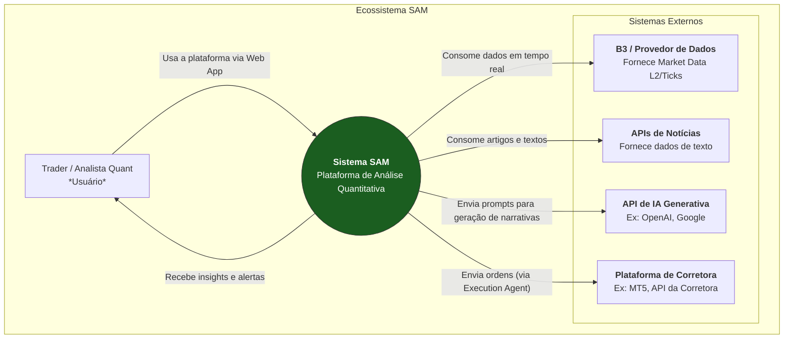

**6.1.2. Nível 2: Diagrama de Contêineres**

Este diagrama dá um "zoom" dentro do **Sistema SAM**, mostrando os principais contêineres e serviços que compõem a aplicação e como eles se comunicam. Ele reflete nossa arquitetura de produção planejada.

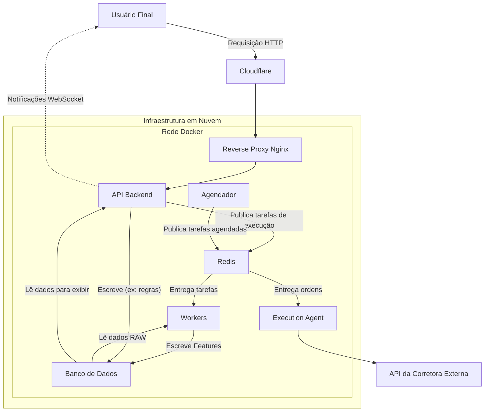

---

#### **6.2. Diagramas de Componentes**

Este nível dá um zoom ainda maior, detalhando as responsabilidades dentro de cada contêiner ou serviço principal.

*   **Coletores (Collectors):**
    *   **Componentes:** `MT5 Connector`, `News API Collector`, `Macro Data Collector`.
    *   **Responsabilidade:** São os "tentáculos" do sistema. Cada um é um especialista em se conectar a uma fonte de dados externa (seja uma API REST, um feed de WebSocket ou o terminal MT5), normalizar os dados para um formato padrão e publicá-los na camada `RAW` do banco de dados ou em uma fila do Redis para processamento.

*   **Fábricas de Features (Feature Factories):**
    *   **Componentes:** `LOB Factory`, `DI Curve Factory`, `Fair Value Factory`, `NLP Factory`.
    *   **Responsabilidade:** São o coração analítico, rodando dentro dos **Workers (Celery)**. Cada fábrica consome dados da camada `RAW` e os transforma em inteligência, calculando as features de alto valor (ex: `microprice`, `synthetic_slope`) e salvando-as na camada `FEATURES` do banco de dados.

*   **Motor de Score (ScoreEngine):**
    *   **Componente:** `regime_and_score_factory`.
    *   **Responsabilidade:** É uma fábrica especializada que roda como a etapa final do pipeline de processamento. Ela consome os outputs de todas as outras fábricas, aplica os pesos e a lógica de confluência, e gera o `Master Confluence Score` (MCS), salvando-o na camada `META-MODEL`.

*   **Infraestrutura de ML (ML Infra):**
    *   **Componentes:** `MLflow Server`, `Model Training Pipeline`, `Inference Service`.
    *   **Responsabilidade:** Gerencia todo o ciclo de vida dos modelos de Machine Learning (ex: o modelo que calcula a probabilidade do OFI Popup). O MLflow rastreia os experimentos, armazena os modelos treinados e os serve para que possam ser consumidos em tempo real pelo sistema de alertas.

*   **Agente de Execução (Execution Agent):**
    *   **Componentes:** `Order Manager`, `Broker Adapters` (MT5, XP, etc.).
    *   **Responsabilidade:** É um serviço isolado e seguro que consome mensagens de uma fila específica do Redis. Ele traduz uma ordem genérica do **SAM** para o formato específico da corretora do usuário (usando o adaptador correto) e gerencia o ciclo de vida da ordem.

*   **Interface do Usuário (UI):**
    *   **Componentes:** `Dashboard (Situation Room)`, `RuleBuilder`, `Backtester UI`, `Auth Module`.
    *   **Responsabilidade:** É a aplicação frontend (provavelmente construída em React/Vue/Svelte) que o usuário interage. Ela se comunica exclusivamente com o **API Backend** para buscar dados e renderizar as visualizações.

---

#### **6.3. Fluxo de Dados (Sequence Diagrams)**

Estes diagramas mostram a jornada de uma informação através do sistema.

**Diagrama de Sequência: Do Tick ao Insight na Tela**

#### **Diagrama 1: A Ingestão de Dados em Tempo Real**

Este diagrama foca em uma única coisa: como um novo negócio no mercado chega ao nosso banco de dados.

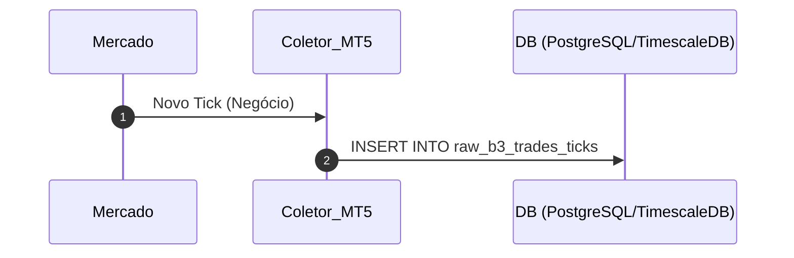
**Descrição:** O fluxo de ingestão é contínuo. O Mercado gera um novo negócio, o Coletor MT5 o captura e o insere imediatamente na tabela de dados brutos do Banco de Dados.

---

#### **Diagrama 2: O Processamento Periódico em Lote (A Fábrica)**

Este diagrama mostra o que acontece a cada minuto, quando o nosso motor de análise "acorda" para trabalhar.

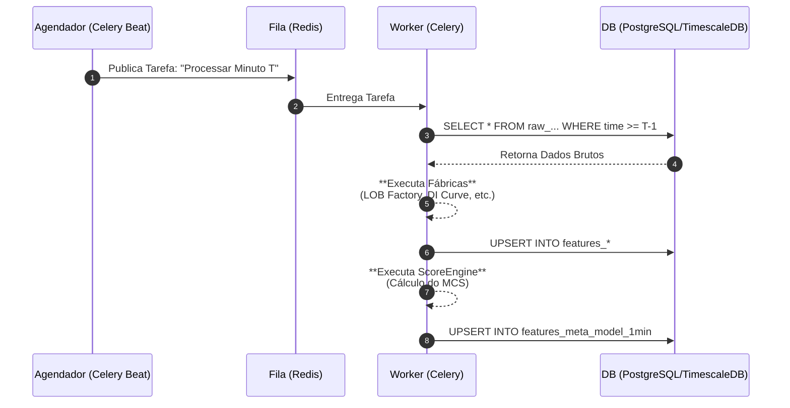
**Descrição:** A cada minuto, o Agendador dispara uma tarefa. O Worker a consome, busca os dados brutos do último minuto no banco, executa todas as Fábricas de Features e o ScoreEngine, e salva os resultados (features e o score MCS) de volta no banco de dados.

---

#### **Diagrama 3: A Comunicação em Tempo Real com o Usuário**

Este diagrama mostra como o insight gerado na Fábrica chega à tela do usuário.

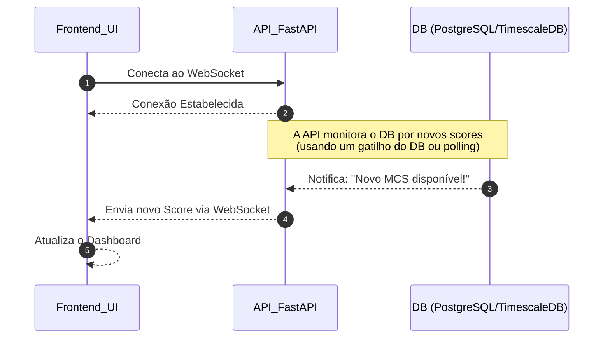
**Descrição:** O Frontend mantém uma conexão WebSocket aberta com a API. A API monitora o banco de dados. Quando o Worker (do Diagrama 2) salva um novo Score, a API é notificada e imediatamente "empurra" o novo dado para o Frontend através da conexão WebSocket, que atualiza o dashboard do usuário instantaneamente.


#### **6.4. Diagramas de Deploy**

*   **Ambiente de Staging (Homologação):**
    *   **Descrição:** Uma réplica exata do ambiente de produção, mas com recursos reduzidos. Rodará em uma VPS separada. Todo novo código, após passar nos testes automatizados, é implantado primeiro em Staging.
    *   **Propósito:** Validação de ponta-a-ponta, testes de regressão e demonstrações para stakeholders sem impactar o ambiente de produção.

*   **Ambiente de Produção (Production):**
    *   **Descrição:** A infraestrutura principal, com recursos completos, monitoramento avançado e alta disponibilidade.
    *   **Estratégia de Deploy:** Utilizaremos uma estratégia **Blue-Green**. Quando uma nova versão é lançada, uma infraestrutura "Green" (nova) completa é criada em paralelo à "Blue" (antiga). O tráfego é então redirecionado para a nova versão. Se algum problema ocorrer, o tráfego pode ser revertido instantaneamente para a versão Blue, garantindo altíssima disponibilidade.

*   **Ambiente de Backups e Disaster Recovery:**
    *   **Backups:** O banco de dados gerenciado (TimescaleDB) terá backups automáticos e contínuos (Point-in-Time Recovery), armazenados em um serviço de Object Storage geograficamente redundante.
    *   **Disaster Recovery (DR):** O plano de DR envolve a capacidade de restaurar o sistema completo a partir da infraestrutura como código (Terraform) e dos backups do banco de dados em uma nova região de nuvem em caso de falha total do data center principal.

---

#### **6.5. Requisitos Não-Funcionais (Non-functional requirements)**

*   **Latência:**
    *   **Ingestão de Dados (P99):** < 200ms desde o evento na B3 até o registro na tabela `raw_*`.
    *   **Processamento de Features (P99):** < 1 segundo desde o fechamento do minuto até a atualização da tabela `features_meta_model_1min`.
    *   **Entrega na UI (Ponta-a-Ponta):** < 500ms desde o evento de mercado até a atualização visual no dashboard do usuário.

*   **SLOs (Service Level Objectives):**
    *   **Disponibilidade da API:** 99.9% de uptime mensal.
    *   **Frescor dos Dados:** 99.99% dos scores no dashboard devem ter sido calculados com dados de no máximo 2 minutos de atraso.

*   **RPO/RTO (Recuperação de Desastres):**
    *   **RPO (Recovery Point Objective):** Máximo de 5 minutos de perda de dados em caso de falha catastrófica do banco de dados.
    *   **RTO (Recovery Time Objective):** O sistema deve estar totalmente operacional em uma nova infraestrutura em no máximo 4 horas após a declaração de um desastre.

*   **Planejamento de Capacidade (Capacity Planning):**
    *   A arquitetura deve ser projetada para suportar a carga inicial de 100 usuários concorrentes com o uso de CPU da VPS de produção permanecendo abaixo de 60% em média, garantindo margem para picos. O auto-scaling de workers (Celery) será configurado para adicionar novos workers quando o tamanho da fila do Redis exceder 500 tarefas por mais de 1 minuto.

#### **6.6. Plano de Validação de Performance e Benchmarking**

Para garantir que os Requisitos Não-Funcionais e os SLOs definidos sejam atingidos e mantidos, implementaremos um plano de testes de performance contínuo.

*   **Ferramentas:** Utilizaremos frameworks de teste de carga como k6 ou Locust.
*   **Processo:** Antes de cada release majoritária (ex: lançamento Beta), executaremos uma bateria de testes de carga em nosso ambiente de Staging (Homologação), que espelha a arquitetura de produção.
*   **Cenários de Teste:** Os scripts simularão o comportamento do usuário, incluindo login, carregamento do dashboard (consumo via WebSocket) e chamadas à API para dados históricos. Os testes serão executados com cargas de 10, 100 e 500 usuários concorrentes.
*   **Relatórios:** Os resultados (latência P95/P99, taxa de erro, consumo de CPU/memória) serão documentados e anexados ao release plan, servindo como um critério de "go/no-go" para o deploy em produção.
*   **Anexo de Referência:** Veja o **Anexo V: Plano de Benchmarking Detalhado**.

---


### **7. Especificação da API e Integrações (API & Integration Spec)**

Esta seção define o contrato técnico para todas as formas como o **Sistema SAM** se comunica com o mundo exterior (usuários e sistemas parceiros) e com seus próprios componentes desacoplados. Ela serve como o guia definitivo para desenvolvedores de frontend, usuários da API e parceiros de integração, garantindo que todas as interações sejam padronizadas, seguras e bem documentadas.

---

#### **7.1. API Principal (OpenAPI / FastAPI)**

A API principal é o ponto de entrada central para todos os dados e funcionalidades do **SAM**. Ela é construída com o framework Python **FastAPI**, que gera automaticamente uma especificação **OpenAPI 3.0** (`openapi.yaml`). Esta especificação garante que nossa API seja autodocumentada, fácil de integrar e fortemente tipada.

Abaixo estão os principais grupos de endpoints planejados:

**7.1.1. Endpoints de Leitura de Dados (`/scores`, `/features`)**

*   **Função:** Fornecer acesso de leitura aos dados processados pelo sistema, tanto em tempo real quanto históricos.
*   **Endpoints Principais:**
    *   `GET /api/v1/scores/live?assets=WDO,WIN`: Endpoint para streaming (via WebSocket) que envia o `Master Confluence Score` (MCS) e os sub-scores dos pilares (OFS, MRS, etc.) em tempo real para os ativos solicitados.
    *   `GET /api/v1/scores/historical?asset=WDO&start_date=...&end_date=...`: Retorna uma série temporal dos scores históricos para um ativo em um determinado período, usado para popular gráficos.
    *   `GET /api/v1/features/historical?asset=WDO&feature=microprice...`: Endpoint mais granular que permite o acesso a séries temporais de features específicas (ex: `microprice`, `synthetic_slope`).

**7.1.2. Endpoints de Eventos e Alertas (`/events`, `/ws/alerts`)**

*   **Função:** Entregar notificações e alertas proativos gerados pelo `nexus-trigger-engine` e pelo Co-Piloto de IA.
*   **Endpoints Principais:**
    *   `GET /ws/v1/alerts`: O principal canal WebSocket que o frontend escutará. O backend "empurrará" mensagens para este canal sempre que um alerta (OFI Popup, regra de usuário, etc.) for gerado.
    *   `GET /api/v1/events/history`: Retorna um histórico paginado de todos os alertas e narrativas de IA que foram gerados para o usuário.

**7.1.3. Endpoints de Interação do Usuário (`/rules`, `/backtest`)**

*   **Função:** Permitir que o usuário configure o sistema, crie automações e execute simulações.
*   **Endpoints Principais:**
    *   `POST /api/v1/rules`: Cria uma nova regra de alerta personalizada no RuleBuilder. O corpo da requisição conterá a lógica da regra em formato JSON.
    *   `GET /api/v1/rules`: Lista todas as regras criadas pelo usuário.
    *   `DELETE /api/v1/rules/{rule_id}`: Apaga uma regra específica.
    *   `POST /api/v1/backtest/start`: Inicia uma nova simulação de backtest. O corpo da requisição especificará a regra a ser testada e o período. Retorna um `job_id`.
    *   `GET /api/v1/backtest/status/{job_id}`: Permite que o frontend verifique o status de um backtest em andamento.
    *   `GET /api/v1/backtest/results/{job_id}`: Retorna o relatório de performance completo quando o backtest estiver concluído.

**7.1.4. Endpoints de Execução (`/execute`)**

*   **Função:** Lidar com a funcionalidade de execução de ordens (inicialmente em demo, futuramente em contas reais).
*   **Endpoints Principais:**
    *   `POST /api/v1/execute/webhook`: Endpoint seguro que recebe a chamada do frontend quando o usuário clica em "Executar Demo". Este endpoint então publica uma mensagem em uma fila específica do Redis para o Execution Agent.

---

#### **7.2. Autenticação e Segurança (Auth & Security)**

*   **Definição:** A segurança da API será baseada em padrões modernos para garantir que apenas usuários autorizados possam acessar seus dados e funcionalidades.
*   **Mecanismo:** **JWT (JSON Web Tokens) com o fluxo OAuth2 "Password Flow"**. Este fluxo é robusto e padrão de mercado para aplicações web.
*   **Diagrama de Fluxo de Autenticação:**

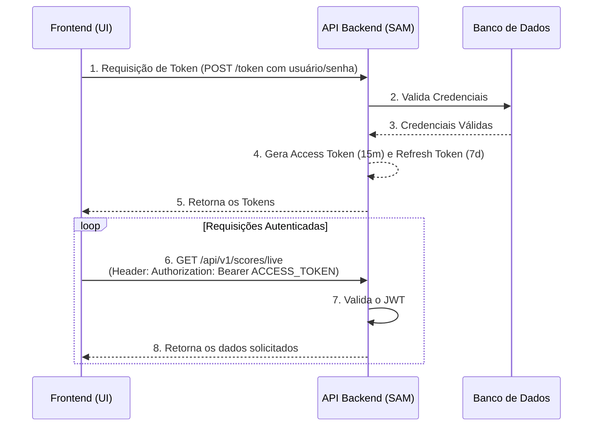

*   **Escopos de Acesso (Scopes):** A API implementará escopos para controle de acesso granular. Por exemplo, um token pode ter os escopos `scores:read` (permitindo a leitura de scores), mas não `rules:write` (impedindo a criação de regras). Isso é fundamental para a diferenciação de planos (Lite, Pro) e para a segurança de futuras integrações com parceiros.

---

#### **7.3. Contrato de Webhook (Webhook Contract)**

*   **Definição:** Define o padrão para como o **SAM** se comunicará com sistemas externos de forma proativa, como o Execution Agent do MT5.
*   **Especificação do Contrato:**
    *   **Formato do Payload:** Todas as chamadas de webhook serão feitas via **HTTP POST** com um corpo em formato **JSON**. O payload conterá informações padronizadas, como `event_type`, `timestamp`, `asset`, `direction` (compra/venda), `quantity`, etc.
    *   **Mecanismo de Retentativas (Retries):** Se um webhook enviado pelo **SAM** falhar (ex: erro 5xx), o sistema implementará uma política de retentativas com **backoff exponencial** (tentando reenviar em intervalos de 2s, 8s, 30s) antes de marcar o evento como falho.
    *   **Assinatura de Segurança (Signature):** Cada requisição incluirá um cabeçalho `X-SAM-Signature` contendo um **HMAC** do corpo da requisição, assinado com um segredo compartilhado. Isso garante a autenticidade e a integridade da mensagem.
*   **Diagrama de Verificação do Webhook:**

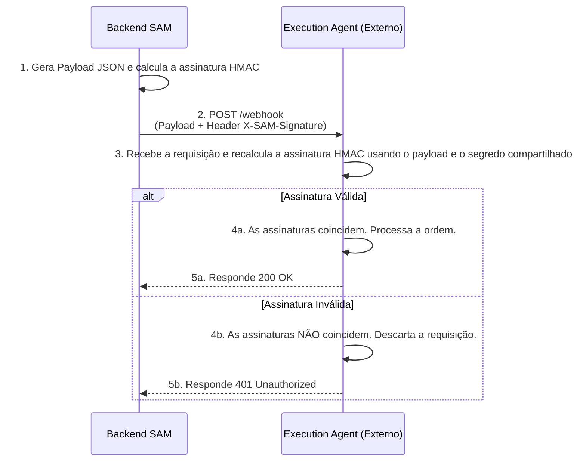

---

#### **7.4. Especificação dos Adaptadores de Corretora (Broker Adapters)**

*   **Definição:** Define a arquitetura modular para a integração do Execution Agent do **SAM** com diferentes plataformas de corretagem. O objetivo é isolar a complexidade de cada corretora em seu próprio módulo.
*   **Estado Atual da Pesquisa:** **Não sabemos** ainda quais corretoras nacionais (além do MT5) oferecem APIs abertas e acessíveis para parceiros em nosso modelo de negócio. Esta é uma área que **requer pesquisa e desenvolvimento futuro**.
*   **Arquitetura Planejada (Padrão de Projeto "Adapter"):** A integração não será monolítica. O `Execution Agent` principal conterá a lógica de negócio genérica e se comunicará com uma interface padronizada. Cada corretora terá sua própria classe "Adaptador" que implementa essa interface, traduzindo as chamadas genéricas para o formato específico da API da corretora.
*   **Diagrama de Componentes dos Adaptadores:**

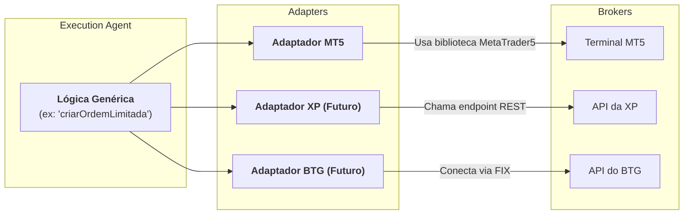
*   **Mapeamento do Modelo de Ordem (Order Model):** Definiremos um modelo de ordem interno e padronizado no **SAM** (em JSON). Cada adaptador será responsável por **traduzir** este modelo de ordem genérico para o formato específico exigido pela API da corretora. Isso garante que a lógica de negócio principal do Execution Agent permaneça agnóstica à corretora.

---

#### **Anexos Exigidos:**

*   **`openapi.yaml`:** O arquivo de especificação OpenAPI completo, a ser gerado automaticamente pelo FastAPI assim que os endpoints forem implementados.
*   **Exemplos de Payloads (`example_payloads.json`):** Um arquivo a ser criado durante o desenvolvimento, contendo exemplos de corpos de requisição e resposta para os principais endpoints, servindo como guia para os desenvolvedores de frontend.
*   **Exemplo de SDK (`connector_sdk_snippet.py/.js`):** Um pequeno trecho de código a ser criado após a estabilização da API, mostrando como se autenticar e fazer uma chamada básica, para acelerar a integração por parte de usuários avançados ou parceiros.


---

### **8. Modelo de Dados e Armazenamento (Data Model and Storage)**

Esta seção descreve a espinha dorsal do **Sistema SAM**: seu modelo de dados. A arquitetura de dados foi projetada com três princípios em mente: granularidade, separação por camadas e performance para séries temporais.

#### **8.1. Schema das Tabelas de Dados**

O banco de dados é logicamente dividido em camadas, cada uma com um propósito claro. A tecnologia de base é o **PostgreSQL com a extensão TimescaleDB**.

**8.1.1. Camada RAW (Dados Brutos)**

Esta camada armazena os dados exatamente como são recebidos, com o mínimo de processamento. São tabelas de altíssimo volume.

*   **`raw_b3_trades_ticks`:** Armazena cada negócio individual.
*   **`raw_b3_lob_snapshots`:** Armazena "fotos" do livro de ofertas.
*   **`raw_time_series_*`:** Uma família de tabelas para dados de velas (OHLCV) em várias granularidades (`_intraday`, `_m5`, `_h1`, `_daily`).
*   **`news_articles`:** Armazena o texto completo e metadados de artigos de notícias.

**8.1.2. Camada FEATURES (Dados Processados)**

Esta camada armazena os outputs das "Fábricas de Features". Os dados aqui são agregados (geralmente por minuto) e enriquecidos.

*   **`features_b3_lob_1min`:** Contém as features de microestrutura de 1 minuto.
*   **`features_di_curve_1min`:** Contém as features da curva de juros de 1 minuto.
*   **`features_dollar_fair_value_1min`:** Contém o valor justo do dólar de 1 minuto.
*   **`feature_sentiment_by_aspect`:** Armazena o score de sentimento para cada artigo e aspecto.
*   **`features`:** Tabela consolidada para features **diárias** (sentimento agregado, fechamento do slope dos juros).

**8.1.3. Camada OPERACIONAL (Dados da Aplicação)**

Esta camada contém as tabelas que suportam a lógica da aplicação web, como regras de usuário e logs. Estas são tabelas de baixo volume, mas de alta importância.

*   **Tabela Proposta: `user_rules`**
    *   **Propósito:** Armazenar as regras de alerta personalizadas criadas pelos usuários no RuleBuilder.
    *   **Schema Chave:** `rule_id (PK)`, `user_id (FK)`, `rule_name`, `rule_definition (JSONB)`, `is_active (boolean)`.
*   **Tabela Proposta: `user_alerts_history`**
    *   **Propósito:** Manter um histórico de todos os alertas (proativos e de regras) que foram disparados para cada usuário.
    *   **Schema Chave:** `alert_id (PK)`, `user_id (FK)`, `rule_id (FK, nullable)`, `trigger_timestamp`, `alert_payload (JSONB)`.
*   **Tabela Proposta: `execution_logs`**
    *   **Propósito:** Registrar cada tentativa de execução de ordem (via Execution Agent), seja ela bem-sucedida ou não.
    *   **Schema Chave:** `exec_id (PK)`, `user_id (FK)`, `order_details (JSONB)`, `status ('SENT', 'CONFIRMED', 'FAILED')`, `broker_response (TEXT)`.

---

#### **8.2. Políticas de Retenção e Particionamento**

Para gerenciar o volume massivo de dados brutos e garantir a performance, implementaremos uma estratégia agressiva de particionamento, compressão e tiering, habilitada pela TimescaleDB.

*   **Particionamento (Partitioning Strategy):** As tabelas da camada RAW, que são séries temporais, serão configuradas como **Hypertables** no TimescaleDB. Elas serão particionadas automaticamente em "chunks" baseados em tempo (ex: um novo chunk por dia). Isso torna as queries em dados recentes extremamente rápidas e as operações de manutenção (como apagar dados antigos) instantâneas.

*   **Políticas de Retenção e Tiering (Hot/Cold):**

| Tabela                        | Tier "Hot" (Online/Rápido)           | Tier "Cold" (Comprimido/Lento)                   | Política de Expurgo (Purge)                                              |
| :---------------------------- | :----------------------------------- | :----------------------------------------------- | :----------------------------------------------------------------------- |
| **`raw_b3_trades_ticks`**     | **30 dias** (não comprimido, em SSD) | **> 30 dias** (Compressão pesada do TimescaleDB) | **> 2 anos:** Arquivar em Object Storage (ex: AWS S3) e apagar do banco. |
| **`raw_b3_lob_snapshots`**    | **30 dias** (não comprimido, em SSD) | **> 30 dias** (Compressão pesada do TimescaleDB) | **> 2 anos:** Arquivar e apagar.                                         |
| **`features_*` (tabelas HF)** | **1 ano** (não comprimido, em SSD)   | **> 1 ano** (Compressão leve do TimescaleDB)     | **> 5 anos:** Arquivar e apagar.                                         |
| **Tabelas Operacionais**      | Para sempre (sempre online)          | N/A                                              | Nunca apagar (a menos que solicitado pelo usuário - LGPD).               |

---

#### **8.3. Contrato do Feature Store**

Para garantir a consistência e a confiabilidade dos dados usados em nossos modelos de ML e no backend, definimos um "Contrato de Feature Store" informal. Ele serve como uma fonte única da verdade sobre o que cada feature significa e o que se pode esperar dela.

| Nome da Feature (Conceitual) | Tabela de Origem                  | Coluna de Origem              | Tipo de Dado | SLA de Frescor (P99) | Owner                    |
| :--------------------------- | :-------------------------------- | :---------------------------- | :----------- | :------------------- | :----------------------- |
| Score de Agressão            | `features_b3_lob_1min`            | `aggression_delta_volume`     | Float        | 65 segundos          | Equipe de Microestrutura |
| Score de Pressão Passiva     | `features_b3_lob_1min`            | `book_imbalance`              | Float        | 65 segundos          | Equipe de Microestrutura |
| Score de Estresse de Juros   | `features_di_curve_1min`          | `synthetic_slope`             | Float        | 65 segundos          | Equipe de Macroeconomia  |
| Score de Prêmio do Dólar     | `features_dollar_fair_value_1min` | `premium_discount_pct_1min`   | Float        | 65 segundos          | Equipe de Macroeconomia  |
| Score de Risco Fiscal        | `features`                        | `sentiment_fiscal_risk_avg_d` | Real         | 24 horas             | Equipe de NLP            |

---

#### **Anexos**

**Anexo K: Diagrama de Entidade-Relacionamento (ER Diagram) - Simplificado**

O diagrama abaixo ilustra as principais relações entre as tabelas do sistema.

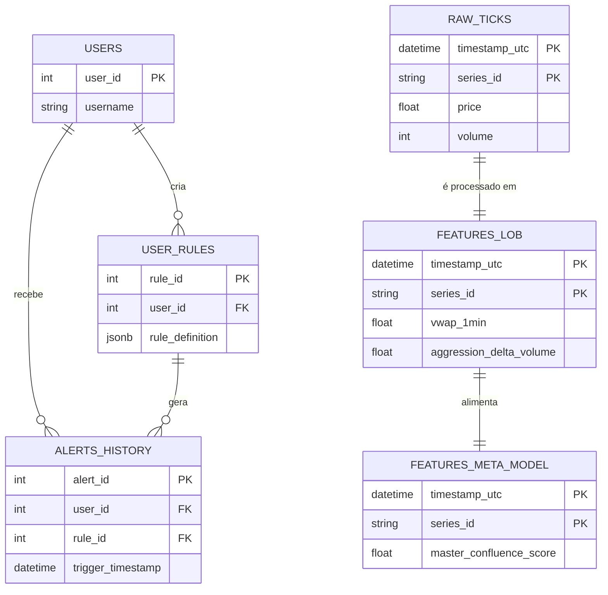

**Anexo L: Exemplo de SQL DDL (com TimescaleDB)**

O DDL a seguir mostra como a tabela `raw_b3_trades_ticks` seria criada e convertida em uma hypertable.

```sql
-- 1. Criação da Tabela Padrão do PostgreSQL
CREATE TABLE raw_b3_trades_ticks (
    timestamp_utc   TIMESTAMPTZ       NOT NULL,
    series_id       VARCHAR(50)       NOT NULL,
    price           DOUBLE PRECISION,
    tick_volume     BIGINT,
    aggressor_side  aggressor_type,
    -- ... outras colunas
    PRIMARY KEY (timestamp_utc, series_id)
);

-- 2. Conversão para Hypertable do TimescaleDB (A Mágica)
-- Particiona a tabela em "chunks" de 1 dia com base na coluna de tempo.
SELECT create_hypertable('raw_b3_trades_ticks', 'timestamp_utc', chunk_time_interval => INTERVAL '1 day');

-- 3. (Opcional) Adicionar Política de Compressão
-- Comprime automaticamente os chunks com mais de 30 dias.
SELECT add_compression_policy('raw_b3_trades_ticks', compress_after => INTERVAL '30 days');
```


---
---

### **9. Ciclo de Vida de Machine Learning, Modelagem e Experimentos (ML Lifecycle, Modeling & Experiments)**

Esta seção descreve a metodologia e a infraestrutura que o **Sistema SAM** utilizará para desenvolver, validar, implantar e monitorar modelos de Machine Learning. O objetivo é estabelecer um processo de MLOps (Machine Learning Operations) robusto, garantindo que nossos modelos sejam não apenas precisos, mas também reprodutíveis, auditáveis e confiáveis em um ambiente de produção.

---

#### **9.1. O Pipeline de Ciclo de Vida do Modelo (ML Lifecycle)**

O desenvolvimento de qualquer modelo preditivo no **SAM**, desde um simples modelo de probabilidade para um alerta até um complexo ensemble para scores de regime, seguirá um pipeline padronizado e rigoroso. A ferramenta de orquestração para este ciclo de vida será o **MLflow**.

**Diagrama do Pipeline de ML:**

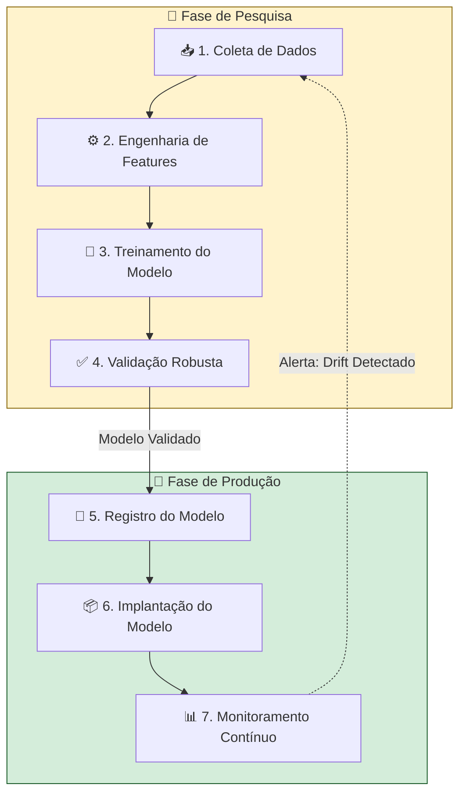

**Descrição das Etapas:**

1.  **Coleta de Dados:** O pesquisador quant extrai um conjunto de dados versionado do nosso banco de dados (PostgreSQL/TimescaleDB) para um ambiente de pesquisa (Jupyter Notebook).
2.  **Engenharia de Features:** Criação e seleção de features relevantes (ex: as "features de segunda ordem" que discutimos, como a `aceleração do microprice`).
3.  **Treinamento (Training):** O modelo (ex: LightGBM, LSTM) é treinado com os dados. Todos os parâmetros, o código de treinamento e o dataset são registrados no **MLflow Tracking**.
4.  **Validação (Validation):** Esta é a etapa mais crítica. O modelo é submetido a um rigoroso processo de validação, utilizando técnicas anti-overfitting como a **Cross-Validation Purgada (Purged CV)** para simular o desempenho real em dados de séries temporais financeiras.
5.  **Registro (Registry):** Se o modelo passar na validação, ele é promovido do estágio de "Experimento" para o **Registro de Modelos do MLflow**, recebendo uma versão oficial (ex: `ofi-popup-model:v1.2`). Ele é marcado como "Staging".
6.  **Implantação (Deployment):** O modelo em "Staging" é empacotado em um contêiner Docker e implantado em nosso ambiente de homologação. Após a validação final, ele é promovido para "Production" e o serviço de inferência é atualizado.
7.  **Monitoramento (Monitoring):** Uma vez em produção, o modelo é continuamente monitorado para detectar **"Data Drift"** (quando os dados de mercado em tempo real começam a diferir estatisticamente dos dados com os quais o modelo foi treinado) e **"Concept Drift"** (quando a relação subjacente que o modelo aprendeu muda). Se um drift significativo for detectado, um alerta é disparado, reiniciando o ciclo de vida para retreinar o modelo.

---

#### **9.2. Template do Cartão do Modelo (Model Card)**

Para garantir a transparência e a auditabilidade, cada modelo promovido ao Registro do MLflow deve ser acompanhado por um "Cartão do Modelo". Este é um documento padronizado que resume tudo sobre o modelo.

**Estado Atual:** O template a seguir **não foi implementado**, mas representa o padrão que adotaremos.

| Campo                               | Descrição                                                                                                | Exemplo                                                                                                                                                                                                                                                                                                   |
| :---------------------------------- | :------------------------------------------------------------------------------------------------------- | :-------------------------------------------------------------------------------------------------------------------------------------------------------------------------------------------------------------------------------------------------------------------------------------------------------- |
| **Nome do Modelo**                  | Nome canônico e versão.                                                                                  | `ofi-popup-probability:v1.0`                                                                                                                                                                                                                                                                              |
| **Propósito do Modelo**             | O que o modelo prevê e como ele é usado no produto?                                                      | Prever a probabilidade de um movimento de preço continuar após um alerta de OFI, para ser exibido no popup de alerta.                                                                                                                                                                                     |
| **Proprietário (Owner)**            | Equipe ou indivíduo responsável.                                                                         | Equipe de Microestrutura                                                                                                                                                                                                                                                                                  |
| **Tipo de Modelo**                  | Algoritmo utilizado.                                                                                     | `LightGBM Classifier`                                                                                                                                                                                                                                                                                     |
| **Dataset de Treinamento**          | Versão do dataset, período e fonte dos dados.                                                            | `wdo_ticks_2024_2025_v2`, de 2024-01-01 a 2025-10-31.                                                                                                                                                                                                                                                     |
| **Features Utilizadas**             | Lista das colunas de input para o modelo.                                                                | `aggression_delta_volume`, `book_imbalance_volatility`, `microprice_deviation`...                                                                                                                                                                                                                         |
| **Variável Alvo (Label)**           | O que o modelo foi treinado para prever.                                                                 | `movimento_continuou_5min` (binário: 1 ou 0).                                                                                                                                                                                                                                                             |
| **Métricas de Performance**         | Principais métricas de validação.                                                                        | **AUC-ROC:** 0.68, **Precision:** 0.72, **Recall:** 0.65 (em dados de teste purgados).                                                                                                                                                                                                                    |
| **Considerações Éticas**            | Potenciais vieses ou limitações do modelo.                                                               | O modelo não foi treinado em períodos de "cisne negro" e pode ter performance degradada em eventos de volatilidade extrema.                                                                                                                                                                               |
| **Fonte do Dataset de Treinamento** | Origem, período e processo de versionamento dos dados usados para treinar e validar o modelo.            | Notícias coletadas via NewsAPI/Firecrawl (portais G1, InfoMoney, etc.), período de 2023-01-01 a 2025-10-31. O dataset final foi versionado como `news_corpus_br_v1.2`. O fine-tuning do FinBERT foi realizado neste corpus específico de notícias financeiras brasileiras.                                |
| **Análise de Vieses**               | Descreve os vieses conhecidos ou potenciais do modelo e as estratégias de mitigação, se houver.          | O modelo pode apresentar um viés para sentimento negativo, pois notícias sobre crises econômicas tendem a ser mais longas e detalhadas, dando mais peso a termos negativos. Além disso, o pipeline de NLP atual não detecta sarcasmo de forma eficaz. Nenhuma mitigação de viés foi implementada na v1.0. |
| **Custos de Inferência**            | Custo computacional ou financeiro para executar o modelo em produção (por chamada, por 1k tokens, etc.). | Baixo (para o modelo `ofi-popup-probability`). Inferência em < 10ms em CPU padrão. Para futuros modelos baseados em LLM, o custo estimado da API (ex: GPT-4-Turbo) é de ~$10 por 1 milhão de tokens de input e ~$30 por 1 milhão de tokens de output.                                                     |
| **Estratégia de Fallback**          | Define o procedimento padrão em caso de falha do modelo em produção.                                     | Se o modelo `ofi-popup-probability` falhar em retornar uma previsão, o alerta será exibido com um valor de probabilidade padrão ("N/A") e um erro será logado no Sentry para análise da equipe de operações. O sistema não quebra, mas opera com informação degradada.                                    |

---

#### **9.3. Governança de Modelos (Model Governance)**

A governança garante que a implantação e a atualização de modelos sejam feitas de forma segura e controlada, minimizando o risco para o sistema e para os usuários.

*   **Rollbacks (Reversão):**
    *   **Mecanismo:** O Registro de Modelos do MLflow nos permite manter múltiplas versões de um mesmo modelo (`v1.0`, `v1.1`, `v1.2`). Se a versão `v1.2` em produção começar a apresentar um comportamento anômalo (detectado pelo nosso sistema de monitoramento), temos um "runbook" (um procedimento operacional padrão) para, com um único comando, reverter o serviço de inferência para usar a versão estável anterior (`v1.1`) em minutos.

*   **Testes A/B (Canary Deployment):**
    *   **Estado Atual:** A implementação de testes A/B **não está no escopo do MVP**, mas é uma parte crucial do roadmap de maturidade.
    *   **Mecanismo Planejado:** Quando tivermos um novo modelo candidato (ex: `v2.0`) que parece promissor, em vez de substituir o antigo (`v1.x`) de uma só vez, faremos um "Canary Deployment". Direcionaremos uma pequena porcentagem do tráfego de inferência (ex: 5% das solicitações de alerta) para o novo modelo. Monitoraremos sua performance em tempo real em comparação com o modelo antigo. Se o novo modelo se provar superior em dados ao vivo, aumentaremos gradualmente o tráfego para ele até que ele substitua completamente o antigo. Isso permite a inovação contínua com risco minimizado.

---

#### **Anexos:**

*   **Anexo M: Exemplo de Notebook de Treinamento (`training_notebooks/`):**
    *   **Descrição:** Uma pasta no repositório do projeto conterá os Jupyter Notebooks utilizados para a pesquisa e o treinamento de cada modelo. Estes notebooks serão versionados e devem ser totalmente reprodutíveis.

*   **Anexo N: Exemplo de Cartão de Modelo (`model_cards/sample_card.md`):**
    *   **Descrição:** Um arquivo Markdown de exemplo preenchido com as informações do template da Seção 9.2, servindo como guia para a documentação de novos modelos.


---
---

### **10. Backtesting, Validação e Pesquisa (Backtesting, Validation & Research)**

Esta seção descreve a metodologia e as ferramentas que garantem o rigor científico e a relevância prática de todas as estratégias, presets e modelos gerados pelo **Sistema SAM**. O objetivo do nosso framework de pesquisa não é encontrar a "curva de capital perfeita" em dados passados, mas sim validar a robustez e a probabilidade de uma estratégia continuar a funcionar no futuro.

---

#### **10.1. Arquitetura do Motor de Backtesting (Backtest Engine Internals)**

Nosso motor de backtesting é projetado para simular o comportamento do mercado de alta frequência da forma mais realista possível. Para o MVP, ele será uma versão simplificada, evoluindo para um simulador de nível profissional nas fases subsequentes.

*   **Motor de Replay (Ticker Replay):**
    *   **Função:** O coração do simulador. Em vez de operar em velas (OHLC), que omitem a informação intraday, nosso motor processa o histórico de dados tick-a-tick da tabela `raw_b3_trades_ticks` em sequência. Isso permite que a simulação reaja a cada negócio individual, exatamente como aconteceria em tempo real.

*   **Simulador de Ordens (Order Matching):**
    *   **Função:** Quando uma estratégia envia uma ordem (ex: "COMPRAR a mercado"), o simulador não assume uma execução instantânea no último preço. Ele consulta a tabela `raw_b3_lob_snapshots` para o exato milissegundo da ordem e simula o "caminho" da ordem pelo livro de ofertas, determinando a que preço a ordem seria de fato executada.

*   **Modelo de Custos e Fricção (Cost Model):**
    *   **Slippage (Derrapagem):** O custo mais importante e frequentemente ignorado. O simulador calcula o slippage com base na lógica do Order Matcher e no estado do livro. Além disso, para modelos mais simples, ele usará o output da feature **LSS (Liquidity & Slippage Score)** para aplicar um slippage médio esperado.
    *   **Latência:** Para simulações de altíssima frequência, o motor pode ser configurado para introduzir uma latência artificial (ex: 50ms) entre a geração do sinal e o envio da ordem, simulando o atraso do mundo real.
    *   **Taxas e Corretagem:** Custos de emolumentos da B3 e corretagem são aplicados a cada trade para garantir que o resultado líquido seja realista.

*   **Preenchimento de Ordens (Fills):**
    *   **Função:** O sistema modela preenchimentos parciais. Se uma estratégia envia uma ordem de 10 contratos, mas só há liquidez para 5 no melhor preço, o simulador preencherá apenas 5 e manterá o restante da ordem no livro (se for uma ordem limite) ou continuará a consumir o próximo nível de preço (se for a mercado).

---

#### **10.2. Protocolos de Validação (Validation Protocols)**

Para combater o risco de overfitting (criar uma estratégia que funciona perfeitamente no passado, mas falha no presente), o **SAM** empregará um conjunto rigoroso de protocolos de validação padrão-ouro da indústria quantitativa.

*   **Cross-Validation Purgada (Purged CV):**
    *   **Função:** É a nossa principal ferramenta para validar modelos de Machine Learning em séries temporais. Ao dividir os dados em conjuntos de treino e teste, este método "purga" (remove) os dados de treino que estão muito próximos do início do período de teste. Isso impede que o modelo "espione" informações do futuro, que é o principal defeito da validação cruzada tradicional em dados financeiros.

*   **Validação Walk-Forward:**
    *   **Função:** O principal protocolo para validar a robustez de uma estratégia parametrizada ao longo do tempo. Em vez de otimizar os parâmetros em todo o histórico de uma vez, o processo é feito em janelas rolantes:
        1.  **Otimização:** Encontra os melhores parâmetros para a estratégia nos dados de Jan-Mar.
        2.  **Teste Fora da Amostra:** Testa o desempenho desses parâmetros nos dados "virgens" de Abril.
        3.  **Avanço da Janela:** Repete o processo, otimizando em Fev-Abr e testando em Maio.
    *   **Resultado:** Se a estratégia mostra um desempenho consistentemente positivo em todas as janelas "fora da amostra", ela é considerada robusta.

*   **Probabilidade de Overfitting do Backtest (PBO):**
    *   **Função:** Uma técnica estatística para responder à pergunta: "Se eu testei 1000 variações de uma estratégia, qual a probabilidade de que a melhor delas seja a melhor apenas por sorte?". Ela usa combinações e simulações para determinar se o resultado de um backtest é estatisticamente significativo ou provavelmente fruto do acaso.

*   **Métricas de Overfitting:**
    *   Além dos protocolos acima, monitoraremos métricas simples, como a **diferença entre a performance dentro da amostra (In-Sample) e fora da amostra (Out-of-Sample)**. Uma grande queda na performance é uma bandeira vermelha clássica para o overfitting.

---

#### **10.3. Rastreamento e Reprodutibilidade de Experimentos**

*   **Rastreamento de Experimentos (Experiment Tracking):**
    *   **Ferramenta:** **MLflow**.
    *   **Função:** Cada execução de um backtest ou treinamento de modelo é registrada como um "experimento" no MLflow. Nós salvaremos automaticamente:
        *   O hash do commit do Git do código que foi executado.
        *   A versão do dataset de entrada.
        *   Todos os hiperparâmetros utilizados.
        *   As métricas de performance resultantes (Sharpe, Drawdown, etc.).
        *   Os artefatos gerados (gráficos, modelo treinado, relatório de resultados).

*   **Reprodutibilidade (Reproducibility):**
    *   **Gerenciamento de Sementes (Seed Management):** Para qualquer processo que envolva aleatoriedade (ex: inicialização de modelos de ML), a "semente" (seed) do gerador de números aleatórios será fixada e registrada. Isso garante que, se rodarmos o mesmo experimento duas vezes, obteremos exatamente o mesmo resultado.
    *   **Versionamento de Datasets:** Os datasets usados para treinamento não serão apenas queries ao banco. Eles serão extraídos e salvos como arquivos versionados (ex: Parquet), garantindo que possamos sempre voltar e usar o exato conjunto de dados com o qual um modelo foi treinado.

---

#### **Anexos:**

*   **Anexo O: Template de Relatório de Backtest (`sample_backtest_report.pdf`):**
    *   **Descrição:** Um modelo de PDF mostrando como os resultados de um backtest serão apresentados ao usuário. Incluirá a curva de capital, um resumo das métricas principais, uma tabela com todos os trades executados e gráficos de distribuição de retornos.

*   **Anexo P: Gráficos de Calibração (`calibration_plots.png`):**
    *   **Descrição:** Exemplos de gráficos gerados durante o processo de P&D, como gráficos de "Confiabilidade" (calibration plots) que mostram se um modelo que prevê 80% de chance de alta acerta de fato 80% das vezes. Outro exemplo são os gráficos de importância de features (SHAP).


---


---

### **11. Experiência de Produto e Fluxos de Usuário (UX / Product)**

Esta seção descreve a experiência do usuário (UX) e a interface do produto (UI) do **Sistema SAM**. O design da plataforma é guiado por um princípio central: **reduzir a carga cognitiva do trader**. A interface deve ser limpa, intuitiva e focada em apresentar insights claros, em vez de sobrecarregar o usuário com dados brutos.

---

#### **11.1. Telas e Fluxos de Usuário (Screens & Flows)**

A jornada do usuário dentro do **SAM** é projetada para ser uma progressão natural, desde o primeiro contato até o uso avançado da plataforma.

**11.1.1. Fluxo de Onboarding e Configuração Inicial**

*   **Tela de Login / Cadastro (Login/Onboard):**
    *   **Função:** O primeiro ponto de contato. Uma interface simples e segura para criação de conta e login. Utilizará autenticação moderna, incluindo opções de login social (Google, etc.) para reduzir o atrito.
*   **Fluxo de Conexão com a Corretora (Connect Broker):**
    *   **Função:** Um passo guiado (wizard) para conectar o **SAM** à conta da corretora do usuário. Inicialmente, isso envolverá a inserção de credenciais para a conta de demonstração do MT5.
    *   **Experiência:** O fluxo enfatizará a segurança, explicando que as credenciais são criptografadas e usadas apenas para a funcionalidade de execução de ordens com o consentimento do usuário.
*   **Tela de Seleção de Presets (Choose Presets):**
    *   **Função:** Após o primeiro login, o usuário será apresentado a uma tela para escolher seu "estilo operacional".
    *   **Experiência:** Em vez de uma tela de configuração complexa, o usuário escolherá entre presets como "Scalper", "Day Trader Momentum" ou "Analista Macro". Cada preset ajusta automaticamente os pesos do `Master Confluence Score` e os thresholds dos alertas iniciais, oferecendo um ponto de partida relevante e imediato. O usuário poderá personalizar tudo depois.

**11.1.2. Fluxo Principal de Análise Intraday**

*   **A Tela Principal - "Situation Room":**
    *   **Função:** O cockpit central do trader. É a tela onde o usuário passará 90% do seu tempo.
    *   **Design:** O layout será minimalista e modular ("tiles").
        *   **Tile Principal:** Um grande medidor proeminente para o `Master Confluence Score` (MCS).
        *   **Tiles Secundários:** Pequenos medidores para os sub-scores (OFS, MRS, SNS), permitindo um diagnóstico rápido da fonte do score principal.
        *   **Gráfico Principal:** Um gráfico de velas limpo, com a opção de sobrepor visualizações-chave como o `Microprice`, `Fair Value` e as bandas de volatilidade.
        *   **Feed de Insights:** Uma coluna lateral onde os alertas do Co-Piloto de IA (OFI Popups, etc.) e as narrativas aparecem em tempo real.
*   **Fluxo de Resposta a um Alerta (Respond to Popup):**
    *   **Função:** Define a interação do usuário com os insights proativos do sistema.
    *   **Experiência:** Um popup (ou "toast") discreto aparece no canto da tela com o insight gerado pela IA.
        1.  O usuário pode dispensá-lo.
        2.  O usuário pode clicar em "Ver Detalhes", o que expande o alerta no Feed de Insights, mostrando os dados que o geraram e talvez um gráfico de SHAP (explicabilidade).
        3.  O usuário pode clicar em "Executar Demo" (Feature MVP-08), o que dispara o webhook de execução.

**11.1.3. Fluxos de Personalização e Pesquisa**

*   **Tela do Construtor de Regras (Create Rule):**
    *   **Função:** A interface "no-code" para criar automações e alertas personalizados.
    *   **Experiência:** O usuário será guiado por um sistema de menus suspensos e campos de valor. Ex: `SE [Feature: MCS] [Condição: >] [Valor: 0.8] E [Feature: Premium Z-Score] [Condição: >] [Valor: 1.5] ENTÃO [Ação: Disparar Alerta com a Mensagem: ...]`

*   **Tela de Backtesting (Run Backtest):**
    *   **Função:** O laboratório quantitativo do usuário.
    *   **Experiência:** Um fluxo de 3 passos:
        1.  **"Selecionar Estratégia":** O usuário escolhe uma de suas regras salvas.
        2.  **"Definir Período e Custos":** O usuário seleciona o intervalo de datas e insere custos de corretagem/slippage para a simulação.
        3.  **"Analisar Resultados":** Após a execução, o usuário vê o relatório de performance completo (curva de capital, métricas, lista de trades).

Para garantir a transparência e gerenciar as expectativas do usuário, a interface de resultados do backtester no MVP exibirá um aviso claro e permanente na tela de resultados: **"Atenção: Este resultado foi gerado pelo nosso Backtester Básico. Ele é uma ferramenta poderosa para validar a lógica da sua estratégia em dados históricos. No entanto, esta versão simplificada não simula custos de transação realistas, como slippage, latência ou preenchimentos parciais de ordens. Os resultados devem ser considerados como uma primeira aproximação otimista e não como uma garantia de performance em conta real. O Backtester Avançado, com simulação de custos realistas, está disponível nos planos Pro e Enterprise."**

---

#### **11.2. Mockups e Wireframes**

*   **Estado Atual:** **Não existem mockups ou wireframes finalizados.** Esta é uma das próximas etapas críticas no roadmap de desenvolvimento do produto.
*   **Processo Planejado:**
    1.  **Wireframes de Baixa Fidelidade:** O primeiro passo será criar wireframes simples (caixas e texto, sem design) para validar o layout das informações e o fluxo de navegação entre as telas descritas acima.
    2.  **Mockups de Alta Fidelidade:** Após a validação dos wireframes, um designer de UI/UX criará mockups detalhados, definindo a paleta de cores, tipografia, iconografia e o design final dos componentes.
*   **Filosofia de Design:** O design seguirá uma abordagem "dark mode first", otimizada para longos períodos de uso em ambientes de trading. O foco será em clareza, contraste e hierarquia visual da informação.

---

#### **11.3. Acessibilidade e Internacionalização**

*   **Acessibilidade (Accessibility - a11y):**
    *   O design da interface seguirá as diretrizes do WCAG (Web Content Accessibility Guidelines). Isso inclui garantir um bom contraste de cores para usuários com baixa visão, adicionar texto alternativo para elementos visuais e garantir que a navegação via teclado seja possível.

*   **Internacionalização (Internationalization - i18n):**
    *   **Estado Atual:** O sistema será desenvolvido com foco no mercado brasileiro e em português (**pt-BR**).
    *   **Arquitetura Preparada:** No entanto, a aplicação frontend será construída com a internacionalização em mente. Todo o texto da interface (botões, menus, títulos) não será escrito diretamente no código, mas sim referenciado através de chaves em arquivos de tradução (ex: `i18n/pt-BR.json`, `i18n/en-US.json`).
    *   **Plano Futuro:** Isso garantirá que, quando decidirmos expandir para outros mercados, a tradução da plataforma para o inglês ou espanhol será um processo simples de adicionar novos arquivos de tradução, sem a necessidade de reescrever o código da interface.

---

#### **Anexos:**

*   **Anexo Q: Links para o Figma (`[Placeholder: Link para o projeto no Figma]`):**
    *   **Descrição:** Este anexo conterá os links para os wireframes e mockups de alta fidelidade do produto, assim que forem desenvolvidos.

*   **Anexo R: Especificação da Biblioteca de Componentes (`[Placeholder: Link para o Storybook/Component Library Spec]`):**
    *   **Descrição:** Para garantir a consistência visual e a reutilização de código, desenvolveremos uma biblioteca de componentes de UI (ex: botões, gráficos, tiles). Este anexo especificará o design e o comportamento de cada componente.
---


---
---

### **12. Modelo de Negócio e Estratégia de Go-to-Market (GTM)**

Esta seção detalha o plano comercial do **Sistema SAM**, abrangendo como o produto será precificado, monetizado e levado ao mercado. A estratégia é projetada para maximizar a aquisição de clientes, garantir a lucratividade e construir um negócio sustentável a longo prazo.

---
#### **12.1. Modelo de Receita (Revenue Model)**

O **SAM** operará em um modelo de receita primário de **SaaS (Software as a Service)** baseado em assinaturas mensais, com diferentes níveis (tiers) que desbloqueiam funcionalidades e capacidades progressivamente. Este modelo garante uma receita previsível e recorrente (MRR).

*   **SaaS Tiers (Níveis de Assinatura):**
    *   **Plano Lite:** Focado no trader iniciante que precisa de um "filtro de ruído". Oferecerá acesso ao `Master Confluence Score` para 1 ativo principal (WDO ou WIN), alertas básicos e o feed de insights do Co-Piloto de IA.
    *   **Plano Trader:** Focado no trader experiente. Desbloqueia o monitoramento de múltiplos ativos, acesso a todos os sub-scores dos pilares, e o **Construtor de Regras (RuleBuilder)** para alertas personalizados.
    *   **Plano Pro:** Focado no trader profissional e quant. Desbloqueia o **Módulo de Backtesting**, acesso via API às features e scores, e funcionalidades analíticas avançadas (como os gráficos de Footprint e Heatmap).
    *   **Licenciamento Enterprise:** Focado em pequenos fundos, mesas proprietárias e clientes institucionais. Oferecerá um plano personalizado, com suporte dedicado, SLAs (Service Level Agreements) mais rigorosos e a possibilidade de integrações customizadas.

*   **Fontes de Receita Secundárias:**
    *   **Marketplace Revenue Share:** Uma vez que o Marketplace de Módulos (Seção 5.15) for lançado, o **SAM** reterá uma porcentagem (ex: 30%) sobre a venda de módulos e estratégias premium desenvolvidas pela comunidade.
    *   **Data Add-ons:** O acesso a fontes de dados alternativas (ex: dados de satélite - NDVI, rastreamento de navios - AIS) será oferecido como um add-on pago para assinantes do Plano Pro e Enterprise, criando uma nova linha de receita.

---

#### **12.2. Estratégia de Precificação (Pricing Strategy)**

A estratégia de precificação foi projetada para ser competitiva, alinhada ao valor percebido e psicologicamente atraente. Ela também se baseia em uma modelagem de margem que leva em conta nossos custos operacionais.

*   **Pontos de Preço Sugeridos (Suggested Price Points):**
    *   **Plano Lite:** **R$ 69,90 / mês**
    *   **Plano Trader:** **R$ 99,00 / mês**
    *   **Plano Pro:** **R$ 159,00 / mês**
    *   *Oferecer um desconto de ~20% para assinaturas anuais para aumentar a retenção e o fluxo de caixa.*

*   **Modelagem de Margem e Custo por Bem Vendido (COGS - Cost of Goods Sold):**
    *   **Custo de Dados (Data Feed Costs):** Este é o nosso principal COGS. Nossa projeção financeira inicial se baseia na **premissa estratégica** de que a licença **"Product Developer - Non-Display"** da B3 tem um custo fixo, não variável por usuário. **Esta premissa crucial está atualmente em processo de validação formal junto à B3 para mitigar riscos.** Se confirmada, ela nos confere uma vantagem de custo massiva, permitindo que nosso custo total de infraestrutura por usuário diminua drasticamente à medida que a base de clientes cresce.
    *   **Custo de IA (LLM API) e Sistema de Créditos:** Para controlar os custos e criar uma fonte de receita adicional, o uso do Co-Piloto de IA será gerenciado por um sistema de "créditos de IA", incluídos em cada plano. A projeção de custo de **~R$ 5,00/mês por usuário** reflete o custo médio esperado *dentro* do limite de créditos oferecido, alcançado através de uma estratégia de tiering de modelos (usando LLMs de baixo custo para tarefas simples) e caching agressivo. O uso que exceder o limite será monetizado através da venda de pacotes de créditos adicionais, garantindo que o custo de IA seja sempre coberto pela receita e se transforme em um centro de lucro.
    *   **Margem Bruta:** Com uma ARPU (Receita Média por Usuário) projetada de ~R$ 105,00 e custos de infraestrutura marginais por usuário muito baixos, a margem bruta por novo cliente é extremamente saudável, permitindo um reinvestimento robusto em aquisição.

---

#### **12.3. Vendas e Distribuição (Sales & Distribution)**

Nossa estratégia de distribuição será multifacetada, combinando canais diretos e indiretos para alcançar diferentes segmentos do mercado.

*   **Vendas Diretas (Direct Sales):**
    *   O principal canal de vendas será nosso próprio site, com um funil de conversão claro, permitindo que os usuários se inscrevam, escolham um plano e comecem a usar a plataforma de forma totalmente auto-serviço (self-service).
    *   Para o plano Enterprise, teremos uma abordagem de vendas consultiva, com um executivo de contas dedicado.

*   **Parcerias com Corretoras (Partnerships with Brokers):**
    *   **Estado Atual:** Esta é uma meta de médio a longo prazo que **requer pesquisa e negociação**.
    *   **Modelo:** Estabelecer parcerias com corretoras de varejo e escritórios de agentes autônomos. A corretora poderia oferecer o **SAM** como uma ferramenta de valor agregado para seus clientes premium, seja através de um modelo de comissionamento (revenue share) ou comprando um bloco de licenças com desconto.

*   **Modelo de Revenda/Afiliados (Reseller Model):**
    *   Criar um programa de afiliados onde influenciadores digitais, educadores financeiros e traders profissionais podem promover o **SAM** para sua audiência em troca de uma comissão recorrente sobre as assinaturas geradas.

*   **Marketing de Comunidade (Community-Led Growth):**
    *   **A Estratégia Principal:** O crescimento inicial será impulsionado pela comunidade. Isso envolve a criação de conteúdo de altíssimo valor que demonstra o poder do **SAM** na prática. Esta abordagem é a espinha dorsal de nossa estratégia para alcançar um Custo de Aquisição de Cliente combinado (Blended CAC) baixo e sustentável.
    *   **Táticas:**
        *   **Lives e Webinars:** Sessões ao vivo de "análise de mercado com o SAM", onde mostramos como as teses quantitativas se aplicam ao pregão do dia.
        *   **Conteúdo no YouTube/Redes Sociais:** Publicar vídeos curtos com os "Insights do Dia" gerados pelo Co-Piloto de IA.
        *   **Artigos e Whitepapers:** Usar nosso Jupyter Notebook de pesquisa para gerar análises profundas ("Como o Risco Fiscal Afetou o Dólar nos Últimos 6 Meses: Uma Análise com o SAM") e publicá-las em blogs e fóruns.

---

#### **12.4. Canais de Aquisição e Estratégia de Custo (Channels & CAC Strategy)**

*   **Canais de Aquisição Digital (Digital Acquisition Channels):**
    1.  **Marketing de Conteúdo / SEO (Orgânico):** Nosso principal canal e motor de crescimento. A criação de conteúdo de alta qualidade (conforme descrito acima) irá gerar tráfego orgânico e construir autoridade, resultando no menor CAC possível.
    2.  **Marketing de Performance (Pago):** Anúncios direcionados no Google (Search), YouTube e redes sociais focadas em traders (Twitter/X, Instagram) serão usados para validar canais e complementar o crescimento orgânico.
    3.  **Programa de Afiliados:** Alavancar a audiência de parceiros para acelerar a aquisição com um modelo baseado em performance.

*   **Estratégia de Aquisição e Análise de Custo (CAC):**
    *   **Orçamento de Marketing de Performance (Ponto de Partida):** Alocaremos um orçamento inicial de referência de **R$ 1.000/mês** para canais pagos. Este valor não é um teto fixo, mas uma métrica inicial para validar a eficiência dos anúncios. O investimento será escalado dinamicamente com base na performance e na razão LTV/CAC, garantindo que cada real investido tenha um retorno positivo e sustentável.
    *   **Abordagem de Aquisição Mista:** Nosso modelo financeiro se baseia em uma estratégia de aquisição mista, onde a grande maioria dos clientes será adquirida através de canais orgânicos e de comunidade, que possuem um custo marginal próximo de zero.
    *   **CAC Pago (Meta para Canais de Performance):** Para os clientes adquiridos especificamente através de anúncios pagos, nosso objetivo é manter o Custo de Aquisição de Cliente **abaixo de R$ 500,00**.
    *   **CAC Combinado (Blended CAC):** Ao combinar o baixo volume de aquisições pagas com o alto volume de aquisições orgânicas, o CAC médio geral (Blended CAC) será drasticamente reduzido. É este CAC combinado baixo que fundamenta a viabilidade do nosso modelo.
    *   **Validação do Período de Retorno (Payback Period):** O KPI de negócio de manter um **payback period inferior a 5 meses** é validado por esta estratégia. O cálculo não se baseia no CAC Pago de R$500, mas no CAC Combinado, que projetamos ser significativamente menor. Com uma ARPU de R$ 105,00/mês, um CAC Combinado baixo garante que o investimento para adquirir um cliente seja recuperado rapidamente, permitindo o reinvestimento agressivo no crescimento.

---
**Anexos:**
*   *Anexo S: Planilha de Modelo de Precificação (Unit Economics)*
*   *Anexo T: Análise Comparativa de Preços de Concorrentes (Profit, TradingView, Bookmap)*

---


### **Seção 13: Plano de Negócios Financeiro (Financial Business Plan)**

Esta seção detalha o modelo financeiro do **Sistema SAM**, projetado para demonstrar a viabilidade econômica do negócio, projetar o crescimento ao longo de 3 anos e identificar os principais drivers de custo e receita. O objetivo é fornecer uma visão clara e baseada em premissas realistas sobre a trajetória financeira da empresa, desde a fase de investimento inicial até a lucratividade.

*Nota de Transparência: As projeções e KPIs financeiros apresentados nesta seção (ARPU, CAC Payback, Break-Even) são premissas estratégicas. Elas são suportadas por um modelo financeiro detalhado, que está sendo desenvolvido em uma planilha separada. Este anexo financeiro, contendo o detalhamento de CAC por canal, projeções de MRR, análise de burn rate e runway, será disponibilizado como o **Anexo U: Modelo Financeiro Detalhado**.*

#### **Oportunidade de Mercado: Um Cenário Fértil para Inovação**

Antes de detalhar as finanças, é crucial entender o contexto de mercado em que o **SAM** se insere. O Brasil vive um momento único de expansão e amadurecimento do mercado de capitais, criando uma oportunidade sem precedentes para ferramentas inovadoras.

*   **Crescimento Exponencial da Base de Investidores:** Relatórios da própria B3 confirmam uma expansão massiva. No primeiro trimestre de 2025, a marca de **6 milhões de investidores pessoa física** foi atingida, um crescimento contínuo que demonstra a entrada de novos participantes buscando ferramentas mais sofisticadas. Com um aumento de **5,2% no número de contas ativas em 2024**, a demanda por plataformas que ofereçam uma vantagem competitiva nunca foi tão alta.
*   **Explosão do Ecossistema de Fintechs:** O setor de fintechs no Brasil, um motor para a inovação financeira, projeta um crescimento de **21% ao ano até 2027**. Com um volume que deve ultrapassar **US$ 400 bilhões em 2025**, este ecossistema cria tanto a concorrência quanto a validação de que há um apetite imenso por soluções tecnológicas no mercado financeiro.

É neste cenário de crescimento, sofisticação e demanda por inovação que o **Sistema SAM** se posiciona, não como mais uma plataforma, mas como a ferramenta de análise contextual que faltava para essa nova geração de investidores.

---

#### **13.1. Premissas Fundamentais (Assumptions)**

O sucesso do modelo financeiro depende da validade de suas premissas. As premissas abaixo foram formuladas com base em benchmarks de mercado para empresas SaaS e na nossa própria estratégia de produto.


### **Análise Detalhada do Tamanho do Mercado (TAM, SAM, SOM)**

*   **Tamanho do Mercado (TAM, SAM, SOM):**

    Para fundamentar nosso plano de negócios e demonstrar o potencial de crescimento do **Sistema SAM**, utilizamos a metodologia de análise de mercado TAM, SAM, SOM. Este framework nos permite dimensionar a oportunidade total, identificar nosso mercado-alvo específico e definir metas realistas de captura de mercado nos primeiros anos de operação. A seguir, detalhamos a origem, o cálculo e a estratégia por trás de cada um desses números, utilizando como base as estatísticas públicas mais recentes da B3.

    *   **TAM (Total Addressable Market) - O Potencial de Longo Prazo:**
        *   **Definição:** O TAM representa a demanda total do mercado global por plataformas e ferramentas de análise para trading. Ele engloba todos os traders e investidores no mundo que poderiam, teoricamente, se beneficiar de uma solução como a nossa.
        *   **Contextualização e Relevância:** Embora nosso foco inicial e estratégico seja 100% no mercado brasileiro, a análise do TAM é crucial para demonstrar a visão de longo prazo e o potencial de escalabilidade internacional do negócio. O mercado global de software para trading foi avaliado em bilhões de dólares e continua a crescer, impulsionado pela digitalização dos serviços financeiros. Para o **SAM**, o TAM representa a oportunidade futura de expansão para outros mercados, como a América Latina, que possui características semelhantes ao Brasil, ou até mesmo mercados de língua inglesa, validando que não estamos construindo um negócio com um teto de crescimento limitado geograficamente.

    *   **SAM (Serviceable Addressable Market) - Nosso Campo de Batalha Real, Fundamentado em Dados:**
        *   **Definição:** O SAM é o segmento do TAM que podemos realisticamente atender com nosso produto, considerando nossas especificidades e foco geográfico. Para nós, o SAM é **o número de traders de pessoa física com atividade recorrente nos mercados de ações e futuros (B3) no Brasil.**

        *   **Correção da Premissa e Fundamentação em Fontes (De Onde Vêm os Números Corretos?):**  Para garantir a máxima precisão e veracidade, reconstruímos a análise a partir dos dados públicos divulgados pela própria B3 referentes aos trimestres de 2025.

        *   **Justificativa e Decomposição do Número (A Lógica por Trás do 1.5 Milhão):** O número de **1.5 milhão de traders** não é uma estimativa arbitrária, mas sim o resultado de um funil de qualificação, partindo dos dados oficiais para chegar ao nosso perfil de cliente ideal. A decomposição é a seguinte:

            1.  **Ponto de Partida (Universo de Investidores em Renda Variável na B3):** Segundo os relatórios de "Pessoas Físicas" publicados pela B3, o número de investidores ativos em Renda Variável (incluindo ações, FIIs, BDRs, ETFs) consolidou-se na faixa de **5,3 a 5,4 milhões de CPFs** no primeiro semestre de 2025. Este é o nosso universo total e auditável de partida.

            2.  **Primeiro Filtro (Distinção entre "Investidor" e "Trader"):** Dentro deste universo de 5,4 milhões, é fundamental distinguir o investidor de longo prazo (perfil "buy-and-hold"), que realiza poucas operações, do nosso público-alvo: o **trader ativo**. O trader ativo é aquele que necessita de ferramentas de análise de alta frequência para tomar decisões em janelas de tempo mais curtas (dias, semanas ou intra-dia). O investidor passivo não é nosso cliente primário.

            3.  **Segundo Filtro (Quantificação do "Trader Ativo"):** A própria B3, em seus estudos e comunicações, nos ajuda a quantificar este segmento. Relatórios indicam que o número de pessoas físicas realizando operações de day trade já atingiu a marca de **1 milhão de CPFs**. Além dos day traders puros, existe um contingente significativo de swing traders que operam com alta frequência. Portanto, estimar que o universo total de traders ativos recorrentes (day trade + swing trade frequente) no Brasil se situa entre **1 milhão e 1,5 milhão** de pessoas é uma premissa robusta e alinhada com os dados de mercado. Para nossa projeção, adotaremos o valor de **1,5 milhão de traders** como nosso SAM, representando um mercado endereçável substancial, engajado e com uma necessidade latente por ferramentas de análise superiores.

    *   **SOM (Serviceable Obtainable Market) - Nossa Meta de Captura em 3 Anos:**
        *   **Definição:** O SOM é a porção do SAM(nosso sistema) que pretendemos capturar em um horizonte de tempo específico (neste caso, os **primeiros 3 anos de operação**), considerando nossa estratégia de go-to-market, a concorrência e a capacidade de execução.
        *   **Justificativa da Meta de 0.5% (Ambição com Realismo):** Projetamos capturar **0.5%** do nosso SAM nos primeiros 3 anos. A escolha deste percentual é deliberada e equilibra ambição com realismo, especialmente em um mercado com players já consolidados:
            *   **Humildade e Respeito à Concorrência:** O mercado brasileiro já possui plataformas estabelecidas. Seria ingênuo e arrogante projetar a captura de uma fatia de 5% ou 10% do mercado em um curto período. Nossa meta de 0.5% demonstra um profundo respeito pelo cenário competitivo e um planejamento "pé no chão".
            *   **Confiança no Diferencial Competitivo:** Ao mesmo tempo, a meta de 0.5% reflete uma forte convicção de que a proposta de valor única do **SAM** — ser um **"motor de síntese"** focado em clareza e análise quantitativa com IA, em vez de apenas mais uma plataforma gráfica — nos permitirá conquistar um nicho significativo e crescente de traders que buscam uma vantagem analítica real. Não queremos ser a maior plataforma, queremos ser a mais inteligente.
            *   **Validação do Modelo de Negócio:** Atingir essa meta é o marco que valida nosso produto, nossa estratégia de marketing e a sustentabilidade financeira do negócio a longo prazo. É o ponto em que o **SAM** deixa de ser uma promessa para se tornar um negócio validado e escalável.
        *   **Cálculo Final do SOM (A Meta em Números Absolutos):** A meta de 0.5% se traduz em um número tangível de clientes pagantes, que serve como o principal norte para nossas equipes de produto, marketing e vendas.
            *   **Cálculo:** `1.500.000 (SAM de traders ativos) * 0.005 (meta de captura de 0.5%)` = **7.500 usuários pagantes**.
        *   **Implicação Estratégica:** Atingir a marca de **7.500 usuários pagantes** ao final do Ano 3 nos posiciona como um player relevante e inovador no ecossistema de fintechs de trading no Brasil. Mais importante, gera a receita recorrente (MRR) projetada em nossa P&L, fornecendo o capital necessário para reinvestir em desenvolvimento de produto, escalar as operações de marketing e começar a atacar uma porção ainda maior do SAM a partir do Ano 4, consolidando nossa posição no mercado.

| Plano            | Preço Mensal (BRL) | Mix de Adoção Esperado | Receita Ponderada (BRL) |
| :--------------- | :----------------- | :--------------------- | :---------------------- |
| Lite             | R$ 69,90           | 50%                    | R$ 34,95                |
| Trader           | R$ 99,00           | 30%                    | R$ 29,70                |
| Pro              | R$ 159,00          | 20%                    | R$ 31,80                |
| **Total / ARPU** |                    | **100%**               | **R$ 96,45**            |

    *   **Premissa Adotada:** Para fins de projeção, utilizaremos uma ARPU arredondada de **R$ 97,00 por mês**.
    *   **Por que é realizável?** Este valor é altamente competitivo. Plataformas estabelecidas como o Profit cobram mensalidades significativamente mais altas por seus módulos avançados de fluxo de ordens. O **SAM** se posiciona com um preço acessível, mas entregando um valor único através da **síntese e da IA**, o que justifica plenamente esta ARPU.

*   **Churn Mensal (Taxa de Cancelamento):**
    *   **O que é:** A porcentagem de clientes que cancelam a assinatura a cada mês. É uma medida crítica da retenção e da satisfação do cliente.
    *   **Meta:** **4% ao mês**. Para um produto SaaS B2C na fase inicial, uma taxa de churn entre 3-7% é considerada normal. Nossa meta de 4% é ambiciosa e reflete nossa confiança na capacidade do produto de se tornar uma ferramenta essencial no dia a dia do trader.

---

### **13.2. Projeção de Lucros e Perdas (P&L 3 Anos)**

Esta seção detalha a projeção financeira do **Sistema SAM** para os próximos 36 meses. A projeção é apresentada em três cenários — **Pessimista, Realista e Otimista** — para fornecer uma visão completa do potencial de retorno e dos riscos associados.

#### **Estratégia Fundamental: Validação de Baixo Custo (Lean Validation)**

A pedra angular da nossa estratégia financeira é a **mitigação radical do custo inicial**. Reconhecemos que o custo de uma API de dados de mercado profissional (estimado em **~R$ 5.000/mês** via Cedro Technologies) é o maior obstáculo financeiro para um MVP sem base de clientes.

Portanto, a projeção para os primeiros **6 a 12 meses** se baseia em uma estratégia de validação de baixo custo:

1.  **Ingestão de Dados via MT5:** Em vez de contratar a API profissional, toda a coleta de dados de mercado em tempo real (ticks, LOB, velas) será realizada através de uma **infraestrutura própria**, utilizando o terminal MetaTrader 5 rodando 24/7 em uma máquina virtual Windows de baixo custo. Isso **elimina** o custo de R$ 5.000/mês da API na fase inicial.
2.  **Infraestrutura Otimizada:** Toda a infraestrutura de backend (banco de dados, workers, API) será hospedada em uma única VPS robusta, otimizando os custos de nuvem.
3.  **Equipe Enxuta:** A equipe inicial será composta por **apenas 1 desenvolvedor full-time** (o próprio fundador), que assume todas as responsabilidades de desenvolvimento, operações e gestão do produto.

Esta abordagem nos permite lançar o produto, adquirir os primeiros usuários e **provar a tração do mercado** com um custo operacional drasticamente reduzido. O investimento na API profissional só será realizado **após a validação do modelo de negócio**, garantindo que o capital seja alocado de forma eficiente.

#### **Projeção de Receitas (Revenues)**

A receita será calculada com base na aquisição de novos clientes e na ARPU de **R$ 97,00/mês**. As metas de aquisição de usuários ao final de cada ano são a principal variável entre os cenários.

*   **Cenário Pessimista:** Tração inicial lenta, marketing de baixo impacto. Atingir **150 usuários** ao final do Ano 1.
*   **Cenário Realista (Nossa Meta Principal):** Tração consistente, produto bem recebido. Atingir **300 usuários** ao final do Ano 1; **1.500** ao final do Ano 2; e **5.000** ao final do Ano 3.
*   **Cenário Otimista:** Tração viral, alto "product-market fit". Atingir **600 usuários** no Ano 1; **3.000** no Ano 2; e **10.000** no Ano 3.

**Tabela de Projeção de Receita Mensal Recorrente (MRR) - Cenário Realista (Final do Período):**

| Período            | Usuários Pagantes | MRR (BRL)  |
| :----------------- | :---------------- | :--------- |
| **Final do Ano 1** | 300               | R$ 29.100  |
| **Final do Ano 2** | 1.500             | R$ 145.500 |
| **Final do Ano 3** | 5.000             | R$ 485.000 |

---

#### **13.3. Análise Detalhada de Custos (Detailed Cost Analysis)**

A seguir, apresentamos uma análise granular e justificada de todos os custos projetados, separando o investimento de capital (Capex) das despesas operacionais (Opex) e explicando a estratégia por trás de cada número.

##### **13.3.1. Despesas de Capital (Capex) - O Investimento Único Inicial**

*   **Definição e Contexto:** Capex (Capital Expenditure) refere-se a investimentos em ativos físicos ou de longa duração, realizados, em geral, uma única vez no início do projeto. Este custo não impacta o fluxo de caixa mensal (P&L), mas é registrado separadamente no balanço da empresa como um "Investimento Inicial". É o capital necessário para "construir a fábrica" antes de começar a produzir.

*   **Equipamentos para Pesquisa, Desenvolvimento e Backtesting (Capex Inicial):**
    *   **O Porquê (A Necessidade Estratégica):** O coração do **SAM** é a sua capacidade de processar grandes volumes de dados históricos para validar teses e treinar modelos de Machine Learning. Para desenvolver, testar e otimizar estes algoritmos de forma eficiente, é indispensável um investimento inicial em uma **Estação de Trabalho de Alta Performance**. Tentar realizar este trabalho em hardware inadequado resultaria em ciclos de desenvolvimento extremamente lentos, comprometendo a inovação e a velocidade de lançamento no mercado.
    *   **Especificação Técnica Detalhada e Justificativa:**
        *   **Computador:** Um desktop com CPU de múltiplos núcleos (ex: AMD Ryzen 7 ou superior), 32 GB de RAM e, crucialmente, 1 ou 2 SSDs NVMe. A velocidade de leitura/escrita dos SSDs NVMe é fundamental para manipular os datasets de ticks e livro de ofertas, que podem atingir centenas de gigabytes.
        *   **Placa de Vídeo (GPU):** Uma **NVIDIA GeForce RTX 5060 Ti ou 5070**. A justificativa para este componente é dupla e olha para o futuro: 1) Aceleração de Modelos de NLP: O treinamento e o ajuste fino de modelos de linguagem (como os usados para o pilar de Sentimento de Notícias) são ordens de magnitude mais rápidos em uma GPU CUDA. 2) Backtesting Vetorizado: Para simulações de estratégias em larga escala, a GPU permite a "vetorização", testando milhares de variações de parâmetros simultaneamente, algo impraticável em uma CPU.
        *   **Monitores:** Um setup com **dois monitores** de alta resolução (mínimo 24 polegadas, 1080p). Este não é um luxo, mas uma necessidade de produtividade para qualquer desenvolvedor ou pesquisador quantitativo. Permite codificar em uma tela enquanto monitora o mercado, visualiza gráficos de dados ou consulta a documentação na outra, otimizando o fluxo de trabalho.
    *   **Custo Estimado Total (One-Time):** Com um orçamento otimizado, buscando um bom custo-benefício em cada componente, o custo total para montar esta estação de trabalho é estimado em **R$ 8.000,00**. Este é o principal e único item de Capex do projeto na fase inicial.

##### **13.3.2. Despesas Operacionais (Opex) - Os Custos Recorrentes para Manter a Operação**

*   **Definição e Estratégia:** Opex (Operational Expenditure) representa todos os custos recorrentes necessários para manter o negócio funcionando mês a mês. Nossa estratégia para a **Fase 1 (Validação de Baixo Custo)** é manter o Opex o mais baixo possível para maximizar o "runway" (tempo de vida do negócio com o capital disponível) e alcançar a validação do produto com o mínimo de investimento.

*   **Análise de Opex - Fase 1 (Primeiros 6-12 meses - Validação com MT5):**
    *   **Infraestrutura de Hosting e Coleta de Dados:**
        *   **VPS Principal (Backend SAM):** Utilizaremos o plano **KVM 4 da Hostinger**. A escolha se justifica por oferecer o melhor balanço entre performance e custo para a fase inicial. Com 4 núcleos de vCPU, 16 GB de RAM e 200 GB de disco NVMe, ele possui os recursos necessários para hospedar nossa pilha Docker completa (PostgreSQL/TimescaleDB, Redis, Workers Celery, API FastAPI) sem gargalos. **Custo: ~R$ 55/mês.**
        *   **Máquina Virtual (Coleta de Dados MT5):** A coleta de dados via MetaTrader 5 é uma solução de baixo custo, mas requer um ambiente Windows estável e dedicado rodando 24/7. Para garantir máxima estabilidade e compatibilidade, essa coleta rodará em uma **VPS Windows dedicada na AWS (Amazon Web Services)**, utilizando uma instância `t2.small` ou equivalente. A escolha da AWS, apesar de um custo ligeiramente maior, se justifica pela confiabilidade e estabilidade superiores. **Custo: ~R$ 150/mês.**
    *   **Ferramentas Essenciais de Desenvolvimento e Operação:**
        *   **Hospedagem de Frontend:** Vercel/Netlify. Os planos gratuitos destas plataformas são robustos e mais do que suficientes para o MVP, oferecendo deploy contínuo e CDN global sem custo. **Custo: R$ 0/mês.**
        *   **Domínio:** Registro.br (Custo anual de R$ 40,00). O custo anual é diluído mensalmente para fins de projeção. **Custo Mensal Diluído: ~R$ 4/mês.**
        *   **Web Scraping (Notícias):** **Firecrawl**. Para o pilar de Inteligência Alternativa, precisamos coletar notícias de fontes não estruturadas. Um plano inicial do Firecrawl nos permite fazer isso de forma programática e confiável. **Custo: ~R$ 100/mês.**
        *   **Monitoramento de Erros:** **Sentry**. É crucial identificar e corrigir bugs rapidamente. O plano "Developer" do Sentry é gratuito e oferece monitoramento de erros em tempo real, essencial para a estabilidade do produto. **Custo: R$ 0/mês.**
        *   **Assistentes de Codificação (IA):** Para maximizar a produtividade da equipe enxuta (1 desenvolvedor), assinaturas de ferramentas como Cursor IDE e GitHub Copilot são um investimento de alto retorno. Elas aceleram drasticamente o desenvolvimento, a refatoração e a depuração de código. **Custo: ~R$ 300/mês.**
    *   **Outras APIs e Marketing:**
        *   **APIs de Produto (LLM):** Custo variável inicial baixo para os testes e uso inicial do Co-Piloto de IA, conforme a estratégia de créditos (Seção 12.2). **Custo: ~R$ 100/mês.**
        *   **Marketing & Vendas (Orçamento Inicial de Validação):** Alocaremos um orçamento inicial de **R$ 1.000/mês** para marketing de performance. **Importante:** Este não é o custo total de marketing, mas sim o orçamento para validar canais pagos (ver Seção 12.4). O investimento principal será em tempo, para a criação de conteúdo. Este valor é um ponto de partida flexível, que será ajustado com base no ROI de cada campanha.
    *   **Folha de Pagamento (Salários):** A maior despesa operacional de qualquer empresa de tecnologia. Para a Fase 1, o modelo assume uma equipe mínima de **1 fundador/desenvolvedor em tempo integral**. A inclusão deste custo é fundamental para uma projeção realista. A remuneração será definida em linha com as práticas de mercado para startups em estágio inicial (early-stage). **Custo: [Valor a ser definido no modelo financeiro detalhado, ex: R$ 8.000 a R$ 12.000/mês]**. *Nota: Este valor não está na tabela resumo para manter o foco na infraestrutura, mas é a principal premissa para o cálculo do ponto de equilíbrio.*

*   **Transição para a Fase 2 (Após Validação - Escala com API Profissional):**
    *   **O Gatilho para a Transição:** A decisão de migrar para a Fase 2 será tomada quando o produto atingir um Product-Market Fit inicial (ex: 100 usuários pagantes e churn controlado), validando que o investimento adicional terá um retorno positivo.
    *   **Custo da API de Dados (Cedro):** O principal custo adicional. A VPS do MT5 é desativada e substituída pela API profissional, que oferece maior robustez, menor latência e acesso a mais dados. **Custo Adicional: ~R$ 5.000/mês.**
    *   **Infraestrutura de Nuvem:** A VPS principal e as ferramentas essenciais são mantidas. O custo total de Opex de infraestrutura e ferramentas sobe para **~R$ 5.559/mês** (R$ 5000 da API + R$ 559 das demais ferramentas e VPS). O orçamento de marketing e a folha de pagamento serão escalados com base na receita gerada.

---

### **13.4. Tabela Resumo de Custos e Verificação Matemática**

A tabela abaixo consolida os custos discutidos para a **Fase 1 (Validação)**, separando o Capex do Opex e mostrando o desembolso total necessário para iniciar a operação.

*   **Verificação Matemática:** A soma dos itens individuais do Opex foi conferida e está correta. O Custo Total Inicial também está matematicamente correto.

| Categoria                                            | Item                              | Justificativa / Detalhes                                        | Tipo de Custo | Valor (BRL)     |
| :--------------------------------------------------- | :-------------------------------- | :-------------------------------------------------------------- | :------------ | :-------------- |
| **Investimento Inicial (One-Time)**                  | Estação de Trabalho para P&D      | PC + GPU + Monitores para desenvolvimento e pesquisa.           | **Capex**     | **R$ 8.000,00** |
|                                                      | **TOTAL CAPEX INICIAL**           | **Investimento único para iniciar o projeto.**                  |               | **R$ 8.000,00** |
|                                                      |                                   |                                                                 |               |                 |
| **Custos Operacionais Mensais (Fase 1)**             | VPS Principal (Hostinger KVM 4)   | Hospedagem do backend (DB, API, Workers).                       | **Opex**      | R$ 110,00       |
|                                                      | VPS Coleta de Dados (AWS Windows) | Servidor dedicado para rodar o terminal MT5 24/7.               | **Opex**      | R$ 150,00       |
|                                                      | Ferramentas de Dev (IA, etc.)     | GitHub Copilot, Cursor IDE. Aceleradores de produtividade.      | **Opex**      | R$ 500,00       |
|                                                      | APIs (Notícias, LLM, Scraping)    | Firecrawl para notícias, custos iniciais com LLMs.              | **Opex**      | R$ 200,00       |
|                                                      | Domínio (Registro.br)             | Custo anual de R$40, diluído mensalmente.                       | **Opex**      | R$ 4,00         |
|                                                      | Marketing de Performance Inicial  | Orçamento de validação para canais pagos (Google, etc).         | **Opex**      | R$ 1.000,00     |
|                                                      | **SUBTOTAL OPEX MENSAL (Fase 1)** | **Custo recorrente para operar, sem salários.**                 |               | **R$ 1.964,00** |
|                                                      |                                   |                                                                 |               |                 |
| **CUSTO TOTAL PARA INICIAR E OPERAR O PRIMEIRO MÊS** | (Total Capex + 1º Mês de Opex)    | **Capital necessário para comprar os ativos e pagar o 1º mês.** |               | **R$ 9.964,00** |


---

### **14. Roadmap & Plano de Lançamento (MVP → Alpha → Beta → Produção)**

Esta seção detalha o roadmap estratégico para a evolução do **Sistema SAM**. Nosso roadmap não é um cronograma rígido e inflexível, mas um mapa estratégico que guia o desenvolvimento de forma iterativa e incremental. Ele foi projetado para mitigar riscos, validar hipóteses em cada etapa e garantir que cada ciclo de desenvolvimento entregue valor tangível e mensurável para nossos usuários.

O plano de lançamento é dividido em quatro fases distintas: **MVP (Produto Mínimo Viável)**, **Alpha (Expansão Técnica)**, **Beta (Preparação para Produção)** e **Produção (Escalonamento Contínuo)**. Cada fase possui um foco estratégico claro, um conjunto de funcionalidades mapeadas, uma duração estimada e KPIs de sucesso que servem como critérios de saída para a fase seguinte.

#### **14.1. Filosofia de Lançamento e Dependências Lógicas**

A execução deste roadmap segue uma lógica de dependências fundamental, semelhante à construção de uma casa: não se pode pintar as paredes antes de construir a fundação. Nossa "cadeia de valor" de desenvolvimento é organizada da seguinte forma, garantindo uma construção robusta e coerente do sistema:

1.  **Camada 1 - Coletores de Dados:** A fundação. Sem dados de mercado brutos (ticks, livro de ofertas, notícias) de forma confiável e resiliente, nenhuma análise é possível. Esta camada deve ser a primeira a ser solidificada.
2.  **Camada 2 - Fábricas de Features:** As paredes e a estrutura. Uma vez que temos os dados brutos, nossas "Fábricas" os processam e transformam em inteligência quantitativa (microprice, score de sentimento, slope da curva de juros, etc.).
3.  **Camada 3 - Motores de Síntese e Alertas:** O telhado. Com as features calculadas, o `Motor de Confluência` as sintetiza no `Master Confluence Score` (MCS), e o `Motor de Gatilhos` gera os alertas proativos. É aqui que o "caos" dos dados se torna um "veredito".
4.  **Camada 4 - Interface do Usuário (UI) e APIs:** O acabamento e o interior. Com os insights gerados, a camada final os expõe ao usuário através de um dashboard intuitivo (o "Situation Room") e de APIs para usuários avançados.

Cada fase do nosso roadmap respeita essa hierarquia, garantindo que as dependências sejam resolvidas antes de avançarmos para a próxima camada de valor.

#### **14.2. Fases do Roadmap e Plano de Lançamento**

---

##### **Fase 1: MVP (Lançamento Essencial)**

*   **Foco Principal:** **Validar a Proposta de Valor Central.** O objetivo era provar que conseguimos transformar dados de mercado complexos em um veredito de confluência claro, acionável e que entrega valor real para um grupo inicial de traders.
*   **Duração:** **Concluído.** O estado atual do projeto, conforme descrito neste documento, é o de um "Fundação Técnica Validada".
*   **Features-Chave Mapeadas (Conforme Seção 4.1):**
    *   `MVP-01: Módulo de Coleta de Dados`: A fundação para capturar ticks, LOB e curvas de juros.
    *   `MVP-02: Fábricas Críticas`: A estrutura para calcular features essenciais de microestrutura e macro.
    *   `MVP-03: Motor de Confluência v1 (MCS)`: A síntese inicial para gerar o score mestre.
    *   `MVP-04: Alerta de Fluxo v1 (OFI Popup)`: O primeiro alerta proativo de alto valor.
    *   `MVP-07: "Situation Room" (Dashboard)`: A interface inicial para visualizar os insights.
    *   `MVP-05, 06, 08`: Protótipos funcionais para o Construtor de Regras, Backtest e Demonstração de Execução.
*   **KPIs de Sucesso (Critérios de Saída Atingidos):**
    *   **Validação Funcional:** Todos os componentes do pipeline (Coleta → Fábricas → Score) estão operacionais e auditados.
    *   **Estabilidade da Coleta de Dados:** Uptime da coleta de dados superior a 99% durante o horário de pregão.
    *   **Feedback Qualitativo Positivo:** Primeiros usuários-teste confirmam que o `Score de Confluência` é intuitivo e ajuda na tomada de decisão.

---

##### **Fase 2: Alpha (A Expansão Técnica)**

*   **Foco Principal:** **Aprofundar a Análise Quantitativa e Construir a Base de Machine Learning.** Com o core validado, o objetivo desta fase é adicionar camadas de profundidade analítica para traders mais avançados e construir a infraestrutura de MLOps necessária para futuras features de IA.
*   **Duração Estimada:** **16 a 20 semanas.**
*   **Features-Chave Mapeadas (Conforme Seção 4.2):**
    *   `ALPHA-01: Gráficos de Footprint e Heatmap`: Visualizações avançadas de microestrutura.
    *   `ALPHA-02: Score de Liquidez e Slippage (LSS) v1`: Uma nova fábrica para medir a "profundidade" do mercado.
    *   `ALPHA-03: Melhoria do Score de Sentimento (SNS)`: Refatoração do pipeline de NLP para maior precisão.
    *   `ALPHA-04: Pipeline de Treinamento de ML`: Implementação do **MLflow** para criar um processo de treinamento de modelos robusto e reprodutível.
    *   `ALPHA-05: Backtester Avançado`: Extensão do backtester para incluir técnicas anti-overfitting (Purged CV, Walk-Forward).
*   **KPIs de Sucesso (Critérios de Saída para a Fase Beta):**
    *   **Disponibilidade dos Dados de Alta Granularidade:** Pipeline de processamento para Footprint e Heatmap validado e performático.
    *   **Validação Estatística do Score LSS:** O novo score demonstra correlação significativa com o slippage observado em backtests.
    *   **Rastreabilidade de Experimentos de ML:** Pelo menos um modelo (ex: probabilidade do OFI Popup) foi treinado, versionado e registrado com sucesso no pipeline do MLflow.

---

##### **Fase 3: Beta (Preparação para Produção Controlada)**

*   **Foco Principal:** **Introduzir IA Sofisticada, Validar a Escalabilidade e Preparar para a Monetização.** Esta é a fase final antes do lançamento público. O objetivo é testar as features mais avançadas baseadas em IA com um grupo selecionado de usuários ("beta testers"), validar a estabilidade da infraestrutura sob carga e refinar o produto com base no feedback.
*   **Duração Estimada:** **12 semanas (Plano de Beta Fechado).**
*   **Features-Chave Mapeadas (Conforme Seção 4.3):**
    *   `BETA-01: Explicabilidade de IA (SHAP)`: Integração para mostrar "por que" um alerta de ML foi gerado.
    *   `BETA-02: Novos Scores de Regime`: Desenvolvimento de fábricas para scores de Volatilidade (VRS) e Correlação (CCS).
    *   `BETA-03: Co-Piloto de IA (LLM RAG)`: A evolução do Co-Piloto para responder a perguntas complexas do usuário.
    *   `BETA-04: Integrações de Dados Alternativos`: Conectores para fontes de dados pagas como um "add-on".
    *   `BETA-05: Dimensionamento de Posição`: Sugestão de tamanho de posição com base no score LSS.
*   **KPIs de Sucesso (Critérios de Saída para o Lançamento em Produção):**
    *   **Taxa de Engajamento com Features Beta:** >40% dos beta testers devem utilizar ativamente pelo menos uma das novas features (ex: fazer uma pergunta ao Co-Piloto RAG, analisar um gráfico SHAP).
    *   **Uptime da Infraestrutura em Ambiente Simulado:** >99.9% de uptime da API principal durante o período de Beta, com carga de usuários simulada.
    *   **Validação de Backtests por Beta Testers:** >80% dos backtests executados pelos usuários devem ser concluídos com sucesso, com resultados considerados "plausíveis" e úteis pelo feedback.
    *   **Taxa de Conversão "Intenção de Compra":** >20% dos beta testers devem indicar em pesquisa final que "certamente" ou "muito provavelmente" pagariam pelo produto após o lançamento.

---

##### **Fase 4: Produção e Escalonamento (Enterprise)**

*   **Foco Principal:** **Endurecer a Plataforma, Garantir a Monetização e a Conformidade.** Após o lançamento público, o foco se desloca da validação de features para a robustez operacional, escalabilidade e a adição de funcionalidades de nível empresarial necessárias para crescer a base de usuários e atender clientes maiores.
*   **Duração Estimada:** **Contínuo, Pós-Lançamento (Roadmap do Ano 1 e 2).**
*   **Features-Chave Mapeadas (Conforme Seção 4.4):**
    *   `PROD-01: Multi-tenancy e Faturamento`: Implementação de uma arquitetura multi-tenant e integração com gateway de pagamento (Stripe) para gerenciar assinaturas.
    *   `PROD-02: Features de Auditoria e Conformidade`: Funcionalidades para exportação de logs de alertas e interações.
    *   `PROD-03: Escalonamento e Observabilidade Avançada`: Implementação de deploy blue-green/canary, auto-scaling de workers e dashboards completos no Grafana.
*   **KPIs de Sucesso (Métricas de Negócio Contínuas):**
    *   **Crescimento da Receita Mensal Recorrente (MRR):** Atingir as metas de MRR definidas no plano financeiro (Seção 13.2).
    *   **Taxa de Cancelamento (Churn Rate):** Manter o churn mensal abaixo da meta de 4%.
    *   **Cumprimento dos SLOs (Service Level Objectives):** Manter a latência ponta-a-ponta (P99) da UI abaixo de 500ms e a disponibilidade da API acima de 99.9%.

#### **14.3. Timeline Visual e Ferramentas de Gestão**

Para garantir a execução disciplinada deste roadmap, utilizamos ferramentas de gestão de projetos padrão da indústria para rastrear o progresso, gerenciar dependências e comunicar o status para todos os stakeholders.

*   **Diagrama de Gantt:** Um diagrama de Gantt detalhado, mantido em formato de planilha (`.xlsx`), serve como a representação visual de alto nível da timeline do projeto. Ele mapeia as principais fases, os épicos de features e as dependências críticas entre as equipes (quando aplicável), fornecendo uma visão clara do caminho crítico e dos principais marcos do projeto.

*   **Mapeamento em Ferramenta de Gestão Ágil (Jira):** Cada feature listada neste roadmap corresponde a um "Épico" em nosso sistema de gestão de projetos (Jira). Cada Épico é então decomposto em "Histórias de Usuário" e "Tarefas" técnicas, que são priorizadas e alocadas em sprints de desenvolvimento de duas semanas. Este mapeamento garante que a visão estratégica do roadmap seja traduzida em trabalho tático e executável para a equipe de desenvolvimento.

#### **14.4. Anexos do Roadmap**

*   **Anexo G: Diagrama de Gantt do Projeto (`roadmap_gantt_v1.xlsx`)**
*   **Anexo H: Exemplo de Mapeamento de Épicos do Jira (`jira_epic_mapping_sample.pdf`)**


---

### **15. Operações, Segurança, Conformidade e Recuperação de Desastres (Ops, Security, Compliance & DR)**

Esta seção descreve a espinha dorsal operacional do **Sistema SAM**. Enquanto as outras seções focam no produto, esta detalha os processos, as ferramentas e as políticas que garantem que o sistema funcione de forma estável, segura, em conformidade com as regulamentações e seja capaz de se recuperar de falhas. Estes não são "features" visíveis ao usuário, mas são fundamentais para a confiança do cliente e a viabilidade do negócio.

#### **15.1. Manuais Operacionais (Runbooks) - Nosso Plano de Ação para Incidentes**

*   **O Que São:** Runbooks são documentos vivos que fornecem procedimentos passo a passo, detalhados e pré-aprovados, para que a equipe de operações possa responder a incidentes e realizar tarefas complexas de forma rápida, consistente e com o mínimo de erros. Eles são o nosso "checklist de emergência".

*   **Por Que São Cruciais:** Em um sistema que lida com dados de mercado em tempo real, a velocidade e a precisão da resposta a um incidente são críticas. A hesitação ou uma ação incorreta podem levar à indisponibilidade do serviço ou à corrupção de dados. Os runbooks eliminam a necessidade de improvisação sob pressão, garantindo que mesmo um novo membro da equipe possa seguir um procedimento testado para resolver um problema.

*   **Principais Runbooks a Serem Desenvolvidos:**
    *   **Runbook de Resposta a Incidentes (P1/P2):** Define o processo completo para lidar com incidentes críticos (ex: API principal fora do ar). Inclui:
        1.  **Detecção e Alerta:** Como o alerta é gerado (ex: Grafana/Alertmanager) e quem é notificado (on-call).
        2.  **Triagem e Diagnóstico:** Passos iniciais para identificar a causa raiz (ex: verificar logs, status dos containers, métricas de CPU/memória).
        3.  **Comunicação:** Templates de comunicação para stakeholders e, se necessário, para a página de status pública (ex: "Estamos investigando uma instabilidade em nossa API de scores...").
        4.  **Mitigação e Resolução:** Procedimentos para resolver problemas comuns (ex: reiniciar um serviço, reverter um deploy, escalar recursos).
        5.  **Pós-Incidente:** Processo para documentar o incidente (post-mortem), analisar a causa raiz e criar ações preventivas.
    *   **Runbook de Falha na Ingestão de Dados:** Procedimento específico para quando um de nossos coletores de dados (ex: coletor de ticks do MT5) para de funcionar. Inclui passos para reiniciar o coletor de forma segura, verificar a integridade dos dados e, se necessário, executar scripts para preencher lacunas de dados históricos a partir de fontes de backup.
    *   **Runbook de Desvio de Modelo (Model Drift):** Procedimento para quando nosso sistema de monitoramento detectar que a performance de um modelo de Machine Learning (ex: probabilidade do OFI Popup) degradou em produção. Inclui passos para:
        1.  Confirmar o desvio com análises adicionais.
        2.  Reverter o serviço de inferência para uma versão estável anterior do modelo (conforme Seção 9.3).
        3.  Disparar o pipeline de retreinamento do modelo no MLflow com dados recentes.

#### **15.2. Gestão de Segredos e Infraestrutura de Chave Pública (Secrets & PKI)**

*   **O Que É:** Refere-se à gestão segura de todas as informações sensíveis (segredos) necessárias para o funcionamento do sistema, como senhas de banco de dados, chaves de API de serviços externos, tokens de autenticação e certificados SSL/TLS.

*   **Por Que É Crucial:** Armazenar segredos de forma inadequada (ex: em arquivos de configuração no código-fonte ou em variáveis de ambiente não seguras) é uma das vulnerabilidades de segurança mais comuns e perigosas. Um vazamento de código-fonte poderia expor todas as nossas credenciais, permitindo acesso não autorizado ao nosso banco de dados e à nossa infraestrutura.

*   **Ferramenta e Implementação Planejada:**
    *   **Ferramenta:** Utilizaremos o **HashiCorp Vault** (ou um serviço de gestão de segredos equivalente oferecido pelo provedor de nuvem, como AWS Secrets Manager ou Google Secret Manager). O Vault é o padrão-ouro da indústria para esta finalidade.
    *   **Como Funciona:** Nenhum segredo será armazenado diretamente no código ou na configuração da aplicação. Em vez disso, a aplicação, ao iniciar, se autenticará de forma segura no Vault (usando uma identidade de serviço) e obterá as credenciais de que precisa dinamicamente e em memória. O acesso ao Vault é estritamente controlado por políticas (PKI - Public Key Infrastructure), garantindo que cada serviço só possa ler os segredos para os quais tem permissão explícita. Isso centraliza, audita e protege rigorosamente todo o nosso material sensível.

#### **15.3. Auditoria e Retenção de Dados (Audit & Retention)**

*   **O Que São:** Políticas e mecanismos técnicos que garantem que todas as ações sensíveis no sistema sejam registradas em logs, que esses logs sejam protegidos contra adulteração (imutáveis) e que todos os dados (de mercado e de usuário) sejam armazenados e descartados de acordo com um ciclo de vida definido.

*   **Por Que É Crucial:** A auditoria é fundamental para a segurança (investigar atividades suspeitas) e para a conformidade. As políticas de retenção são cruciais para o gerenciamento de custos de armazenamento e para o cumprimento de regulamentações de proteção de dados (como a LGPD), que determinam por quanto tempo os dados pessoais podem ser mantidos.

*   **Implementação Planejada:**
    *   **Logs de Auditoria Imutáveis:** Implementaremos um sistema de logging centralizado (ex: usando o stack ELK - Elasticsearch, Logstash, Kibana, ou um serviço como o Datadog). Os logs de auditoria (ex: quem acessou o quê, quem tentou fazer login, quem alterou uma regra) serão enviados para um storage de objetos (como o AWS S3) com políticas de imutabilidade (WORM - Write Once, Read Many), garantindo que, uma vez escritos, não possam ser alterados ou apagados, nem mesmo por um administrador.
    *   **Políticas de Retenção:** As políticas de retenção de dados, conforme detalhado na Seção 8.2, serão automatizadas pelo TimescaleDB. Dados "quentes" serão mantidos em SSDs de alta performance, dados "mornos" serão comprimidos e dados "frios" serão arquivados em storage de baixo custo antes de serem expurgados permanentemente, tudo de forma automática para garantir a conformidade com a LGPD e a otimização de custos.

#### **15.4. Aspectos Legais e de Conformidade (Legal & Compliance)**

*   **O Que É:** O conjunto de medidas para garantir que a operação e a comercialização do **SAM** estejam em conformidade com as leis, regulamentações e os termos de serviço das fontes de dados que utilizamos.

*   **Por Que É Crucial:** A não conformidade pode resultar em multas pesadas, processos judiciais e, crucialmente, na perda do direito de usar os dados que são a matéria-prima do nosso negócio. A clareza legal protege tanto a empresa quanto nossos usuários.

*   **Ações e Políticas Mandatórias:**
    *   **Avisos Legais e Isenções de Responsabilidade (Disclaimers):** Todas as interfaces do produto, materiais de marketing e o site terão avisos legais claros, elaborados com assessoria jurídica, afirmando que:
        1.  O **SAM** é uma ferramenta de análise e não fornece aconselhamento de investimento.
        2.  As informações e scores são fornecidos "como estão", sem garantia de performance futura.
        3.  O trading em mercados financeiros envolve riscos significativos, e o usuário é o único responsável por suas decisões.
    *   **Licenciamento de Dados da B3:** Esta é a pedra angular da nossa conformidade operacional. Nossa estratégia de negócio se baseia na aquisição da licença correta para nosso caso de uso, que interpretamos ser a **"Product Developer - Non-Display"**.
        *   **Estratégia de Conformidade:** Nossa conformidade se baseia em uma distinção crucial: não iremos redistribuir ou exibir os **dados brutos** da B3 (como o livro de ofertas em tempo real ou o fluxo de ticks) para os usuários finais. Em vez disso, nosso produto consome esses dados brutos como um insumo para nossos motores proprietários e entrega ao usuário final **insights derivados, transformados e de valor agregado** (nossos scores, como o MCS, OFS, etc.). Esta transformação é o cerne da nossa propriedade intelectual e, em nossa interpretação, alinha-se com as políticas de "Non-Display".
        *   **Mitigação de Risco:** Reconhecemos que a interpretação de contratos de licenciamento de dados é complexa. Para mitigar qualquer risco legal, estamos em processo de busca por assessoria jurídica especializada e prepararemos uma **solicitação formal de esclarecimento junto à B3** para validar nossa interpretação antes do lançamento comercial do produto. O avanço para a Fase 2 do nosso plano de custos, que envolve a contratação de APIs profissionais, está condicionado à resolução positiva desta questão.
    *   **Conformidade com a LGPD:** Implementaremos todas as medidas necessárias para estar em conformidade com a Lei Geral de Proteção de Dados, incluindo: Termos de Serviço e Política de Privacidade claros, mecanismos para o usuário solicitar a visualização e a exclusão de seus dados, e a anonimização de dados sempre que possível.

#### **15.5. Anexos**

*   **Anexo I: Exemplos de Manuais de Procedimentos para Incidentes (`incident_playbooks_v1.pdf`)**
*   **Anexo J: Definição de Acordos de Nível de Serviço (SLAs) e Objetivos (SLOs) (`slas_and_slos_v1.pdf`)**

#### **15.6. Plano de Segurança da Informação**

A segurança é um pilar fundamental do nosso desenvolvimento. Aderimos a frameworks padrão da indústria, como o **OWASP Top 10**, para mitigar as vulnerabilidades mais comuns em aplicações web. Além disso, possuímos um plano de resposta a incidentes que define os procedimentos para identificar, conter, erradicar e se recuperar de possíveis ameaças de segurança, garantindo uma comunicação transparente com nossos usuários caso necessário.

---

### **16. Auditoria Técnica e Dívida (Fraquezas e Plano de Ação)**

Esta seção serve como um exercício de transparência e autocrítica técnica. Reconhecemos que, na busca pela velocidade para validar nosso MVP, incorremos em certas dívidas técnicas e arquiteturais. Longe de ignorá-las, acreditamos que a identificação, a priorização e o planejamento proativo para a remediação dessas fraquezas são cruciais para a construção de um produto robusto e escalável a longo prazo.

A seguir, apresentamos uma listagem completa das nossas principais dívidas técnicas, classificadas por prioridade. Cada item detalha o problema, o risco que ele representa, seu impacto potencial, o responsável pela solução, o plano de remediação e um tempo estimado para a conclusão (ETA).

---

#### **16.1. Dívida Técnica #1 (Prioridade: ALTA)**

*   **Descrição da Fraqueza:** **Função de Inserção no Banco de Dados (UPSERT) Legada e Propensa a Falhas Silenciosas.** Conforme identificado na Seção 3.3, uma versão mais antiga de uma função `UPSERT` (UPDATE/INSERT) ainda existe em alguns dos nossos scripts de pipeline mais antigos. Auditorias revelaram que, sob certas condições de alta concorrência (múltiplos processos escrevendo ao mesmo tempo), esta função pode falhar em persistir os dados sem gerar um erro explícito (falha silenciosa).
*   **Risco:** **Corrupção de Dados e Integridade Comprometida.** Este é o nosso risco técnico mais grave. Uma falha silenciosa na persistência de dados significa que podemos ter "buracos" em nossas séries temporais de ticks ou features sem que nossos sistemas de alerta percebam.
*   **Impacto Potencial:** Os scores e análises gerados seriam baseados em dados incompletos, tornando-os imprecisos e potencialmente enganosos para o usuário final. Isso mina a proposta de valor central do produto e destrói a confiança.
*   **Owner (Responsável):** William I. Kuroda (Equipe de Backend).
*   **Plano de Remediação (Action Plan):**
    1.  Realizar uma busca global (usando `grep` ou funcionalidades da IDE) em todo o código-fonte para identificar todas as instâncias que ainda utilizam a função `UPSERT` legada.
    2.  Refatorar cada script identificado para utilizar a nova e robusta função `upsert_dataframe_robust()` do nosso módulo `db_utils.py`, que inclui mecanismos de re-tentativa (retry) e logging aprimorado.
    3.  Implementar um teste de integração específico que simule condições de alta concorrência de escrita no banco de dados para validar que a nova função se comporta como esperado e garante a persistência dos dados.
*   **ETA (Tempo Estimado para Conclusão):** **1 Semana.** Dada a criticidade, esta é a prioridade máxima da equipe de backend.

---

#### **16.2. Dívida Técnica #2 (Prioridade: ALTA)**

*   **Descrição da Fraqueza:** **Parâmetros "Hardcoded" no Processador de NLP.** O script `nlp_processor_factory.py`, responsável por analisar o sentimento das notícias, contém nomes de modelos de IA (ex: `finbert-sentiment`) e nomes de tabelas do banco de dados escritos diretamente no código.
*   **Risco:** **Rigidez Arquitetural e Manutenção Ineficiente.** Qualquer alteração, como testar um novo modelo de NLP ou mudar o nome de uma tabela de destino, exige uma alteração no código-fonte, um novo commit, revisão e deploy. Isso viola o princípio de separação entre configuração e código.
*   **Impacto Potencial:** A velocidade de experimentação e inovação no pilar de Inteligência Alternativa é drasticamente reduzida. O processo para testar um novo modelo de sentimento, que deveria levar minutos (alterando um arquivo de configuração), leva horas ou dias, nos tornando menos ágeis.
*   **Owner (Responsável):** William I. Kuroda (Equipe de ML/Backend).
*   **Plano de Remediação (Action Plan):**
    1.  Modificar o script `nlp_processor_factory.py` para que ele leia todos os parâmetros configuráveis (nomes de modelos, nomes de tabelas de entrada/saída, thresholds) do nosso arquivo de configuração central `catalog.yaml`.
    2.  Atualizar o `catalog.yaml` com uma nova seção dedicada à configuração do pipeline de NLP.
    3.  Atualizar os testes unitários para garantir que o script carrega a configuração corretamente e falha de forma explícita se um parâmetro necessário não for encontrado no `catalog.yaml`.
*   **ETA (Tempo Estimado para Conclusão):** **2 Semanas.**

---

#### **16.3. Dívida Técnica #3 (Prioridade: MÉDIA)**

*   **Descrição da Fraqueza:** **Falta de um Mecanismo de Fallback Robusto nos Coletores de Dados.** Nossos coletores de dados (especialmente o do MT5) são projetados para serem resilientes, mas atualmente não possuem um mecanismo de fallback automatizado para fontes de dados secundárias. Se a conexão com o terminal MT5 primário for perdida por um período prolongado, a coleta de dados é interrompida.
*   **Risco:** **Ponto Único de Falha (Single Point of Failure - SPoF) na Ingestão de Dados.** A nossa "matéria-prima" depende inteiramente da disponibilidade de uma única fonte.
*   **Impacto Potencial:** Uma interrupção prolongada na fonte de dados primária resultaria em uma "paralisação" do sistema, com scores e alertas deixando de ser atualizados. Embora seja um risco de disponibilidade e não de corrupção de dados, impacta diretamente a experiência do usuário.
*   **Owner (Responsável):** William I. Kuroda (Equipe de Infraestrutura/Backend).
*   **Plano de Remediação (Action Plan):**
    1.  **Fase 1 (Curto Prazo):** Melhorar o sistema de alertas. Configurar um alerta no Grafana/Alertmanager que dispare imediatamente se a "taxa de recebimento de ticks" de um coletor cair a zero por mais de 60 segundos, permitindo uma intervenção manual rápida.
    2.  **Fase 2 (Longo Prazo - Roadmap Alpha/Beta):** Desenvolver um "Gerenciador de Fontes de Dados". Este serviço atuará como um proxy que, ao detectar uma falha na fonte primária (MT5), tentará se conectar automaticamente a uma fonte secundária pré-configurada (ex: uma API de dados de mercado de backup, mesmo que de menor granularidade).
*   **ETA (Tempo Estimado para Conclusão):** **Fase 1: 1 Semana. Fase 2: 4 Semanas (a ser priorizado no roadmap).**

---

#### **16.4. Dívida Técnica #4 (Prioridade: MÉDIA)**

*   **Descrição da Fraqueza:** **Baixa Cobertura de Testes Automatizados.** O código do MVP foi desenvolvido com foco na validação funcional, resultando em uma cobertura de testes unitários e de integração abaixo do ideal. Partes críticas do sistema, como as lógicas de cálculo dentro das "Fábricas de Features", não possuem testes automatizados suficientes.
*   **Risco:** **Regressões e Bugs em Produção.** Sem uma suíte de testes robusta, cada nova feature ou refatoração carrega um alto risco de quebrar funcionalidades existentes de forma não intencional, introduzindo bugs que só seriam descobertos em produção.
*   **Impacto Potencial:** A degradação da qualidade do produto ao longo do tempo, a perda de confiança do usuário e um aumento no tempo gasto pela equipe de desenvolvimento em "apagar incêndios" em vez de criar novo valor.
*   **Owner (Responsável):** William I. Kuroda (Toda a equipe de desenvolvimento).
*   **Plano de Remediação (Action Plan):**
    1.  Adotar uma política de "cobertura de testes obrigatória" para todo novo código. Nenhum novo Pull Request será aprovado sem testes unitários correspondentes.
    2.  Priorizar a criação de testes para as áreas de maior risco. Começar com testes de integração para as `Fábricas de Features`, validando que, para um conjunto de dados brutos de entrada conhecido, o output numérico é exatamente o esperado.
    3.  Integrar uma ferramenta de análise de cobertura de código (ex: `pytest-cov`) ao nosso pipeline de Integração Contínua (CI) para visualizar o progresso e identificar áreas não testadas.
*   **ETA (Tempo Estimado para Conclusão):** **Processo Contínuo.** A meta é atingir uma cobertura de >70% nas áreas críticas do sistema no prazo de **8 Semanas**.

---

#### **16.5. Anexos**

Para garantir o rastreamento e a execução do plano de remediação, todas as dívidas técnicas identificadas são formalmente catalogadas em nosso sistema de gestão de projetos.

*   **Anexo K: Backlog de Remediação da Dívida Técnica (`remediation_backlog_jira_export.csv`)**: Este anexo contém um exemplo da exportação do nosso backlog de dívidas técnicas, formatado para clareza e alinhado com as prioridades aqui definidas.


---

### **17. Roadmap de Crescimento e Parcerias Estratégicas**

Com o roadmap de produto estabelecido e um plano claro para o lançamento, esta seção detalha a visão estratégica para o crescimento do **Sistema SAM** no médio e longo prazo. Nossa ambição vai além de ser apenas uma ferramenta de análise; nosso objetivo é posicionar o **SAM** como uma plataforma central no ecossistema de trading e análise quantitativa no Brasil e, futuramente, na América Latina.

Este crescimento será impulsionado por três pilares estratégicos: a construção de um ecossistema através de parcerias estratégicas, a criação de novas linhas de receita através do nosso Marketplace e um plano estruturado para a expansão internacional.

#### **17.1. Parcerias Estratégicas - Construindo um Ecossistema de Valor**

Acreditamos que o crescimento sustentável é alcançado através da colaboração e da criação de valor compartilhado. Nosso programa de parcerias será fundamental para acelerar a aquisição de clientes, enriquecer nosso produto e solidificar nossa posição no mercado. Identificamos quatro categorias prioritárias de parceiros:

*   **1. Corretoras e Escritórios de Agentes Autônomos (EA):**
    *   **Visão Estratégica:** Transformar o **SAM** em uma ferramenta de valor agregado que corretoras possam oferecer para reter seus clientes de alto volume (heavy traders) e que EAs possam usar para fornecer análises mais sofisticadas para suas carteiras.
    *   **Modelo de Parceria:**
        *   **Revenue Share:** A corretora ou o EA promove o **SAM** para sua base de clientes e recebe uma comissão recorrente sobre as assinaturas geradas. Este modelo de baixo atrito é ideal para iniciar a parceria.
        *   **Licenciamento em Lote (White-Labeling Parcial):** A corretora compra um grande número de licenças do **SAM** com desconto e as oferece como um benefício para seus clientes premium (ex: clientes com RLP ativo ou que atingem um certo volume de negociação). A ferramenta pode ter um branding sutil da corretora.
    *   **Plano de Ação:** Iniciar conversas exploratórias com corretoras focadas no público de varejo ativo e com grandes redes de EAs a partir da **Fase Beta** do nosso roadmap. O objetivo é ter pelo menos uma parceria piloto em andamento até o final do primeiro ano pós-lançamento.

*   **2. Provedores de Dados Alternativos e de Pesquisa:**
    *   **Visão Estratégica:** Expandir a definição de "contexto de mercado" além dos dados financeiros tradicionais. Dados alternativos são uma das fronteiras mais importantes para a geração de "alfa" (retornos acima do mercado).
    *   **Modelo de Parceria:**
        *   **Parcerias de Dados para Add-ons:** Firmar acordos com provedores de dados únicos (ex: provedores de imagens de satélite para monitoramento de safras, dados de tráfego de navios cargueiros, dados de sentimento de redes sociais compilados). Integraremos esses dados como novos pilares analíticos no **SAM** e os ofereceremos como "Data Add-ons" pagos para nossos usuários dos planos Pro e Enterprise.
        *   **Parcerias com Organizações de Pesquisa:** Colaborar com casas de análise e consultorias para integrar seus relatórios e teses macroeconômicas ao nosso **Co-Piloto de IA (LLM RAG)**. Isso enriqueceria o contexto que o Co-Piloto pode fornecer, permitindo que ele responda a perguntas como "Qual a visão da [Nome da Casa de Análise] sobre a inflação para o próximo trimestre?".
    *   **Plano de Ação:** Mapear os principais provedores de dados alternativos com relevância para o mercado brasileiro e iniciar contatos técnicos a partir da **Fase Alpha** para entender a viabilidade e os custos de integração.

*   **3. Educadores Financeiros e Influenciadores Digitais:**
    *   **Visão Estratégica:** Alavancar a autoridade e o alcance de educadores respeitados para validar nossa metodologia e acelerar a educação do mercado sobre a importância da análise quantitativa.
    *   **Modelo de Parceria:** Além do nosso **Programa de Afiliados** (Seção 12.3), buscaremos parcerias mais profundas com um grupo seleto de educadores. O modelo envolve a co-criação de conteúdo, como webinars, cursos e whitepapers, onde o **SAM** é utilizado como a ferramenta prática para aplicar os conceitos ensinados, demonstrando seu poder em um contexto educacional.
    *   **Plano de Ação:** Identificar e construir relacionamentos com 3 a 5 educadores financeiros de ponta, cujo perfil analítico esteja alinhado com a filosofia do **SAM**, a partir do lançamento do MVP.

#### **17.2. Monetização do Marketplace - Criando um Efeito de Rede**

*   **Visão Estratégica:** O Marketplace de Módulos (Seção 5.15) é nosso plano para transformar o **SAM** de um produto fechado em uma **plataforma aberta**. O objetivo é criar um ecossistema onde a comunidade de "quants" e desenvolvedores possa criar, compartilhar e monetizar suas próprias ferramentas e estratégias, gerando um ciclo virtuoso: mais ferramentas atraem mais usuários, e mais usuários atraem mais desenvolvedores.
*   **Modelo de Monetização:** O **SAM** atuará como o distribuidor e o selo de qualidade, retendo uma porcentagem padrão da indústria (tipicamente **20-30%**) sobre todas as vendas de módulos, presets de configuração e estratégias premium vendidas no Marketplace.
*   **Plano de Ação e Fases de Lançamento:**
    1.  **Fase 1 (Ano 2 Pós-Lançamento):** Lançamento do Marketplace com "Módulos Verificados". Inicialmente, apenas parceiros selecionados e desenvolvedores convidados poderão publicar no Marketplace, garantindo um alto padrão de qualidade e segurança.
    2.  **Fase 2 (Ano 3 Pós-Lançamento):** Abertura do Marketplace para a Comunidade. Lançaremos um SDK (Software Development Kit) e uma documentação robusta para que qualquer desenvolvedor possa criar e submeter seus próprios módulos. Haverá um processo rigoroso de revisão e "sandboxing" (execução em ambiente isolado) para garantir a segurança e a estabilidade da plataforma.

Para garantir a segurança e a qualidade do ecossistema, o Marketplace será regido por uma política de governança estrita. Todo módulo submetido por terceiros passará por um processo de revisão que inclui: **1) Auditoria de Segurança Automatizada e Manual**, para detectar código malicioso; **2) Escaneamento de Dependências**, para verificar vulnerabilidades em bibliotecas de terceiros; e **3) Testes de Performance em Ambiente Isolado (Sandbox)**, para garantir que o módulo não degrade a performance da plataforma. Módulos que passarem por um processo de auditoria ainda mais rigoroso e demonstrarem alta qualidade receberão um selo de **"Módulo Certificado"**, oferecendo uma camada extra de confiança para os usuários.

#### **17.3. Expansão Internacional - Levando a Síntese para a América Latina**

*   **Visão Estratégica:** O problema que o **SAM** resolve — a sobrecarga de informações e a necessidade de clareza no trading — não é exclusivo do Brasil. Mercados emergentes, especialmente na América Latina (como México, Colômbia, Chile), possuem uma base de investidores em rápido crescimento e um ecossistema de ferramentas ainda em maturação, representando uma oportunidade natural para expansão.
*   **Por Que a América Latina Primeiro?**
    *   **Similaridade de Mercado:** A estrutura dos mercados e o perfil dos traders de varejo são semelhantes aos do Brasil.
    *   **Barreira Linguística e Cultural:** A tradução para o espanhol e a adaptação cultural são significativamente mais simples do que para mercados de língua inglesa ou asiáticos.
    *   **Vantagem Competitiva:** Muitas ferramentas globais não dão a devida atenção às especificidades e fontes de dados locais desses mercados, criando uma brecha que podemos explorar.
*   **Plano de Ação Fases:**
    1.  **Fase de Pesquisa (Ano 2 Pós-Lançamento):** Realizar uma pesquisa de mercado aprofundada para identificar o próximo mercado-alvo (ex: México). A pesquisa incluirá a análise de fontes de dados locais, concorrentes, regulamentação e o tamanho do SAM local.
    2.  **Fase de Adaptação (Ano 3 Pós-Lançamento):** Com o mercado-alvo definido, iniciaremos o trabalho de adaptação do produto. Graças à nossa arquitetura preparada para internacionalização (i18n, conforme Seção 11.3), o foco será no desenvolvimento de novos **Coletores de Dados** para a bolsa local e no ajuste fino dos modelos para as particularidades do novo mercado.
    3.  **Fase de Lançamento Piloto (Final do Ano 3 / Início do Ano 4):** Lançar uma versão Beta fechada no novo país, em parceria com uma corretora ou comunidade de traders local, para validar a adaptação do produto antes de um lançamento comercial completo.


---

### **18. Governança e Estrutura da Equipe (Governance & Team Org)**

O sucesso do **Sistema SAM** depende tanto da qualidade do nosso código e da nossa estratégia quanto da clareza da nossa estrutura organizacional, da definição de responsabilidades e da nossa capacidade de atrair e reter talentos. Esta seção detalha a governança do projeto, a estrutura da equipe, o plano de contratação e a nossa estratégia para buscar orientação de especialistas.

#### **18.1. Estrutura Organizacional e Matriz de Responsabilidades**

Para a fase inicial (Ano 1-2), operaremos com uma estrutura organizacional enxuta e ágil, focada em velocidade e eficiência. À medida que o negócio escalar, a estrutura evoluirá para acomodar o crescimento.

*   **Organograma (Fase Inicial - Ano 1):**

    A estrutura inicial será centralizada no fundador, que acumulará as funções de liderança técnica, de produto e de negócios, com o apoio estratégico de contratados e consultores.

    *   **Fundador / CEO & Head de Produto/Tecnologia**
        *   (William I. Kuroda)
        *   **Responsabilidades:** Visão estratégica do produto, arquitetura do sistema, desenvolvimento full-stack, gestão do roadmap, operações (Ops) e liderança geral do negócio.

*   **Matriz RACI (Responsible, Accountable, Consulted, Informed):**

    Para garantir clareza e evitar gargalos, mesmo em uma equipe mínima, utilizamos uma matriz RACI para os principais módulos e domínios do sistema.

| Módulo / Domínio                    | Responsible (Executa)              | Accountable (Dono) | Consulted (Consulta)               | Informed (Informa) |
| :---------------------------------- | :--------------------------------- | :----------------- | :--------------------------------- | :----------------- |
| **Arquitetura & Backend**           | Fundador                           | Fundador           | Conselho Consultivo (Infra)        | ---                |
| **Coleta de Dados & Pipeline**      | Fundador                           | Fundador           | Conselho Consultivo (Quant)        | ---                |
| **Modelos de ML & Pesquisa Quant**  | Fundador                           | Fundador           | Conselho Consultivo (Quant)        | ---                |
| **Frontend (UI/UX)**                | Contratado (Freelancer/Agência)    | Fundador           | Usuários Beta                      | ---                |
| **Estratégia de Produto & Roadmap** | Fundador                           | Fundador           | Conselho Consultivo, Usuários Beta | Equipe/Contratados |
| **Marketing & Crescimento**         | Fundador / Contratado (Freelancer) | Fundador           | Conselho Consultivo                | ---                |
| **Legal & Conformidade**            | Fundador                           | Fundador           | Conselho Consultivo (Legal)        | ---                |

#### **18.2. Plano de Contratação e Uso de Contratados**

Nosso plano de contratação é projetado para ser "just-in-time", alinhado às necessidades do roadmap e à validação do modelo de negócio, preservando o capital enquanto garantimos a expertise necessária em cada fase.

*   **Fase 1: MVP & Validação (Primeiros 6-12 Meses):**
    *   **Estratégia:** Manter a equipe interna no mínimo absoluto (1 pessoa) para reduzir o "burn rate". A expertise especializada será obtida através de contratados.
    *   **Uso de Contratados:**
        *   **Desenvolvimento Frontend (UI/UX):** Contrataremos um desenvolvedor freelancer ou uma pequena agência especializada para traduzir os wireframes e mockups em um frontend React/Vue funcional. **Justificativa:** Permite que o fundador foque 100% no backend, na lógica de negócio e na infraestrutura, que são o "core" do produto.
        *   **Marketing de Conteúdo:** Contrataremos um redator freelancer com experiência no mercado financeiro para ajudar na produção de artigos para o blog e posts para redes sociais. **Justificativa:** Acelera nossa estratégia de crescimento orgânico sem a necessidade de uma contratação em tempo integral.

*   **Fase 2: Escala Pós-Lançamento (Ano 2):**
    *   **Estratégia:** Com a validação do produto e o crescimento da receita (MRR), faremos as primeiras contratações estratégicas em tempo integral para escalar o desenvolvimento e o suporte.
    *   **Plano de Contratação (Hiring Plan):**
        1.  **Engenheiro(a) de Software Pleno (Backend/Python):**
            *   **Gatilho para Contratação:** Atingir um marco de MRR que suporte a nova despesa (ex: R$ 20.000 de MRR).
            *   **Responsabilidades:** Assumir a propriedade do pipeline de dados, desenvolver novas "Fábricas de Features", melhorar a resiliência dos coletores e ajudar na manutenção da API. **Justificativa:** Libera o fundador para focar na arquitetura de longo prazo, em pesquisa e desenvolvimento de novos modelos e na estratégia do negócio.
        2.  **Especialista em Sucesso do Cliente / Community Manager:**
            *   **Gatilho para Contratação:** Atingir a marca de 500-700 usuários pagantes.
            *   **Responsabilidades:** Gerenciar o suporte ao cliente (onboarding, dúvidas), moderar a comunidade (Discord/Telegram), coletar feedback de usuários e criar conteúdo de ajuda (tutoriais, FAQs). **Justificativa:** Garante a satisfação e retenção dos clientes, que é crucial para um modelo SaaS, e cria um loop de feedback vital para o desenvolvimento do produto.

#### **18.3. Conselho Consultivo (Advisory Board)**

*   **Visão Estratégica:** Reconhecemos que não temos todas as respostas. Para mitigar riscos e acelerar nossa curva de aprendizado, planejamos montar um conselho consultivo informal. Este conselho não terá poder de governança formal, mas servirá como uma fonte inestimável de orientação estratégica em troca de um pequeno percentual de participação acionária (vesting) ou uma remuneração simbólica.

*   **Perfis Sugeridos para o Conselho Consultivo:**
    *   **Conselheiro Legal/Compliance:**
        *   **Perfil Ideal:** Um advogado com experiência comprovada em regulamentação do mercado de capitais (CVM), direito de fintechs e, idealmente, com experiência em negociação de contratos de licenciamento de dados com a B3.
        *   **Valor para o SAM:** Nos ajudaria a navegar a complexidade da conformidade, revisar nossos Termos de Serviço e, crucialmente, nos orientar na estratégia de negociação com a B3, mitigando nosso principal risco de negócio.
    *   **Conselheiro Quantitativo (Quant):**
        *   **Perfil Ideal:** Um profissional com experiência prática em fundos quantitativos (hedge funds) ou mesas proprietárias, com profundo conhecimento em microestrutura de mercado e desenvolvimento de modelos preditivos.
        *   **Valor para o SAM:** Atuaria como um "validador" de nossas teses e modelos. Forneceria um feedback brutalmente honesto sobre a relevância e a robustez de nossos scores, nos ajudaria a evitar armadilhas comuns em modelagem financeira (como overfitting) e sugeriria novas direções de pesquisa.
    *   **Conselheiro de Infraestrutura e Escalabilidade (Infra/DevOps):**
        *   **Perfil Ideal:** Um engenheiro de DevOps Sênior ou Arquiteto de Soluções com experiência em escalar aplicações de alta vazão e baixa latência em nuvem (AWS/GCP), preferencialmente no setor de fintech.
        *   **Valor para o SAM:** Nos ajudaria a evitar erros arquiteturais caros. Forneceria orientação sobre as melhores práticas para escalabilidade de banco de dados (TimescaleDB), orquestração de containers (Kubernetes vs. Docker Swarm), segurança de nuvem e otimização de custos, garantindo que nossa infraestrutura possa crescer de forma sustentável junto com nossa base de usuários.


---

### **19. Apêndices (Técnicos e Legais)**

Esta seção final serve como um repositório central de informações detalhadas, definições e artefatos de referência que suportam o conteúdo apresentado ao longo deste documento. Seu objetivo é fornecer clareza, aprofundar o entendimento técnico para o público especializado e servir como um guia prático para desenvolvedores e parceiros.

#### **A. Glossário e Definições - Decodificando o Jargão do SAM**

Este glossário define todos os termos técnicos e financeiros chave utilizados neste documento. O objetivo é tornar conceitos complexos acessíveis a todos os públicos, desde investidores a desenvolvedores.

---

**Agressão (de Mercado):**
*   **Definição Simples:** É o ato de "ir atrás" do preço. Uma agressão de **compra** acontece quando um trader envia uma ordem para comprar imediatamente ao melhor preço de venda disponível. Uma agressão de **venda** é o oposto, vendendo ao melhor preço de compra.
*   **Por Que Importa:** Agressão indica **urgência e convicção**. Grandes volumes de agressão de compra sugerem que os compradores estão dispostos a pagar mais para entrar no mercado agora, o que pode impulsionar o preço para cima.

**Absorção (de Mercado):**
*   **Definição Simples:** É quando uma grande onda de agressão (por exemplo, muitas ordens de compra) é "absorvida" por grandes ordens passivas do outro lado (grandes ordens de venda esperando no book). O preço tenta se mover, mas é barrado por uma "parede".
*   **Por Que Importa:** É um sinal clássico de que uma tendência pode estar perdendo força. Se os compradores estão agredindo agressivamente, mas o preço não sobe, significa que vendedores maiores estão "absorvendo" essa pressão e podem forçar o preço para baixo.

**Backtesting:**
*   **Definição Simples:** É o processo de simular uma estratégia de negociação usando dados históricos do mercado. É como "viajar no tempo" para ver como sua estratégia teria se saído no passado.
*   **Por Que Importa:** É uma ferramenta essencial para validar a lógica de uma estratégia e estimar sua performance potencial antes de arriscar dinheiro real.

**Book Imbalance (Desequilíbrio do Livro de Ofertas):**
*   **Definição Simples:** É uma medida que compara a quantidade total de ordens de compra passivas com a quantidade total de ordens de venda passivas no livro de ofertas.
*   **Por Que Importa:** Um grande desequilíbrio (ex: muito mais ordens de compra do que de venda) pode indicar a direção da pressão do mercado a curto prazo e onde o preço tem mais "espaço" para se mover.

**CAC (Custo de Aquisição de Cliente):**
*   **Definição Simples:** É o custo total de marketing e vendas dividido pelo número de novos clientes adquiridos em um período. Responde à pergunta: "Quanto gastamos, em média, para trazer um novo cliente pagante?".
*   **Por Que Importa:** É um KPI de negócio fundamental que mede a eficiência do nosso modelo de aquisição. Um CAC baixo é essencial para um negócio SaaS lucrativo.

**Churn (Taxa de Cancelamento):**
*   **Definição Simples:** É a porcentagem de clientes que cancelam suas assinaturas em um determinado período (geralmente mensal).
*   **Por Que Importa:** É um indicador crítico da satisfação e retenção do cliente. Um churn alto pode inviabilizar o negócio, mesmo com uma boa aquisição de novos clientes.

**CVD (Cumulative Volume Delta):**
*   **Definição Simples:** É uma soma contínua do volume de agressão. Se mais volume foi agredido na compra do que na venda em um período, o CVD sobe. Se a agressão de venda dominar, o CVD cai.
*   **Por Que Importa:** Ajuda a visualizar quem está no controle do mercado ao longo do tempo: os compradores agressivos ou os vendedores agressivos. Divergências entre o CVD e o preço são sinais poderosos.

**Data Drift e Concept Drift:**
*   **Definição Simples:**
    *   **Data Drift:** Ocorre quando os dados de mercado em tempo real começam a ter características estatísticas diferentes dos dados com os quais um modelo de ML foi treinado (ex: a volatilidade média do mercado aumenta drasticamente).
    *   **Concept Drift:** Ocorre quando a relação fundamental que o modelo aprendeu muda (ex: antes, juros altos fortaleciam o dólar, mas agora, por alguma nova dinâmica, isso não é mais verdade).
*   **Por Que Importa:** Ambos degradam a performance de modelos de ML. Detectá-los é crucial para saber quando um modelo precisa ser retreinado para se manter relevante.

**Footprint Chart (Gráfico de Pegada):**
*   **Definição Simples:** Uma visualização avançada que mostra exatamente quanto volume foi negociado em cada nível de preço dentro de uma vela (candle). É como um "raio-x" da vela, mostrando onde a "batalha" entre compradores e vendedores realmente aconteceu.
*   **Por Que Importa:** Permite identificar com precisão níveis de alta negociação (suportes/resistências) e sinais de rejeição ou absorção de preço.

**Heatmap (Mapa de Calor da Liquidez):**
*   **Definição Simples:** Uma visualização dinâmica que mostra a evolução do livro de ofertas ao longo do tempo. Níveis de preço com grande quantidade de ordens passivas (liquidez) são mostrados com cores mais "quentes".
*   **Por Que Importa:** Permite "ver o futuro" da liquidez, identificando "paredes" de ordens que o preço terá dificuldade em ultrapassar. É usado para detectar suportes/resistências dinâmicos e manipulação de mercado (spoofing).

**Kyle's Lambda (λ):**
*   **Definição Simples:** Uma métrica quantitativa clássica que mede a iliquidez do mercado. Em termos simples, ela quantifica o quanto o preço se move para cada unidade de volume negociado.
*   **Por Que Importa:** Um Lambda alto significa que o mercado está "raso" ou ilíquido, e até mesmo ordens pequenas podem causar um grande impacto no preço (alto slippage). É um indicador fundamental de risco de execução.

**LGPD (Lei Geral de Proteção de Dados):**
*   **Definição Simples:** A legislação brasileira que regula como as empresas coletam, usam, processam e armazenam dados pessoais.
*   **Por Que Importa:** A conformidade com a LGPD é uma obrigação legal e fundamental para garantir a confiança do usuário na forma como tratamos seus dados.

**LLM RAG (Retrieval-Augmented Generation):**
*   **Definição Simples:** Uma técnica avançada de IA onde um Modelo de Linguagem Grande (LLM, como o GPT) tem sua capacidade "aumentada" ao poder "consultar" uma base de dados externa em tempo real antes de responder a uma pergunta.
*   **Por Que Importa:** É a tecnologia que permite que nosso Co-Piloto de IA responda a perguntas específicas sobre o mercado (ex: "Qual a análise para PETR4 hoje?") usando os dados e scores do SAM, em vez de apenas seu conhecimento genérico da internet.

**LSS (Liquidity & Slippage Score):**
*   **Definição Simples:** O nosso score proprietário derivado do **Kyle's Lambda**. Ele normaliza a métrica complexa do Lambda em um score intuitivo (ex: de 0 a 1) que mede a iliquidez e o risco de slippage (derrapagem) esperado no mercado.
*   **Por Que Importa:** É o "medidor de profundidade" do mercado, informando ao trader se ele deve usar ordens menores ou esperar uma maior diferença entre o preço clicado e o preço executado.

**MCS (Master Confluence Score):**
*   **Definição Simples:** O "Score Mestre de Confluência". É a feature principal do **SAM**. Ele sintetiza centenas de pontos de dados dos três pilares (Microestrutura, Macro, Inteligência Alternativa) em um único veredito numérico, mostrando a força da convicção por trás de um movimento de mercado.
*   **Por Que Importa:** É o coração do sistema, o nosso "motor de síntese" que transforma o excesso de informação em clareza acionável.

**Microprice:**
*   **Definição Simples:** É o "preço real" ajustado pela liquidez do livro de ofertas. Ele representa o verdadeiro ponto de equilíbrio entre compradores e vendedores em um determinado milissegundo, sendo mais informativo que o último preço negociado.
*   **Por Que Importa:** É uma métrica muito mais estável e preditiva do que o preço de mercado tradicional, sendo amplamente utilizada em fundos quantitativos para prever a direção de curtíssimo prazo.

**MLflow:**
*   **Definição Simples:** Uma plataforma de código aberto para gerenciar o ciclo de vida de Machine Learning (MLOps).
*   **Por Que Importa:** É a ferramenta que usaremos para garantir que nosso processo de desenvolvimento de modelos de ML seja organizado, rastreável e reprodutível, permitindo-nos treinar, versionar e implantar modelos de forma segura e auditável.

**OFA (Order Flow Activity):**
*   **Definição Simples:** Acrônimo para "Atividade de Fluxo de Ordens". Refere-se a todos os eventos que acontecem no mercado: negócios fechados, novas ordens sendo adicionadas ou canceladas no book, etc.
*   **Por Que Importa:** É a análise do OFA que nos permite entender a dinâmica de microestrutura do mercado.

**OFI (Order Flow Imbalance):**
*   **Definição Simples:** Acrônimo para "Desequilíbrio de Fluxo de Ordens". É uma métrica de microestrutura que mede o desequilíbrio entre a oferta e a demanda nos melhores níveis de preço do livro de ofertas.
*   **Por Que Importa:** É um indicador poderoso da direção do preço nos próximos segundos/minutos.

**OFS (Order Flow Score):**
*   **Definição Simples:** O score composto do **SAM** para o pilar de **Microestrutura**. Ele combina dezenas de métricas de fluxo de ordens (como CVD, OFI, Microprice, etc.) em um único número que mede a pressão institucional em tempo real.
*   **Por Que Importa:** É o nosso "raio-x" do fluxo de ordens, decodificando a intenção por trás dos movimentos de preço.

**Overfitting (Sobreajuste):**
*   **Definição Simples:** É quando um modelo de ML ou uma estratégia de trading "decora" os dados históricos em vez de aprender a relação fundamental. O resultado é uma estratégia que parece perfeita no backtest, mas falha miseravelmente em dados novos (no mercado real).
*   **Por Que Importa:** É o maior risco na pesquisa quantitativa. Combater o overfitting com técnicas como Purged CV é nossa principal preocupação para garantir que nossas estratégias sejam robustas.

**PBO (Probability of Backtest Overfitting):**
*   **Definição Simples:** Uma técnica estatística que ajuda a responder à pergunta: "Qual a probabilidade de que o bom resultado do meu backtest tenha sido apenas sorte?".
*   **Por Que Importa:** É uma "ferramenta de honestidade" que usamos internamente para garantir que apenas as estratégias estatisticamente significativas sejam consideradas para o produto.

**Purged Cross-Validation (Validação Cruzada Purgada):**
*   **Definição Simples:** Uma técnica avançada de validação para dados de séries temporais financeiras. Ela "purga" (remove) os dados de treino que estão muito próximos dos dados de teste para evitar que o modelo "espione" informações do futuro.
*   **Por Que Importa:** É o método padrão-ouro para validar modelos de ML em finanças e evitar o overfitting.

**Slippage (Derrapagem):**
*   **Definição Simples:** É a diferença entre o preço que um trader espera obter (o preço que ele vê na tela quando clica) e o preço real em que sua ordem é executada.
*   **Por Que Importa:** É um custo de transação oculto e muito importante. Em mercados ilíquidos ou voláteis, o slippage pode impactar significativamente a lucratividade de uma estratégia.

**Spoofing:**
*   **Definição Simples:** Uma tática de manipulação de mercado onde um trader coloca uma grande ordem passiva no book sem a intenção de executá-la, apenas para "assustar" o mercado e induzir outros a negociar. A ordem é cancelada antes de ser atingida.
*   **Por Que Importa:** É uma "informação falsa" que pode levar traders a tomar decisões erradas. Ferramentas como o Heatmap ajudam a identificar esse comportamento.

---

#### **B. Contrato da API (OpenAPI / Swagger)**

*   *(Anexo a ser gerado automaticamente pela implementação do FastAPI. Conterá a especificação técnica completa de todos os endpoints da API, modelos de dados, parâmetros e respostas esperadas, servindo como a documentação interativa para desenvolvedores de frontend e usuários da API.)*

#### **C. DDL do SQL e Exemplos de Queries**

*   *(Anexo a ser preenchido com os scripts DDL (Data Definition Language) para a criação das principais tabelas no PostgreSQL/TimescaleDB, como `raw_b3_trades_ticks` e `features_meta_model_1min`, incluindo a conversão para hypertables. Também incluirá exemplos de queries SQL para consultas comuns, como a busca de um score histórico para um ativo.)*

#### **D. Exemplo de Payloads (Eventos, Features)**

*   *(Anexo a ser preenchido com exemplos em formato JSON mostrando a estrutura exata dos dados que trafegam em nosso sistema, como o payload de um alerta de OFI enviado via WebSocket e a resposta de uma chamada à API que retorna a série temporal de uma feature.)*

#### **E. Cartões de Modelo e Linhagem de Dados (Model Cards & Data Lineage)**

*   *(Anexo a ser preenchido com um exemplo do nosso "Cartão de Modelo" (Model Card), conforme o template da Seção 9.2, para um de nossos modelos de ML. Também incluirá um diagrama simplificado de "linhagem de dados", mostrando visualmente como um dado bruto (um tick) se transforma em uma feature e, finalmente, influencia o Master Confluence Score.)*

#### **F. Documentos Legais (Rascunhos)**

*   *(Anexo a ser preenchido com os rascunhos iniciais, para revisão jurídica, dos nossos Termos de Serviço (TOS) e da Política de Privacidade, alinhados com a LGPD. Também incluirá o rascunho do e-mail/solicitação a ser enviado à B3 para a formalização do licenciamento de dados.)*

#### **G. Bibliografia e Referências**

*   *(Anexo a ser preenchido com uma lista curada de referências acadêmicas, livros e artigos que formam a base teórica para muitas das nossas métricas, incluindo links para os trabalhos originais de Marcos López de Prado sobre validação de backtests, a paper original de Albert Kyle sobre o "Lambda", e documentações de tecnologias chave utilizadas.)*

#### **H. Exemplo de Relatório de Auditoria e Validação**

Para garantir a máxima qualidade e confiabilidade de cada componente, todas as "Fábricas de Features" e módulos críticos passam por um processo de auditoria interna antes de serem promovidos ao estado "Aprovado". Abaixo, um exemplo da estrutura deste relatório, que serve como artefato de validação.

---

**RELATÓRIO DE AUDITORIA DE COMPONENTE**

*   **Componente:** `lob_feature_factory.py`
*   **Versão Auditada:** `v7.9`
*   **Data da Auditoria:** `10/11/2025`
*   **Auditor Responsável:** `William I. Kuroda`
*   **Critérios de Aceitação (Testes de Sanidade):**
    1.  **Não Nulos:** Os outputs numéricos principais (ex: `microprice`, `book_imbalance`) não devem gerar valores nulos para timestamps dentro do horário de pregão. **Resultado: APROVADO**
    2.  **Range Válido:** Os valores de scores normalizados devem estar estritamente dentro do range esperado (ex: -1 a +1). **Resultado: APROVADO**
    3.  **Performance:** O tempo de execução da fábrica para um lote de 1 minuto de dados deve ser inferior a 10 segundos em hardware de desenvolvimento. **Resultado: APROVADO** (Média de 4.2s)
*   **Status Final:** **APROVADO (Padrão Ouro)**
*   **Hash do Commit da Versão Aprovada:** `a1b2c3d4e5f6a1b2c3d4e5f6a1b2c3d4e5f6a1b2`

---