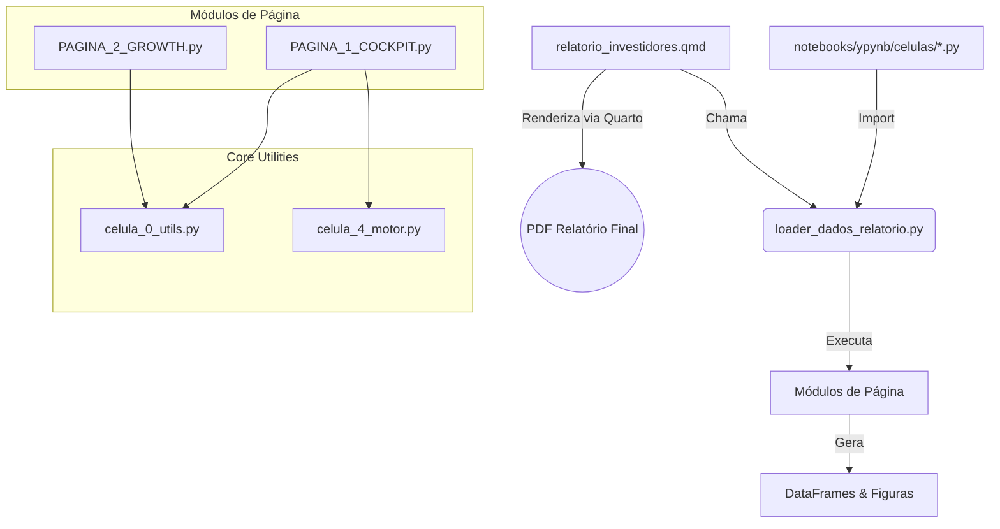

# 📘 DOCUMENTAÇÃO TÉCNICA MASTER V20.0 - JUPYTER & QUARTO PDF REPORT
**Projeto:** SAM Análise Financeira - Investor Deck Generator
**Versão:** 20.0 (Gold Standard - Modular V7)
**Status:** ✅ Produção (Páginas 1 e 2 Completas + PDF Automatizado)
**Data:** 07/12/2025

---

## 🏗️ 1. Arquitetura do Sistema

O projeto migrou de um Notebook monolítico para uma arquitetura modular baseada em scripts Python, orquestrada por um loader central e renderizada via Quarto.

### 1.1 Diagrama de Componentes



### 1.2 Estrutura de Diretórios Crítica

```
e:\Projetos\sam_analise_financeira\notebooks\
├── quarto_pdf\
│   └── relatorio_investidores.qmd       # 📄 Template do Relatório PDF
├── ypynb\
│   ├── loader_dados_relatorio.py        # 🚀 Orquestrador Principal
│   └── celulas\
│       ├── celula_0_utils.py            # 🛠️ Shared Utils (HTML/PDF Sanitizer)
│       ├── celula_2_premissas.py        # ⚙️ Configuração Central (PREMISSAS)
│       ├── celula_4_motor.py            # 🧮 Motor de Simulação Financeira
│       ├── PAGINA_1_COCKPIT.py          # 📊 Visualizações Pág. 1
│       └── PAGINA_2_GROWTH.PY           # 📊 Visualizações Pág. 2
```

---

## 🚀 2. Guia de Uso (Workflow)

### 2.1 Gerando o Relatório PDF

O comando deve ser executado da raiz do projeto (onde está o `venv`). **Não requer abrir o Jupyter Notebook.**

```bash
quarto render notebooks/quarto_pdf/relatorio_investidores.qmd --to pdf
```

**O que acontece nos bastidores:**
1. Quarto inicializa um kernel Python.
2. `relatorio_investidores.qmd` importa os scripts.
3. `executar_analise_real` e `ideal` rodam as simulações.
4. `render_atomic_block` (em `utils.py`) detecta `report_mode=True`.
5. Gráficos são salvos como PNG e tabelas convertidas para Markdown puro.
6. PDF final é gerado em `notebooks/quarto_pdf/relatorio_investidores.pdf`.

### 2.2 Trabalhando no Jupyter Notebook (Desenvolvimento)

1. Abra `notebooks/ypynb/real_vs_ideal.ipynb`.
2. As células agora apenas importam e chamam as funções.
3. `report_mode=False` é ativado automaticamente.
4. Output é gerado com HTML/CSS rico (cores, badges, interatividade).

---

## 🛠️ 3. Padrões de Desenvolvimento (Gold Standard)

### 3.1 Anatomia de uma Página (`PAGINA_X.py`)

Todo arquivo de página deve seguir esta estrutura:

1. **Imports:** Apenas o necessário + `celula_0_utils`.
2. **Função `gerar_viz_X`:** Cria 1 gráfico específico. Retorna `(fig, df_tabela, insight)`.
3. **Função `executar_pagina_X`:**
   - Recebe `df_real`, `df_ideal`, `report_mode`.
   - Chama as funções de visualização.
   - Chama `render_atomic_block` para imprimir o output.

### 3.2 O Utilitário `render_atomic_block`

Localizado em `celula_0_utils.py`, é o coração da compatibilidade Híbrida (Notebook/PDF).

- **Entradas:** `chart_id`, Títulos, Figura, Tabela, Insight.
- **Lógica Dual:**
  - **Se PDF (`report_mode=True`):**
    - Tabela viram Markdown puro (remove HTML tags).
    - Insights usam Quarto Callouts (`::: {.callout-tip} :::`).
    - Usa `\newpage` para quebra de página.
    - Separador visual é `***` (evita conflito YAML com `---`).
  - **Se Notebook (`report_mode=False`):**
    - Tabelas usam HTML estilizado (Pandas Styler/CSS).
    - Insights usam `<div>` coloridas.

---

## ⚠️ 4. Troubleshooting & Lições Aprendidas

### 🚨 Erro: `YAML parse exception`
- **Sintoma:** O comando `quarto render` falha dizendo que não encontrou `,` ou `}` no YAML.
- **Causa Real:** Geralmente **NÃO** é o cabeçalho YAML. É algum output Python imprimindo caracteres reservados do Markdown/Pandoc, como `---` (traço triplo) ou HTML malformado no meio do fluxo.
- **Solução:**
  1. Use `display(Markdown("***"))` em vez de `---`.
  2. Nunca imprima HTML cru (`<span>`, `<div>`) em `report_mode=True`. O `render_atomic_block` já trata isso removendo tags via Regex.

### 🚨 Erro: `ImportError: No module named 'celula_2_premissas'`
- **Causa:** O script Python roda dentro do contexto do arquivo `.qmd`, que pode não ter o diretório `celulas` no `sys.path`.
- **Solução:** No bloco de setup do `.qmd`, adicione explicitamente:
  ```python
  sys.path.append(os.path.join(root_dir, 'notebooks/ypynb/celulas/'))
  ```

### 🚨 Gráficos Cortados no PDF
- **Causa:** Tamanho padrão do matplotlib excede margens A4.
- **Solução:** Padronizar `figsize=(10, 6)` ou similar no `setup_style` do `utils.py`.

---

## 🗑️ 5. Arquivos Obsoletos (Deletados)

Os seguintes arquivos foram consolidados neste documento e removidos para limpeza:
- `HANDOFF_FINAL_PAGINA2.md`
- `HANDOFF_GERAL_STATUS.md`
- `HANDOFF_GERAL_V7.md`
- `plano_completo_notebook.md`
- `mockup_narrativa.md`
- `mockup_paginas.md`

Use este `DOCUMENTACAO_TECNICA_MASTER.md` e o `diretrizes_notebook.md` (Design System) como únicas fontes de verdade.
