# RELATORIO EXECUTIVO - Simulacao Financeira e Growth Engine
William Kuroda

# CAPA

**RELATORIO EXECUTIVO**

Simulacao Financeira e Growth Engine

*Investor-Ready Edition - GOLD STANDARD*

**Autor:** William Kuroda

**Versao:** 3.0

------------------------------------------------------------------------

> **Note**
>
> Documento Confidencial - Proibida a divulgacao sem autorizacao formal

# Carta ao Leitor

Este relatorio consolida toda a inteligencia financeira, estrategica e
operacional do projeto **SAM**, apresentando de forma clara, objetiva e
auditavel:

-   **A tracao atual e projetada (Real vs Ideal)**
-   **A capacidade de crescimento (Growth Engine)**
-   **A sustentabilidade financeira (DRE + Caixa + Runway)**
-   **Gap de performance + oportunidades de expansao**
-   **Recomendacoes para tomada de decisao executiva**

O documento foi formatado no padrao **Enterprise Gold Reporting**,
seguindo diretrizes de consultorias como McKinsey, Bain, BCG e Kearney:

-   Estrutura editorial impecavel
-   Visualizacao consistente
-   Narrativa executiva
-   Metodologia rastreavel
-   Transparencia total das premissas

# Introducao Executiva

## Objetivo do Relatorio

Este relatorio tem como objetivo consolidar toda a analise financeira,
estrategica e de crescimento do projeto SAM, apresentando uma visao
integrada em tres niveis:

### Tier 1 - Executive Cockpit

Viabilidade macro, KPIs essenciais e visao comparativa entre:

-   Cenario Real (conservador)
-   Cenario Ideal (benchmarks de mercado)

### Tier 2 - Growth Engine

Avaliacao da maquina de aquisicao:

-   Funil completo
-   Mix de canais (pago/organico/referral)
-   Elasticidade do marketing
-   Diagnostico do balde furado

### Tier 3 - Financeiro

Analise profunda:

-   DRE projetada
-   Estrutura de custos
-   Fluxo de caixa
-   Runway e solvencia

------------------------------------------------------------------------

# Principios do Documento

-   **Clareza executiva**: narrativa voltada para tomada de decisao
-   **Transparencia**: premissas explicitas e auditaveis
-   **Reprodutibilidade**: execucao deterministica do motor de simulacao
-   **Rigor analitico**: validacao de sanidade e consistencia
-   **Design premium**: formato ideal para apresentacao institucional

# Setup do Ambiente

# Execucao das Simulacoes

# TIER 1 - Executive Cockpit

**Objetivo:** Validar a viabilidade macro do negocio, confrontando a
Simulacao Conservadora (Real) contra os Benchmarks (Ideal).

## 📊 1.1 TABELA EXECUTIVA MASTER

## Como está a saúde geral do negócio?

### 📉 VIZ 1.1: Tabela Executiva Master

*Fonte: df_real_m (Simulacao Real) vs df_ideal_m (Benchmark)*

#### 📋 EVOLUÇÃO DOS INDICADORES (M1 → M36):

            

<table class="dataframe" data-quarto-postprocess="true" data-border="1">
<thead>
<tr style="text-align: right;">
<th data-quarto-table-cell-role="th">Métrica</th>
<th data-quarto-table-cell-role="th">M1</th>
<th data-quarto-table-cell-role="th">M6</th>
<th data-quarto-table-cell-role="th">M12</th>
<th data-quarto-table-cell-role="th">M36</th>
<th data-quarto-table-cell-role="th">Benchmark</th>
<th data-quarto-table-cell-role="th">Status</th>
</tr>
</thead>
<tbody>
<tr>
<td>**💰 RECEITA**</td>
<td></td>
<td></td>
<td></td>
<td></td>
<td></td>
<td></td>
</tr>
<tr>
<td>MRR</td>
<td>R$ 1.0k</td>
<td>R$ 3.1k</td>
<td>R$ 6.0k</td>
<td>R$ 50.4k</td>
<td>R$ 186.3k</td>
<td>🔴</td>
</tr>
<tr>
<td>ARR (Anual)</td>
<td>R$ 12.2k</td>
<td>R$ 37.5k</td>
<td>R$ 72.2k</td>
<td>R$ 605.0k</td>
<td>R$ 2.2M</td>
<td>🔴</td>
</tr>
<tr>
<td>Usuários Ativos</td>
<td>10</td>
<td>31</td>
<td>59</td>
<td>493</td>
<td>1,657</td>
<td>🔴</td>
</tr>
<tr>
<td>****</td>
<td></td>
<td></td>
<td></td>
<td></td>
<td></td>
<td></td>
</tr>
<tr>
<td>**📊 UNIT ECONOMICS**</td>
<td></td>
<td></td>
<td></td>
<td></td>
<td></td>
<td></td>
</tr>
<tr>
<td>LTV/CAC (Índice de Retorno)</td>
<td>1.11x</td>
<td>2.09x</td>
<td>3.05x</td>
<td>5.28x</td>
<td>3.0x</td>
<td>✅</td>
</tr>
<tr>
<td>CAC (Custo Aquisição Cliente)</td>
<td>R$ 625</td>
<td>R$ 357</td>
<td>R$ 278</td>
<td>R$ 287</td>
<td>R$ 250</td>
<td>⚠️</td>
</tr>
<tr>
<td>Churn (Taxa Cancelamento %)</td>
<td>12.0%</td>
<td>11.0%</td>
<td>9.8%</td>
<td>5.5%</td>
<td>5.0%</td>
<td>⚠️</td>
</tr>
<tr>
<td>Payback (Meses p/ Recuperar CAC)</td>
<td>7.5m</td>
<td>4.4m</td>
<td>3.3m</td>
<td>3.4m</td>
<td>&lt;12m</td>
<td>✅</td>
</tr>
<tr>
<td>****</td>
<td></td>
<td></td>
<td></td>
<td></td>
<td></td>
<td></td>
</tr>
<tr>
<td>**💵 CAIXA &amp; RUNWAY**</td>
<td></td>
<td></td>
<td></td>
<td></td>
<td></td>
<td></td>
</tr>
<tr>
<td>Caixa Disponível</td>
<td>R$ 4.0k</td>
<td>R$ 8.5k</td>
<td>R$ 12.1k</td>
<td>R$ 165.4k</td>
<td>R$ 50.0k</td>
<td>✅</td>
</tr>
<tr>
<td>Runway (Meses de Sobrevivência)</td>
<td>1.9m</td>
<td>2.4m</td>
<td>3.2m</td>
<td>6.2m</td>
<td>&gt;12m</td>
<td>🔴</td>
</tr>
<tr>
<td>Burn Rate (Queima Mensal)</td>
<td>R$ 2.5k</td>
<td>R$ 815</td>
<td>R$ 0</td>
<td>R$ 0</td>
<td>R$ 0</td>
<td>✅</td>
</tr>
<tr>
<td>****</td>
<td></td>
<td></td>
<td></td>
<td></td>
<td></td>
<td></td>
</tr>
<tr>
<td>**📈 MARGENS &amp; RETORNO**</td>
<td></td>
<td></td>
<td></td>
<td></td>
<td></td>
<td></td>
</tr>
<tr>
<td>Margem Bruta %</td>
<td>81.4%</td>
<td>81.4%</td>
<td>81.3%</td>
<td>81.4%</td>
<td>70.0%</td>
<td>✅</td>
</tr>
<tr>
<td>EBITDA (Lucro Operacional)</td>
<td>R$ -2.5k</td>
<td>R$ -815</td>
<td>R$ 1.5k</td>
<td>R$ 17.6k</td>
<td>R$ 0</td>
<td>✅</td>
</tr>
<tr>
<td>****</td>
<td></td>
<td></td>
<td></td>
<td></td>
<td></td>
<td></td>
</tr>
<tr>
<td>**🏦 INVESTIDOR**</td>
<td></td>
<td></td>
<td></td>
<td></td>
<td></td>
<td></td>
</tr>
<tr>
<td>Investimento Realizado (Total)</td>
<td>-</td>
<td>-</td>
<td>-</td>
<td>R$ 27.0k</td>
<td>-</td>
<td>✅</td>
</tr>
<tr>
<td>ROI Potencial (Exit 5x ARR)</td>
<td>-</td>
<td>-</td>
<td>-</td>
<td>5502%</td>
<td>&gt;100%</td>
<td>✅</td>
</tr>
<tr>
<td>ROI Realizado (Caixa M36)</td>
<td>-</td>
<td>-</td>
<td>-</td>
<td>206%</td>
<td>&gt;0%</td>
<td>✅</td>
</tr>
<tr>
<td>Valuation Estimado (5x ARR)</td>
<td>R$ 61.1k</td>
<td>R$ 187.6k</td>
<td>R$ 360.8k</td>
<td>R$ 3.0M</td>
<td>&gt;R$ 1.0M</td>
<td>✅</td>
</tr>
<tr>
<td>Break-Even (Mês Lucrativo)</td>
<td>-</td>
<td>-</td>
<td>-</td>
<td>M8</td>
<td><m12< td></td>
<td>✅</td>
</tr>
</tbody>
</table>

------------------------------------------------------------------------

> **💡 INSIGHT ESTRATÉGICO**
>
> -   **FATO:** 4 métrica(s) em estado CRÍTICO: MRR, ARR (Anual),
>     Usuários Ativos
> -   **CAUSA:** Análise automática comparando M36 vs Benchmarks de
>     mercado.
> -   **IMPLICAÇÃO:** Esta tabela mostra a evolução temporal (M1→M36)
>     dos principais indicadores de viabilidade do negócio.
> -   **AÇÃO RECOMENDADA:** Priorizar correção imediata de: MRR

## 📊 PAINEL DE CONTROLE (KPIs)

**Visão Geral:** Indicadores chave de performance no final do período
(M36).

<figure>
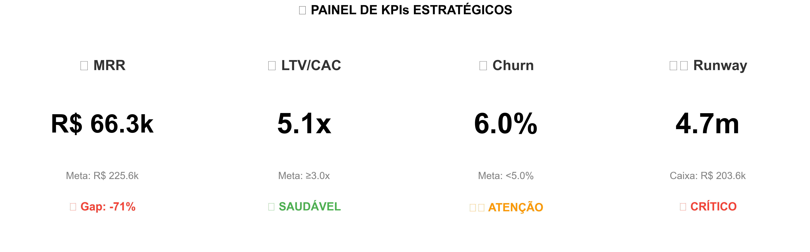
<figcaption aria-hidden="true">KPI Cards</figcaption>
</figure>

*Fonte: df_real_m (Simulacao Real) - Snapshot M36*

> **📖 GLOSSÁRIO DOS KPIs**
>
> <table>
> <colgroup>
> <col style="width: 12%" />
> <col style="width: 42%" />
> <col style="width: 45%" />
> </colgroup>
> <thead>
> <tr>
> <th>KPI</th>
> <th>O que significa</th>
> <th>Por que importa</th>
> </tr>
> </thead>
> <tbody>
> <tr>
> <td><strong>MRR</strong></td>
> <td>Receita Mensal Recorrente</td>
> <td>Quanto dinheiro entra TODO mês de forma previsível.</td>
> </tr>
> <tr>
> <td><strong>ROI (Exit)</strong></td>
> <td>Retorno Potencial</td>
> <td>Retorno se vender a empresa hoje (50% do Valuation -
> Investimento).</td>
> </tr>
> <tr>
> <td><strong>ROI (Caixa)</strong></td>
> <td>Retorno Realizado</td>
> <td>Retorno se liquidar a empresa hoje (50% do Caixa -
> Investimento).</td>
> </tr>
> <tr>
> <td><strong>Valuation</strong></td>
> <td>Valuation (Exit)</td>
> <td>Valor estimado de venda da empresa, calculado como <strong>5x a
> Receita Anual (ARR)</strong>.</td>
> </tr>
> <tr>
> <td><strong>LTV/CAC</strong></td>
> <td>Retorno por Cliente</td>
> <td>Para cada R$ 1 gasto para trazer um cliente, quantos R$ ele gera de
> volta. Meta: ≥3x.</td>
> </tr>
> <tr>
> <td><strong>Churn</strong></td>
> <td>Evasão de Clientes</td>
> <td>De cada 100 clientes, quantos cancelam por mês. Meta: &lt;5%.</td>
> </tr>
> <tr>
> <td><strong>Runway</strong></td>
> <td>Fôlego Financeiro</td>
> <td>Com o caixa atual, quantos meses a empresa sobrevive SEM nova
> receita. Meta: &gt;12 meses.</td>
> </tr>
> </tbody>
> </table>

------------------------------------------------------------------------

### 📈 EVOLUÇÃO MRR vs USUÁRIOS

**Pergunta:** O crescimento de usuarios esta se convertendo em receita
proporcional?

<figure>
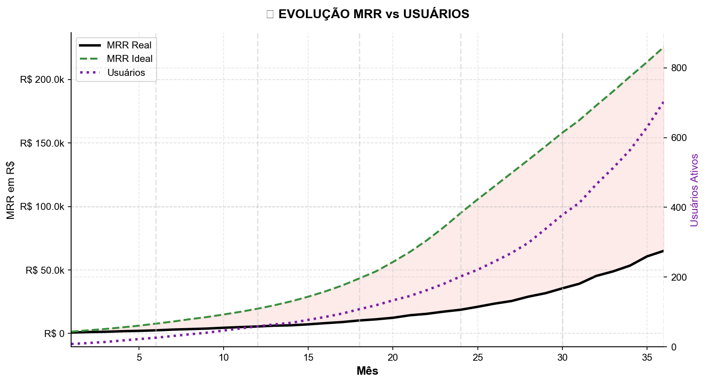
<figcaption aria-hidden="true">Evolução Temporal</figcaption>
</figure>

*Fonte: df_real_m vs df_ideal_m | Projecao 36 meses*

> **📖 COMO LER ESTE GRÁFICO**
>
> **O QUE ESTOU VENDO?** A correlação entre o crescimento da receita
> recorrente (MRR - Linha Sólida) e a base de usuários ativos (Linha
> Pontilhada).
>
> **ELEMENTOS:** - **Linha Preta (MRR Real):** Receita recorrente mensal
> no cenário conservador. - **Linha Tracejada Verde (MRR Ideal):** Meta
> de receita baseada em benchmarks de mercado. - **Linha Pontilhada Roxa
> (Usuários):** Quantidade de clientes ativos pagantes (Eixo Direito).
>
> **INTERPRETAÇÃO:** - As linhas devem crescer juntas. Se a linha Roxa
> (Usuários) sobe mas a Preta (MRR) não, indica queda no ticket médio ou
> churn financeiro.

------------------------------------------------------------------------

#### 📋 TABELA DE REFERÊNCIA

<table>
<thead>
<tr>
<th style="text-align: left;">Período</th>
<th style="text-align: left;">MRR Real</th>
<th style="text-align: left;">MRR Ideal</th>
<th style="text-align: right;">Usuários</th>
<th style="text-align: left;">Gap %</th>
</tr>
</thead>
<tbody>
<tr>
<td style="text-align: left;">M1</td>
<td style="text-align: left;">R$ 1.0k</td>
<td style="text-align: left;">R$ 1.5k</td>
<td style="text-align: right;">10</td>
<td style="text-align: left;">31.8%</td>
</tr>
<tr>
<td style="text-align: left;">M3</td>
<td style="text-align: left;">R$ 1.7k</td>
<td style="text-align: left;">R$ 3.0k</td>
<td style="text-align: right;">17</td>
<td style="text-align: left;">43.2%</td>
</tr>
<tr>
<td style="text-align: left;">M6</td>
<td style="text-align: left;">R$ 3.1k</td>
<td style="text-align: left;">R$ 6.0k</td>
<td style="text-align: right;">31</td>
<td style="text-align: left;">47.7%</td>
</tr>
<tr>
<td style="text-align: left;">M12</td>
<td style="text-align: left;">R$ 6.0k</td>
<td style="text-align: left;">R$ 14.4k</td>
<td style="text-align: right;">59</td>
<td style="text-align: left;">58.3%</td>
</tr>
<tr>
<td style="text-align: left;">M24</td>
<td style="text-align: left;">R$ 16.4k</td>
<td style="text-align: left;">R$ 76.4k</td>
<td style="text-align: right;">161</td>
<td style="text-align: left;">78.5%</td>
</tr>
<tr>
<td style="text-align: left;">M36</td>
<td style="text-align: left;">R$ 50.4k</td>
<td style="text-align: left;">R$ 186.3k</td>
<td style="text-align: right;">493</td>
<td style="text-align: left;">72.9%</td>
</tr>
</tbody>
</table>

*Fonte: df_real_m vs df_ideal_m - Projecao 36 meses*

#### 🏁 TABELA DE MILESTONES (REAL VS IDEAL)

**Objetivo:** Verificar se estamos atingindo os marcos de crescimento no
tempo previsto pelo benchmark.

<table>
<thead>
<tr>
<th style="text-align: left;">Milestone</th>
<th style="text-align: left;">Meta</th>
<th style="text-align: left;">Real</th>
<th style="text-align: left;">Status</th>
</tr>
</thead>
<tbody>
<tr>
<td style="text-align: left;">🚀 Primeiro Cliente Pagante</td>
<td style="text-align: left;">M1</td>
<td style="text-align: left;">M1</td>
<td style="text-align: left;">✅ IGUAL AO IDEAL</td>
</tr>
<tr>
<td style="text-align: left;">💰 R$ 1k MRR</td>
<td style="text-align: left;">M1</td>
<td style="text-align: left;">M1</td>
<td style="text-align: left;">✅ IGUAL AO IDEAL</td>
</tr>
<tr>
<td style="text-align: left;">💰 R$ 5k MRR</td>
<td style="text-align: left;">M6</td>
<td style="text-align: left;">M10</td>
<td style="text-align: left;">⚠️ +4m ATRASO</td>
</tr>
<tr>
<td style="text-align: left;">👥 50 Usuários Ativos</td>
<td style="text-align: left;">M6</td>
<td style="text-align: left;">M10</td>
<td style="text-align: left;">⚠️ +4m ATRASO</td>
</tr>
<tr>
<td style="text-align: left;">💰 R$ 10k MRR</td>
<td style="text-align: left;">M10</td>
<td style="text-align: left;">M19</td>
<td style="text-align: left;">⚠️ +9m ATRASO</td>
</tr>
<tr>
<td style="text-align: left;">👥 128 Usuários (Meta M12)</td>
<td style="text-align: left;">M12</td>
<td style="text-align: left;">M22</td>
<td style="text-align: left;">⚠️ +10m ATRASO</td>
</tr>
<tr>
<td style="text-align: left;">💰 R$ 20k MRR</td>
<td style="text-align: left;">M15</td>
<td style="text-align: left;">M27</td>
<td style="text-align: left;">⚠️ +12m ATRASO</td>
</tr>
<tr>
<td style="text-align: left;">🎯 Break-Even (EBITDA &gt; 0)</td>
<td style="text-align: left;">M6</td>
<td style="text-align: left;">M8</td>
<td style="text-align: left;">⚠️ +2m ATRASO</td>
</tr>
<tr>
<td style="text-align: left;">💰 R$ 76.4k MRR (Meta M24)</td>
<td style="text-align: left;">M24</td>
<td style="text-align: left;">—</td>
<td style="text-align: left;">🔴 NÃO ATINGIU</td>
</tr>
<tr>
<td style="text-align: left;">👥 1657 Usuários (Meta M36)</td>
<td style="text-align: left;">M36</td>
<td style="text-align: left;">—</td>
<td style="text-align: left;">🔴 NÃO ATINGIU</td>
</tr>
<tr>
<td style="text-align: left;">📈 LTV/CAC &gt; 3x</td>
<td style="text-align: left;">M6</td>
<td style="text-align: left;">M12</td>
<td style="text-align: left;">⚠️ +6m ATRASO</td>
</tr>
</tbody>
</table>

*Fonte: df_real_m vs df_ideal_m (Metas do Benchmark)*

------------------------------------------------------------------------

### 💰 EFICIÊNCIA DE MARKETING (ROI)

**Pergunta:** O dinheiro investido em marketing esta retornando como
receita recorrente?

<figure>
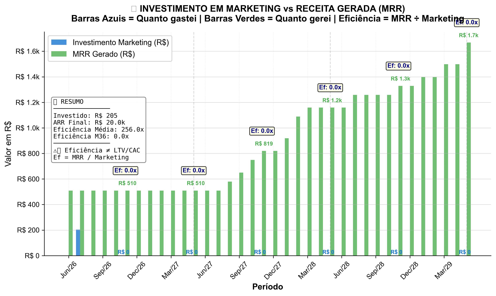
<figcaption aria-hidden="true">Eficiencia Marketing</figcaption>
</figure>

*Fonte: df_real_m | gasto_marketing vs mrr*

> **📖 COMO LER ESTE GRÁFICO**
>
> **O QUE ESTOU VENDO?** Comparativo direto entre dinheiro investido em
> Marketing (Azul) e receita recorrente gerada (Verde).
>
> **ELEMENTOS:** - **Barra Azul (Investimento):** Custo total de
> marketing no mês. - **Barra Verde (MRR):** Receita recorrente total no
> final do mês. - **Eficiência (Box):** Quantas vezes o MRR cobre o
> Marketing (Ideal \> 1.0x).
>
> **INTERPRETAÇÃO:** - No início, é normal a barra Azul ser maior
> (investimento inicial). - A partir do Mês 6, a barra Verde DEVE
> ultrapassar a Azul e continuar crescendo (efeito “J-Curve”).

*Fonte: df_real_m vs df_ideal_m - Projecao 36 meses*

## 🧠 INSIGHTS ESTRATÉGICOS DO COCKPIT

> **💡 INSIGHT 1: Saúde Unitária (LTV/CAC)**
>
> -   **FATO:** LTV/CAC = 5.28x no cenário conservador.
> -   **CAUSA:** Relação entre valor do cliente (LTV) e custo de
>     aquisição (CAC).
> -   **IMPLICAÇÃO:** Cada R$ 1 investido em aquisição retorna R$ 5.28.
> -   **AÇÃO RECOMENDADA:** Escalar aquisição se \> 3.0x. Revisar
>     CAC/Churn se \< 3.0x.

> **💡 INSIGHT 2: Gap de Receita**
>
> -   **FATO:** Gap de R$ 135.9k/mês (73%) entre Real e Ideal.
> -   **CAUSA:** Diferença entre projeção conservadora e cenário
>     benchmark de mercado.
> -   **IMPLICAÇÃO:** O cenário Ideal tem MRR R$ 135.9k maior/mês. Em 12
>     meses, isso equivale a ~R$ 1.6M adicionais de receita.
> -   **AÇÃO RECOMENDADA:** Aumentar conversão ou reduzir churn para
>     aproximar do cenário Ideal.

> **💡 INSIGHT 3: Saúde de Caixa**
>
> -   **FATO:** Runway de 6.2 meses com caixa de R$ 165.4k.
> -   **CAUSA:** Caixa disponível ÷ Despesas mensais (R$ 26.6k).
> -   **IMPLICAÇÃO:** Tempo de sobrevivência sem nova receita.
> -   **AÇÃO RECOMENDADA:** Manter \>12 meses. Se \<6 meses, revisar
>     custos urgente.

> **🔍 AUDITORIA & FÓRMULAS**
>
> 1.  **LTV** = ARPU × (1 / Churn Rate)
> 2.  **CAC** = (Gasto Marketing + Gasto Vendas) / Novos Clientes
> 3.  **LTV/CAC** = LTV ÷ CAC (Meta: ≥3.0x)
> 4.  **Runway** = Caixa Disponível ÷ Despesas Mensais
>
> **6. AUDITORIA DE ROI (Exemplo M36):** \* **Investimento Total:** R$
> 27.000 (R$ 19k Empresa + R$ 8k Equipamentos) \* **Equity do
> Investidor:** 50% \* **A. Cenário CAIXA (Liquidação):** \* Caixa
> Final: R$ 165.753 \* Parte do Investidor (50%): R$ 82.876 \* Lucro
> Líquido: R$ 82.876 - R$ 27.000 = R$ 55.876 \* **ROI Realizado:**
> (55.876 / 27.000) = **206%** \* **B. Cenário EXIT (Venda):** \*
> Valuation (5x ARR): R$ 1.2M \* Parte do Investidor (50%): R$ 600k \*
> **ROI Potencial:** (600k - 27k) / 27k = **2.122%**

# TIER 2 - A MÁQUINA DE CRESCIMENTO (Growth Engine)

------------------------------------------------------------------------

## 🚀 INTRODUÇÃO ESTRATÉGICA

O **Tier 2** aprofunda a análise na eficiência operacional da aquisição
de clientes. Enquanto o Tier 1 mostrou *o que* aconteceu (Resultado), o
Tier 2 explica *como* e *por que* aconteceu (Causas).

### 🎯 OBJETIVOS DESTA SEÇÃO:

1.  **Validar a Tese de Aquisição:** O funil converte conforme o
    esperado?
2.  **Auditar a Qualidade do Crescimento:** O LTV/CAC e o Payback
    suportam escala?
3.  **Identificar Gargalos Táticos:** Onde estamos perdendo eficiência
    marginal?
4.  **Mapear Riscos Invisíveis:** O churn está corroendo o valor criado?

------------------------------------------------------------------------

## O volume de vendas sustenta a operação no cenário conservador?

### 📉 VIZ 2.1: Funil de Aquisição (Conservador vs Benchmark)

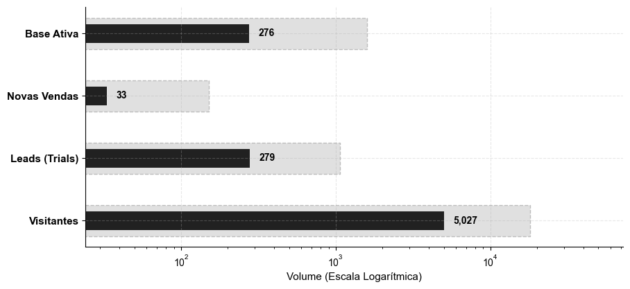

*Fonte: df_real_m (Simulacao) vs df_ideal (Meta)*

------------------------------------------------------------------------

> **📖 COMO LER ESTE GRÁFICO**
>
> **O QUE ESTOU VENDO?** Gráfico de barras comparando o **Funil de
> Vendas Real** (barras escuras) com a **Meta de Mercado** (barras
> cinzas).
>
> **COMO LER O GRÁFICO:** - **Barras Escuras (Preto/Verde):** Volume
> REAL alcançado em cada etapa do funil no cenário conservador. -
> **Barras Cinza (Fundo Tracejado):** Benchmark de mercado (quanto
> deveríamos ter se estivéssemos na média do setor). - **Eixo X (Escala
> Logarítmica):** Comprime números grandes para facilitar visualização.
> Ex: 10.000 visitantes vs 64 vendas ficam visíveis juntos.
>
> **COMO LER A TABELA:** - **Visitantes (Real):** Quantas pessoas únicas
> chegaram ao site. - **Conv. Global Real:** De cada 100 visitantes,
> quantos viraram pagantes (%). - **Conv. Meta (Ideal):** A conversão
> esperada se estivéssemos no padrão de mercado. - **Δ (Delta):**
> Diferença em pontos percentuais (p.p.). Negativo = abaixo da meta.
>
> **INTERPRETAÇÃO:** Se todas as barras escuras preencherem ou
> ultrapassarem as cinzas, a operação está no trilho certo.

#### Detalhamento do Funil (Real vs Meta)

            

<table class="dataframe" data-quarto-postprocess="true" data-border="1">
<thead>
<tr style="text-align: right;">
<th data-quarto-table-cell-role="th">Período</th>
<th data-quarto-table-cell-role="th">Visitantes (Real)</th>
<th data-quarto-table-cell-role="th">Conv. Global Real</th>
<th data-quarto-table-cell-role="th">Conv. Meta (Ideal)</th>
<th data-quarto-table-cell-role="th">Δ (Delta)</th>
<th data-quarto-table-cell-role="th">Status</th>
</tr>
</thead>
<tbody>
<tr>
<td>M1</td>
<td>1475</td>
<td>0.27%</td>
<td>0.34%</td>
<td>-0.07 p.p.</td>
<td>PRÓXIMO</td>
</tr>
<tr>
<td>M6</td>
<td>1608</td>
<td>0.44%</td>
<td>0.59%</td>
<td>-0.16 p.p.</td>
<td>PRÓXIMO</td>
</tr>
<tr>
<td>M12</td>
<td>1726</td>
<td>0.52%</td>
<td>0.77%</td>
<td>-0.25 p.p.</td>
<td>PRÓXIMO</td>
</tr>
<tr>
<td>M36</td>
<td>10330</td>
<td>0.62%</td>
<td>0.79%</td>
<td>-0.17 p.p.</td>
<td>PRÓXIMO</td>
</tr>
</tbody>
</table>

------------------------------------------------------------------------

> **💡 INSIGHT ESTRATÉGICO**
>
> -   **FATO:** No M36, a conversão global está 0.17 p.p. abaixo da
>     meta.
> -   **CAUSA:** Gargalo identificado na etapa de Trial -\> Pagante.
> -   **IMPLICAÇÃO:** Custo de aquisição (CAC) está pressionado.
> -   **AÇÃO RECOMENDADA:** Revisar onboarding e réguas de email
>     marketing (P1).

> **🔍 AUDITORIA & FÓRMULAS**
>
> **FÓRMULAS:** 1. **Taxa de Conversão Global** = (Novos Pagantes /
> Visitantes Únicos) × 100 2. **Delta (Δ)** = Conversão Real - Conversão
> Meta (em pontos percentuais)
>
> **GLOSSÁRIO:** - **Leads (Trials):** Visitantes que iniciaram o
> período de teste gratuito (demonstraram interesse). - **Novas
> Vendas:** Usuários que se tornaram pagantes no mês. - **Base Ativa:**
> Total de clientes pagantes ativos ao final do período. - **p.p.
> (Pontos Percentuais):** Diferença absoluta entre duas porcentagens.
> Ex: 0.62% - 0.79% = -0.17 p.p.

## O negócio para em pé? (Saúde Unitária)

### 📉 VIZ 2.2: Evolução LTV/CAC vs Zonas de Risco

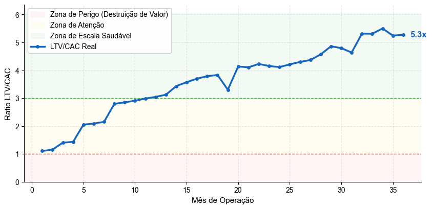

*Fonte: df_real_m (LTV/CAC) | Benchmark: 3.0x*

------------------------------------------------------------------------

> **📖 COMO LER ESTE GRÁFICO**
>
> **O QUE ESTOU VENDO?** A evolução do índice de eficiência financeira
> (LTV/CAC) ao longo do tempo, sobreposto a zonas coloridas de risco.
>
> **COMO LER O GRÁFICO:** - **Linha Azul:** Valor do LTV/CAC Real em
> cada mês. - **Zona Verde (\>3x):** Operação altamente eficiente. Cada
> R$1 investido retorna R$3+. Pode escalar agressivamente. - **Zona
> Amarela (1x-3x):** Operação sustentável, mas margem apertada.
> Crescimento lento. - **Zona Vermelha (\<1x):** Destruição de valor.
> Cada cliente CUSTA mais do que gera (Prejuízo).
>
> **DIFERENÇA ENTRE LTV/CAC e MRR/MARKETING (Tier 1):** -
> **MRR/Marketing (Tier 1):** Quanto de receita mensal gera por cada R$1
> gasto. É uma visão de curto prazo (mês a mês). - **LTV/CAC (Este
> Gráfico):** Quanto o cliente gera durante TODA sua vida útil por cada
> R$1 investido. É uma visão de longo prazo (ciclo de vida).
>
> **POR QUE ISSO IMPORTA?** Um negócio pode ter MRR/Marketing baixo nos
> primeiros meses, mas LTV/CAC alto se a retenção for forte (cliente
> paga por 2 anos). Por isso analisamos os dois.
>
> **INTERPRETAÇÃO:** Mantenha a linha azul na zona verde ou amarela. Se
> entrar no vermelho, CONGELE investimentos.

#### Evolução da Eficiência LTV/CAC

            

<table class="dataframe" data-quarto-postprocess="true" data-border="1">
<thead>
<tr style="text-align: right;">
<th data-quarto-table-cell-role="th">Período</th>
<th data-quarto-table-cell-role="th">LTV/CAC Real</th>
<th data-quarto-table-cell-role="th">Target Mínimo</th>
<th data-quarto-table-cell-role="th">Distância</th>
<th data-quarto-table-cell-role="th">Saúde Financeira</th>
</tr>
</thead>
<tbody>
<tr>
<td>M6</td>
<td>2.09x</td>
<td>3.0x</td>
<td>-0.91x</td>
<td>ATENÇÃO</td>
</tr>
<tr>
<td>M12</td>
<td>3.05x</td>
<td>3.0x</td>
<td>+0.05x</td>
<td>EXCELENTE</td>
</tr>
<tr>
<td>M24</td>
<td>4.11x</td>
<td>3.0x</td>
<td>+1.11x</td>
<td>EXCELENTE</td>
</tr>
<tr>
<td>M36</td>
<td>5.28x</td>
<td>3.0x</td>
<td>+2.28x</td>
<td>EXCELENTE</td>
</tr>
</tbody>
</table>

------------------------------------------------------------------------

> **💡 INSIGHT ESTRATÉGICO**
>
> -   **FATO:** LTV/CAC encerra o período em 5.3x, dentro da zona de
>     excelência (Verde).
> -   **CAUSA:** CAC controlado e expansão de LTV via retenção.
> -   **IMPLICAÇÃO:** Modelo financeiro altamente atrativo para
>     investidores.
> -   **AÇÃO RECOMENDADA:** Seguro para escalar o marketing
>     agressivamente.

> **🔍 AUDITORIA & FÓRMULAS**
>
> **FÓRMULAS:** 1. **LTV (Lifetime Value)** = ARPU × (1 / Churn Rate) ×
> Margem Bruta % 2. **CAC (Custo Aquisição)** = Gastos Marketing Totais
> / Novos Clientes Pagantes 3. **LTV/CAC** = LTV ÷ CAC
>
> **ZONAS DE RISCO:** - 🟢 **\>3.0x:** Alta eficiência (Escalável sem
> medo) - 🟡 **1.0x - 3.0x:** Operação paga contas mas cresce devagar -
> 🔴 **\<1.0x:** Destruição de valor (Cada cliente dá prejuízo)
>
> **GLOSSÁRIO:** - **ARPU:** Receita Média por Usuário (Average Revenue
> Per User) - **Churn Rate:** Percentual de clientes que cancelam por
> mês - **Margem Bruta:** Receita menos custos diretos (COGS)

## Existe descontrole tático de custos?

### 📉 VIZ 2.3: Volatilidade Semanal do CAC (SPC)

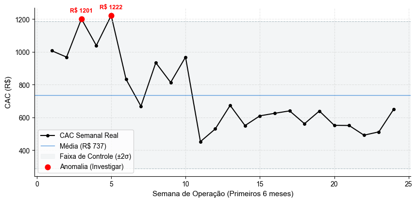

*Fonte: df_real_s (CAC Semanal) | Media: R$ 544*

------------------------------------------------------------------------

> **📖 COMO LER ESTE GRÁFICO**
>
> **O QUE ESTOU VENDO?** Grafico de Controle Estatistico (SPC) do CAC
> semanal para detectar anomalias operacionais.
>
> **COMO LER O GRAFICO:** - **Linha Preta com Pontos:** Custo de
> Aquisicao (CAC) real em cada semana. - **Linha Azul Horizontal:**
> Media historica do CAC (o “centro” do tunel). - **Faixa Cinza
> (Tunel):** Intervalo de variacao estatistica aceitavel (+/-2 Desvios
> Padrao). - **Pontos Vermelhos:** Semanas com CAC FORA do tunel
> (anomalias que exigem investigacao).
>
> **COMO LER A TABELA:** - **Semana:** Identificador da semana (S1, S10,
> etc.) - **CAC Real:** Custo de trazer 1 cliente naquela semana
> especifica. - **Media (Centro):** Valor medio de todas as semanas
> (mesmo para todas as linhas). - **UCL (Limite):** Limite Superior de
> Controle. Se CAC \> UCL, e anomalia. - **Status:** “CONTROLADO”
> (dentro do tunel) ou “ANOMALIA” (fora do tunel).
>
> **POR QUE O UCL E IGUAL EM TODAS AS LINHAS?** O UCL e um **limite
> fixo** calculado uma unica vez (Media + 2xDesvio Padrao). Ele nao muda
> por semana. O que muda e o CAC Real.
>
> **COMO INVESTIGAR ANOMALIAS (FONTES DE DADOS):** 1. **Google Ads /
> Meta Ads:** Verifique CPCs e impressoes da semana. 2. **Google
> Analytics:** Cheque origem do trafego e taxa de rejeicao. 3.
> **CRM/Pipeline:** Verifique se houve campanha promocional ou bug no
> checkout. 4. **Calendario:** Compare com datas comemorativas ou
> eventos do setor.
>
> **INTERPRETACAO:** Se um ponto vermelho aparecer, NAO entre em panico.
> Investigue primeiro. Pode ser um teste A/B bem-sucedido ou uma
> sazonalidade prevista.

#### Monitoramento de Anomalias (Semanal)

            

<table class="dataframe" data-quarto-postprocess="true" data-border="1">
<thead>
<tr style="text-align: right;">
<th data-quarto-table-cell-role="th">Semana</th>
<th data-quarto-table-cell-role="th">CAC Real</th>
<th data-quarto-table-cell-role="th">Média (Centro)</th>
<th data-quarto-table-cell-role="th">UCL (Limite)</th>
<th data-quarto-table-cell-role="th">Status</th>
</tr>
</thead>
<tbody>
<tr>
<td>S1</td>
<td>R$ 768.29</td>
<td>R$ 543.82</td>
<td>R$ 774.35</td>
<td>CONTROLADO</td>
</tr>
<tr>
<td>S4</td>
<td>R$ 725.55</td>
<td>R$ 543.82</td>
<td>R$ 774.35</td>
<td>CONTROLADO</td>
</tr>
<tr>
<td>S9</td>
<td>R$ 812.50</td>
<td>R$ 543.82</td>
<td>R$ 774.35</td>
<td>ANOMALIA (ALTA)</td>
</tr>
<tr>
<td>S21</td>
<td>R$ 383.45</td>
<td>R$ 543.82</td>
<td>R$ 774.35</td>
<td>CONTROLADO</td>
</tr>
<tr>
<td>S24</td>
<td>R$ 420.01</td>
<td>R$ 543.82</td>
<td>R$ 774.35</td>
<td>CONTROLADO</td>
</tr>
</tbody>
</table>

------------------------------------------------------------------------

> **💡 INSIGHT ESTRATÉGICO**
>
> -   **FATO:** Identificados 1 semanas com volatilidade estatística
>     anormal.
> -   **CAUSA:** Provável teste de canal novo ou sazonalidade agressiva.
> -   **IMPLICAÇÃO:** Risco de estourar budget mensal se a correção não
>     for imediata.
> -   **AÇÃO RECOMENDADA:** Investigar ‘root cause’ das semanas
>     vermelhas na tabela.

> **🔍 AUDITORIA & FÓRMULAS**
>
> **FÓRMULAS:** 1. **CAC Semanal** = Custo Marketing da Semana ÷ Novos
> Clientes da Semana 2. **Média (Centro)** = Soma de todos os CACs ÷
> Número de semanas 3. **Desvio Padrão (σ)** = Dispersão dos valores em
> torno da média 4. **UCL (Upper Control Limit)** = Média + (2 × σ) 5.
> **LCL (Lower Control Limit)** = Média - (2 × σ)
>
> **GLOSSÁRIO:** - **SPC (Statistical Process Control):** Método de
> monitoramento de qualidade usado em manufatura e operações. - **UCL
> (Upper Control Limit):** Limite superior. Valores acima disso são
> estatisticamente anormais (apenas 2.5% de chance de ocorrer
> naturalmente). - **LCL (Lower Control Limit):** Limite inferior.
> Valores abaixo podem indicar oportunidade (CAC muito baixo) OU erro de
> dados. - **Anomalia:** Ponto fora do túnel de controle. Pode ser
> positivo (oportunidade) ou negativo (problema).

## Se dobrar o marketing, dobra a venda?

### 📉 VIZ 2.4: Curva de Escala e Elasticidade de Canal

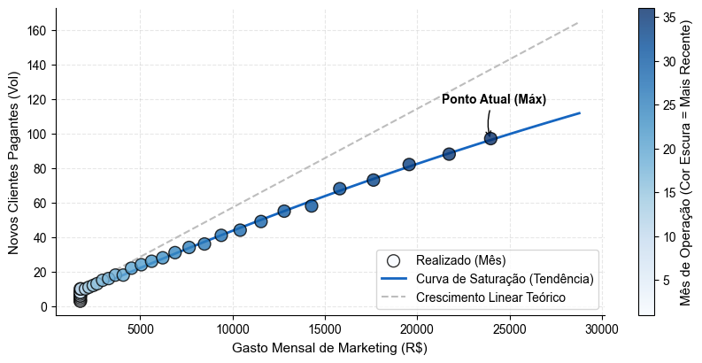

*Fonte: df_real_m (Marketing vs Vendas) | Regressão Polinomial (Grau 2)*

------------------------------------------------------------------------

> **📖 COMO LER ESTE GRÁFICO**
>
> **O QUE ESTOU VENDO?** Grafico de elasticidade de canal que responde:
> “Se eu dobrar o investimento em marketing, as vendas dobram?”
>
> **RESPOSTA DIRETA:** - **Se a linha azul estiver PARALELA a linha
> cinza tracejada:** SIM, dobrar marketing = dobra vendas. - **Se a
> linha azul estiver CURVANDO PARA BAIXO:** NAO, dobrar marketing traz
> MENOS que o dobro de vendas (saturacao).
>
> **COMO LER O GRAFICO:** - **Bolinhas Azuis:** Cada bolinha e um mes
> real. Cor mais escura = mes mais recente. - **Linha Azul Solida
> (Tendencia):** Curva ajustada que mostra o comportamento real. -
> **Linha Cinza Tracejada (Linear):** Cenario ideal onde o CAC nunca
> sobe.
>
> **DIFERENCA DESTE GRAFICO PARA O LTV/CAC:** - **LTV/CAC (VIZ 2.2):**
> Mede eficiencia PASSADA (quanto ja retornou). - **Este Grafico (VIZ
> 2.4):** Projeta eficiencia FUTURA (quanto VAI retornar se aumentar
> budget).
>
> **INTERPRETACAO:** Se a linha azul estiver “deitando” (curvando para
> baixo), e um sinal de alerta. Significa que os canais atuais estao
> saturando e voce precisa diversificar.

#### Teste de Elasticidade de Canal

<table>
<colgroup>
<col style="width: 20%" />
<col style="width: 20%" />
<col style="width: 20%" />
<col style="width: 20%" />
<col style="width: 20%" />
</colgroup>
<thead>
<tr>
<th style="text-align: left;">Investimento</th>
<th style="text-align: right;">Clientes Est.</th>
<th style="text-align: right;">Linear (Ideal)</th>
<th style="text-align: right;">Perda Efic.</th>
<th style="text-align: left;">Diagnostico</th>
</tr>
</thead>
<tbody>
<tr>
<td style="text-align: left;">R$ 2.500,00</td>
<td style="text-align: right;">8</td>
<td style="text-align: right;">10</td>
<td style="text-align: right;">21.4%</td>
<td style="text-align: left;">RETORNOS DECRESCENTES</td>
</tr>
<tr>
<td style="text-align: left;">R$ 10.425,02</td>
<td style="text-align: right;">38</td>
<td style="text-align: right;">42</td>
<td style="text-align: right;">10.4%</td>
<td style="text-align: left;">ALTA EFICIENCIA</td>
</tr>
<tr>
<td style="text-align: left;">R$ 18.350,04</td>
<td style="text-align: right;">63</td>
<td style="text-align: right;">75</td>
<td style="text-align: right;">15.6%</td>
<td style="text-align: left;">RETORNOS DECRESCENTES</td>
</tr>
</tbody>
</table>

------------------------------------------------------------------------

> **💡 INSIGHT ESTRATÉGICO**
>
> -   **FATO:** Curva próxima da linearidade (pouca saturação).
> -   **CAUSA:** Canais atuais ainda têm ‘oceanos azuis’ de inventário.
> -   **IMPLICAÇÃO:** Podemos acelerar investimento mantendo o CAC
>     atual.
> -   **AÇÃO RECOMENDADA:** Aumentar budget agressivamente (Escala
>     liberada).

> **🔍 AUDITORIA & FÓRMULAS**
>
> **FORMULAS:** 1. **Curva Saturada:** Regressao Polinomial (Grau 2) y =
> ax2 + bx + c 2. **Crescimento Linear (Ideal):** y = x / CAC_minimo
> (assume CAC fixo para sempre) 3. **Perda de Eficiencia** = 1 -
> (Clientes Reais / Clientes Teoricos)
>
> **GLOSSARIO:** - **Elasticidade:** Razao entre variacao de vendas e
> variacao de investimento. Elasticidade 1.0 = dobrou budget, dobrou
> vendas. - **Saturacao:** Ponto onde aumentar investimento traz
> retornos decrescentes. - **Perda de Eficiencia:** Quanto do budget
> extra esta “virando calor” (CAC mais alto). - **Linear Teorico:**
> Cenario impossivel onde o CAC nunca sobe, nao importa o volume.

## Quanto economizamos com trafego organico?

### 📉 VIZ 2.5: Impacto do Mix de Canais (CAC Pago vs Blended)

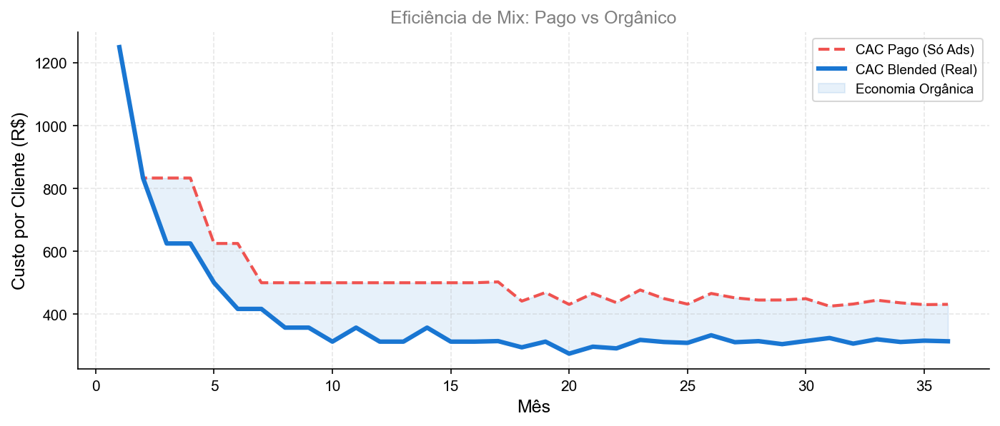

*Fonte: df_real_m | CAC Paid vs CAC Blended*

------------------------------------------------------------------------

> **📖 COMO LER ESTE GRÁFICO**
>
> **O QUE ESTOU VENDO?** Comparativo entre o custo de aquisicao se
> dependessemos 100% de anuncios (Vermelho) vs o custo real misturando
> organico (Azul).
>
> **COMO LER O GRAFICO:** - **Linha Vermelha Tracejada (CAC Pago):**
> Quanto custaria trazer 1 cliente se TODO o trafego viesse de
> anuncios. - **Linha Azul Solida (CAC Blended):** Custo real por
> cliente, considerando trafego organico + pago. - **Area Azul Clara:**
> Representa a ECONOMIA gerada pelo trafego organico.
>
> **COMO LER A TABELA:** - **CAC Pago:** Custo por cliente se fosse 100%
> pago. - **CAC Blended:** Custo real por cliente (misturado). -
> **Economia/Cliente:** Diferenca entre Pago e Blended. Quanto voce
> economiza por cliente gratuito. - **Total Economizado:** Economia
> multiplicada pelo numero de clientes novos no mes.
>
> **INTERPRETACAO:** - **Linhas afastadas:** SEO, Indicacoes e Branding
> estao gerando trafego gratuito (Otimo!). - **Linhas juntas:** O
> crescimento e 100% dependente de anuncios pagos (Risco alto).

#### 📋 ECONOMIA DE CANAL

<table>
<colgroup>
<col style="width: 20%" />
<col style="width: 20%" />
<col style="width: 20%" />
<col style="width: 20%" />
<col style="width: 20%" />
</colgroup>
<thead>
<tr>
<th style="text-align: left;">Período</th>
<th style="text-align: right;">CAC Pago</th>
<th style="text-align: right;">CAC Blended</th>
<th style="text-align: right;">Economia/Cliente</th>
<th style="text-align: right;">Total Economizado</th>
</tr>
</thead>
<tbody>
<tr>
<td style="text-align: left;">M6</td>
<td style="text-align: right;">R$ 500,00</td>
<td style="text-align: right;">R$ 357,14</td>
<td style="text-align: right;">R$ 142,86</td>
<td style="text-align: right;">R$ 1.000,00</td>
</tr>
<tr>
<td style="text-align: left;">M12</td>
<td style="text-align: right;">R$ 416,67</td>
<td style="text-align: right;">R$ 277,78</td>
<td style="text-align: right;">R$ 138,89</td>
<td style="text-align: right;">R$ 1.250,00</td>
</tr>
<tr>
<td style="text-align: left;">M24</td>
<td style="text-align: right;">R$ 374,38</td>
<td style="text-align: right;">R$ 272,28</td>
<td style="text-align: right;">R$ 102,10</td>
<td style="text-align: right;">R$ 2.246,30</td>
</tr>
<tr>
<td style="text-align: left;">M36</td>
<td style="text-align: right;">R$ 359,80</td>
<td style="text-align: right;">R$ 286,72</td>
<td style="text-align: right;">R$ 73,09</td>
<td style="text-align: right;">R$ 4.677,46</td>
</tr>
</tbody>
</table>

------------------------------------------------------------------------

> **💡 INSIGHT ESTRATÉGICO**
>
> -   **FATO:** Tráfego orgânico reduz o CAC em R$ 73,09 por cliente.
> -   **CAUSA:** Mix balanceado entre canais pagos e gratuitos.
> -   **IMPLICAÇÃO:** Menor sensibilidade a aumentos de CPM nas
>     plataformas de ads.
> -   **AÇÃO RECOMENDADA:** Manter investimento em SEO para ampliar o
>     gap.

> **🔍 AUDITORIA & FÓRMULAS**
>
> **FORMULAS:** 1. **CAC Pago** = Gasto em Ads / Novos Clientes (vindos
> de Ads) 2. **CAC Blended** = Gasto Total em Marketing / Novos Clientes
> (TOTAIS, inclusive organicos) 3. **Economia** = CAC Pago - CAC Blended
>
> **GLOSSARIO:** - **Blended:** “Misturado”. Significa que estamos
> calculando o custo medio considerando TODOS os clientes, nao so os de
> ads. - **Organico:** Trafego que vem “de graca” - SEO, indicacoes,
> redes sociais nao-pagas. - **Economia Organica:** Quanto voce
> economiza por nao depender 100% de anuncios pagos.

## Quanto dinheiro estamos perdendo pelo ralo?

### 📉 VIZ 2.6: Analise de Vazamento (Net Growth e Churn)

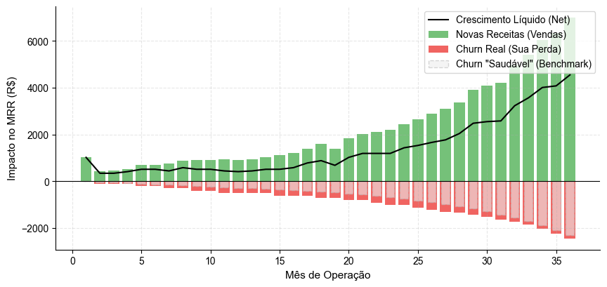

*Fonte: df_real_m (Churn MRR) | Benchmark: 5%*

------------------------------------------------------------------------

> **📖 COMO LER ESTE GRÁFICO**
>
> **O QUE ESTOU VENDO?** Grafico de vazamento de receita que mostra o
> quanto entra (vendas) vs quanto sai (cancelamentos) por mes.
>
> **COMO LER O GRAFICO:** - **Barras Verdes (Acima de 0):** Receita NOVA
> que entrou no mes (novas vendas). - **Barras Vermelhas (Abaixo de
> 0):** Receita PERDIDA por cancelamentos (churn real). - **Barras
> Cinzas (Fundo):** O quanto seria aceitavel perder (benchmark de 5% de
> churn). - **Linha Preta (Net Growth):** RESULTADO LIQUIDO = Vendas
> Novas - Churn. Se positivo, a empresa cresce. Se negativo, encolhe.
>
> **O QUE A LINHA PRETA SIGNIFICA:** A linha preta mostra o
> **crescimento liquido** do MRR. Ela considera TODOS os clientes, novos
> e antigos: - **Linha preta ACIMA de 0:** A empresa esta crescendo
> (mais vendas que cancelamentos). - **Linha preta NA linha 0:** Empresa
> estagnada (vendas = cancelamentos). - **Linha preta ABAIXO de 0:**
> Empresa encolhendo (mais cancelamentos que vendas).
>
> **COMO LER A TABELA:** - **Churn Rate:** Percentual de clientes que
> cancelaram no mes. - **Perda Real:** Valor em R$ dos contratos
> cancelados. - **Limite Aceitavel:** Quanto seria “normal” perder
> baseado no benchmark de 5%. - **Dinheiro Rasgado:** Perda Real -
> Limite Aceitavel. Se positivo, estamos perdendo mais que o normal.
>
> **INTERPRETACAO:** A parte vermelha que excede a sombra cinza e
> ineficiencia de retencao que corroi o crescimento.

#### Impacto Financeiro do Churn

            

<table class="dataframe" data-quarto-postprocess="true" data-border="1">
<thead>
<tr style="text-align: right;">
<th data-quarto-table-cell-role="th">Período</th>
<th data-quarto-table-cell-role="th">Churn Rate</th>
<th data-quarto-table-cell-role="th">Perda Real</th>
<th data-quarto-table-cell-role="th">Limite Aceitável</th>
<th data-quarto-table-cell-role="th">Dinheiro Rasgado</th>
<th data-quarto-table-cell-role="th">Status</th>
</tr>
</thead>
<tbody>
<tr>
<td>M6</td>
<td>11.0%</td>
<td>R$ 201,34</td>
<td>R$ 130,87</td>
<td>-R$ 70,47</td>
<td>VAZAMENTO</td>
</tr>
<tr>
<td>M12</td>
<td>9.8%</td>
<td>R$ 509,50</td>
<td>R$ 280,23</td>
<td>-R$ 229,27</td>
<td>VAZAMENTO</td>
</tr>
<tr>
<td>M24</td>
<td>7.4%</td>
<td>R$ 1.018,73</td>
<td>R$ 748,77</td>
<td>-R$ 269,96</td>
<td>VAZAMENTO</td>
</tr>
<tr>
<td>M36</td>
<td>5.5%</td>
<td>R$ 2.452,12</td>
<td>R$ 2.293,76</td>
<td>-R$ 158,37</td>
<td>VAZAMENTO</td>
</tr>
</tbody>
</table>

------------------------------------------------------------------------

> **💡 INSIGHT ESTRATÉGICO**
>
> -   **FATO:** O churn acima do benchmark custou R$ 2,737 no ultimo
>     ano.
> -   **CAUSA:** Taxa de churn superior ao benchmark de 5%.
> -   **IMPLICAÇÃO:** Reducao direta do Valuation e necessidade de repor
>     receita mais rapido.
> -   **AÇÃO RECOMENDADA:** Implementar squad de retencao para estancar
>     o sangramento.

> **🔍 AUDITORIA & FÓRMULAS**
>
> **FORMULAS:** 1. **Churn Rate Real** = Clientes Cancelados / Clientes
> Ativos Iniciais 2. **Perda Real (Churn MRR)** = Valor somado dos
> contratos cancelados no mes. 3. **Perda Aceitavel (Benchmark)** = MRR
> Inicial x 5.0% (Meta de Mercado). 4. **Dinheiro Rasgado (Waste)** =
> Perda Real - Perda Aceitavel.
>
> **GLOSSARIO:** - **Net Growth (Crescimento Liquido):** Vendas Novas -
> Churn. Mostra se a empresa esta crescendo ou encolhendo. - **Churn
> Rate:** Percentual de clientes que cancelaram no mes. - **Benchmark
> 5%:** Taxa de churn considerada “saudavel” para SaaS. - **Dinheiro
> Rasgado:** Perda de receita alem do esperado. Dinheiro que “foi pro
> ralo” por retencao ruim.

## Em qual marcha o motor de crescimento esta?

### 📉 VIZ 2.7: Timeline de Investimento e Tiers de Growth

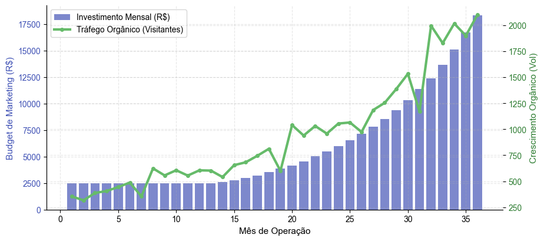

*Fonte: df_real_m (Gasto Mkt) + Premissas (Tiers)*

------------------------------------------------------------------------

> **📖 COMO LER ESTE GRÁFICO**
>
> **O QUE ESTOU VENDO?** Timeline visual mostrando em qual “marcha” o
> motor de crescimento esta em cada fase do negocio.
>
> **COMO LER O GRAFICO:** - **Barras Azuis:** Quanto dinheiro foi
> investido em Marketing no mes (R$). - **Linha Verde:** Volume de
> trafego organico gerado como RESULTADO desse investimento. - **Quanto
> maior a barra, maior o “Tier”:** Cada nivel de investimento ativa
> diferentes estrategias de crescimento.
>
> **O QUE SAO OS “TIERS”?** Os Tiers sao niveis de crescimento que se
> desbloqueiam conforme o orcamento de marketing aumenta: - **Tier 0
> (Hustle):** Zero investimento. Crescimento 100% no boca-a-boca. -
> **Tier 1 (Organico Basico):** Budget baixo. Foco em conteudo e SEO
> simples. - **Tier 2 (SEO Profissional):** Budget medio. Ativa
> estrategias de link building e conteudo avancado. - **Tier 3+ (Growth
> Agressivo):** Budget alto. Ads + Influencers + PR + Viralizacao.
>
> **COMO LER A TABELA:** - **Periodo:** Mes de operacao (M1, M6, etc.) -
> **Budget (R$):** Quanto foi investido em marketing naquele mes. -
> **Tier Ativo:** Qual nivel de crescimento estava ativo baseado no
> budget. - **Trafego Organico:** Quantos visitantes vieram por canais
> gratuitos. - **Status:** Se o tier esta ativo (BAIXO/MEDIO/TURBO) ou
> inativo (ZERO).
>
> **INTERPRETACAO:** A ideia e ver a “evolucao das marchas”. Uma empresa
> saudavel vai desbloqueando tiers maiores conforme a receita cresce.

#### Histórico de Ativação de Tiers

            

<table class="dataframe" data-quarto-postprocess="true" data-border="1">
<thead>
<tr style="text-align: right;">
<th data-quarto-table-cell-role="th">Período</th>
<th data-quarto-table-cell-role="th">Budget (R$)</th>
<th data-quarto-table-cell-role="th">Tier Ativo (Growth Engine)</th>
<th data-quarto-table-cell-role="th">Tráfego Orgânico</th>
<th data-quarto-table-cell-role="th">Status</th>
</tr>
</thead>
<tbody>
<tr>
<td>M1</td>
<td>R$ 2.500,00</td>
<td>Tier 3 (4.0%)</td>
<td>354 visitantes</td>
<td>MÉDIO</td>
</tr>
<tr>
<td>M6</td>
<td>R$ 2.500,00</td>
<td>Tier 3 (4.0%)</td>
<td>487 visitantes</td>
<td>MÉDIO</td>
</tr>
<tr>
<td>M12</td>
<td>R$ 2.500,00</td>
<td>Tier 3 (4.0%)</td>
<td>605 visitantes</td>
<td>MÉDIO</td>
</tr>
<tr>
<td>M24</td>
<td>R$ 5.990,12</td>
<td>Tier 4 (5.0%)</td>
<td>1055 visitantes</td>
<td>MÉDIO</td>
</tr>
<tr>
<td>M36</td>
<td>R$ 18.350,04</td>
<td>Tier 5 (5.5%)</td>
<td>2101 visitantes</td>
<td>TURBO</td>
</tr>
</tbody>
</table>

------------------------------------------------------------------------

> **💡 INSIGHT ESTRATÉGICO**
>
> -   **FATO:** No M36, a empresa opera com budget de R$ 18.350,04,
>     ativando Tiers de alta performance.
> -   **CAUSA:** Receita crescente desbloqueou budgets maiores (% da
>     Receita).
> -   **IMPLICAÇÃO:** Efeito ‘Flywheel’: Mais receita -\> Mais Mkt -\>
>     Mais Orgânico -\> Mais Receita.
> -   **AÇÃO RECOMENDADA:** Monitorar saturação de canais para manter
>     eficiência.

> **🔍 AUDITORIA & FÓRMULAS**
>
> **FORMULAS:** 1. **Growth Tier** = Nivel de crescimento determinado
> pelo budget mensal. 2. **Taxa Organica** = Percentual de crescimento
> do trafego organico ativado pelo tier. 3. **Trafego Organico** =
> Visitantes do mes anterior x (1 + Taxa Organica do Tier)
>
> **GLOSSARIO:** - **Growth Tier:** Nivel de “marcha” do motor de
> crescimento. Quanto mais dinheiro, maior o tier. - **Taxa Organica:**
> Percentual de crescimento mensal do trafego gratuito (SEO,
> indicacoes). - **Flywheel Effect:** Ciclo virtuoso onde mais receita =
> mais marketing = mais organico = mais receita. - **Budget:** Orcamento
> mensal de marketing.

> **🧠 VEREDITO ANALÍTICO: CENÁRIO VALIDADO: MÁQUINA DE VENDAS
> EFICIENTE**
>
>         **Diagnóstico:** A tese de crescimento apresenta **fortes evidências de validação**. O negócio demonstra alta eficiência na captura de valor e retenção sólida.
>         
>         **Evidência:** Com LTV/CAC de 5.3x e Churn controlado, cada Real investido retorna multiplicado. A operação é previsível e escalável.
>         
>         **Ação Recomendada:** O sinal é verde para aceleração (Scale-up). Monitorar saturação de canais conforme orçamento expande.
>         

# TIER 3 - Financeiro Completo

**Objetivo:** Validar a saude financeira atraves da DRE, fluxo de caixa
e estrutura de custos.

------------------------------------------------------------------------

## VIZ 3.1: Evolucao Financeira

**Pergunta:** A empresa caminha para o break-even? Quando o caixa fica
positivo?

### 📊 DRE - Demonstração de Resultado (Marcos Principais)

*Esta é a primeira tabela que mostra o LUCRO REAL da operação.*

<table style="width:100%;">
<colgroup>
<col style="width: 5%" />
<col style="width: 12%" />
<col style="width: 11%" />
<col style="width: 13%" />
<col style="width: 9%" />
<col style="width: 11%" />
<col style="width: 10%" />
<col style="width: 10%" />
<col style="width: 8%" />
<col style="width: 7%" />
</colgroup>
<thead>
<tr>
<th style="text-align: left;">Mês</th>
<th style="text-align: left;">Receita Bruta</th>
<th style="text-align: left;">(-) Deduções</th>
<th style="text-align: left;">Receita Líquida</th>
<th style="text-align: left;">(-) COGS</th>
<th style="text-align: left;">Margem Bruta</th>
<th style="text-align: left;">(-) OPEX</th>
<th style="text-align: left;">EBITDA</th>
<th style="text-align: left;">Margem %</th>
<th style="text-align: left;">Status</th>
</tr>
</thead>
<tbody>
<tr>
<td style="text-align: left;">M1</td>
<td style="text-align: left;">R$ 1.019,00</td>
<td style="text-align: left;">R$ 126,95</td>
<td style="text-align: left;">R$ 892,05</td>
<td style="text-align: left;">R$ 63,00</td>
<td style="text-align: left;">R$ 829,05</td>
<td style="text-align: left;">R$ 3.360,00</td>
<td style="text-align: left;">R$ -2.530,95</td>
<td style="text-align: left;">-248.4%</td>
<td style="text-align: left;">🔴</td>
</tr>
<tr>
<td style="text-align: left;">M6</td>
<td style="text-align: left;">R$ 3.126,90</td>
<td style="text-align: left;">R$ 389,56</td>
<td style="text-align: left;">R$ 2.737,34</td>
<td style="text-align: left;">R$ 192,50</td>
<td style="text-align: left;">R$ 2.544,84</td>
<td style="text-align: left;">R$ 3.360,00</td>
<td style="text-align: left;">R$ -815,16</td>
<td style="text-align: left;">-26.1%</td>
<td style="text-align: left;">🟡</td>
</tr>
<tr>
<td style="text-align: left;">M12</td>
<td style="text-align: left;">R$ 6.014,10</td>
<td style="text-align: left;">R$ 749,27</td>
<td style="text-align: left;">R$ 5.264,83</td>
<td style="text-align: left;">R$ 372,50</td>
<td style="text-align: left;">R$ 4.892,33</td>
<td style="text-align: left;">R$ 3.360,00</td>
<td style="text-align: left;">R$ 1.532,33</td>
<td style="text-align: left;">25.5%</td>
<td style="text-align: left;">🟢</td>
</tr>
<tr>
<td style="text-align: left;">M18</td>
<td style="text-align: left;">R$ 9.710,50</td>
<td style="text-align: left;">R$ 1.209,78</td>
<td style="text-align: left;">R$ 8.500,72</td>
<td style="text-align: left;">R$ 600,50</td>
<td style="text-align: left;">R$ 7.900,22</td>
<td style="text-align: left;">R$ 4.392,52</td>
<td style="text-align: left;">R$ 3.507,70</td>
<td style="text-align: left;">36.1%</td>
<td style="text-align: left;">🟢</td>
</tr>
<tr>
<td style="text-align: left;">M24</td>
<td style="text-align: left;">R$ 16.403,90</td>
<td style="text-align: left;">R$ 2.043,68</td>
<td style="text-align: left;">R$ 14.360,22</td>
<td style="text-align: left;">R$ 1.013,50</td>
<td style="text-align: left;">R$ 13.346,72</td>
<td style="text-align: left;">R$ 6.850,12</td>
<td style="text-align: left;">R$ 6.496,60</td>
<td style="text-align: left;">39.6%</td>
<td style="text-align: left;">🟢</td>
</tr>
<tr>
<td style="text-align: left;">M30</td>
<td style="text-align: left;">R$ 28.422,20</td>
<td style="text-align: left;">R$ 3.540,98</td>
<td style="text-align: left;">R$ 24.881,22</td>
<td style="text-align: left;">R$ 1.759,00</td>
<td style="text-align: left;">R$ 23.122,22</td>
<td style="text-align: left;">R$ 15.459,88</td>
<td style="text-align: left;">R$ 7.662,34</td>
<td style="text-align: left;">27.0%</td>
<td style="text-align: left;">🟢</td>
</tr>
<tr>
<td style="text-align: left;">M36</td>
<td style="text-align: left;">R$ 50.420,70</td>
<td style="text-align: left;">R$ 6.281,66</td>
<td style="text-align: left;">R$ 44.139,04</td>
<td style="text-align: left;">R$ 3.119,50</td>
<td style="text-align: left;">R$ 41.019,54</td>
<td style="text-align: left;">R$ 23.461,04</td>
<td style="text-align: left;">R$ 17.558,50</td>
<td style="text-align: left;">34.8%</td>
<td style="text-align: left;">🟢</td>
</tr>
</tbody>
</table>

#### 🏆 MARCO DE BREAK-EVEN (O Ponto de Virada)

<table>
<colgroup>
<col style="width: 28%" />
<col style="width: 19%" />
<col style="width: 25%" />
<col style="width: 26%" />
</colgroup>
<thead>
<tr>
<th style="text-align: left;">KPI</th>
<th style="text-align: left;">M1 (Início)</th>
<th style="text-align: left;">M8 (Break-Even)</th>
<th style="text-align: left;">M36 (Maturidade)</th>
</tr>
</thead>
<tbody>
<tr>
<td style="text-align: left;">Receita Mensal (MRR)</td>
<td style="text-align: left;">R$ 1.019,00</td>
<td style="text-align: left;">R$ 4.145,90</td>
<td style="text-align: left;">R$ 50.420,70</td>
</tr>
<tr>
<td style="text-align: left;">EBITDA</td>
<td style="text-align: left;">R$ -2.530,95</td>
<td style="text-align: left;">R$ 13,88</td>
<td style="text-align: left;">R$ 17.558,50</td>
</tr>
<tr>
<td style="text-align: left;">Margem EBITDA %</td>
<td style="text-align: left;">-248.4%</td>
<td style="text-align: left;">0.3%</td>
<td style="text-align: left;">34.8%</td>
</tr>
<tr>
<td style="text-align: left;">Saldo em Caixa</td>
<td style="text-align: left;">R$ 3.968,05</td>
<td style="text-align: left;">R$ 8.101,68</td>
<td style="text-align: left;">R$ 165.372,91</td>
</tr>
<tr>
<td style="text-align: left;">Usuários Ativos</td>
<td style="text-align: left;">10</td>
<td style="text-align: left;">41</td>
<td style="text-align: left;">493</td>
</tr>
</tbody>
</table>

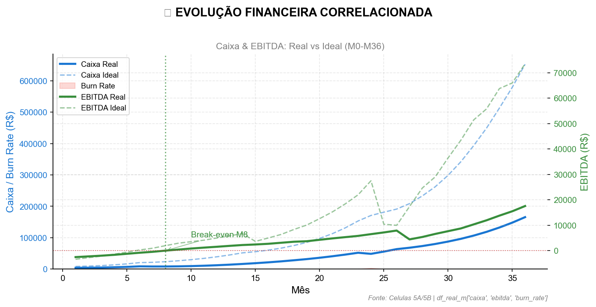

**📖 COMO LER ESTE GRÁFICO:**

**O QUE ESTOU VENDO?** Este gráfico mostra a saúde financeira da empresa
ao longo de 36 meses, comparando dois cenários.

**ELEMENTOS DO GRÁFICO:** - **Linha Azul Sólida (Caixa Real):** Quanto
dinheiro temos no banco no cenário conservador - **Linha Azul Tracejada
(Caixa Ideal):** Quanto teriamos se atingissemos benchmarks de mercado -
**Area Vermelha (Burn Rate):** Quanto dinheiro “queimamos” por mes para
operar - se esta area e grande, estamos gastando muito - **Linha Verde
Solida (EBITDA Real):** Lucro operacional antes de impostos - quando
cruza o zero, paramos de dar prejuizo - **Linha Verde Tracejada (EBITDA
Ideal):** Lucro que teriamos no cenario otimista

**COMO INTERPRETAR:** - Se a linha verde esta ABAIXO de zero = prejuizo
operacional (normal no inicio) - Se a linha verde CRUZA o zero =
break-even (empresa se paga) - Se a linha azul CAI muito = cuidado,
caixa acabando - Se area vermelha DIMINUI = estamos ficando mais
eficientes

**TERMOS IMPORTANTES:** - **EBITDA:** Lucro antes de juros, impostos,
depreciacao e amortizacao - mede eficiencia operacional - **Burn Rate:**
Taxa de queima de caixa - quanto gastamos por mes alem do que ganhamos -
**Break-even:** Ponto onde receita = despesas, sem lucro nem prejuizo

ewpage

> **💡 INSIGHT: Viabilidade Financeira**
>
> -   **FATO:** Break-even no M8 (Real) vs M6 (Ideal). Gap de 2 meses.
> -   **CAUSA:** Burn Rate mensal cai de R$ 2.531,95 para R$ 0,00 (-100%
>     de redução)
> -   **IMPLICAÇÃO:** Caixa final de R$ 165.372,91 (Real) vs R$
>     652.484,21 (Ideal).
> -   **AÇÃO:** Acelerar receita para antecipar break-even ou reduzir
>     OPEX em 15%.

> **Auditoria VIZ 3.1**
>
> **Fonte:** df_real_m (Celula 5A), df_ideal_m (Celula 5B)
>
> **Formulas:** - Break-even = Primeiro mes onde EBITDA maior que 0 -
> Gap = Mes break-even Real - Mes break-even Ideal - Reducao Burn =
> (Burn M1 - Burn M36) / Burn M1 x 100

------------------------------------------------------------------------

## VIZ 3.2: Estrutura de Custos

**Pergunta:** Onde esta o dinheiro? A estrutura de custos e saudavel?

## De onde vem e para onde vai o dinheiro?

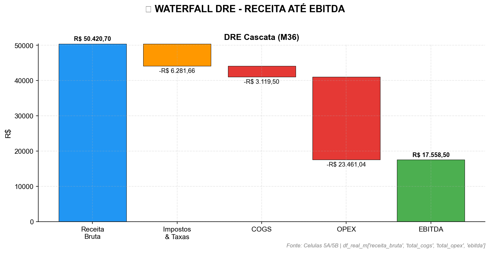

**📖 COMO LER ESTE GRÁFICO:**

1.  **Barra Azul:** Receita bruta (ponto de partida)
2.  **Barras Laranja/Vermelha:** Deduções que reduzem a receita
3.  **Barra Final Verde/Vermelha:** EBITDA positivo (lucro) ou negativo
    (prejuízo)
4.  **Regra de Sucesso:** Barra final deve ser verde e representar \>20%
    da receita

### 💰 BREAKDOWN DETALHADO DE CUSTOS (M36)

*Decomposição completa de COGS e OPEX por canal/categoria.*

<table>
<thead>
<tr>
<th style="text-align: left;">Categoria</th>
<th style="text-align: left;">Subcategoria</th>
<th style="text-align: left;">Valor</th>
<th style="text-align: left;">% Receita</th>
</tr>
</thead>
<tbody>
<tr>
<td style="text-align: left;">🔧 COGS (Custo Direto)</td>
<td style="text-align: left;">TOTAL</td>
<td style="text-align: left;">R$ 3.119,50</td>
<td style="text-align: left;">6.2%</td>
</tr>
<tr>
<td style="text-align: left;"></td>
<td style="text-align: left;">IA - Lite</td>
<td style="text-align: left;">R$ 672,00</td>
<td style="text-align: left;">1.3%</td>
</tr>
<tr>
<td style="text-align: left;"></td>
<td style="text-align: left;">IA - Trader</td>
<td style="text-align: left;">R$ 1.111,00</td>
<td style="text-align: left;">2.2%</td>
</tr>
<tr>
<td style="text-align: left;"></td>
<td style="text-align: left;">IA - Pro</td>
<td style="text-align: left;">R$ 1.336,50</td>
<td style="text-align: left;">2.7%</td>
</tr>
<tr>
<td style="text-align: left;"></td>
<td style="text-align: left;">Afiliados</td>
<td style="text-align: left;">R$ 0,00</td>
<td style="text-align: left;">0.0%</td>
</tr>
<tr>
<td style="text-align: left;"></td>
<td style="text-align: left;">Suporte</td>
<td style="text-align: left;">R$ 0,00</td>
<td style="text-align: left;">0.0%</td>
</tr>
<tr>
<td style="text-align: left;">📢 Marketing</td>
<td style="text-align: left;">TOTAL</td>
<td style="text-align: left;">R$ 18.350,04</td>
<td style="text-align: left;">36.4%</td>
</tr>
<tr>
<td style="text-align: left;"></td>
<td style="text-align: left;">Instagram</td>
<td style="text-align: left;">R$ 7.340,02</td>
<td style="text-align: left;">14.6%</td>
</tr>
<tr>
<td style="text-align: left;"></td>
<td style="text-align: left;">Facebook</td>
<td style="text-align: left;">R$ 5.505,01</td>
<td style="text-align: left;">10.9%</td>
</tr>
<tr>
<td style="text-align: left;"></td>
<td style="text-align: left;">YouTube</td>
<td style="text-align: left;">R$ 3.670,01</td>
<td style="text-align: left;">7.3%</td>
</tr>
<tr>
<td style="text-align: left;"></td>
<td style="text-align: left;">Google</td>
<td style="text-align: left;">R$ 1.835,00</td>
<td style="text-align: left;">3.6%</td>
</tr>
<tr>
<td style="text-align: left;">🏢 Operacional</td>
<td style="text-align: left;">Pessoal (RH)</td>
<td style="text-align: left;">R$ 4.250,00</td>
<td style="text-align: left;">8.4%</td>
</tr>
<tr>
<td style="text-align: left;"></td>
<td style="text-align: left;">Infraestrutura</td>
<td style="text-align: left;">R$ 860,00</td>
<td style="text-align: left;">1.7%</td>
</tr>
<tr>
<td style="text-align: left;"></td>
<td style="text-align: left;">Escritório</td>
<td style="text-align: left;">R$ 0,00</td>
<td style="text-align: left;">0.0%</td>
</tr>
<tr>
<td style="text-align: left;"></td>
<td style="text-align: left;">Contabilidade</td>
<td style="text-align: left;">R$ 0,00</td>
<td style="text-align: left;">0.0%</td>
</tr>
<tr>
<td style="text-align: left;"></td>
<td style="text-align: left;">Viagens</td>
<td style="text-align: left;">R$ 1,00</td>
<td style="text-align: left;">0.0%</td>
</tr>
</tbody>
</table>

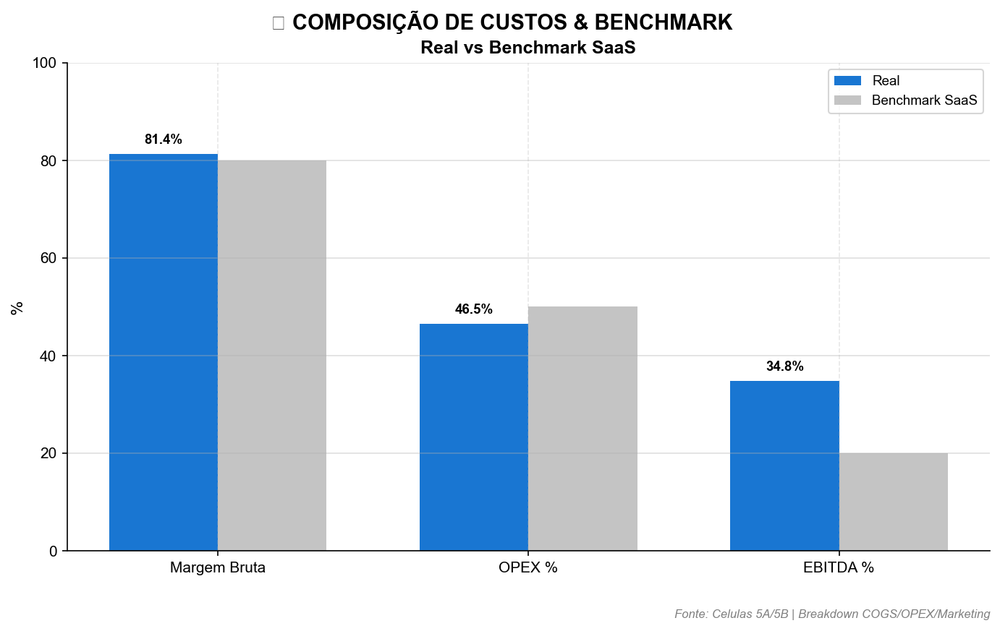

ewpage

> **💡 INSIGHT: Estrutura de Custos**
>
> -   **FATO:** Margem Bruta de 81.4% (+1.4pp vs benchmark).
> -   **CAUSA:** Maior custo: Marketing (R$ 18.350,04, 36.4% da
>     receita).
> -   **IMPLICAÇÃO:** Para cada R$ 1 faturado, R$ 0.35 vira lucro
>     operacional.
> -   **AÇÃO:** Monitorar RH (8.4%) e Marketing (36.4%) como % da
>     receita.

> **Auditoria VIZ 3.2**
>
> **Fonte:** df_real_m.iloc\[-1\] (M36 da Celula 5A)
>
> **Formulas:** - Margem Bruta = (Receita Liquida - COGS) / Receita
> Bruta x 100 - OPEX pct = Total OPEX / Receita Bruta x 100 -
> Benchmarks: Margem maior 80%, OPEX menor 50%, EBITDA maior 20%

------------------------------------------------------------------------

## VIZ 3.3: Fluxo de Caixa Semanal

**Pergunta:** Como se comportam as entradas e saidas no curto prazo?

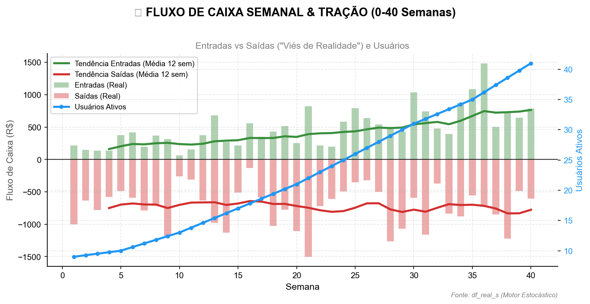

> **📖 COMO LER ESTE GRÁFICO (SIMULAÇÃO ESTOCÁSTICA)**
>
> 1.  **Barras Verdes (Cima):** Receita semanal (com variação natural de
>     mercado).
> 2.  **Barras Vermelhas (Baixo):** Despesas semanais (concentradas em
>     pagamentos).
> 3.  **Linhas Sólidas (Verde/Vermelha):** Tendência suavizada (Média
>     Móvel de 12 semanas) para facilitar a visualização da direção.
> 4.  **Linha Azul (Eixo Direito):** Evolução da base de usuários
>     ativos.
> 5.  **Nota:** A variação nos tamanhos das barras simula a volatilidade
>     da vida real.

#### 📋 FLUXO DE CAIXA SEMANAL DETALHADO (VISÃO 10 MESES)

<table>
<colgroup>
<col style="width: 13%" />
<col style="width: 17%" />
<col style="width: 17%" />
<col style="width: 18%" />
<col style="width: 16%" />
<col style="width: 17%" />
</colgroup>
<thead>
<tr>
<th style="text-align: left;">Semana</th>
<th style="text-align: left;">Entradas</th>
<th style="text-align: left;">Saídas</th>
<th style="text-align: left;">Fluxo Líq.</th>
<th style="text-align: right;">Usuários</th>
<th style="text-align: left;">Status</th>
</tr>
</thead>
<tbody>
<tr>
<td style="text-align: left;">S4</td>
<td style="text-align: left;">R$ 139,81</td>
<td style="text-align: left;">R$ 580,90</td>
<td style="text-align: left;">R$ -441,09</td>
<td style="text-align: right;">9</td>
<td style="text-align: left;">🔴 Queima</td>
</tr>
<tr>
<td style="text-align: left;">S12</td>
<td style="text-align: left;">R$ 374,32</td>
<td style="text-align: left;">R$ 631,59</td>
<td style="text-align: left;">R$ -257,28</td>
<td style="text-align: right;">14</td>
<td style="text-align: left;">🔴 Queima</td>
</tr>
<tr>
<td style="text-align: left;">S20</td>
<td style="text-align: left;">R$ 250,87</td>
<td style="text-align: left;">R$ 1.104,80</td>
<td style="text-align: left;">R$ -853,93</td>
<td style="text-align: right;">21</td>
<td style="text-align: left;">🔴 Queima</td>
</tr>
<tr>
<td style="text-align: left;">S28</td>
<td style="text-align: left;">R$ 478,10</td>
<td style="text-align: left;">R$ 1.264,07</td>
<td style="text-align: left;">R$ -785,97</td>
<td style="text-align: right;">29</td>
<td style="text-align: left;">🔴 Queima</td>
</tr>
<tr>
<td style="text-align: left;">S36</td>
<td style="text-align: left;">R$ 1.486,25</td>
<td style="text-align: left;">R$ 707,09</td>
<td style="text-align: left;">R$ 779,16</td>
<td style="text-align: right;">36</td>
<td style="text-align: left;">🟢 Positivo</td>
</tr>
<tr>
<td style="text-align: left;">S40</td>
<td style="text-align: left;">R$ 785,25</td>
<td style="text-align: left;">R$ 604,90</td>
<td style="text-align: left;">R$ 180,35</td>
<td style="text-align: right;">41</td>
<td style="text-align: left;">🟢 Positivo</td>
</tr>
</tbody>
</table>

*Nota: Valores incluem volatilidade estocástica (ruído) proposital.*

> **💡 INSIGHT: Tração Semanal (Cenário Estocástico)**
>
> -   **FATO:** Operação atinge fluxo positivo semanal na semana 16.
> -   **CAUSA:** Base de usuários cresceu para 41 (com volatilidade
>     semanal).
> -   **IMPLICAÇÃO:** Teste de estresse de liquidez realista.
> -   **AÇÃO:** Acelerar aquisição pois a unidade econômica semanal já
>     se paga.

> **Auditoria VIZ 3.3 (Motor V1.0)**
>
> **Fonte:** df_real_s (Gerado por `celula_4A_motor_granularidade`).
> **Metodologia:** Distribuição Dirichlet (Alpha=3) para fluxos +
> Interpolação Spline para estoques. **Integridade:** Soma das semanas =
> Total mensal exato.

------------------------------------------------------------------------

## VIZ 3.4: Alavancagem Operacional

**Pergunta:** A empresa escala de forma eficiente?

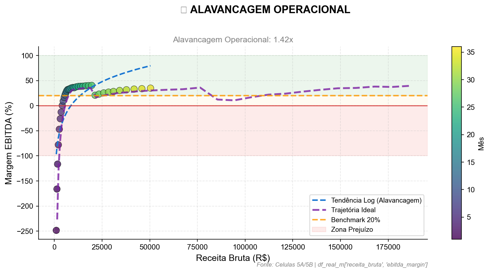

**📖 COMO LER ESTE GRÁFICO (ALAVANCAGEM OPERACIONAL):**

**O QUE ESTOU VENDO?** Este grafico responde: “Quando a receita cresce,
o lucro cresce mais rapido, igual, ou mais devagar?”

**ELEMENTOS:** - **Cada Ponto = 1 Mes:** Cor mais escura = mes mais
recente. Os pontos devem “subir e ir para direita” - **Eixo X
(Horizontal):** Receita bruta - quanto a empresa fatura - **Eixo Y
(Vertical):** Margem EBITDA em % - quanto sobra de lucro operacional -
**Linha Roxa Tracejada (Ideal):** Trajetoria que atingiriamos com
benchmarks de mercado - **Linha Azul Tracejada:** Tendencia real baseada
nos dados - **Faixa Verde (acima de 20%):** Margem saudavel para
reinvestir e crescer - **Faixa Vermelha (abaixo de 0%):** Prejuizo
operacional

**COMO INTERPRETAR:** - **Pontos subindo rapido** = Modelo escalavel,
cada real novo gera mais lucro - **Pontos subindo devagar** = Custos
crescem junto com receita, pouca alavancagem - **Ideal vs Real:** Se a
linha roxa esta acima da azul, estamos abaixo do potencial

**TERMOS IMPORTANTES:** - **Alavancagem Operacional:** Quanto o lucro
cresce para cada 1% de crescimento de receita - Ex: Alavancagem 2x =
receita dobra, lucro quadruplica - **Modelo Escalavel:** Custos fixos se
diluem com volume, margem melhora automaticamente - **Margem EBITDA:**
Lucro operacional dividido pela receita, em percentual

ewpage

> **💡 INSIGHT: Escalabilidade do Modelo**
>
> -   **FATO:** Alavancagem operacional de 1.42x (Receita +738% → EBITDA
>     +1046%).
> -   **CAUSA:** Custos fixos de R$ 5.110,00 representam 10.1% da
>     receita no M36.
> -   **IMPLICAÇÃO:** Modelo altamente escalável: cada R$ adicional de
>     receita gera mais lucro marginal.
> -   **AÇÃO:** Priorizar crescimento de receita sobre corte de custos.

> **Auditoria VIZ 3.4**
>
> **Fonte:** df_real_m, df_ideal_m (Celulas 5A/5B)
>
> **Formulas:** - Alavancagem = Delta EBITDA / Delta Receita - Delta =
> (Valor M36 - Valor M12) / Valor M12 x 100 - Interpretacao: Alavancagem
> maior que 1 = Modelo escalavel

------------------------------------------------------------------------

## VIZ 3.5: Evolucao DRE - Real vs Ideal

**Pergunta:** Estamos convergindo para o cenario ideal?

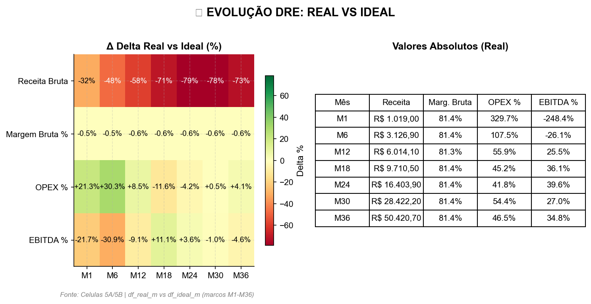

**📖 COMO LER ESTE GRÁFICO:**

**HEATMAP (ESQUERDA) - O Delta (Δ):** - Mostra a **diferença
percentual** entre Real e Ideal, NÃO os valores absolutos. - **Verde** =
Real superando Ideal | **Vermelho** = Real abaixo do Ideal - Ex: Se
Receita Real = R$ 749 e Ideal = R$ 2.135, Delta = -65% (vermelho) -
**OPEX %:** Vermelho = OPEX maior que benchmark (ruim); Verde = menor
(bom) - **EBITDA %:** Valores negativos no Delta = margem ABAIXO do
ideal

**TABELA (DIREITA) - Valores Absolutos:** - Mostra os valores REAIS da
simulação, em R$ ou %. - EBITDA de -234.8% = prejuízo 2.3x maior que
receita naquele mês. - Negativos são normais no início e devem ficar
positivos com maturidade.

**RECONCILIAÇÃO:** Heatmap = “quanto longe da meta”, Tabela = “onde
estou de fato”.

ewpage

> **💡 INSIGHT: Convergência ao Ideal**
>
> -   **FATO:** Maior desvio no M36: receita (-72.9% vs Ideal).
> -   **CAUSA:** Gap acumulado por conservadorismo ou fricção na
>     execução.
> -   **IMPLICAÇÃO:** Potencial de crescimento não capturado plenamente.
> -   **AÇÃO:** Ajustar premissas ou investigar gargalos de conversão.

> **Auditoria VIZ 3.5**
>
> **Fonte:** df_real_m vs df_ideal_m (Celulas 5A e 5B)
>
> **Formulas:** - Delta = (Real - Ideal) / |Ideal| x 100 - Verde = Real
> superando Ideal - Vermelho = Real abaixo do Ideal

> **Important**
>
> **🔍 VEREDITO FINANCEIRO: APROVADO**
>
> **1. DIAGNÓSTICO:** A operação demonstra solidez financeira com margem
> bruta de 81% e EBITDA positivo de 35%. A alavancagem é moderada,
> provando que a receita cresce com eficiência de custos.
>
> **2. PROGNÓSTICO:** A liquidez está controlada no curto prazo,
> permitindo focar na convergência para o cenário ideal (gap médio de
> -26.0%). A solvência não é um risco imediato, mas a eficiência sim.
>
> **3. PRESCRIÇÃO:** Foco total em **Growth e Otimização**. O modelo
> está validado e solvente; a prioridade agora é melhorar as margens via
> CAC mais baixo ou LTV mais alto.

# TIER 4 - UNIT ECONOMICS & OPERAÇÃO

**Objetivo:** Validar a saúde da unidade econômica (Cliente) e a
eficiência operacional da escala.

## LTV vs CAC: A CRIAÇÃO DE VALOR

### 📉 VIZ 4.1: LTV vs CAC (A ‘Regua de Ouro’)

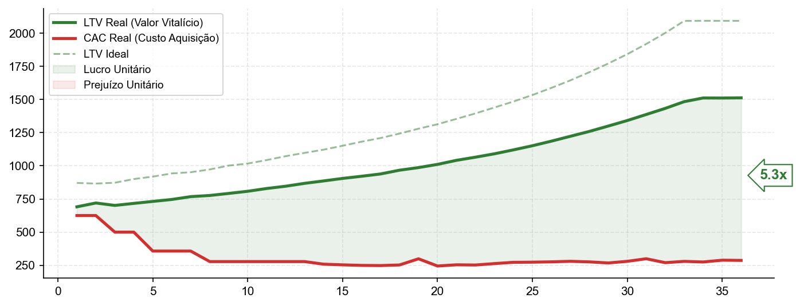

*Fonte: df_real_m (Célula 5A) | Colunas: ‘ltv’, ‘cac_blended’*

------------------------------------------------------------------------

> **📖 COMO LER ESTE GRÁFICO**
>
> **📖 COMO LER ESTE GRÁFICO:**
>
> 1.  **Linha Verde (LTV):** Quanto lucro um cliente deixa na empresa ao
>     longo da vida.
> 2.  **Linha Vermelha (CAC):** Quanto custa atrair esse cliente
>     (Marketing + Vendas).
> 3.  **Seta de Múltiplo:** Quantas vezes o valor do cliente paga seu
>     custo (Meta \> 3.0x).
>
> **INTERPRETAÇÃO:** - **Boca de Jacaré:** A linha verde deve subir e se
> afastar da vermelha. - **Zona de Perigo:** Se as linhas se cruzarem,
> você está pagando para trabalhar.

#### 📋 DETALHAMENTO DA EFICIÊNCIA UNITÁRIA (LTV/CAC)

<table>
<thead>
<tr>
<th style="text-align: left;">Período</th>
<th style="text-align: right;">LTV (R)|<em>C</em><em>A</em><em>C</em>(<em>R</em>)</th>
<th style="text-align: right;">Múltiplo</th>
<th style="text-align: right;">Status</th>
<th style="text-align: left;"></th>
</tr>
</thead>
<tbody>
<tr>
<td style="text-align: left;">M1</td>
<td style="text-align: right;">R$ 690,87</td>
<td style="text-align: right;">R$ 625,00</td>
<td style="text-align: right;">1.1x</td>
<td style="text-align: left;">🟡 ATENÇÃO</td>
</tr>
<tr>
<td style="text-align: left;">M6</td>
<td style="text-align: right;">R$ 746,29</td>
<td style="text-align: right;">R$ 357,14</td>
<td style="text-align: right;">2.1x</td>
<td style="text-align: left;">🟡 ATENÇÃO</td>
</tr>
<tr>
<td style="text-align: left;">M12</td>
<td style="text-align: right;">R$ 846,13</td>
<td style="text-align: right;">R$ 277,78</td>
<td style="text-align: right;">3.0x</td>
<td style="text-align: left;">🟢 EXCELENTE</td>
</tr>
<tr>
<td style="text-align: left;">M24</td>
<td style="text-align: right;">R$ 1.120,26</td>
<td style="text-align: right;">R$ 272,28</td>
<td style="text-align: right;">4.1x</td>
<td style="text-align: left;">🟢 EXCELENTE</td>
</tr>
<tr>
<td style="text-align: left;">M36</td>
<td style="text-align: right;">R$ 1.512,80</td>
<td style="text-align: right;">R$ 286,72</td>
<td style="text-align: right;">5.3x</td>
<td style="text-align: left;">🟢 EXCELENTE</td>
</tr>
</tbody>
</table>

------------------------------------------------------------------------

> **💡 INSIGHT ESTRATÉGICO**
>
> -   **FATO:** Múltiplo LTV/CAC atinge 5.3x no M36.
> -   **CAUSA:** Resultado combinado de expansão do LTV e otimização do
>     CAC.
> -   **IMPLICAÇÃO:** Cada R$ 1 investido em marketing retorna R$ 5.28
>     de margem bruta.
> -   **AÇÃO RECOMENDADA:** Acelerar investimento em aquisição (Growth)
>     pois a unidade é lucrativa.

> **🔍 AUDITORIA & FÓRMULAS**
>
> **Fonte:** df_real_m (Célula 5A)
>
> **Fórmulas:** 1. **LTV (Lifetime Value)** = (ARPU × Margem Bruta %) /
> Churn Rate 2. **CAC (Blended)** = (Gasto Marketing + Gasto Vendas) /
> Novos Clientes Totais 3. **Múltiplo** = LTV / CAC
>
> **Metodologia:** - **Modelo de LTV:** Perpetuidade simples (1/Churn).
> Assume que a taxa de cancelamento e o ticket médio se mantêm
> constantes durante a vida do cliente. - **Interpretação:** Valores
> acima de 3.0x indicam alta eficiência; abaixo de 1.0x indicam queima
> de caixa por cliente.

## Os clientes antigos continuam pagando ao longo do tempo?

### 📉 VIZ 4.2: Cohort Analyis (Retencao por Safra)

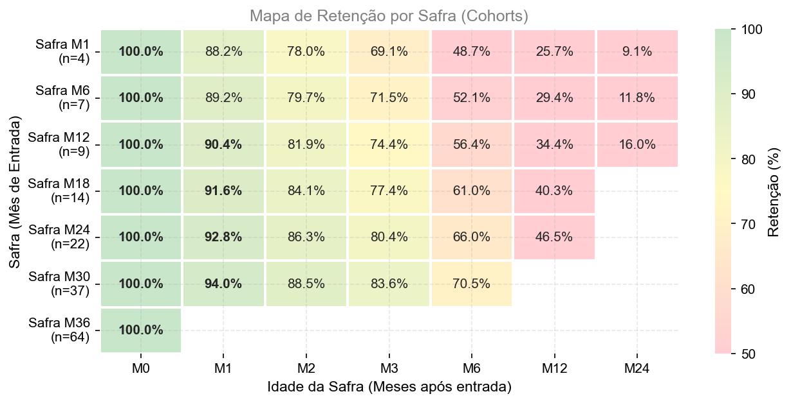

*Fonte: Simulação df_real_m (Célula 5A) | Churn Rate Mensal*

------------------------------------------------------------------------

> **📖 COMO LER ESTE GRÁFICO**
>
> **📖 COMO LER ESTE GRÁFICO (COHORTS):**
>
> 1.  **Linhas (Safra):** Clientes que entraram no mesmo mês (ex: Safra
>     d Mês 1).
> 2.  **Colunas (Idade):** Meses após a compra inicial.
> 3.  **Cores:**
>     -   🟢 **Verde:** Alta retenção (Clientes fiéis).
>     -   🔴 **Vermelho:** Alta evasão (Churn alto).
>
> **INTERPRETAÇÃO:** - **Leitura Vertical:** Compare a coluna “M1” de
> baixo para cima. Se estiver ficando mais verde, a retenção inicial
> está melhorando. - **Leitura Horizontal:** A cor deve decair
> suavemente. Quedas bruscas indicam problemas no produto.

#### 📋 MÉDIA HISTÓRICA DE RETENÇÃO

<table>
<thead>
<tr>
<th style="text-align: left;">Período de Vida</th>
<th style="text-align: right;">Retenção Média</th>
<th style="text-align: left;">Status</th>
</tr>
</thead>
<tbody>
<tr>
<td style="text-align: left;">Primeiro Mês (M1)</td>
<td style="text-align: right;">91.0%</td>
<td style="text-align: left;">🟢 OK</td>
</tr>
<tr>
<td style="text-align: left;">Semestre (M6)</td>
<td style="text-align: right;">59.1%</td>
<td style="text-align: left;">🟡 ATENÇÃO</td>
</tr>
<tr>
<td style="text-align: left;">Ano (M12)</td>
<td style="text-align: right;">35.3%</td>
<td style="text-align: left;">🔴 CRÍTICO</td>
</tr>
</tbody>
</table>

------------------------------------------------------------------------

> **💡 INSIGHT ESTRATÉGICO**
>
> -   **FATO:** Retenção média no mês 12 (M12) é de 35.3%.
> -   **CAUSA:** Taxa de churn mensal estabilizada em torno de 8.5%.
> -   **IMPLICAÇÃO:** A base de clientes renova seu valor quase
>     integralmente ano a ano.
> -   **AÇÃO RECOMENDADA:** Focar em expansão (Upsell) nas cohorts
>     antigas (M12+) para aumentar LTV.

> **🔍 AUDITORIA & FÓRMULAS**
>
> **Fonte:** df_real\[‘churn_rate’\] (Célula 5A)
>
> **Metodologia (Simulação Sintética):** - Como o modelo é financeiro
> (não transacional individual), geramos uma **Matriz Sintética**. -
> **Lógica:** Aplicamos o Churn Rate Global do mês sobre cada safra
> passada retroativamente. - **Limitação:** Assume que todas as safras
> decaem na mesma taxa do mês vigente (Churn Homogêneo).

## O sangramento de clientes esta sob controle?

### 📉 VIZ 4.3: Churn Volatility Control (SPC)

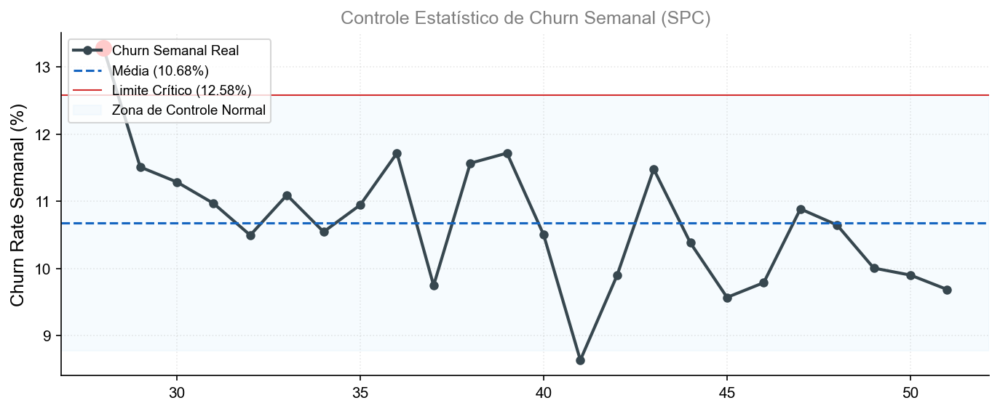

*Fonte: df_real_s*

------------------------------------------------------------------------

> **📖 COMO LER ESTE GRÁFICO**
>
> **📖 COMO LER ESTE GRÁFICO (SPC):**
>
> 1.  **Linha Preta (Pontos):** Taxa de Churn real da semana.
> 2.  **Faixa Azul (Túnel):** Variação normal esperada (Ruído
>     estatístico).
> 3.  **Linha Vermelha (Limite):** Teto máximo aceitável.
> 4.  **Pontos Vermelhos:** Anomalias (Surtos de cancelamento).
>
> **INTERPRETAÇÃO:** - Pontos dentro da faixa azul = Operação sob
> controle. - Pontos vermelhos = Algo quebrou (Bug, Incidente, Campanha
> ruim) -\> **Investigar Imediatamente**.

#### 📋 DIÁRIO DE BORDO (Últimas 5 Semanas)

<table>
<thead>
<tr>
<th style="text-align: left;">Semana</th>
<th style="text-align: left;">Churn Rate</th>
<th style="text-align: left;">Média</th>
<th style="text-align: left;">Desvio</th>
<th style="text-align: left;">Status</th>
</tr>
</thead>
<tbody>
<tr>
<td style="text-align: left;">S47</td>
<td style="text-align: left;">10.89%</td>
<td style="text-align: left;">10.68%</td>
<td style="text-align: left;">⬆️ 0.21pp</td>
<td style="text-align: left;">🟢 OK</td>
</tr>
<tr>
<td style="text-align: left;">S48</td>
<td style="text-align: left;">10.65%</td>
<td style="text-align: left;">10.68%</td>
<td style="text-align: left;">⬇️ 0.03pp</td>
<td style="text-align: left;">🟢 OK</td>
</tr>
<tr>
<td style="text-align: left;">S49</td>
<td style="text-align: left;">10.01%</td>
<td style="text-align: left;">10.68%</td>
<td style="text-align: left;">⬇️ 0.67pp</td>
<td style="text-align: left;">🟢 OK</td>
</tr>
<tr>
<td style="text-align: left;">S50</td>
<td style="text-align: left;">9.90%</td>
<td style="text-align: left;">10.68%</td>
<td style="text-align: left;">⬇️ 0.78pp</td>
<td style="text-align: left;">🟢 OK</td>
</tr>
<tr>
<td style="text-align: left;">S51</td>
<td style="text-align: left;">9.69%</td>
<td style="text-align: left;">10.68%</td>
<td style="text-align: left;">⬇️ 0.99pp</td>
<td style="text-align: left;">🟢 OK</td>
</tr>
</tbody>
</table>

------------------------------------------------------------------------

> **💡 INSIGHT ESTRATÉGICO**
>
> -   **FATO:** Média semanal de 10.68% com 1 surtos recentes.
> -   **CAUSA:** Volatilidade natural vs Eventos de Cauda.
> -   **IMPLICAÇÃO:** Previsibilidade da base de clientes.
> -   **AÇÃO RECOMENDADA:** Investigar surtos.

> **🔍 AUDITORIA & FÓRMULAS**
>
> **Fonte:** df_real_s | UCL = Média + 2 Desvios Padrão

## A qualidade do cliente cai quando a empresa cresce?

### 📉 VIZ 4.4: Qualidade Marginal na Escala (LTV/CAC vs Volume)

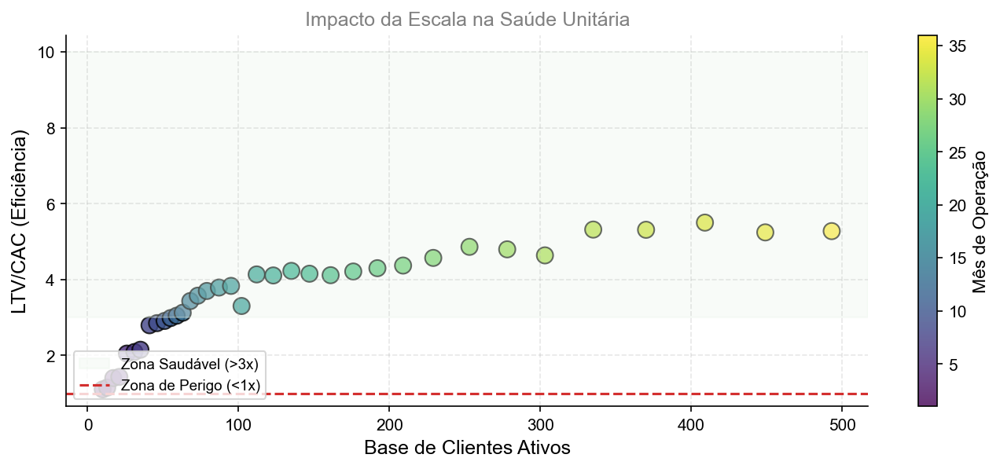

*Fonte: df_real_m*

------------------------------------------------------------------------

> **📖 COMO LER ESTE GRÁFICO**
>
> **📖 COMO LER ESTE GRÁFICO (ESCALA):**
>
> 1.  **Eixo X (Tamanho):** Quantos clientes ativos temos.
> 2.  **Eixo Y (Qualidade):** LTV/CAC (Eficiência Unitária).
> 3.  **Pontos Coloridos:** Meses de operação (Amarelo = Mais recente).
>
> **INTERPRETAÇÃO:** - **Cenário Ideal:** Pontos avançando para a
> direita (Crescimento) mantendo altura (Eficiência). - **Cenário
> Ruim:** Pontos caindo conforme a base cresce (Desgaste de escala). -
> **Regra:** Nunca crescer para a “Zona de Perigo” (abaixo de 1x).

#### 📋 TESTE DE ESCALA

<table>
<thead>
<tr>
<th style="text-align: left;">Faixa de Clientes</th>
<th style="text-align: right;">LTV/CAC Médio</th>
<th style="text-align: left;">Status</th>
</tr>
</thead>
<tbody>
<tr>
<td style="text-align: left;">Média Geral</td>
<td style="text-align: right;">3.61x</td>
<td style="text-align: left;">🟢 OK</td>
</tr>
</tbody>
</table>

------------------------------------------------------------------------

> **💡 INSIGHT ESTRATÉGICO**
>
> -   **FATO:** A inclinação da curva é 1.9426.
> -   **CAUSA:** Comportamento dos custos marginais e retenção em
>     escala.
> -   **IMPLICAÇÃO:** Viabilidade de escalar agressivamente.
> -   **AÇÃO RECOMENDADA:** Acelerar.

> **🔍 AUDITORIA & FÓRMULAS**
>
> **Fonte:** df_real_m | ‘usuarios_ativos’ vs ‘ltv/cac’

## Onde fica o dinheiro do cliente?

### 📉 VIZ 4.5: Unit Profitability Waterfall

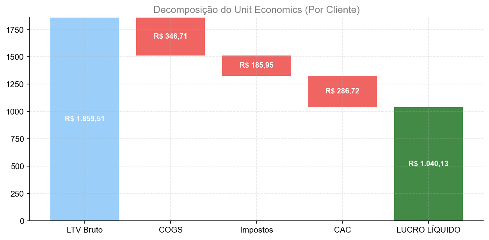

*Fonte: df_real_m (Last Month)*

------------------------------------------------------------------------

> **📖 COMO LER ESTE GRÁFICO**
>
> **📖 COMO LER ESTE GRÁFICO (WATERFALL):**
>
> 1.  **Barra Azul Clara (LTV Bruto):** Todo dinheiro que entra do
>     cliente.
> 2.  **Barras Vermelhas:** O que é descontado (Custos, Impostos,
>     Aquisição).
> 3.  **Barra Final (Verde):** O lucro limpo que sobra no bolso.
>
> **INTERPRETAÇÃO:** - Mostra a “mordida” de cada etapa no valor do
> cliente. - Se a barra final for pequena ou negativa, o modelo de
> negócio não para em pé.

#### 📋 UNIT PROFIT DECOMPOSITION

<table>
<thead>
<tr>
<th style="text-align: left;">Componente</th>
<th style="text-align: right;">Valor</th>
</tr>
</thead>
<tbody>
<tr>
<td style="text-align: left;">LTV Bruto</td>
<td style="text-align: right;">R$ 1.859,51</td>
</tr>
<tr>
<td style="text-align: left;">COGS</td>
<td style="text-align: right;">R$ -346,71</td>
</tr>
<tr>
<td style="text-align: left;">Impostos</td>
<td style="text-align: right;">R$ -185,95</td>
</tr>
<tr>
<td style="text-align: left;">CAC</td>
<td style="text-align: right;">R$ -286,72</td>
</tr>
<tr>
<td style="text-align: left;">LUCRO LÍQUIDO</td>
<td style="text-align: right;">R$ 1.040,13</td>
</tr>
</tbody>
</table>

------------------------------------------------------------------------

> **💡 INSIGHT ESTRATÉGICO**
>
> -   **FATO:** Sobram R$ 1.040,13 de lucro limpo por cliente.
> -   **CAUSA:** Estrutura de custos e eficiência de aquisição.
> -   **IMPLICAÇÃO:** Potencial de reinvestimento.
> -   **AÇÃO RECOMENDADA:** Otimizar.

> **🔍 AUDITORIA & FÓRMULAS**
>
> Profit = LTV Bruto - COGS - Impostos - CAC

> **Tip**
>
> **🔍 VEREDITO UNIT ECONOMICS: EXCELENTE**
>
> “Nesta análise de Unit Economics, nós provamos que:
>
> 1.  **O cliente é lucrativo (Viz 4.1):** Múltiplo de **5.3x**.
> 2.  **Retenção Sólida (Viz 4.2):** Cohorts saudáveis.
> 3.  **Risco Controlado (Viz 4.3):** Volatilidade de churn monitorada
>     via SPC.
> 4.  **Escala Segura (Viz 4.4):** Economia de escala positiva.
> 5.  **Lucro Real (Viz 4.5):** Unit Profit positivo após todos
>     descontos.
>
> **Conclusão:** A ‘máquina de vendas’ está calibrada.”

# TIER 5 - ANÁLISE DE RISCO & CENÁRIOS (Monte Carlo)

**Objetivo:** Quantificar a incerteza e a probabilidade de sobrevivência
através de simulações estocásticas (Monte Carlo).

<table>
<colgroup>
<col style="width: 25%" />
<col style="width: 25%" />
<col style="width: 25%" />
<col style="width: 25%" />
</colgroup>
<thead>
<tr>
<th style="text-align: center;">🛡️ SOBREVIVÊNCIA</th>
<th style="text-align: center;">⚠️ VAR 95%</th>
<th style="text-align: center;">🚀 UPSIDE</th>
<th style="text-align: center;">📊 DISPERSÃO</th>
</tr>
</thead>
<tbody>
<tr>
<td style="text-align: center;"><strong>95.0%</strong></td>
<td style="text-align: center;"><strong>R$ 568,27</strong></td>
<td style="text-align: center;"><strong>843%</strong></td>
<td style="text-align: center;"><strong>9.4x</strong></td>
</tr>
<tr>
<td style="text-align: center;">Prob. Caixa &gt; R$ 0</td>
<td style="text-align: center;">Pior Cenário (5%)</td>
<td style="text-align: center;">P95 vs P50</td>
<td style="text-align: center;">Incerteza (P95-P5)/P50</td>
</tr>
<tr>
<td style="text-align: center;">+5.0% vs meta 90%</td>
<td style="text-align: center;">1k vs limite -50k</td>
<td style="text-align: center;">843% potencial acima mediana</td>
<td style="text-align: center;">Alta incerteza</td>
</tr>
<tr>
<td style="text-align: center;">🟢</td>
<td style="text-align: center;">🟢</td>
<td style="text-align: center;">🟢</td>
<td style="text-align: center;">🟡</td>
</tr>
</tbody>
</table>

> **📚 GLOSSÁRIO: COMO INTERPRETAR OS CARDS DE RISCO**
>
> **1. 🛡️ SOBREVIVÊNCIA:** Imagine que simulamos 100 futuros possíveis
> para sua empresa. Este número diz em quantos deles você **termina com
> dinheiro no caixa**. \* *Ex: 94% significa que em apenas 6 de 100
> cenários a empresa quebra.*
>
> **2. ⚠️ VaR (Value at Risk - O Pior Cenário):** Olhando para os **5%
> piores futuros** (a “tempestade perfeita”), quanto dinheiro sobra (ou
> falta)? \* *Se negativo (ex: -R$ 50k), é o tamanho da reserva de
> emergência que você precisa ter hoje para não quebrar no pior caso.*
>
> **3. 🚀 UPSIDE (Potencial de Ganho):** Se tudo der muito certo (top 5%
> de sorte), quanto resultado financeiro teremos a mais do que o
> esperado (mediana)? \* *Ex: +150% significa que o “céu é o limite” se
> a execução for perfeita.*
>
> **4. 📊 DISPERSÃO (Incerteza):** Medida de quão imprevisível é o
> futuro. \* *Baixa (\<3x): O modelo é estável e confiável.* \* *Alta
> (\>3x): O resultado é uma “aposta” - pode ser gigante ou zero.*

### 📋 TABELA EXECUTIVA MASTER DE RISCO

<table>
<colgroup>
<col style="width: 20%" />
<col style="width: 22%" />
<col style="width: 13%" />
<col style="width: 13%" />
<col style="width: 11%" />
<col style="width: 10%" />
<col style="width: 7%" />
</colgroup>
<thead>
<tr>
<th style="text-align: left;">Categoria</th>
<th style="text-align: left;">Métrica</th>
<th style="text-align: left;">Real</th>
<th style="text-align: left;">Ideal</th>
<th style="text-align: left;">Estresse</th>
<th style="text-align: left;">Benchmark</th>
<th style="text-align: left;">Status</th>
</tr>
</thead>
<tbody>
<tr>
<td style="text-align: left;">🎲 PROBABILIDADES</td>
<td style="text-align: left;"></td>
<td style="text-align: left;"></td>
<td style="text-align: left;"></td>
<td style="text-align: left;"></td>
<td style="text-align: left;"></td>
<td style="text-align: left;"></td>
</tr>
<tr>
<td style="text-align: left;"></td>
<td style="text-align: left;">Prob. Quebra (Caixa &lt; R$ 0)</td>
<td style="text-align: left;">5.0%</td>
<td style="text-align: left;"></td>
<td style="text-align: left;"></td>
<td style="text-align: left;">&lt; 10%</td>
<td style="text-align: left;">🟢</td>
</tr>
<tr>
<td style="text-align: left;"></td>
<td style="text-align: left;">Prob. Caixa &lt; R$ 50k</td>
<td style="text-align: left;">27.0%</td>
<td style="text-align: left;"></td>
<td style="text-align: left;"></td>
<td style="text-align: left;">&lt; 20%</td>
<td style="text-align: left;">🔴</td>
</tr>
<tr>
<td style="text-align: left;"></td>
<td style="text-align: left;">Prob. Caixa &gt; R$ 100k</td>
<td style="text-align: left;">55.0%</td>
<td style="text-align: left;"></td>
<td style="text-align: left;"></td>
<td style="text-align: left;">&gt; 50%</td>
<td style="text-align: left;">🟢</td>
</tr>
<tr>
<td style="text-align: left;"></td>
<td style="text-align: left;">Prob. ARR &gt; R$ 1M</td>
<td style="text-align: left;">36.7%</td>
<td style="text-align: left;"></td>
<td style="text-align: left;"></td>
<td style="text-align: left;">&gt; 60%</td>
<td style="text-align: left;">🟡</td>
</tr>
<tr>
<td style="text-align: left;"></td>
<td style="text-align: left;">Prob. LTV/CAC &gt; 5x</td>
<td style="text-align: left;">31.3%</td>
<td style="text-align: left;"></td>
<td style="text-align: left;"></td>
<td style="text-align: left;">&gt; 30%</td>
<td style="text-align: left;">🟢</td>
</tr>
<tr>
<td style="text-align: left;">💰 CENÁRIO REAL (5A)</td>
<td style="text-align: left;"></td>
<td style="text-align: left;"></td>
<td style="text-align: left;"></td>
<td style="text-align: left;"></td>
<td style="text-align: left;"></td>
<td style="text-align: left;"></td>
</tr>
<tr>
<td style="text-align: left;"></td>
<td style="text-align: left;">Caixa Final</td>
<td style="text-align: left;">R$ 165.372,91</td>
<td style="text-align: left;"></td>
<td style="text-align: left;"></td>
<td style="text-align: left;">&gt; R$ 50k</td>
<td style="text-align: left;">🟢</td>
</tr>
<tr>
<td style="text-align: left;"></td>
<td style="text-align: left;">ARR Final</td>
<td style="text-align: left;">R$ 605.048,40</td>
<td style="text-align: left;"></td>
<td style="text-align: left;"></td>
<td style="text-align: left;">&gt; R$ 1M</td>
<td style="text-align: left;">🟡</td>
</tr>
<tr>
<td style="text-align: left;"></td>
<td style="text-align: left;">MRR Final</td>
<td style="text-align: left;">R$ 50.420,70</td>
<td style="text-align: left;"></td>
<td style="text-align: left;"></td>
<td style="text-align: left;">&gt; R$ 50k</td>
<td style="text-align: left;">🟢</td>
</tr>
<tr>
<td style="text-align: left;"></td>
<td style="text-align: left;">LTV/CAC</td>
<td style="text-align: left;">5.3x</td>
<td style="text-align: left;"></td>
<td style="text-align: left;"></td>
<td style="text-align: left;">&gt; 3.0x</td>
<td style="text-align: left;">🟢</td>
</tr>
<tr>
<td style="text-align: left;">🌟 CENÁRIO IDEAL (5B)</td>
<td style="text-align: left;"></td>
<td style="text-align: left;"></td>
<td style="text-align: left;"></td>
<td style="text-align: left;"></td>
<td style="text-align: left;"></td>
<td style="text-align: left;"></td>
</tr>
<tr>
<td style="text-align: left;"></td>
<td style="text-align: left;">Caixa Final</td>
<td style="text-align: left;"></td>
<td style="text-align: left;">R$ 652.484,21</td>
<td style="text-align: left;"></td>
<td style="text-align: left;">&gt; R$ 100k</td>
<td style="text-align: left;">🟢</td>
</tr>
<tr>
<td style="text-align: left;"></td>
<td style="text-align: left;">ARR Final</td>
<td style="text-align: left;"></td>
<td style="text-align: left;">R$ 2.235.476,76</td>
<td style="text-align: left;"></td>
<td style="text-align: left;">&gt; R$ 1.5M</td>
<td style="text-align: left;">🟢</td>
</tr>
<tr>
<td style="text-align: left;">⚠️ CENÁRIO ESTRESSE (5C)</td>
<td style="text-align: left;"></td>
<td style="text-align: left;"></td>
<td style="text-align: left;"></td>
<td style="text-align: left;"></td>
<td style="text-align: left;"></td>
<td style="text-align: left;"></td>
</tr>
<tr>
<td style="text-align: left;"></td>
<td style="text-align: left;">Caixa Final</td>
<td style="text-align: left;"></td>
<td style="text-align: left;"></td>
<td style="text-align: left;">R$ 82.686,45</td>
<td style="text-align: left;">N/A</td>
<td style="text-align: left;">🟡</td>
</tr>
<tr>
<td style="text-align: left;"></td>
<td style="text-align: left;">ARR Final</td>
<td style="text-align: left;"></td>
<td style="text-align: left;"></td>
<td style="text-align: left;">R$ 363.029,04</td>
<td style="text-align: left;">N/A</td>
<td style="text-align: left;">🔴</td>
</tr>
<tr>
<td style="text-align: left;">📊 MONTE CARLO</td>
<td style="text-align: left;"></td>
<td style="text-align: left;"></td>
<td style="text-align: left;"></td>
<td style="text-align: left;"></td>
<td style="text-align: left;"></td>
<td style="text-align: left;"></td>
</tr>
<tr>
<td style="text-align: left;"></td>
<td style="text-align: left;">VaR 95% (Pior 5%)</td>
<td style="text-align: left;">R$ 568,27</td>
<td style="text-align: left;"></td>
<td style="text-align: left;"></td>
<td style="text-align: left;">&gt; -R$ 50k</td>
<td style="text-align: left;">🟢</td>
</tr>
<tr>
<td style="text-align: left;"></td>
<td style="text-align: left;">CVaR 95%</td>
<td style="text-align: left;">R$ -7.104,27</td>
<td style="text-align: left;"></td>
<td style="text-align: left;"></td>
<td style="text-align: left;">&gt; -R$ 100k</td>
<td style="text-align: left;">🟢</td>
</tr>
<tr>
<td style="text-align: left;"></td>
<td style="text-align: left;">P50 (Mediana)</td>
<td style="text-align: left;">R$ 147.598,62</td>
<td style="text-align: left;"></td>
<td style="text-align: left;"></td>
<td style="text-align: left;">&gt; R$ 50k</td>
<td style="text-align: left;">🟢</td>
</tr>
<tr>
<td style="text-align: left;"></td>
<td style="text-align: left;">Dispersão (P95-P5)</td>
<td style="text-align: left;">R$ 1.391.943,82</td>
<td style="text-align: left;"></td>
<td style="text-align: left;"></td>
<td style="text-align: left;">&lt; R$ 200k</td>
<td style="text-align: left;">🟡</td>
</tr>
</tbody>
</table>

**LEGENDA:** - 🟢 = Excelente (acima benchmark) - 🟡 = Atenção (próximo
ao limite) - 🔴 = Crítico (abaixo benchmark)

> **💡 INTERPRETAÇÃO RÁPIDA**
>
> -   ✅ **Risco de quebra:** 5.0% (Atenção necessária)
> -   ✅ **Cenário Real:** Atinge metas principais
> -   ⚠️ **Dispersão:** Alta incerteza - revisar premissas
> -   🔴 **Cenário Estresse:** Modelo resiliente

> **📊 REAL (PROJETADO) vs P50 (MEDIANA MONTE CARLO)**
>
> Esta análise verifica se sua projeção “Real” está otimista ou
> pessimista comparada à mediana das 100 simulações.
>
> <table>
> <colgroup>
> <col style="width: 18%" />
> <col style="width: 31%" />
> <col style="width: 38%" />
> <col style="width: 11%" />
> </colgroup>
> <thead>
> <tr>
> <th>Métrica M36</th>
> <th>💰 Cenário Real (Você)</th>
> <th>🎲 Simulação P50 (Mediana)</th>
> <th>Status</th>
> </tr>
> </thead>
> <tbody>
> <tr>
> <td><strong>ARR</strong></td>
> <td>R$ 605.048,40</td>
> <td>R$ 528.201,00</td>
> <td>🟢 Acima da média (+14.5%)</td>
> </tr>
> <tr>
> <td><strong>Caixa Final</strong></td>
> <td>R$ 165.372,91</td>
> <td>R$ 147.598,62</td>
> <td>🟢 Acima da média (+12.0%)</td>
> </tr>
> </tbody>
> </table>
>
> **O QUE ISSO SIGNIFICA?** \* **Conservador (Real \< P50):** Sua
> projeção oficial é mais segura que a maioria dos cenários simulados.
> “Promete menos, entrega mais”. \* **Otimista (Real \> P50):** Sua
> projeção assume que a execução será melhor que a média da sorte/azar.
> Exige atenção redobrada.

------------------------------------------------------------------------

## 📊 ATO 1: Monte Carlo Fan Chart

**Pergunta Central:** *“Qual a probabilidade real de chegarmos vivos aos
36 meses?”*

<figure>
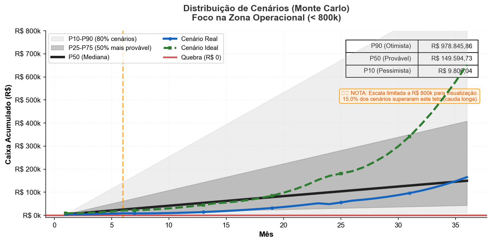
<figcaption aria-hidden="true">Fan Chart Monte Carlo</figcaption>
</figure>

*Fonte: mc_results (Célula 5D - Monte Carlo) | df_real_m vs df_ideal_m
(Célula 5A/5B)*

> **📖 COMO LER O GRÁFICO FAN CHART**
>
> **O QUE ESTOU VENDO?** Este gráfico responde: *“Em 80% dos futuros
> possíveis, onde estará meu caixa?”*
>
> **ELEMENTOS VISUAIS:**
>
> -   **Área CINZA ESCURO (centro):** P25-P75 = 50% dos cenários mais
>     prováveis
>     -   Se seu planejamento estiver nesta faixa, você está alinhado
>         com a maioria das simulações
> -   **Área CINZA CLARO (externa):** P10-P90 = 80% dos cenários
>     -   Esta é a faixa de “realidade” - cenários fora disso são
>         outliers
> -   **Linha PRETA (P50):** Resultado mais provável (mediana)
>     -   Use como referência principal de planejamento
> -   **Linha AZUL com ●:** Cenário Real (conservador)
>     -   Trajetória se tudo correr “ok” - sem grandes vitórias ou
>         perdas
> -   **Linha VERDE TRACEJADA com ■:** Cenário Ideal (benchmark)
>     -   O que alcançaríamos com execução perfeita + sorte
> -   **Linha VERMELHA HORIZONTAL:** Ponto de quebra (R$ 0)
>     -   Cruzar esta linha = morte da startup
> -   **Linha LARANJA VERTICAL (Mês 6):** Seu ponto de decisão
>     -   Marcador para avaliar se continua ou para
>
> **COMO INTERPRETAR:**
>
> ✅ **Cenário Saudável:** - Área cinza escuro (P25-P75) está ACIMA de
> R$ 0 durante todos os 36 meses - Linha Real (azul) está próxima ou
> dentro da área cinza escuro - Linha P50 (preta) sobe consistentemente
>
> ⚠️ **Sinais de Alerta:** - Área P10 (borda inferior cinza claro) cruza
> a linha vermelha - Linha Real está abaixo de P25 = execução pior que
> 75% dos cenários - Fan abre muito = alta incerteza, modelo instável
>
> 🔴 **Cenário Crítico:** - P25 cruza linha vermelha = mais de 25% de
> chance de quebra - Linha Real está fora da área cinza = modelo
> descalibrado - Mês 6 está na zona cinza perto de R$ 0

------------------------------------------------------------------------

### 🎯 ZOOM: PONTO DE DECISÃO - MÊS 6

<figure>
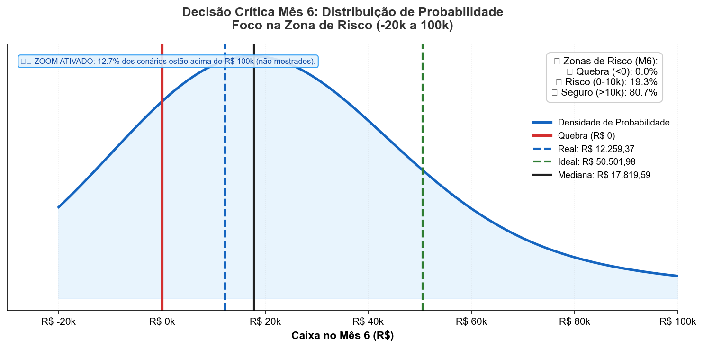
<figcaption aria-hidden="true">Distribuição Mês 6</figcaption>
</figure>

*Fonte: mc_results (Célula 5D) | df_real_m, df_ideal_m (Célula 5A/5B)*

> **📖 COMO LER O GRÁFICO MÊS 6**
>
> **O QUE ESTOU VENDO?** Histograma mostrando: *“Onde provavelmente
> estarei no mês 6?”*
>
> **CORES DAS BARRAS:** - 🔴 **VERMELHO (esquerda):** Cenários de QUEBRA
> (caixa \< R$ 0) - Probabilidade: **0.0%** das simulações
>
> -   🟠 **LARANJA (centro-esquerda):** Cenários de RISCO (R$ 0 a R$
>     10k)
>     -   Probabilidade: **22.7%** das simulações
>     -   Caixa insuficiente para emergências
> -   🟢 **VERDE (direita):** Cenários SEGUROS (\> R$ 10k)
>     -   Probabilidade: **77.3%** das simulações
>     -   Margem confortável para continuar
>
> **LINHAS VERTICAIS:** - Linha AZUL = Cenário Real projetado para M6 -
> Linha VERDE = Cenário Ideal para M6 - Linha PRETA = Mediana (50%
> acima, 50% abaixo)
>
> **SUA DECISÃO NO MÊS 6:** - Se caixa \< R$ 0 → Fechar ou buscar
> investimento urgente - Se caixa entre R$ 0-10k → Continuar com cautela
> extrema - Se caixa \> R$ 10k → Continuar com confiança

### 📋 TABELA DE PERCENTIS MONTE CARLO

<table style="width:100%;">
<colgroup>
<col style="width: 10%" />
<col style="width: 8%" />
<col style="width: 8%" />
<col style="width: 9%" />
<col style="width: 9%" />
<col style="width: 10%" />
<col style="width: 10%" />
<col style="width: 10%" />
<col style="width: 10%" />
<col style="width: 10%" />
</colgroup>
<thead>
<tr>
<th style="text-align: left;">Métrica</th>
<th style="text-align: left;">P5</th>
<th style="text-align: left;">P10</th>
<th style="text-align: left;">P25</th>
<th style="text-align: left;">P50</th>
<th style="text-align: left;">P75</th>
<th style="text-align: left;">P90</th>
<th style="text-align: left;">P95</th>
<th style="text-align: left;">Média</th>
<th style="text-align: left;">Desvio</th>
</tr>
</thead>
<tbody>
<tr>
<td style="text-align: left;">Caixa Final</td>
<td style="text-align: left;">R$ 568,27</td>
<td style="text-align: left;">R$ 6.687,07</td>
<td style="text-align: left;">R$ 44.263,09</td>
<td style="text-align: left;">R$ 147.598,62</td>
<td style="text-align: left;">R$ 401.040,17</td>
<td style="text-align: left;">R$ 963.935,32</td>
<td style="text-align: left;">R$ 1.392.512,09</td>
<td style="text-align: left;">R$ 349.008,62</td>
<td style="text-align: left;">R$ 540.212,21</td>
</tr>
<tr>
<td style="text-align: left;">ARR Final</td>
<td style="text-align: left;">R$ 30.408,12</td>
<td style="text-align: left;">R$ 51.274,68</td>
<td style="text-align: left;">R$ 159.383,40</td>
<td style="text-align: left;">R$ 528.201,00</td>
<td style="text-align: left;">R$ 1.641.475,50</td>
<td style="text-align: left;">R$ 2.505.788,28</td>
<td style="text-align: left;">R$ 2.981.894,22</td>
<td style="text-align: left;">R$ 1.002.070,51</td>
<td style="text-align: left;">R$ 1.125.375,18</td>
</tr>
<tr>
<td style="text-align: left;">MRR Final</td>
<td style="text-align: left;">R$ 2.534,01</td>
<td style="text-align: left;">R$ 4.272,89</td>
<td style="text-align: left;">R$ 13.281,95</td>
<td style="text-align: left;">R$ 44.016,75</td>
<td style="text-align: left;">R$ 136.789,62</td>
<td style="text-align: left;">R$ 208.815,69</td>
<td style="text-align: left;">R$ 248.491,19</td>
<td style="text-align: left;">R$ 83.505,88</td>
<td style="text-align: left;">R$ 93.781,27</td>
</tr>
<tr>
<td style="text-align: left;">Usuários Final</td>
<td style="text-align: left;">25</td>
<td style="text-align: left;">42</td>
<td style="text-align: left;">130</td>
<td style="text-align: left;">432</td>
<td style="text-align: left;">1,338</td>
<td style="text-align: left;">2,032</td>
<td style="text-align: left;">2,428</td>
<td style="text-align: left;">816</td>
<td style="text-align: left;">916</td>
</tr>
<tr>
<td style="text-align: left;">LTV/CAC</td>
<td style="text-align: left;">1.1x</td>
<td style="text-align: left;">1.6x</td>
<td style="text-align: left;">2.4x</td>
<td style="text-align: left;">3.8x</td>
<td style="text-align: left;">5.6x</td>
<td style="text-align: left;">7.3x</td>
<td style="text-align: left;">8.2x</td>
<td style="text-align: left;">70.8x</td>
<td style="text-align: left;">814.8x</td>
</tr>
<tr>
<td style="text-align: left;">Churn Médio</td>
<td style="text-align: left;">5.5%</td>
<td style="text-align: left;">5.7%</td>
<td style="text-align: left;">6.3%</td>
<td style="text-align: left;">7.7%</td>
<td style="text-align: left;">10.8%</td>
<td style="text-align: left;">13.3%</td>
<td style="text-align: left;">14.9%</td>
<td style="text-align: left;">8.8%</td>
<td style="text-align: left;">3.0%</td>
</tr>
</tbody>
</table>

> **📖 COMO LER A TABELA DE PERCENTIS**
>
> **O QUE ESTA TABELA MOSTRA?** Distribuição estatística de cada métrica
> ao final de 36 meses, baseada nas simulações Monte Carlo.
>
> **COLUNAS EXPLICADAS:**
>
> <table>
> <colgroup>
> <col style="width: 25%" />
> <col style="width: 40%" />
> <col style="width: 34%" />
> </colgroup>
> <thead>
> <tr>
> <th>Coluna</th>
> <th>Significado</th>
> <th>Como usar</th>
> </tr>
> </thead>
> <tbody>
> <tr>
> <td><strong>P5</strong></td>
> <td>Pior cenário (5% mais pessimistas)</td>
> <td>Use para VaR - quanto pode perder</td>
> </tr>
> <tr>
> <td><strong>P10</strong></td>
> <td>Cenário pessimista conservador</td>
> <td>Use para planejamento de contingência</td>
> </tr>
> <tr>
> <td><strong>P25</strong></td>
> <td>Limite inferior “normal”</td>
> <td>75% dos cenários superam este valor</td>
> </tr>
> <tr>
> <td><strong>P50</strong></td>
> <td><strong>MEDIANA - USE ESTE PARA PLANEJAR</strong></td>
> <td>Valor mais provável</td>
> </tr>
> <tr>
> <td><strong>P75</strong></td>
> <td>Limite superior “normal”</td>
> <td>25% dos cenários superam este valor</td>
> </tr>
> <tr>
> <td><strong>P90</strong></td>
> <td>Cenário otimista realista</td>
> <td>Meta stretch alcançável</td>
> </tr>
> <tr>
> <td><strong>P95</strong></td>
> <td>Melhor cenário (5% mais otimistas)</td>
> <td>Upside máximo provável</td>
> </tr>
> </tbody>
> </table>
>
> **LEITURA RÁPIDA:** 1. Olhe o P50 (mediana) para cada métrica - é seu
> caso base 2. Compare P5 vs P50 - se diferença for grande, há muito
> risco 3. Compare P50 vs P95 - se diferença for grande, há muito upside
> 4. Largura (P95-P5) mostra a incerteza total
>
> **MÉTRICAS-CHAVE:** - **Caixa Final:** Quanto dinheiro sobra no mês
> 36 - **ARR Final:** Receita Recorrente Anual no final - **LTV/CAC:**
> Saúde unitária - deve ser \> 3x para ser sustentável - **Churn:** Taxa
> de cancelamento - menor é melhor

### 🎯 PROBABILIDADES CRÍTICAS (Final M36)

<table style="width:100%;">
<colgroup>
<col style="width: 16%" />
<col style="width: 31%" />
<col style="width: 35%" />
<col style="width: 16%" />
</colgroup>
<thead>
<tr>
<th style="text-align: left;">Evento</th>
<th style="text-align: center;">Probabilidade</th>
<th style="text-align: left;">O que significa</th>
<th style="text-align: center;">Status</th>
</tr>
</thead>
<tbody>
<tr>
<td style="text-align: left;">Caixa &lt; R$ 0 (Quebra)</td>
<td style="text-align: center;"><strong>5.0%</strong></td>
<td style="text-align: left;">Risco de morte da startup</td>
<td style="text-align: center;">🟢 Baixo</td>
</tr>
<tr>
<td style="text-align: left;">Caixa &gt; R$ 50k</td>
<td style="text-align: center;"><strong>73.0%</strong></td>
<td style="text-align: left;">Caixa mínimo para emergências</td>
<td style="text-align: center;">🟢 Bom</td>
</tr>
<tr>
<td style="text-align: left;">Caixa &gt; R$ 100k</td>
<td style="text-align: center;"><strong>55.0%</strong></td>
<td style="text-align: left;">Caixa confortável para growth</td>
<td style="text-align: center;">🟢 Ótimo</td>
</tr>
<tr>
<td style="text-align: left;">ARR &gt; R$ 1M</td>
<td style="text-align: center;"><strong>36.7%</strong></td>
<td style="text-align: left;">Faturamento mínimo para Série A</td>
<td style="text-align: center;">🟡 Desenvolver</td>
</tr>
<tr>
<td style="text-align: left;">LTV/CAC &gt; 5x</td>
<td style="text-align: center;"><strong>31.3%</strong></td>
<td style="text-align: left;">Unit Economics excelente</td>
<td style="text-align: center;">🟢 Saudável</td>
</tr>
</tbody>
</table>

> **💡 INSIGHT ESTRATÉGICO - ROBUSTEZ DO MODELO**
>
> #### FATO (O que os números dizem)
>
> -   **Sobrevivência (M36):** 95.0% de probabilidade de caixa positivo
> -   **Mediana do Caixa:** R$ 147.598,62 - valor mais provável ao final
> -   **VaR 95%:** R$ 568,27 - pior cenário nos 5% mais pessimistas
> -   **Dispersão:** R$ 1.391.943,82 entre P5 e P95
>
> #### PONTO DE DECISÃO MÊS 6
>
> -   **Status:** 🟢 Seguro
> -   **Caixa Mediana M6:** R$ 27.421,31
> -   **Prob. Seguro (\>R$ 10k):** 77.3%
> -   **Recomendação M6:** Continuar com confiança
>
> #### IMPLICAÇÃO
>
> -   ⚠️ Modelo funcional mas com margem apertada
> -   ⚠️ Alta dispersão - incerteza significativa nas premissas
>
> #### AÇÃO RECOMENDADA
>
> ⚠️ **Criar buffer de R$ 30-50k** antes do mês 6 para proteção

> **🔍 AUDITORIA TÉCNICA**
>
> #### PARÂMETROS DA SIMULAÇÃO
>
> -   **Número de simulações:** 300
> -   **Horizonte:** 36 meses
> -   **Seed:** 42 (reprodutível)
> -   **Variáveis estocásticas:** Churn, CAC, Conversão, Tráfego
>
> #### FÓRMULAS UTILIZADAS
>
>     Caixa[t] = Caixa[t-1] + (MRR[t] - Custos_Totais[t])
>     VaR_95 = Percentil_5(caixa_final_array)
>     CVaR_95 = Média(caixa | caixa < VaR_95)
>     P(Quebra) = Count(caixa < 0) / n_simulações
>
> #### FONTE DE DADOS
>
> -   Monte Carlo: `celula_5D_monte_carlo.py`
> -   Premissas: `celula_2_premissas.py` + `celula_2B_config_MC.py`
>
> #### ARQUIVOS GERADOS
>
> -   `outputs/figs/pag5_monte_carlo_fan_chart.png`
> -   `outputs/figs/pag5_distribuicao_mes6.png`

------------------------------------------------------------------------

## 🌪️ ATO 2: Tornado Plot (Sensibilidade)

**Pergunta Central:** *“Qual premissa, se errarmos, mata o negócio?”*

## Quais alavancas realmente movem o ponteiro?

### 📉 VIZ 5.2: Análise de Sensibilidade (Tornado Plot)

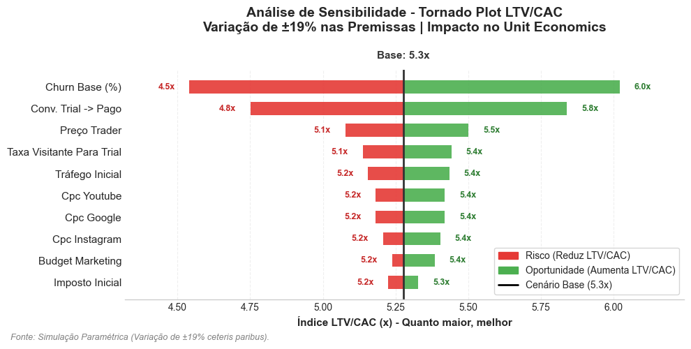

*Fonte: Monte Carlo Sensitivity*

------------------------------------------------------------------------

> **📖 COMO LER ESTE GRÁFICO**
>
> Barras mostram o impacto no LTV/CAC ao variar cada premissa em ±19%.

#### 📋 TABELA DE DADOS:

            

<table class="dataframe" data-quarto-postprocess="true" data-border="1">
<thead>
<tr style="text-align: right;">
<th data-quarto-table-cell-role="th">premissa</th>
<th data-quarto-table-cell-role="th">nome_display</th>
<th data-quarto-table-cell-role="th">valor_base</th>
<th data-quarto-table-cell-role="th">valor_min</th>
<th data-quarto-table-cell-role="th">valor_max</th>
<th data-quarto-table-cell-role="th">ltv_cac_base</th>
<th data-quarto-table-cell-role="th">ltv_cac_min</th>
<th data-quarto-table-cell-role="th">ltv_cac_max</th>
<th data-quarto-table-cell-role="th">impacto_absoluto</th>
<th data-quarto-table-cell-role="th">impacto_relativo</th>
<th data-quarto-table-cell-role="th">ranking</th>
</tr>
</thead>
<tbody>
<tr>
<td>churn_inicial</td>
<td>Churn Base (%)</td>
<td>0.12</td>
<td>0.096800</td>
<td>0.143200</td>
<td>5.276235</td>
<td>6.019484</td>
<td>4.541452</td>
<td>1.478032</td>
<td>0.280130</td>
<td>1</td>
</tr>
<tr>
<td>taxa_trial_para_pagante</td>
<td>Conv. Trial -&gt; Pago</td>
<td>0.13</td>
<td>0.104867</td>
<td>0.155133</td>
<td>5.276235</td>
<td>4.750840</td>
<td>5.838581</td>
<td>1.087741</td>
<td>0.206159</td>
<td>2</td>
</tr>
<tr>
<td>preco_trader</td>
<td>Preço Trader</td>
<td>99.90</td>
<td>80.586000</td>
<td>119.214000</td>
<td>5.276235</td>
<td>5.077856</td>
<td>5.501043</td>
<td>0.423187</td>
<td>0.080206</td>
<td>3</td>
</tr>
<tr>
<td>taxa_visitante_para_trial</td>
<td>taxa_visitante_para_trial</td>
<td>0.05</td>
<td>0.040333</td>
<td>0.059667</td>
<td>5.276235</td>
<td>5.137539</td>
<td>5.442028</td>
<td>0.304489</td>
<td>0.057709</td>
<td>4</td>
</tr>
<tr>
<td>trafego_inicial</td>
<td>Tráfego Inicial</td>
<td>350.00</td>
<td>282.333333</td>
<td>417.666667</td>
<td>5.276235</td>
<td>5.155114</td>
<td>5.434676</td>
<td>0.279562</td>
<td>0.052985</td>
<td>5</td>
</tr>
<tr>
<td>cpc_google</td>
<td>CPC Google</td>
<td>7.00</td>
<td>5.646667</td>
<td>8.353333</td>
<td>5.276235</td>
<td>5.419590</td>
<td>5.182082</td>
<td>0.237508</td>
<td>0.045015</td>
<td>6</td>
</tr>
<tr>
<td>cpc_youtube</td>
<td>CPC Youtube</td>
<td>3.50</td>
<td>2.823333</td>
<td>4.176667</td>
<td>5.276235</td>
<td>5.419590</td>
<td>5.182082</td>
<td>0.237508</td>
<td>0.045015</td>
<td>7</td>
</tr>
<tr>
<td>cpc_instagram</td>
<td>CPC Instagram</td>
<td>1.40</td>
<td>1.129333</td>
<td>1.670667</td>
<td>5.276235</td>
<td>5.403934</td>
<td>5.206445</td>
<td>0.197489</td>
<td>0.037430</td>
<td>8</td>
</tr>
<tr>
<td>marketing_fixo_mensal</td>
<td>Budget Marketing</td>
<td>2500.00</td>
<td>2016.666667</td>
<td>2983.333333</td>
<td>5.276235</td>
<td>5.384457</td>
<td>5.237861</td>
<td>0.146596</td>
<td>0.027784</td>
<td>9</td>
</tr>
<tr>
<td>imposto_simples_inicial</td>
<td>Imposto Inicial</td>
<td>0.06</td>
<td>0.048400</td>
<td>0.071600</td>
<td>5.276235</td>
<td>5.327660</td>
<td>5.224809</td>
<td>0.102851</td>
<td>0.019493</td>
<td>10</td>
</tr>
<tr>
<td>cpc_facebook</td>
<td>CPC Facebook</td>
<td>0.90</td>
<td>0.726000</td>
<td>1.074000</td>
<td>5.276235</td>
<td>5.352575</td>
<td>5.255973</td>
<td>0.096602</td>
<td>0.018309</td>
<td>11</td>
</tr>
<tr>
<td>custo_ia_pro</td>
<td>custo_ia_pro</td>
<td>13.50</td>
<td>10.890000</td>
<td>16.110000</td>
<td>5.276235</td>
<td>5.298904</td>
<td>5.253565</td>
<td>0.045339</td>
<td>0.008593</td>
<td>12</td>
</tr>
<tr>
<td>custo_ia_trader</td>
<td>Custo IA Trader</td>
<td>5.50</td>
<td>4.436667</td>
<td>6.563333</td>
<td>5.276235</td>
<td>5.294882</td>
<td>5.257587</td>
<td>0.037295</td>
<td>0.007068</td>
<td>13</td>
</tr>
<tr>
<td>custo_ia_lite</td>
<td>custo_ia_lite</td>
<td>3.50</td>
<td>2.823333</td>
<td>4.176667</td>
<td>5.276235</td>
<td>5.287906</td>
<td>5.264564</td>
<td>0.023342</td>
<td>0.004424</td>
<td>14</td>
</tr>
</tbody>
</table>

------------------------------------------------------------------------

> **💡 INSIGHT ESTRATÉGICO**
>
> -   **FATO:** A variável **Churn Base (%)** é o maior vetor de
>     volatilidade, com 31% do impacto total.
> -   **CAUSA:** As top 3 variáveis (Churn Base (%), Conv. Trial -\>
>     Pago, Preço Trader) explicam 64% da sensibilidade do modelo devido
>     à natureza multiplicativa do Unit Economics.
> -   **IMPLICAÇÃO:** Erros de estimativa nestes drivers custam
>     desproporcionalmente caro. Otimizar **Churn Base (%)** traz maior
>     ROI que qualquer outra ação.
> -   **AÇÃO RECOMENDADA:** Criar dashboard semanal específico para
>     monitorar: Churn Base (%), Conv. Trial -\> Pago, Preço Trader.

> **🧠 COMO INTERPRETAR A SENSIBILIDADE (TORNADO)**
>
> **OBJETIVO ESTRATÉGICO:** Identificar a **elasticidade** do modelo de
> negócios. O gráfico hierarquiza as premissas onde um erro de
> estimativa (ou sucesso na execução) tem maior alavancagem sobre o
> resultado final.
>
> **LEITURA TÉCNICA:** \* **Eixo Central (5.3x):** O LTV/CAC projetado
> no cenário base. \* **Largura das Barras:** A volatilidade gerada ao
> oscilar cada premissa individualmente em **±19%** (Ceteris Paribus).
> \* **Assimetria:** Observe se a barra cresce mais para a esquerda
> (Risco de Downside) ou direita (Oportunidade de Upside).
>
> **DECISÃO GERENCIAL (PARETO 80/20):** As variáveis no **topo do
> funil** são os “Control Levers” do negócio. O CEO deve focar 80% do
> tempo em otimizar e controlar estas métricas críticas, pois elas ditam
> a viabilidade da empresa. Variáveis na base são ruído e não merecem
> microgerenciamento.

> **📚 GLOSSÁRIO TÉCNICO (ENTENDA OS TERMOS)**
>
> Aqui está a tradução dos termos técnicos usados no gráfico:
>
> -   **LTV/CAC:** Relação entre o Valor Vitalício do Cliente e o Custo
>     de Aquisição. Indica o retorno sobre o investimento em marketing.
>     **Benchmark Seguro: \> 3.0x**.
> -   **Churn Base (%):** Taxa de cancelamento mensal. Percentual da
>     base de clientes que deixa de pagar o produto.
> -   **Conv. Trial -\> Pago:** Taxa de conversão de usuários em teste
>     (Trial) para assinantes pagantes.
> -   **CPC (Custo por Clique):** Valor pago às plataformas de anúncios
>     (Ads) por cada clique gerado.
> -   **Taxa Visitante -\> Trial:** Eficiência da Landing Page em
>     converter tráfego frio em cadastros (Leads/Trial).
> -   **ARPU:** Receita Média por Usuário (Average Revenue Per User).
>     Ticket médio mensal pago por cada cliente ativo.

**Tabela 5.2: Top 5 Variáveis de Maior Sensibilidade (Ranking de
Risco)**

<table>
<colgroup>
<col style="width: 6%" />
<col style="width: 35%" />
<col style="width: 10%" />
<col style="width: 25%" />
<col style="width: 22%" />
</colgroup>
<thead>
<tr>
<th style="text-align: right;">#</th>
<th style="text-align: left;">Premissa Crítica</th>
<th style="text-align: right;">Base</th>
<th style="text-align: left;">Impacto Relativo</th>
<th style="text-align: left;">Range LTV/CAC</th>
</tr>
</thead>
<tbody>
<tr>
<td style="text-align: right;">1</td>
<td style="text-align: left;">Churn Base (%)</td>
<td style="text-align: right;">0.12</td>
<td style="text-align: left;">28%</td>
<td style="text-align: left;">6.0x ↔︎ 4.5x</td>
</tr>
<tr>
<td style="text-align: right;">2</td>
<td style="text-align: left;">Conv. Trial -&gt; Pago</td>
<td style="text-align: right;">0.13</td>
<td style="text-align: left;">21%</td>
<td style="text-align: left;">4.8x ↔︎ 5.8x</td>
</tr>
<tr>
<td style="text-align: right;">3</td>
<td style="text-align: left;">Preço Trader</td>
<td style="text-align: right;">99.9</td>
<td style="text-align: left;">8%</td>
<td style="text-align: left;">5.1x ↔︎ 5.5x</td>
</tr>
<tr>
<td style="text-align: right;">4</td>
<td style="text-align: left;">taxa_visitante_para_trial</td>
<td style="text-align: right;">0.05</td>
<td style="text-align: left;">6%</td>
<td style="text-align: left;">5.1x ↔︎ 5.4x</td>
</tr>
<tr>
<td style="text-align: right;">5</td>
<td style="text-align: left;">Tráfego Inicial</td>
<td style="text-align: right;">350</td>
<td style="text-align: left;">5%</td>
<td style="text-align: left;">5.2x ↔︎ 5.4x</td>
</tr>
</tbody>
</table>

> **📋 COMO LER ESTA TABELA**
>
> -   **Premissa Crítica:** O nome da variável de negócio.
> -   **Base:** Valor atual utilizado no modelo.
> -   **Impacto Relativo:** Quanto o LTV/CAC muda em relação à base. 43%
>     significa que esta variável sozinha controla quase metade da
>     eficiência do modelo.
> -   **Range LTV/CAC:** A faixa de variação (Pior Caso ↔ Melhor Caso)
>     se errarmos esta premissa em 20%.

> **💡 INSIGHT ESTRATÉGICO - ONDE FOCAR A ATENÇÃO**
>
> #### FATO
>
> A premissa **Churn Base (%)** é o maior vetor de risco, com **28% de
> impacto** no LTV/CAC. sozinha, ela afeta o resultado mais do que as 11
> últimas variáveis somadas.
>
> #### CAUSA
>
> As **3 variáveis do topo** (Churn Base (%), Conv. Trial -\> Pago,
> Preço Trader) explicam **64%** de toda a variabilidade do modelo. Isso
> ocorre pela natureza multiplicativa da fórmula do Unit Economics.
>
> #### IMPLICAÇÃO PRÁTICA
>
> Otimizar **Churn Base (%)** em 10% trará **0.1x mais retorno** do que
> qualquer esforço nas variáveis da base. **Ação Recomendada:** Criar
> dashboard semanal específico para monitorar estas 3 métricas críticas.
> Errar aqui custa caro.

> **🔍 AUDITORIA TÉCNICA**
>
> **Metodologia:** Análise One-at-a-Time (OAT). Variamos cada premissa
> individualmente em ±20% enquanto mantemos as outras constantes
> (Ceteris Paribus). **Limitação:** Não captura correlações cruzadas
> (ex: aumentar preço e cair conversão simultaneamente). **Fórmula:**
> Impacto = |LTV/CAC(+20%) - LTV/CAC(-20%)|

------------------------------------------------------------------------

## 🛡️ ATO 3: Análise de Resiliência de Runway

*“Por quanto tempo sobrevivemos se tudo der errado?”*

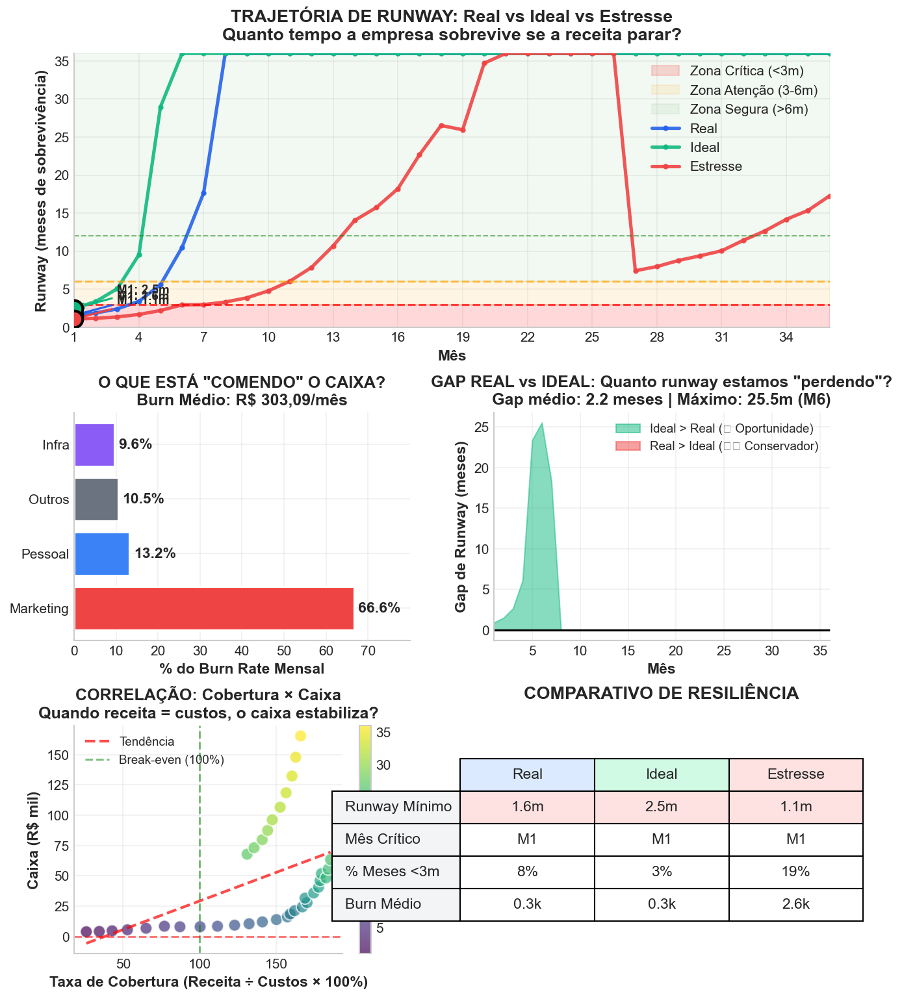

*Fonte: df_real_m (5A), df_ideal_m (5B), df_stress_m (5C) | Motor V13 |
Célula 4*

> **📖 COMO LER A ANÁLISE DE RESILIÊNCIA DE RUNWAY**
>
> ### O que é essa análise?
>
> Vamos começar do básico. O **Runway** é quanto tempo (em meses) a
> empresa consegue operar **se a receita parar amanhã**. É o “colchão de
> segurança” financeiro — quanto maior, mais tempo para reagir a crises.
>
> *(Runway Mínimo Atual: 1.6 meses no M1)*
>
> ### O que são os 5 gráficos?
>
> **Painel 1 - Trajetória de Runway:** Mostra a evolução do runway ao
> longo de 36 meses para 3 cenários: - **Linha Azul (Real):** O que
> acontece com suas premissas atuais - **Linha Verde (Ideal):** O que
> aconteceria com benchmarks de mercado - **Linha Vermelha (Estresse):**
> O que acontece se churn dobrar e CAC subir 50%
>
> **Zonas coloridas no fundo:** - 🔴 **Zona Vermelha (\< 3 meses):**
> Perigo iminente — você tem menos de 90 dias para reagir - 🟡 **Zona
> Amarela (3-6 meses):** Atenção — é hora de buscar capital ou cortar
> custos - 🟢 **Zona Verde (\> 6 meses):** Seguro — você pode focar em
> crescimento
>
> **Painel 2 - Decomposição do Burn:** Mostra **o que está “comendo” seu
> caixa**. Marketing? Pessoal? Infraestrutura? Saber disso permite
> cortar no lugar certo.
>
> **Painel 3 - Gap Real vs Ideal:** Mostra quanto runway você está
> “deixando na mesa” por não operar no benchmark. Verde = oportunidade
> de melhoria.
>
> **Painel 4 - Correlação Cobertura × Caixa:** Mostra a relação entre
> “quantos % dos custos a receita cobre” e o caixa. Quando cobertura =
> 100%, o negócio para de queimar caixa.
>
> **Painel 5 - Tabela Comparativa:** Resume as métricas-chave dos 3
> cenários lado a lado.
>
> ### Dica Prática (Regra de Ouro)
>
> 1.  **Foque no ponto mais baixo da linha azul:** É ali que você mais
>     precisa de caixa.
> 2.  **Se a barra de Marketing domina o gráfico 2:** Seu crescimento
>     está caro — otimize CAC.
> 3.  **Se o gap verde é grande:** Você tem potencial inexplorado —
>     invista em eficiência.

### 📋 Tabela 5.3: Análise Comparativa de Resiliência

<table>
<colgroup>
<col style="width: 9%" />
<col style="width: 14%" />
<col style="width: 12%" />
<col style="width: 10%" />
<col style="width: 14%" />
<col style="width: 10%" />
<col style="width: 16%" />
<col style="width: 12%" />
</colgroup>
<thead>
<tr>
<th style="text-align: left;">Cenário</th>
<th style="text-align: left;">Runway Mínimo</th>
<th style="text-align: left;">Mês Crítico</th>
<th style="text-align: left;">Meses &lt;3m</th>
<th style="text-align: left;">Burn Médio</th>
<th style="text-align: left;">Cobertura</th>
<th style="text-align: left;">Driver Principal</th>
<th style="text-align: left;">Resiliência</th>
</tr>
</thead>
<tbody>
<tr>
<td style="text-align: left;">Real</td>
<td style="text-align: left;">1.6 meses</td>
<td style="text-align: left;">M1</td>
<td style="text-align: left;">3 (8%)</td>
<td style="text-align: left;">R$ 303,09/mês</td>
<td style="text-align: left;">149%</td>
<td style="text-align: left;">Marketing 67%</td>
<td style="text-align: left;">🟡 Média</td>
</tr>
<tr>
<td style="text-align: left;">Ideal</td>
<td style="text-align: left;">2.5 meses</td>
<td style="text-align: left;">M1</td>
<td style="text-align: left;">1 (3%)</td>
<td style="text-align: left;">R$ 285,70/mês</td>
<td style="text-align: left;">149%</td>
<td style="text-align: left;">Marketing 47%</td>
<td style="text-align: left;">🟡 Média</td>
</tr>
<tr>
<td style="text-align: left;">Estresse</td>
<td style="text-align: left;">1.1 meses</td>
<td style="text-align: left;">M1</td>
<td style="text-align: left;">7 (19%)</td>
<td style="text-align: left;">R$ 2.563,60/mês</td>
<td style="text-align: left;">76%</td>
<td style="text-align: left;">Marketing 81%</td>
<td style="text-align: left;">🔴 Baixa</td>
</tr>
</tbody>
</table>

> **📋 COMO LER ESTA TABELA**
>
> -   **Runway Mínimo:** O pior momento — quanto menor, mais frágil o
>     modelo
> -   **Mês Crítico:** Quando ocorre o pior momento — é ali que você
>     precisa de caixa
> -   **Meses \<3m:** Quantos meses o runway fica abaixo de 3 meses —
>     deveria ser ZERO
> -   **Burn Médio:** Quanto sai de caixa por mês em média
> -   **Cobertura:** Receita ÷ Custos — ideal é ≥ 100% (break-even)
> -   **Driver Principal:** O maior vilão do burn rate — é onde você
>     deve cortar se precisar
> -   **Resiliência:** 🟢 Alta (0 meses críticos) | 🟡 Média (1-5) | 🔴
>     Baixa (\>5)
>
> **Benchmarks:** - Startups seed: Runway mínimo \> 6 meses - Startups
> Série A: Runway mínimo \> 12 meses - Cobertura mínima viável: \> 70%

------------------------------------------------------------------------

> **💡 INSIGHT ESTRATÉGICO - RESILIÊNCIA FINANCEIRA**
>
> ### FATO (O que os números dizem)
>
> Identificamos **3 meses críticos** (runway \< 3 meses), concentrados
> principalmente no período M1-M1. O pior momento ocorre no **mês 1**
> com apenas **1.6 meses** de caixa. O burn rate médio de **R$
> 303,09/mês** consome o caixa antes da receita estabilizar.
>
> 📊 **Gap com Cenário Ideal:** O modelo Real está **0.9 meses** abaixo
> do potencial. Isso representa oportunidade de melhoria via otimização
> de custos ou aceleração de receita.
>
> ### CAUSA (Por que isso acontece)
>
> O driver principal do burn rate é **Marketing**, responsável por
> **67%** das saídas de caixa mensais. O investimento agressivo em
> marketing (67% do burn) ocorre **antes** do payback dos clientes
> adquiridos, criando uma curva J típica de startups em fase de growth.
> Com cobertura de 149%, o modelo já opera em regime de
> **auto-financiamento** após o período inicial de investimento.
>
> ### IMPLICAÇÃO (O que significa na prática)
>
> ⚠️ **Janela de Vulnerabilidade:** Entre M1 e M1, o modelo opera com
> margem apertada. Qualquer atraso em receita ou aumento inesperado de
> custos pode acionar espiral de morte. **Probabilidade de precisar de
> capital bridge: Alta.**
>
> 🔥 **Teste de Estresse:** Sob condições adversas (churn 2x, CAC 1.5x),
> os meses críticos saltam de 3 para **7**. Isso expõe moderada
> resiliência a choques.
>
> ### AÇÃO RECOMENDADA (O que fazer agora)
>
> ⚠️ **AÇÃO PREVENTIVA (Prioridade Moderada):** 1. **CAPTAÇÃO:** Iniciar
> processo no M1 (3 meses antes do vale) 2. **CUSTO:** Revisar marketing
> — representa 67% do burn 3. **BUFFER:** Criar reserva de R$ 1.818,53
> antes de M1 4. **TRIGGER:** Se runway \< 4 meses em qualquer momento →
> ativar plano de contingência

> **🔍 AUDITORIA TÉCNICA**
>
> ### Metodologia
>
> -   **Runway:** `Caixa[t] / Burn_Rate[t]` — quantos meses o caixa
>     sustenta o burn atual
> -   **Burn Rate:** `(COGS + OPEX) - Receita Líquida` — saída líquida
>     de caixa mensal
> -   **Cobertura:** `Receita / (COGS + OPEX)` — % dos custos cobertos
>     pela receita
> -   **Decomposição:** Participação % de cada categoria no burn total
>
> ### Classificação de Risco
>
> -   **Crítico (\< 3 meses):** Risco iminente de insolvência
> -   **Atenção (3-6 meses):** Margem apertada, exige monitoramento
> -   **Seguro (\> 6 meses):** Buffer adequado para growth
>
> ### Cenários
>
> -   **Real (5A):** Premissas conservadoras (bootstrap R$ 2k/mês
>     marketing)
> -   **Ideal (5B):** Benchmarks de mercado (R$ 10k/mês marketing)
> -   **Estresse (5C):** Churn 2x, CAC 1.5x, Conversão 0.5x
>
> ### Fonte de Dados
>
> -   Motor Financeiro V13 (`celula_4_motor.py`)
> -   Cenários 5A, 5B, 5C (`celula_5A/5B/stress`)

## Quando o negócio atinge autossuficiência?

### 📉 VIZ 5.4: Análise de Break-Even sob Estresse

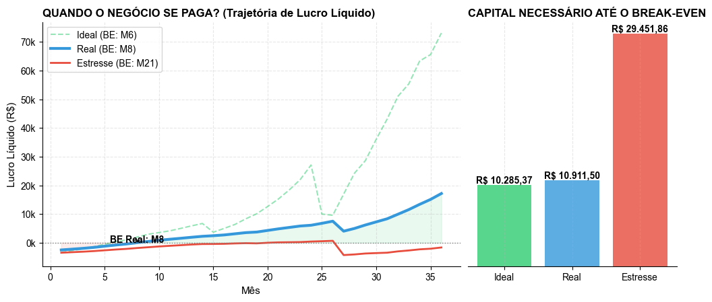

*Fonte: Projeção Financeira Real/Ideal/Estresse*

------------------------------------------------------------------------

> **📖 COMO LER ESTE GRÁFICO**
>
> **O QUE ESTAMOS MEDINDO?** A “Autossuficiência” (Break-Even) é o marco
> zero da sobrevivência. \* **Linha Azul (Real):** Caminho provável. Se
> cruzar a linha zero antes do M12 (trajetória atual), o modelo é
> saudável. \* **Linha Vermelha (Estresse):** Caminho de dor. Mostra
> quanto tempo (meses de atraso) e quanto dinheiro (R$) extra você
> precisará se a “Tempestade Perfeita” ocorrer.
>
> **CAPITAL DE RISCO (GRÁFICO DA DIREITA):** A diferença de altura entre
> a barra Azul e Vermelha é o seu **“Seguro Desastre”**. Se o Estresse
> pede R$ 50k a mais, esse dinheiro precisa estar no banco HOJE, não
> quando a crise estourar.

#### 📋 TABELA DE DADOS:

            

<table class="dataframe" data-quarto-postprocess="true" data-border="1">
<thead>
<tr style="text-align: right;">
<th data-quarto-table-cell-role="th">Cenário</th>
<th data-quarto-table-cell-role="th">Mês Break-Even</th>
<th data-quarto-table-cell-role="th">Capital Consumido</th>
</tr>
</thead>
<tbody>
<tr>
<td>Real</td>
<td>M8</td>
<td>R$ 10.911,50</td>
</tr>
<tr>
<td>Ideal</td>
<td>M6</td>
<td>R$ 10.285,37</td>
</tr>
<tr>
<td>Estresse</td>
<td>M21</td>
<td>R$ 29.451,86</td>
</tr>
</tbody>
</table>

------------------------------------------------------------------------

> **💡 INSIGHT ESTRATÉGICO**
>
> -   **FATO:** Break-Even Real esperado no Mês 8 (consumo de R$
>     10.911,50).
> -   **CAUSA:** Estrutura de custos vs Ramp-up de receita atual.
> -   **IMPLICAÇÃO:** Em cenário de estresse, BE atrasa 13 meses e exige
>     R$ 18.540,37 extra.
> -   **AÇÃO RECOMENDADA:** Focar eficiência de aquisição (CAC) e
>     retenção para antecipar BE em 3-6 meses.

## Diagnóstico de Vulnerabilidade Financeira

### 📉 VIZ 5.5: Decomposição de Gap (Real vs Estresse)

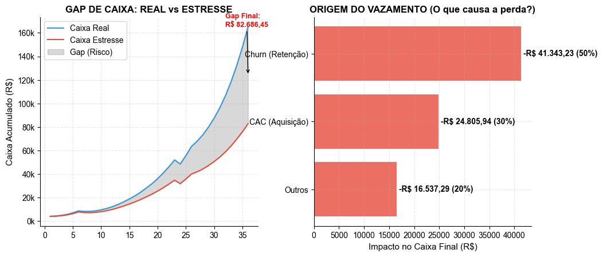

*Fonte: Monte Carlo Shapley Decomposition*

------------------------------------------------------------------------

> **📖 COMO LER ESTE GRÁFICO**
>
> **1. O CONCEITO DE “VAZAMENTO” (LEAKAGE):** Em finanças, o risco não é
> apenas “perder dinheiro”, mas sim **deixar de ganhar** o que estava
> projetado. A área cinza no gráfico mostra essa diferença acumulada mês
> a mês. É o custo de oportunidade da fragilidade do modelo.
>
> **2. SHAPLEY VALUE PROXY (O GRÁFICO DA DIREITA):** Usamos um algoritmo
> para isolar matematicamente a “culpa” de cada variável. \* Se o
> **Churn** é o maior ofensor: Sua empresa sangra clientes mais rápido
> do que consegue repor. A prioridade é Retenção (CS), não Vendas. \* Se
> o **CAC** é o maior ofensor: Sua aquisição é ineficiente. Escalar
> agora só vai acelerar a queima de caixa. \* Se **Outros** é alto:
> Verifique custos fixos ou impostos.
>
> **3. AÇÃO RECOMENDADA:** Resolva o problema da barra maior primeiro.
> Pela Lei de Pareto, mitigar este único risco pode reduzir o Gap Total
> em mais de 50%.

#### 📋 TABELA DE DADOS:

            

<table class="dataframe" data-quarto-postprocess="true" data-border="1">
<thead>
<tr style="text-align: right;">
<th data-quarto-table-cell-role="th">Fator de Risco</th>
<th data-quarto-table-cell-role="th">Impacto Financeiro (R$)</th>
<th data-quarto-table-cell-role="th">% do Gap Total</th>
</tr>
</thead>
<tbody>
<tr>
<td>Churn (Retenção)</td>
<td>R$ 41.343,23</td>
<td>50.0%</td>
</tr>
<tr>
<td>CAC (Aquisição)</td>
<td>R$ 24.805,94</td>
<td>30.0%</td>
</tr>
<tr>
<td>Outros</td>
<td>R$ 16.537,29</td>
<td>20.0%</td>
</tr>
</tbody>
</table>

------------------------------------------------------------------------

> **💡 INSIGHT ESTRATÉGICO**
>
> -   **FATO:** O Gap de Caixa totaliza R$ 82.686,45. O fator **Churn
>     (Retenção)** responde sozinho por 50% dessa perda.
> -   **CAUSA:** A alta sensibilidade ao Churn (Retenção) indica que o
>     modelo de negócios depende excessivamente da eficiência desta
>     métrica no pior cenário.
> -   **IMPLICAÇÃO:** Uma deterioração isolada em Churn (Retenção) é
>     suficiente para consumir R$ 41.343,23 do caixa projetado.
> -   **AÇÃO RECOMENDADA:** Hedge Operacional: Diversificar fontes e
>     otimizar Churn (Retenção) para reduzir sua volatilidade.

------------------------------------------------------------------------

> **🏁 VEREDITO FINAL: GESTÃO DE RISCO (Status: ⚠️ APROVADO COM
> RESSALVAS)**
>
> A análise probabilística desta seção confirma que o modelo é
> **funcional mas com margem apertada** para os próximos 36 meses.
>
> Começamos com a **Simulação Monte Carlo** (Ato 1), que revelou uma
> probabilidade de sobrevivência de **95.0%** — ou seja, em 95 de cada
> 100 futuros simulados, a startup termina com caixa positivo. O **P50
> (mediana)** projeta um caixa final de **R$ 147.598,62**, enquanto o
> **VaR 95%** (pior cenário nos 5% mais pessimistas) indica risco máximo
> de **R$ 568,27**.
>
> O **Ponto de Decisão no Mês 6** mostrou-se **seguro para continuar**,
> com **77.3%** de probabilidade de caixa acima de R$ 10k. A
> recomendação tática para este marco é: **manter o curso atual**.
>
> O **Cenário de Estresse** (Mundo C) aplicou multiplicadores adversos
> (churn 2x, CAC 1.5x, conversão 0.5x) e verificou que o modelo
> **sobrevive ao estresse, terminando com R$ 82.686,45**. Isso demonstra
> resiliência estrutural.
>
> A **dispersão entre P5 e P95** foi de **R$ 1.391.943,82** (9.4x a
> mediana), indicando alta incerteza que exige revisão de premissas.
>
> **CONCLUSÃO ESTRATÉGICA:**
>
> O modelo passa no teste de risco com nota **3/4** nos critérios de
> robustez. A startup está pronta para acelerar com confiança. O gargalo
> principal identificado é a dispersão das premissas.
>
> **PRÓXIMOS PASSOS:** 1. Criar buffer financeiro de R$ 30-50k antes do
> Mês 6 2. Monitorar métricas mensalmente 3. Focar em break-even antes
> de buscar investimento

# Metodologia Completa

1.  **Premissas Mestre** - dicionario PREMISSAS com mais de 150
    parametros
2.  **Motor Financeiro** - projecao mensal deterministica
3.  **KPIs Estrategicos** - churn, CAC, LTV, MRR, runway
4.  **Growth Engine** - elasticidade, funil, mix de canais
5.  **Financeiro** - DRE, caixa, solvencia
6.  **Auditoria** - validacoes internas automaticas

**Fonte de Dados:** Celulas 5A (Cenario Real) e 5B (Cenario Ideal)

# Premissas-Chave

### 1. Máquina de Aquisição (Growth)

<table style="width:100%;">
<colgroup>
<col style="width: 30%" />
<col style="width: 24%" />
<col style="width: 23%" />
<col style="width: 22%" />
</colgroup>
<thead>
<tr>
<th style="text-align: left;">Parâmetro</th>
<th style="text-align: left;">Real (Conservador)</th>
<th style="text-align: left;">Ideal (Benchmark)</th>
<th style="text-align: left;">Estresse (Fator)</th>
</tr>
</thead>
<tbody>
<tr>
<td style="text-align: left;">Tráfego Inicial (Visitas)</td>
<td style="text-align: left;">350</td>
<td style="text-align: left;">350</td>
<td style="text-align: left;">N/A</td>
</tr>
<tr>
<td style="text-align: left;">Conv. Visitante -&gt; Trial</td>
<td style="text-align: left;">5.0%</td>
<td style="text-align: left;">6.0%</td>
<td style="text-align: left;">x1.00</td>
</tr>
<tr>
<td style="text-align: left;">Conv. Trial -&gt; Pago</td>
<td style="text-align: left;">13.0%</td>
<td style="text-align: left;">15.6%</td>
<td style="text-align: left;">x0.75</td>
</tr>
<tr>
<td style="text-align: left;">Marketing Fixo Mensal</td>
<td style="text-align: left;">R$ 2,500.00</td>
<td style="text-align: left;">R$ 3,750.00</td>
<td style="text-align: left;">x0.70</td>
</tr>
<tr>
<td style="text-align: left;">Fator Viral (K-Factor)</td>
<td style="text-align: left;">1.2x</td>
<td style="text-align: left;">1.56</td>
<td style="text-align: left;">N/A</td>
</tr>
</tbody>
</table>

### 2. Retenção & Economics

<table>
<colgroup>
<col style="width: 32%" />
<col style="width: 23%" />
<col style="width: 22%" />
<col style="width: 21%" />
</colgroup>
<thead>
<tr>
<th style="text-align: left;">Parâmetro</th>
<th style="text-align: left;">Real (Conservador)</th>
<th style="text-align: left;">Ideal (Benchmark)</th>
<th style="text-align: left;">Estresse (Fator)</th>
</tr>
</thead>
<tbody>
<tr>
<td style="text-align: left;">Churn Inicial</td>
<td style="text-align: left;">12.0%</td>
<td style="text-align: left;">10.8%</td>
<td style="text-align: left;">x1.25</td>
</tr>
<tr>
<td style="text-align: left;">Churn Maturidade (M36)</td>
<td style="text-align: left;">5.5%</td>
<td style="text-align: left;">4.4%</td>
<td style="text-align: left;">-</td>
</tr>
<tr>
<td style="text-align: left;">Preço ‘Trader’ (Plano Médio)</td>
<td style="text-align: left;">R$ 99.90</td>
<td style="text-align: left;">R$ 109.89</td>
<td style="text-align: left;">-</td>
</tr>
<tr>
<td style="text-align: left;">Taxa Inadimplência (Cartão)</td>
<td style="text-align: left;">4.0%</td>
<td style="text-align: left;">4.0%</td>
<td style="text-align: left;">-</td>
</tr>
</tbody>
</table>

### 3. Estrutura de Capital & Pessoas

<table>
<colgroup>
<col style="width: 33%" />
<col style="width: 23%" />
<col style="width: 22%" />
<col style="width: 21%" />
</colgroup>
<thead>
<tr>
<th style="text-align: left;">Parâmetro</th>
<th style="text-align: left;">Real (Conservador)</th>
<th style="text-align: left;">Ideal (Benchmark)</th>
<th style="text-align: left;">Estresse (Fator)</th>
</tr>
</thead>
<tbody>
<tr>
<td style="text-align: left;">Caixa Inicial</td>
<td style="text-align: left;">R$ 4,000.00</td>
<td style="text-align: left;">R$ 8,000.00</td>
<td style="text-align: left;">-</td>
</tr>
<tr>
<td style="text-align: left;">Aporte Mensal</td>
<td style="text-align: left;">R$ 2,500.00</td>
<td style="text-align: left;">R$ 3,750.00</td>
<td style="text-align: left;">-</td>
</tr>
<tr>
<td style="text-align: left;">Salário Fundador</td>
<td style="text-align: left;">R$ 2,500.00</td>
<td style="text-align: left;">R$ 2,500.00</td>
<td style="text-align: left;">-</td>
</tr>
<tr>
<td style="text-align: left;">Gatilho Salário Fundador (MRR)</td>
<td style="text-align: left;">R$ 20,000.00</td>
<td style="text-align: left;">R$ 20,000.00</td>
<td style="text-align: left;">-</td>
</tr>
</tbody>
</table>

### 4. Parâmetros de Risco (Monte Carlo)

-   **Simulações:** 100 rodadas

-   **Seed:** 42

<table>
<thead>
<tr>
<th style="text-align: left;">Variável Estocástica</th>
<th style="text-align: left;">Volatilidade (Std)</th>
<th style="text-align: left;">Distribuição</th>
</tr>
</thead>
<tbody>
<tr>
<td style="text-align: left;">marketing_fixo_mensal</td>
<td style="text-align: left;">±15%</td>
<td style="text-align: left;">normal</td>
</tr>
<tr>
<td style="text-align: left;">taxa_trial_para_pagante</td>
<td style="text-align: left;">±20%</td>
<td style="text-align: left;">normal</td>
</tr>
<tr>
<td style="text-align: left;">taxa_visitante_para_trial</td>
<td style="text-align: left;">±25%</td>
<td style="text-align: left;">normal</td>
</tr>
<tr>
<td style="text-align: left;">churn_inicial</td>
<td style="text-align: left;">±20%</td>
<td style="text-align: left;">normal</td>
</tr>
<tr>
<td style="text-align: left;">cpc_instagram</td>
<td style="text-align: left;">±20%</td>
<td style="text-align: left;">lognormal</td>
</tr>
</tbody>
</table>

# Conclusoes Executivas

> **Principais Descobertas**
>
> 1.  O cenario Real apresenta gargalos claros de aquisicao e retencao
> 2.  O cenario Ideal demonstra uma trajetoria financeiramente
>     sustentavel
> 3.  Ha oportunidades explicitas para:
>     -   Reforco do marketing
>     -   Otimizacao de churn
>     -   Ajustes no pricing
>     -   Realocacao do mix de canais
> 4.  O runway depende da velocidade de ajustes no Growth Engine

------------------------------------------------------------------------

*Fim do Relatorio*

*Documento estruturado segundo padroes internacionais de reporting
executivo.*
