# RELATORIO EXECUTIVO - Simulacao Financeira e Growth Engine
William Kuroda

# CAPA

**RELATORIO EXECUTIVO**

Simulacao Financeira e Growth Engine

*Investor-Ready Edition - GOLD STANDARD*

**Autor:** William Kuroda

**Versao:** 3.0

------------------------------------------------------------------------

> **Note**
>
> Documento Confidencial - Proibida a divulgacao sem autorizacao formal

# Carta ao Leitor

Este relatorio consolida toda a inteligencia financeira, estrategica e
operacional do projeto **SAM**, apresentando de forma clara, objetiva e
auditavel:

-   **A tracao atual e projetada (Real vs Ideal)**
-   **A capacidade de crescimento (Growth Engine)**
-   **A sustentabilidade financeira (DRE + Caixa + Runway)**
-   **Gap de performance + oportunidades de expansao**
-   **Recomendacoes para tomada de decisao executiva**

O documento foi formatado no padrao **Enterprise Gold Reporting**,
seguindo diretrizes de consultorias como McKinsey, Bain, BCG e Kearney:

-   Estrutura editorial impecavel
-   Visualizacao consistente
-   Narrativa executiva
-   Metodologia rastreavel
-   Transparencia total das premissas

# Introducao Executiva

## Objetivo do Relatorio

Este relatorio tem como objetivo consolidar toda a analise financeira,
estrategica e de crescimento do projeto SAM, apresentando uma visao
integrada em tres niveis:

### Tier 1 - Executive Cockpit

Viabilidade macro, KPIs essenciais e visao comparativa entre:

-   Cenario Real (conservador)
-   Cenario Ideal (benchmarks de mercado)

### Tier 2 - Growth Engine

Avaliacao da maquina de aquisicao:

-   Funil completo
-   Mix de canais (pago/organico/referral)
-   Elasticidade do marketing
-   Diagnostico do balde furado

### Tier 3 - Financeiro

Analise profunda:

-   DRE projetada
-   Estrutura de custos
-   Fluxo de caixa
-   Runway e solvencia

------------------------------------------------------------------------

# Principios do Documento

-   **Clareza executiva**: narrativa voltada para tomada de decisao
-   **Transparencia**: premissas explicitas e auditaveis
-   **Reprodutibilidade**: execucao deterministica do motor de simulacao
-   **Rigor analitico**: validacao de sanidade e consistencia
-   **Design premium**: formato ideal para apresentacao institucional

# Setup do Ambiente

# Execucao das Simulacoes

# TIER 1 - Executive Cockpit

**Objetivo:** Validar a viabilidade macro do negocio, confrontando a
Simulacao Conservadora (Real) contra os Benchmarks (Ideal).

## 📊 1.1 TABELA EXECUTIVA MASTER

## Visão Geral do Negócio

### 📉 VIZ 1.1: Tabela Executiva Master

*Fonte: df_real_m (Simulacao Real) vs df_ideal_m (Benchmark)*

#### 📊 DADOS TABULADOS:

            

<table class="dataframe" data-quarto-postprocess="true" data-border="1">
<thead>
<tr style="text-align: right;">
<th data-quarto-table-cell-role="th">Métrica</th>
<th data-quarto-table-cell-role="th">M1</th>
<th data-quarto-table-cell-role="th">M6</th>
<th data-quarto-table-cell-role="th">M12</th>
<th data-quarto-table-cell-role="th">M36</th>
<th data-quarto-table-cell-role="th">Benchmark</th>
<th data-quarto-table-cell-role="th">Status</th>
</tr>
</thead>
<tbody>
<tr>
<td>**💰 RECEITA**</td>
<td></td>
<td></td>
<td></td>
<td></td>
<td></td>
<td></td>
</tr>
<tr>
<td>MRR</td>
<td>R$ 749</td>
<td>R$ 2.5k</td>
<td>R$ 5.6k</td>
<td>R$ 66.3k</td>
<td>R$ 225.6k</td>
<td>🔴</td>
</tr>
<tr>
<td>ARR (Anual)</td>
<td>R$ 9.0k</td>
<td>R$ 29.8k</td>
<td>R$ 66.7k</td>
<td>R$ 795.7k</td>
<td>R$ 2.7M</td>
<td>🔴</td>
</tr>
<tr>
<td>Usuários Ativos</td>
<td>8</td>
<td>26</td>
<td>58</td>
<td>693</td>
<td>2,320</td>
<td>🔴</td>
</tr>
<tr>
<td>****</td>
<td></td>
<td></td>
<td></td>
<td></td>
<td></td>
<td></td>
</tr>
<tr>
<td>**📊 UNIT ECONOMICS**</td>
<td></td>
<td></td>
<td></td>
<td></td>
<td></td>
<td></td>
</tr>
<tr>
<td>LTV/CAC (Índice de Retorno)</td>
<td>1.07x</td>
<td>2.38x</td>
<td>3.83x</td>
<td>5.14x</td>
<td>3.0x</td>
<td>✅</td>
</tr>
<tr>
<td>CAC (Custo Aquisição Cliente)</td>
<td>R$ 583</td>
<td>R$ 292</td>
<td>R$ 203</td>
<td>R$ 247</td>
<td>R$ 250</td>
<td>✅</td>
</tr>
<tr>
<td>Churn (Taxa Cancelamento %)</td>
<td>12.0%</td>
<td>11.0%</td>
<td>9.8%</td>
<td>6.0%</td>
<td>5.0%</td>
<td>⚠️</td>
</tr>
<tr>
<td>Payback (Meses p/ Recuperar CAC)</td>
<td>7.8m</td>
<td>3.8m</td>
<td>2.7m</td>
<td>3.2m</td>
<td>&lt;12m</td>
<td>✅</td>
</tr>
<tr>
<td>****</td>
<td></td>
<td></td>
<td></td>
<td></td>
<td></td>
<td></td>
</tr>
<tr>
<td>**💵 CAIXA &amp; RUNWAY**</td>
<td></td>
<td></td>
<td></td>
<td></td>
<td></td>
<td></td>
</tr>
<tr>
<td>Caixa Disponível</td>
<td>R$ 2.0k</td>
<td>R$ 5.9k</td>
<td>R$ 18.1k</td>
<td>R$ 203.6k</td>
<td>R$ 50.0k</td>
<td>✅</td>
</tr>
<tr>
<td>Runway (Meses de Sobrevivência)</td>
<td>1.5m</td>
<td>2.1m</td>
<td>5.7m</td>
<td>4.7m</td>
<td>&gt;12m</td>
<td>🔴</td>
</tr>
<tr>
<td>Burn Rate (Queima Mensal)</td>
<td>R$ 2.0k</td>
<td>R$ 629</td>
<td>R$ 0</td>
<td>R$ 0</td>
<td>R$ 0</td>
<td>✅</td>
</tr>
<tr>
<td>****</td>
<td></td>
<td></td>
<td></td>
<td></td>
<td></td>
<td></td>
</tr>
<tr>
<td>**📈 MARGENS**</td>
<td></td>
<td></td>
<td></td>
<td></td>
<td></td>
<td></td>
</tr>
<tr>
<td>Margem Bruta %</td>
<td>79.8%</td>
<td>79.7%</td>
<td>79.6%</td>
<td>79.7%</td>
<td>70.0%</td>
<td>✅</td>
</tr>
<tr>
<td>EBITDA (Lucro Operacional)</td>
<td>R$ -2.0k</td>
<td>R$ -629</td>
<td>R$ 1.5k</td>
<td>R$ 13.1k</td>
<td>R$ 0</td>
<td>✅</td>
</tr>
</tbody>
</table>

------------------------------------------------------------------------

> **💡 INSIGHT ESTRATÉGICO**
>
> -   **FATO:** Visão consolidada dos KPIs.
> -   **CAUSA:** Performance agregada.
> -   **IMPLICAÇÃO:** Diagnóstico rápido da saúde do negócio.
> -   **AÇÃO RECOMENDADA:** Verificar métricas em vermelho (Críticas).

## 📊 1.0 PAINEL DE CONTROLE (KPIs)

**Visão Geral:** Indicadores chave de performance no final do período
(M36).

<figure>

<figcaption aria-hidden="true">KPI Cards</figcaption>
</figure>

*Fonte: df_real_m (Simulacao Real) - Snapshot M36*

------------------------------------------------------------------------

### 📈 EVOLUÇÃO MRR vs USUÁRIOS

**Pergunta:** O crescimento de usuarios esta se convertendo em receita
proporcional?

<figure>

<figcaption aria-hidden="true">Evolução Temporal</figcaption>
</figure>

*Fonte: df_real_m vs df_ideal_m | Projecao 36 meses*

> **📖 COMO LER ESTE GRÁFICO**
>
> **O QUE ESTOU VENDO?** A correlação entre o crescimento da receita
> recorrente (MRR - Linha Sólida) e a base de usuários ativos (Linha
> Pontilhada).
>
> **ELEMENTOS:** - **Linha Preta (MRR Real):** Receita recorrente mensal
> no cenário conservador. - **Linha Tracejada Verde (MRR Ideal):** Meta
> de receita baseada em benchmarks de mercado. - **Linha Pontilhada Roxa
> (Usuários):** Quantidade de clientes ativos pagantes (Eixo Direito).
>
> **INTERPRETAÇÃO:** - As linhas devem crescer juntas. Se a linha Roxa
> (Usuários) sobe mas a Preta (MRR) não, indica queda no ticket médio ou
> churn financeiro.

------------------------------------------------------------------------

#### 📋 TABELA DE REFERÊNCIA

<table>
<thead>
<tr>
<th style="text-align: left;">Período</th>
<th style="text-align: left;">MRR Real</th>
<th style="text-align: left;">MRR Ideal</th>
<th style="text-align: right;">Usuários</th>
<th style="text-align: left;">Gap %</th>
</tr>
</thead>
<tbody>
<tr>
<td style="text-align: left;">M1</td>
<td style="text-align: left;">R$ 749</td>
<td style="text-align: left;">R$ 1.4k</td>
<td style="text-align: right;">8</td>
<td style="text-align: left;">47.6%</td>
</tr>
<tr>
<td style="text-align: left;">M3</td>
<td style="text-align: left;">R$ 1.3k</td>
<td style="text-align: left;">R$ 3.5k</td>
<td style="text-align: right;">14</td>
<td style="text-align: left;">62.4%</td>
</tr>
<tr>
<td style="text-align: left;">M6</td>
<td style="text-align: left;">R$ 2.5k</td>
<td style="text-align: left;">R$ 7.8k</td>
<td style="text-align: right;">26</td>
<td style="text-align: left;">67.9%</td>
</tr>
<tr>
<td style="text-align: left;">M12</td>
<td style="text-align: left;">R$ 5.6k</td>
<td style="text-align: left;">R$ 19.5k</td>
<td style="text-align: right;">58</td>
<td style="text-align: left;">71.5%</td>
</tr>
<tr>
<td style="text-align: left;">M24</td>
<td style="text-align: left;">R$ 19.1k</td>
<td style="text-align: left;">R$ 94.9k</td>
<td style="text-align: right;">200</td>
<td style="text-align: left;">79.9%</td>
</tr>
<tr>
<td style="text-align: left;">M36</td>
<td style="text-align: left;">R$ 66.3k</td>
<td style="text-align: left;">R$ 225.6k</td>
<td style="text-align: right;">693</td>
<td style="text-align: left;">70.6%</td>
</tr>
</tbody>
</table>

*Fonte: df_real_m vs df_ideal_m - Projecao 36 meses*

#### 🏁 TABELA DE MILESTONES (REAL VS IDEAL)

**Objetivo:** Verificar se estamos atingindo os marcos de crescimento no
tempo previsto pelo benchmark.

<table>
<thead>
<tr>
<th style="text-align: left;">Milestone</th>
<th style="text-align: left;">Meta</th>
<th style="text-align: left;">Real</th>
<th style="text-align: left;">Status</th>
</tr>
</thead>
<tbody>
<tr>
<td style="text-align: left;">🚀 Primeiro Cliente Pagante</td>
<td style="text-align: left;">M1</td>
<td style="text-align: left;">M1</td>
<td style="text-align: left;">✅ IGUAL AO IDEAL</td>
</tr>
<tr>
<td style="text-align: left;">💰 R$ 1k MRR</td>
<td style="text-align: left;">M1</td>
<td style="text-align: left;">M2</td>
<td style="text-align: left;">⚠️ +1m ATRASO</td>
</tr>
<tr>
<td style="text-align: left;">💰 R$ 5k MRR</td>
<td style="text-align: left;">M5</td>
<td style="text-align: left;">M11</td>
<td style="text-align: left;">⚠️ +6m ATRASO</td>
</tr>
<tr>
<td style="text-align: left;">👥 50 Usuários Ativos</td>
<td style="text-align: left;">M4</td>
<td style="text-align: left;">M11</td>
<td style="text-align: left;">⚠️ +7m ATRASO</td>
</tr>
<tr>
<td style="text-align: left;">💰 R$ 10k MRR</td>
<td style="text-align: left;">M8</td>
<td style="text-align: left;">M18</td>
<td style="text-align: left;">⚠️ +10m ATRASO</td>
</tr>
<tr>
<td style="text-align: left;">👥 201 Usuários (Meta M12)</td>
<td style="text-align: left;">M12</td>
<td style="text-align: left;">M25</td>
<td style="text-align: left;">⚠️ +13m ATRASO</td>
</tr>
<tr>
<td style="text-align: left;">💰 R$ 20k MRR</td>
<td style="text-align: left;">M13</td>
<td style="text-align: left;">M25</td>
<td style="text-align: left;">⚠️ +12m ATRASO</td>
</tr>
<tr>
<td style="text-align: left;">🎯 Break-Even (EBITDA &gt; 0)</td>
<td style="text-align: left;">M5</td>
<td style="text-align: left;">M8</td>
<td style="text-align: left;">⚠️ +3m ATRASO</td>
</tr>
<tr>
<td style="text-align: left;">💰 R$ 94.9k MRR (Meta M24)</td>
<td style="text-align: left;">M24</td>
<td style="text-align: left;">—</td>
<td style="text-align: left;">🔴 NÃO ATINGIU</td>
</tr>
<tr>
<td style="text-align: left;">👥 2320 Usuários (Meta M36)</td>
<td style="text-align: left;">M36</td>
<td style="text-align: left;">—</td>
<td style="text-align: left;">🔴 NÃO ATINGIU</td>
</tr>
<tr>
<td style="text-align: left;">📈 LTV/CAC &gt; 3x</td>
<td style="text-align: left;">M4</td>
<td style="text-align: left;">M8</td>
<td style="text-align: left;">⚠️ +4m ATRASO</td>
</tr>
</tbody>
</table>

*Fonte: df_real_m vs df_ideal_m (Metas do Benchmark)*

------------------------------------------------------------------------

### 💰 EFICIÊNCIA DE MARKETING (ROI)

**Pergunta:** O dinheiro investido em marketing esta retornando como
receita recorrente?

<figure>

<figcaption aria-hidden="true">Eficiencia Marketing</figcaption>
</figure>

*Fonte: df_real_m | gasto_marketing vs mrr*

> **📖 COMO LER ESTE GRÁFICO**
>
> **O QUE ESTOU VENDO?** Comparativo direto entre dinheiro investido em
> Marketing (Azul) e receita recorrente gerada (Verde).
>
> **ELEMENTOS:** - **Barra Azul (Investimento):** Custo total de
> marketing no mês. - **Barra Verde (MRR):** Receita recorrente total no
> final do mês. - **Eficiência (Box):** Quantas vezes o MRR cobre o
> Marketing (Ideal \> 1.0x).
>
> **INTERPRETAÇÃO:** - No início, é normal a barra Azul ser maior
> (investimento inicial). - A partir do Mês 6, a barra Verde DEVE
> ultrapassar a Azul e continuar crescendo (efeito “J-Curve”).

*Fonte: df_real_m vs df_ideal_m - Projecao 36 meses*

## 🧠 INSIGHTS ESTRATÉGICOS DO COCKPIT

> **💡 INSIGHT 1: Saúde Unitária (LTV/CAC)**
>
> -   **FATO:** LTV/CAC = 5.14x no cenário conservador.
> -   **CAUSA:** Relação entre valor do cliente (LTV) e custo de
>     aquisição (CAC).
> -   **IMPLICAÇÃO:** Cada R$ 1 investido em aquisição retorna R$ 5.14.
> -   **AÇÃO RECOMENDADA:** Escalar aquisição se \> 3.0x. Revisar
>     CAC/Churn se \< 3.0x.

> **💡 INSIGHT 2: Gap de Receita**
>
> -   **FATO:** Gap de R$ 159.3k (71%) entre Real e Ideal.
> -   **CAUSA:** Diferença entre projeção conservadora e cenário
>     otimista.
> -   **IMPLICAÇÃO:** Potencial de R$ 5.7M em 3 anos não capturado.
> -   **AÇÃO RECOMENDADA:** Aumentar conversão ou reduzir churn para
>     fechar gap.

> **💡 INSIGHT 3: Saúde de Caixa**
>
> -   **FATO:** Runway de 4.7 meses com caixa de R$ 203.6k.
> -   **CAUSA:** Caixa disponível ÷ Despesas mensais (R$ 43.4k).
> -   **IMPLICAÇÃO:** Tempo de sobrevivência sem nova receita.
> -   **AÇÃO RECOMENDADA:** Manter \>12 meses. Se \<6 meses, revisar
>     custos urgente.

> **🔍 AUDITORIA & FÓRMULAS**
>
> 1.  **LTV** = ARPU × (1 / Churn Rate)
> 2.  **CAC** = (Gasto Marketing + Gasto Vendas) / Novos Clientes
> 3.  **LTV/CAC** = LTV ÷ CAC (Meta: ≥3.0x)
> 4.  **Runway** = Caixa Disponível ÷ Despesas Mensais
> 5.  **Gap** = MRR Ideal - MRR Real

# TIER 2 - A MÁQUINA DE CRESCIMENTO (Growth Engine)

------------------------------------------------------------------------

## 🚀 INTRODUÇÃO ESTRATÉGICA

O **Tier 2** aprofunda a análise na eficiência operacional da aquisição
de clientes. Enquanto o Tier 1 mostrou *o que* aconteceu (Resultado), o
Tier 2 explica *como* e *por que* aconteceu (Causas).

### 🎯 OBJETIVOS DESTA SEÇÃO:

1.  **Validar a Tese de Aquisição:** O funil converte conforme o
    esperado?
2.  **Auditar a Qualidade do Crescimento:** O LTV/CAC e o Payback
    suportam escala?
3.  **Identificar Gargalos Táticos:** Onde estamos perdendo eficiência
    marginal?
4.  **Mapear Riscos Invisíveis:** O churn está corroendo o valor criado?

------------------------------------------------------------------------

## O volume de vendas sustenta a operação no cenário conservador?

### 📉 VIZ 2.1: Funil de Aquisição (Conservador vs Benchmark)

*Fonte: df_real_m (Simulacao) vs df_ideal (Meta)*

------------------------------------------------------------------------

> **📖 COMO LER ESTE GRÁFICO**
>
> **O QUE ESTOU VENDO?** Comparativo direto entre o funil realizado
> (Barras Escuras) e a meta estipulada (Barras Cinzas).
>
> **ELEMENTOS VISUAIS:** - **Barras Escuras:** Resultados do cenário
> Conservador. - **Barras Cinza (Fundo):** Benchmark de mercado
> (Ideal). - **Eixo X (Log):** Escala exponencial para visualizar
> grandes discrepâncias de volume.
>
> **INTERPRETAÇÃO:** - Se a barra escura preencher completamente a
> cinza, a meta foi batida. Se ultrapassar, o desempenho é superior ao
> benchmark.

#### Detalhamento do Funil (Real vs Meta)

            

<table class="dataframe" data-quarto-postprocess="true" data-border="1">
<thead>
<tr style="text-align: right;">
<th data-quarto-table-cell-role="th">Período</th>
<th data-quarto-table-cell-role="th">Visitantes (Real)</th>
<th data-quarto-table-cell-role="th">Conv. Global Real</th>
<th data-quarto-table-cell-role="th">Conv. Meta (Ideal)</th>
<th data-quarto-table-cell-role="th">Δ (Delta)</th>
<th data-quarto-table-cell-role="th">Status</th>
</tr>
</thead>
<tbody>
<tr>
<td>M1</td>
<td>1123</td>
<td>0.27%</td>
<td>0.43%</td>
<td>-0.16 p.p.</td>
<td>PRÓXIMO</td>
</tr>
<tr>
<td>M6</td>
<td>1402</td>
<td>0.43%</td>
<td>0.81%</td>
<td>-0.39 p.p.</td>
<td>PRÓXIMO</td>
</tr>
<tr>
<td>M12</td>
<td>1759</td>
<td>0.57%</td>
<td>0.92%</td>
<td>-0.35 p.p.</td>
<td>PRÓXIMO</td>
</tr>
<tr>
<td>M36</td>
<td>14535</td>
<td>0.67%</td>
<td>0.95%</td>
<td>-0.28 p.p.</td>
<td>PRÓXIMO</td>
</tr>
</tbody>
</table>

------------------------------------------------------------------------

> **💡 INSIGHT ESTRATÉGICO**
>
> -   **FATO:** No M36, a conversão global está 0.28 p.p. abaixo da
>     meta.
> -   **CAUSA:** Gargalo identificado na etapa de Trial -\> Pagante.
> -   **IMPLICAÇÃO:** Custo de aquisição (CAC) está pressionado.
> -   **AÇÃO RECOMENDADA:** Revisar onboarding e réguas de email
>     marketing (P1).

> **🔍 AUDITORIA & FÓRMULAS**
>
> 1.  **Taxa de Conversão Global** = (Novos Pagantes / Visitantes
>     Únicos) \* 100
> 2.  **Benchmark (Ideal)**: Definido nas premissas (ex: 1.0% para SaaS
>     B2C).
> 3.  **Delta**: Diferença percentual (p.p.) entre a conversão Real e a
>     Meta.
> 4.  **Fonte dos Dados**:
>     -   *df_real_m*: Colunas ‘trafego_total’, ‘novos_pagantes_total’
>     -   *df_ideal*: Colunas equivalentes do cenário meta.

## O negócio para em pé? (Saúde Unitária)

### 📉 VIZ 2.2: Evolução LTV/CAC vs Zonas de Risco

*Fonte: df_real_m (LTV/CAC) | Benchmark: 3.0x*

------------------------------------------------------------------------

> **📖 COMO LER ESTE GRÁFICO**
>
> **O QUE ESTOU VENDO?** A evolução da eficiência financeira (Quanto
> retorna de Valor para cada R$ 1 investido em Aquisição).
>
> **ELEMENTOS VISUAIS:** - **Linha Azul:** LTV/CAC Real ao longo do
> tempo. - **Zona Verde (\>3x):** Alta eficiência (Escalável). - **Zona
> Vermelha (\<1x):** Destruição de valor (Prejuízo unitário).
>
> **INTERPRETAÇÃO:** - Mantenha a operação na zona verde ou amarela. A
> zona vermelha indica que custa mais trazer um cliente do que ele paga.

#### Evolução da Eficiência LTV/CAC

            

<table class="dataframe" data-quarto-postprocess="true" data-border="1">
<thead>
<tr style="text-align: right;">
<th data-quarto-table-cell-role="th">Período</th>
<th data-quarto-table-cell-role="th">LTV/CAC Real</th>
<th data-quarto-table-cell-role="th">Target Mínimo</th>
<th data-quarto-table-cell-role="th">Distância</th>
<th data-quarto-table-cell-role="th">Saúde Financeira</th>
</tr>
</thead>
<tbody>
<tr>
<td>M6</td>
<td>2.38x</td>
<td>3.0x</td>
<td>-0.62x</td>
<td>ATENÇÃO</td>
</tr>
<tr>
<td>M12</td>
<td>3.83x</td>
<td>3.0x</td>
<td>+0.83x</td>
<td>EXCELENTE</td>
</tr>
<tr>
<td>M24</td>
<td>4.63x</td>
<td>3.0x</td>
<td>+1.63x</td>
<td>EXCELENTE</td>
</tr>
<tr>
<td>M36</td>
<td>5.14x</td>
<td>3.0x</td>
<td>+2.14x</td>
<td>EXCELENTE</td>
</tr>
</tbody>
</table>

------------------------------------------------------------------------

> **💡 INSIGHT ESTRATÉGICO**
>
> -   **FATO:** LTV/CAC encerra o período em 5.1x, dentro da zona de
>     excelência (Verde).
> -   **CAUSA:** CAC controlado e expansão de LTV via retenção.
> -   **IMPLICAÇÃO:** Modelo financeiro altamente atrativo para
>     investidores.
> -   **AÇÃO RECOMENDADA:** Seguro para escalar o marketing
>     agressivamente.

> **🔍 AUDITORIA & FÓRMULAS**
>
> 1.  **LTV (Lifetime Value)** = (ARPU × Margem Bruta %) / Churn Rate
> 2.  **CAC (Custo Aquisição)** = Gastos Marketing / Novos Clientes
> 3.  **LTV/CAC**: Razão de eficiência. Quanto retorna para cada R$ 1
>     investido.
> 4.  **Zonas de Risco**:
>     -   🟢 \> 3.0x: Alta eficiência (Escalável)
>     -   🟡 1.0x - 3.0x: Operação paga contas mas cresce devagar
>     -   🔴 \< 1.0x: Destruição de valor (Prejuízo unitário)

## Existe descontrole tático de custos?

### 📉 VIZ 2.3: Volatilidade Semanal do CAC (SPC)

*Fonte: df_real_s (CAC Semanal) | Media: R$ 435*

------------------------------------------------------------------------

> **📖 COMO LER ESTE GRÁFICO**
>
> **O QUE ESTOU VENDO?** Monitoramento tático de curto prazo para
> identificar disparadas anormais no Custo de Aquisição (CAC).
>
> **ELEMENTOS VISUAIS:** - **Linha Preta:** Custo real da semana. -
> **Faixa Cinza:** Variação estatística aceitável (Túnel de Controle). -
> **Pontos Vermelhos:** Anomalias graves.
>
> **INTERPRETAÇÃO:** - Se a linha preta sair do túnel cinza, investigue
> imediatamente a causa raiz (Bug, Campanha, Sazonalidade).

#### Monitoramento de Anomalias (Semanal)

            

<table class="dataframe" data-quarto-postprocess="true" data-border="1">
<thead>
<tr style="text-align: right;">
<th data-quarto-table-cell-role="th">Semana</th>
<th data-quarto-table-cell-role="th">CAC Real</th>
<th data-quarto-table-cell-role="th">Média (Centro)</th>
<th data-quarto-table-cell-role="th">UCL (Limite)</th>
<th data-quarto-table-cell-role="th">Status</th>
</tr>
</thead>
<tbody>
<tr>
<td>S6</td>
<td>R$ 582.75</td>
<td>R$ 434.78</td>
<td>R$ 663.62</td>
<td>CONTROLADO</td>
</tr>
<tr>
<td>S8</td>
<td>R$ 653.72</td>
<td>R$ 434.78</td>
<td>R$ 663.62</td>
<td>CONTROLADO</td>
</tr>
<tr>
<td>S10</td>
<td>R$ 677.87</td>
<td>R$ 434.78</td>
<td>R$ 663.62</td>
<td>ANOMALIA (ALTA)</td>
</tr>
<tr>
<td>S22</td>
<td>R$ 286.64</td>
<td>R$ 434.78</td>
<td>R$ 663.62</td>
<td>CONTROLADO</td>
</tr>
<tr>
<td>S24</td>
<td>R$ 379.17</td>
<td>R$ 434.78</td>
<td>R$ 663.62</td>
<td>CONTROLADO</td>
</tr>
</tbody>
</table>

------------------------------------------------------------------------

> **💡 INSIGHT ESTRATÉGICO**
>
> -   **FATO:** Identificados 1 semanas com volatilidade estatística
>     anormal.
> -   **CAUSA:** Provável teste de canal novo ou sazonalidade agressiva.
> -   **IMPLICAÇÃO:** Risco de estourar budget mensal se a correção não
>     for imediata.
> -   **AÇÃO RECOMENDADA:** Investigar ‘root cause’ das semanas
>     vermelhas na tabela.

> **🔍 AUDITORIA & FÓRMULAS**
>
> 1.  **CAC Semanal** = Custo Marketing da Semana / Novos Clientes da
>     Semana
> 2.  **Média (Central)** = Média aritmética de todas as semanas
>     observadas.
> 3.  **Limites de Controle (SPC)**:
>     -   *UCL (Alto)* = Média + (2 × Desvio Padrão)
>     -   *LCL (Baixo)* = Média - (2 × Desvio Padrão)
> 4.  **Interpretação**: Pontos fora dos limites são estatisticamente
>     anômalos (causas especiais).

## Se dobrar o marketing, dobra a venda?

### 📉 VIZ 2.4: Curva de Escala e Elasticidade de Canal

*Fonte: df_real_m (Marketing vs Vendas) | Regressão Polinomial (Grau 2)*

------------------------------------------------------------------------

> **📖 COMO LER ESTE GRÁFICO**
>
> **O QUE ESTOU VENDO?** Teste de elasticidade de canal (Se dobrar
> investimento, vendas dobram?).
>
> **ELEMENTOS VISUAIS:** - **Bolinhas Azuis:** Mês real
> (Escuro=Recente). - **Linha Sólida:** Tendência Real. - **Linha
> Tracejada:** Crescimento Linear Ideal.
>
> **INTERPRETAÇÃO:** - Se a linha sólida “deitar” (curvar para baixo),
> significa que o canal está saturando e o CAC marginal está subindo.

#### Teste de Elasticidade de Canal

<table>
<colgroup>
<col style="width: 20%" />
<col style="width: 20%" />
<col style="width: 20%" />
<col style="width: 20%" />
<col style="width: 20%" />
</colgroup>
<thead>
<tr>
<th style="text-align: left;">Investimento</th>
<th style="text-align: right;">Clientes Est.</th>
<th style="text-align: right;">Linear (Ideal)</th>
<th style="text-align: right;">Perda Efic.</th>
<th style="text-align: left;">Diagnostico</th>
</tr>
</thead>
<tbody>
<tr>
<td style="text-align: left;">R$ 1.750,00</td>
<td style="text-align: right;">7</td>
<td style="text-align: right;">10</td>
<td style="text-align: right;">25.6%</td>
<td style="text-align: left;">RETORNOS DECRESCENTES</td>
</tr>
<tr>
<td style="text-align: left;">R$ 12.864,46</td>
<td style="text-align: right;">55</td>
<td style="text-align: right;">73</td>
<td style="text-align: right;">24.7%</td>
<td style="text-align: left;">RETORNOS DECRESCENTES</td>
</tr>
<tr>
<td style="text-align: left;">R$ 23.978,92</td>
<td style="text-align: right;">96</td>
<td style="text-align: right;">137</td>
<td style="text-align: right;">29.8%</td>
<td style="text-align: left;">RETORNOS DECRESCENTES</td>
</tr>
</tbody>
</table>

------------------------------------------------------------------------

> **💡 INSIGHT ESTRATÉGICO**
>
> -   **FATO:** Curva próxima da linearidade (pouca saturação).
> -   **CAUSA:** Canais atuais ainda têm ‘oceanos azuis’ de inventário.
> -   **IMPLICAÇÃO:** Podemos acelerar investimento mantendo o CAC
>     atual.
> -   **AÇÃO RECOMENDADA:** Aumentar budget agressivamente (Escala
>     liberada).

> **🔍 AUDITORIA & FÓRMULAS**
>
> 1.  **Curva Saturada**: Regressão Polinomial (Grau 2) *y = ax² + bx +
>     c* sobre os dados reais.
> 2.  **Crescimento Linear (Ideal)**: Projeção *y = x / CAC_minimo*.
>     Assume que o CAC se mantém fixo infinitamente.
> 3.  **Perda de Eficiência** = 1 - (Clientes Estimados na Curva /
>     Clientes na Reta Linear).
>     -   Ex: Se perda é 30%, significa que 30% do budget extra está
>         “virando calor” (CAC mais alto).

## Quanto economizamos com trafego organico?

### 📉 VIZ 2.5: Impacto do Mix de Canais (CAC Pago vs Blended)

*Fonte: df_real_m | CAC Paid vs CAC Blended*

------------------------------------------------------------------------

> **📖 COMO LER ESTE GRÁFICO**
>
> **O QUE ESTOU VENDO?** Diferença entre dependência de anúncios
> (Vermelho) e custo real (Azul). **INTERPRETAÇÃO:** - **Linhas
> afastadas:** Branding e Orgânico estão funcionando (Economia). -
> **Linhas juntas:** O crescimento é 100% dependente de anúncios pagos
> (Risco).

#### 📋 ECONOMIA DE CANAL

<table>
<colgroup>
<col style="width: 20%" />
<col style="width: 20%" />
<col style="width: 20%" />
<col style="width: 20%" />
<col style="width: 20%" />
</colgroup>
<thead>
<tr>
<th style="text-align: left;">Período</th>
<th style="text-align: right;">CAC Pago</th>
<th style="text-align: right;">CAC Blended</th>
<th style="text-align: right;">Economia/Cliente</th>
<th style="text-align: right;">Total Economizado</th>
</tr>
</thead>
<tbody>
<tr>
<td style="text-align: left;">M6</td>
<td style="text-align: right;">R$ 437,50</td>
<td style="text-align: right;">R$ 291,67</td>
<td style="text-align: right;">R$ 145,83</td>
<td style="text-align: right;">R$ 875,00</td>
</tr>
<tr>
<td style="text-align: left;">M12</td>
<td style="text-align: right;">R$ 338,31</td>
<td style="text-align: right;">R$ 202,99</td>
<td style="text-align: right;">R$ 135,33</td>
<td style="text-align: right;">R$ 1.353,25</td>
</tr>
<tr>
<td style="text-align: left;">M24</td>
<td style="text-align: right;">R$ 299,17</td>
<td style="text-align: right;">R$ 221,96</td>
<td style="text-align: right;">R$ 77,20</td>
<td style="text-align: right;">R$ 2.393,32</td>
</tr>
<tr>
<td style="text-align: left;">M36</td>
<td style="text-align: right;">R$ 292,43</td>
<td style="text-align: right;">R$ 247,21</td>
<td style="text-align: right;">R$ 45,22</td>
<td style="text-align: right;">R$ 4.386,39</td>
</tr>
</tbody>
</table>

------------------------------------------------------------------------

> **💡 INSIGHT ESTRATÉGICO**
>
> -   **FATO:** Tráfego orgânico reduz o CAC em R$ 45,22 por cliente.
> -   **CAUSA:** Mix balanceado entre canais pagos e gratuitos.
> -   **IMPLICAÇÃO:** Menor sensibilidade a aumentos de CPM nas
>     plataformas de ads.
> -   **AÇÃO RECOMENDADA:** Manter investimento em SEO para ampliar o
>     gap.

> **🔍 AUDITORIA & FÓRMULAS**
>
> 1.  **CAC Pago** = Gasto Ads / Novos Clientes (Só de Ads)
> 2.  **CAC Blended** = Gasto Ads / Novos Clientes (Totais)
> 3.  **Economia** = CAC Pago - CAC Blended

## Quanto dinheiro estamos perdendo pelo ralo?

### 📉 VIZ 2.5: Análise de Vazamento (Net Growth & Churn)

*Fonte: df_real_m (Churn MRR) | Benchmark: 5%*

------------------------------------------------------------------------

> **📖 COMO LER ESTE GRÁFICO**
>
> **O QUE ESTOU VENDO?** Análise de vazamento de receita (Churn) vs
> Novos Contratos.
>
> **ELEMENTOS VISUAIS:** - **Verde:** Vendas Novas (Entrada). -
> **Vermelho:** Cancelamentos (Saída). - **Cinza:** Perda “Normal” de
> mercado (5%).
>
> **INTERPRETAÇÃO:** - A parte vermelha que excede a sombra cinza é
> ineficiência de retenção que corrói o crescimento.

#### Impacto Financeiro do Churn

            

<table class="dataframe" data-quarto-postprocess="true" data-border="1">
<thead>
<tr style="text-align: right;">
<th data-quarto-table-cell-role="th">Período</th>
<th data-quarto-table-cell-role="th">Churn Rate</th>
<th data-quarto-table-cell-role="th">Perda Real</th>
<th data-quarto-table-cell-role="th">Limite Aceitável</th>
<th data-quarto-table-cell-role="th">Dinheiro Rasgado</th>
<th data-quarto-table-cell-role="th">Status</th>
</tr>
</thead>
<tbody>
<tr>
<td>M6</td>
<td>11.0%</td>
<td>R$ 188,89</td>
<td>R$ 103,89</td>
<td>-R$ 85,00</td>
<td>VAZAMENTO</td>
</tr>
<tr>
<td>M12</td>
<td>9.8%</td>
<td>R$ 478,75</td>
<td>R$ 253,74</td>
<td>-R$ 225,01</td>
<td>VAZAMENTO</td>
</tr>
<tr>
<td>M24</td>
<td>7.4%</td>
<td>R$ 1.242,37</td>
<td>R$ 860,10</td>
<td>-R$ 382,27</td>
<td>VAZAMENTO</td>
</tr>
<tr>
<td>M36</td>
<td>6.0%</td>
<td>R$ 3.537,56</td>
<td>R$ 2.997,37</td>
<td>-R$ 540,19</td>
<td>VAZAMENTO</td>
</tr>
</tbody>
</table>

------------------------------------------------------------------------

> **💡 INSIGHT ESTRATÉGICO**
>
> -   **FATO:** O churn acima do benchmark custou R$ 4,642 no último
>     ano.
> -   **CAUSA:** Taxa de churn superior ao benchmark de 5%.
> -   **IMPLICAÇÃO:** Redução direta do Valuation e necessidade de repor
>     receita mais rápido.
> -   **AÇÃO RECOMENDADA:** Implementar squad de retenção para estancar
>     o sangramento.

> **🔍 AUDITORIA & FÓRMULAS**
>
> 1.  **Churn Rate Real** = Clientes Cancelados / Clientes Ativos
>     Iniciais
> 2.  **Perda Real (Churn MRR)** = Valor somado dos contratos cancelados
>     no mês.
> 3.  **Perda Aceitável (Benchmark)** = MRR Inicial × 5.0% (Meta de
>     Mercado).
> 4.  **Dinheiro Rasgado (Waste)** = Perda Real - Perda Aceitável.
>     -   Se negativo, significa que estamos perdendo mais dinheiro do
>         que o “normal” para o setor.

> **🧠 VEREDITO ANALÍTICO: CENÁRIO IDEAL: MÁQUINA DE VENDAS VALIDADA**
>
>         **Diagnóstico:** A tese foi **plenamente validada**. O negócio demonstra alta eficiência na captura de valor e retenção sólida.
>         
>         **Evidência:** Com LTV/CAC de 5.1x e Churn controlado, cada Real investido retorna multiplicado. A operação é previsível e escalável.
>         
>         **Ação Recomendada:** O sinal é verde para aceleração máxima (Scale-up). Buscar Series A para dominar market share agressivamente.
>         

# TIER 3 - Financeiro Completo

**Objetivo:** Validar a saude financeira atraves da DRE, fluxo de caixa
e estrutura de custos.

# 💰 PÁGINA 3: ANÁLISE FINANCEIRA

**Objetivo:** Provar que a conta fecha no cenário conservador vs
benchmark.

------------------------------------------------------------------------

------------------------------------------------------------------------

## VIZ 3.1: Evolucao Financeira

**Pergunta:** A empresa caminha para o break-even? Quando o caixa fica
positivo?

### 📊 DRE - Demonstração de Resultado (Marcos Principais)

*Esta é a primeira tabela que mostra o LUCRO REAL da operação.*

<table style="width:100%;">
<colgroup>
<col style="width: 5%" />
<col style="width: 12%" />
<col style="width: 11%" />
<col style="width: 13%" />
<col style="width: 9%" />
<col style="width: 11%" />
<col style="width: 10%" />
<col style="width: 10%" />
<col style="width: 8%" />
<col style="width: 7%" />
</colgroup>
<thead>
<tr>
<th style="text-align: left;">Mês</th>
<th style="text-align: left;">Receita Bruta</th>
<th style="text-align: left;">(-) Deduções</th>
<th style="text-align: left;">Receita Líquida</th>
<th style="text-align: left;">(-) COGS</th>
<th style="text-align: left;">Margem Bruta</th>
<th style="text-align: left;">(-) OPEX</th>
<th style="text-align: left;">EBITDA</th>
<th style="text-align: left;">Margem %</th>
<th style="text-align: left;">Status</th>
</tr>
</thead>
<tbody>
<tr>
<td style="text-align: left;">M1</td>
<td style="text-align: left;">R$ 749,20</td>
<td style="text-align: left;">R$ 111,50</td>
<td style="text-align: left;">R$ 637,70</td>
<td style="text-align: left;">R$ 40,00</td>
<td style="text-align: left;">R$ 597,70</td>
<td style="text-align: left;">R$ 2.610,00</td>
<td style="text-align: left;">R$ -2.012,30</td>
<td style="text-align: left;">-268.6%</td>
<td style="text-align: left;">🔴</td>
</tr>
<tr>
<td style="text-align: left;">M6</td>
<td style="text-align: left;">R$ 2.487,40</td>
<td style="text-align: left;">R$ 370,18</td>
<td style="text-align: left;">R$ 2.117,22</td>
<td style="text-align: left;">R$ 136,00</td>
<td style="text-align: left;">R$ 1.981,22</td>
<td style="text-align: left;">R$ 2.610,00</td>
<td style="text-align: left;">R$ -628,78</td>
<td style="text-align: left;">-25.3%</td>
<td style="text-align: left;">🟡</td>
</tr>
<tr>
<td style="text-align: left;">M12</td>
<td style="text-align: left;">R$ 5.554,20</td>
<td style="text-align: left;">R$ 826,59</td>
<td style="text-align: left;">R$ 4.727,61</td>
<td style="text-align: left;">R$ 304,00</td>
<td style="text-align: left;">R$ 4.423,61</td>
<td style="text-align: left;">R$ 2.889,88</td>
<td style="text-align: left;">R$ 1.533,73</td>
<td style="text-align: left;">27.6%</td>
<td style="text-align: left;">🟢</td>
</tr>
<tr>
<td style="text-align: left;">M18</td>
<td style="text-align: left;">R$ 10.189,30</td>
<td style="text-align: left;">R$ 1.516,40</td>
<td style="text-align: left;">R$ 8.672,90</td>
<td style="text-align: left;">R$ 555,00</td>
<td style="text-align: left;">R$ 8.117,90</td>
<td style="text-align: left;">R$ 4.512,16</td>
<td style="text-align: left;">R$ 3.605,74</td>
<td style="text-align: left;">35.4%</td>
<td style="text-align: left;">🟢</td>
</tr>
<tr>
<td style="text-align: left;">M24</td>
<td style="text-align: left;">R$ 19.110,00</td>
<td style="text-align: left;">R$ 2.844,00</td>
<td style="text-align: left;">R$ 16.266,00</td>
<td style="text-align: left;">R$ 1.042,00</td>
<td style="text-align: left;">R$ 15.224,00</td>
<td style="text-align: left;">R$ 7.740,80</td>
<td style="text-align: left;">R$ 7.483,20</td>
<td style="text-align: left;">39.2%</td>
<td style="text-align: left;">🟢</td>
</tr>
<tr>
<td style="text-align: left;">M30</td>
<td style="text-align: left;">R$ 35.692,70</td>
<td style="text-align: left;">R$ 5.311,88</td>
<td style="text-align: left;">R$ 30.380,82</td>
<td style="text-align: left;">R$ 1.947,00</td>
<td style="text-align: left;">R$ 28.433,82</td>
<td style="text-align: left;">R$ 13.654,60</td>
<td style="text-align: left;">R$ 14.779,22</td>
<td style="text-align: left;">41.4%</td>
<td style="text-align: left;">🟢</td>
</tr>
<tr>
<td style="text-align: left;">M36</td>
<td style="text-align: left;">R$ 66.310,70</td>
<td style="text-align: left;">R$ 9.868,52</td>
<td style="text-align: left;">R$ 56.442,18</td>
<td style="text-align: left;">R$ 3.617,00</td>
<td style="text-align: left;">R$ 52.825,18</td>
<td style="text-align: left;">R$ 39.769,92</td>
<td style="text-align: left;">R$ 13.055,26</td>
<td style="text-align: left;">19.7%</td>
<td style="text-align: left;">🟢</td>
</tr>
</tbody>
</table>

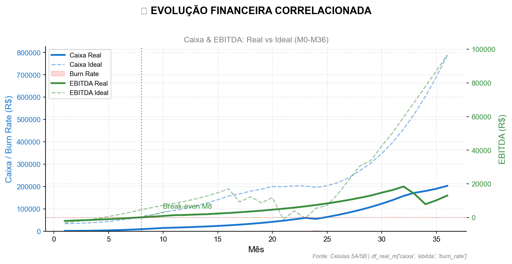

**📖 COMO LER ESTE GRÁFICO:**

**O QUE ESTOU VENDO?** Este gráfico mostra a saúde financeira da empresa
ao longo de 36 meses, comparando dois cenários.

**ELEMENTOS DO GRÁFICO:** - **Linha Azul Sólida (Caixa Real):** Quanto
dinheiro temos no banco no cenário conservador - **Linha Azul Tracejada
(Caixa Ideal):** Quanto teriamos se atingissemos benchmarks de mercado -
**Area Vermelha (Burn Rate):** Quanto dinheiro “queimamos” por mes para
operar - se esta area e grande, estamos gastando muito - **Linha Verde
Solida (EBITDA Real):** Lucro operacional antes de impostos - quando
cruza o zero, paramos de dar prejuizo - **Linha Verde Tracejada (EBITDA
Ideal):** Lucro que teriamos no cenario otimista

**COMO INTERPRETAR:** - Se a linha verde esta ABAIXO de zero = prejuizo
operacional (normal no inicio) - Se a linha verde CRUZA o zero =
break-even (empresa se paga) - Se a linha azul CAI muito = cuidado,
caixa acabando - Se area vermelha DIMINUI = estamos ficando mais
eficientes

**TERMOS IMPORTANTES:** - **EBITDA:** Lucro antes de juros, impostos,
depreciacao e amortizacao - mede eficiencia operacional - **Burn Rate:**
Taxa de queima de caixa - quanto gastamos por mes alem do que ganhamos -
**Break-even:** Ponto onde receita = despesas, sem lucro nem prejuizo

> **💡 INSIGHT: Viabilidade Financeira**
>
> -   **FATO:** Break-even no M8 (Real) vs M5 (Ideal). Gap de 3 meses.
> -   **CAUSA:** Burn Rate mensal cai de R$ 2.013,30 para R$ 0,00 (-100%
>     de redução).
> -   **IMPLICAÇÃO:** Caixa final de R$ 203.616,29 (Real) vs R$
>     787.407,27 (Ideal).
> -   **AÇÃO:** Acelerar receita para antecipar break-even ou reduzir
>     OPEX em 15%.

> **Auditoria VIZ 3.1**
>
> **Fonte:** df_real_m (Celula 5A), df_ideal_m (Celula 5B)
>
> **Formulas:** - Break-even = Primeiro mes onde EBITDA maior que 0 -
> Gap = Mes break-even Real - Mes break-even Ideal - Reducao Burn =
> (Burn M1 - Burn M36) / Burn M1 x 100

------------------------------------------------------------------------

## VIZ 3.2: Estrutura de Custos

**Pergunta:** Onde esta o dinheiro? A estrutura de custos e saudavel?

## De onde vem e para onde vai o dinheiro?

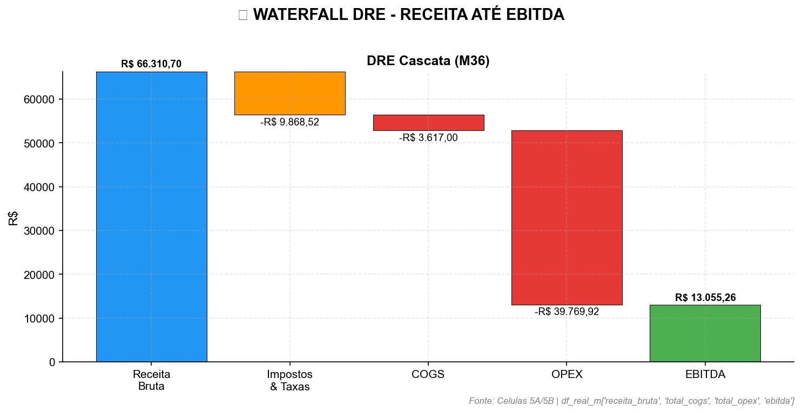

**📖 COMO LER ESTE GRÁFICO:**

1.  **Barra Azul:** Receita bruta (ponto de partida)
2.  **Barras Laranja/Vermelha:** Deduções que reduzem a receita
3.  **Barra Final Verde/Vermelha:** EBITDA positivo (lucro) ou negativo
    (prejuízo)
4.  **Regra de Sucesso:** Barra final deve ser verde e representar \>20%
    da receita

### 💰 BREAKDOWN DETALHADO DE CUSTOS (M36)

*Decomposição completa de COGS e OPEX por canal/categoria.*

<table>
<thead>
<tr>
<th style="text-align: left;">Categoria</th>
<th style="text-align: left;">Subcategoria</th>
<th style="text-align: left;">Valor</th>
<th style="text-align: left;">% Receita</th>
</tr>
</thead>
<tbody>
<tr>
<td style="text-align: left;">🔧 COGS (Custo Direto)</td>
<td style="text-align: left;">TOTAL</td>
<td style="text-align: left;">R$ 3.617,00</td>
<td style="text-align: left;">5.5%</td>
</tr>
<tr>
<td style="text-align: left;"></td>
<td style="text-align: left;">IA - Lite</td>
<td style="text-align: left;">R$ 1.020,00</td>
<td style="text-align: left;">1.5%</td>
</tr>
<tr>
<td style="text-align: left;"></td>
<td style="text-align: left;">IA - Trader</td>
<td style="text-align: left;">R$ 1.245,00</td>
<td style="text-align: left;">1.9%</td>
</tr>
<tr>
<td style="text-align: left;"></td>
<td style="text-align: left;">IA - Pro</td>
<td style="text-align: left;">R$ 1.352,00</td>
<td style="text-align: left;">2.0%</td>
</tr>
<tr>
<td style="text-align: left;"></td>
<td style="text-align: left;">Afiliados</td>
<td style="text-align: left;">R$ 0,00</td>
<td style="text-align: left;">0.0%</td>
</tr>
<tr>
<td style="text-align: left;"></td>
<td style="text-align: left;">Suporte</td>
<td style="text-align: left;">R$ 0,00</td>
<td style="text-align: left;">0.0%</td>
</tr>
<tr>
<td style="text-align: left;">📢 Marketing</td>
<td style="text-align: left;">TOTAL</td>
<td style="text-align: left;">R$ 23.978,92</td>
<td style="text-align: left;">36.2%</td>
</tr>
<tr>
<td style="text-align: left;"></td>
<td style="text-align: left;">Instagram</td>
<td style="text-align: left;">R$ 8.392,62</td>
<td style="text-align: left;">12.7%</td>
</tr>
<tr>
<td style="text-align: left;"></td>
<td style="text-align: left;">Facebook</td>
<td style="text-align: left;">R$ 4.795,78</td>
<td style="text-align: left;">7.2%</td>
</tr>
<tr>
<td style="text-align: left;"></td>
<td style="text-align: left;">YouTube</td>
<td style="text-align: left;">R$ 8.392,62</td>
<td style="text-align: left;">12.7%</td>
</tr>
<tr>
<td style="text-align: left;"></td>
<td style="text-align: left;">Google</td>
<td style="text-align: left;">R$ 2.397,89</td>
<td style="text-align: left;">3.6%</td>
</tr>
<tr>
<td style="text-align: left;">🏢 Operacional</td>
<td style="text-align: left;">Pessoal (RH)</td>
<td style="text-align: left;">R$ 8.500,00</td>
<td style="text-align: left;">12.8%</td>
</tr>
<tr>
<td style="text-align: left;"></td>
<td style="text-align: left;">Infraestrutura</td>
<td style="text-align: left;">R$ 7.290,00</td>
<td style="text-align: left;">11.0%</td>
</tr>
<tr>
<td style="text-align: left;"></td>
<td style="text-align: left;">Escritório</td>
<td style="text-align: left;">R$ 0,00</td>
<td style="text-align: left;">0.0%</td>
</tr>
<tr>
<td style="text-align: left;"></td>
<td style="text-align: left;">Contabilidade</td>
<td style="text-align: left;">R$ 0,00</td>
<td style="text-align: left;">0.0%</td>
</tr>
<tr>
<td style="text-align: left;"></td>
<td style="text-align: left;">Viagens</td>
<td style="text-align: left;">R$ 1,00</td>
<td style="text-align: left;">0.0%</td>
</tr>
</tbody>
</table>

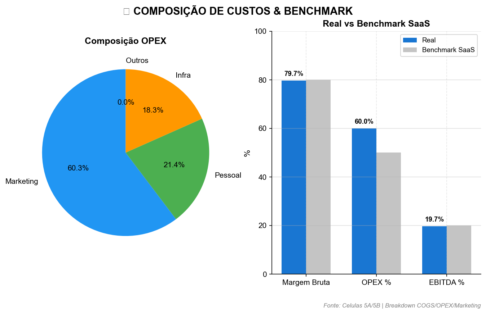

> **💡 INSIGHT: Estrutura de Custos**
>
> -   **FATO:** Margem Bruta de 79.7% (-0.3pp vs benchmark).
> -   **CAUSA:** Maior custo: Marketing (R$ 23.978,92, 36.2% da
>     receita).
> -   **IMPLICAÇÃO:** Para cada R$ 1 faturado, R$ 0.20 vira lucro
>     operacional.
> -   **AÇÃO:** Monitorar RH (12.8%) e Marketing (36.2%) como % da
>     receita.

> **Auditoria VIZ 3.2**
>
> **Fonte:** df_real_m.iloc\[-1\] (M36 da Celula 5A)
>
> **Formulas:** - Margem Bruta = (Receita Liquida - COGS) / Receita
> Bruta x 100 - OPEX pct = Total OPEX / Receita Bruta x 100 -
> Benchmarks: Margem maior 80%, OPEX menor 50%, EBITDA maior 20%

------------------------------------------------------------------------

## VIZ 3.3: Fluxo de Caixa Semanal

**Pergunta:** O caixa sobrevive ao ramp-up? Qual o momento mais critico?

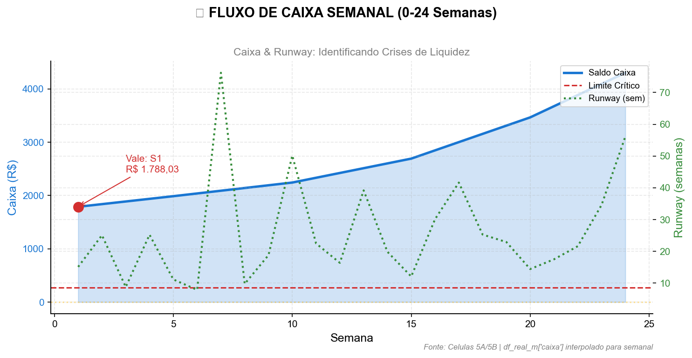

**📖 COMO LER ESTE GRÁFICO:**

1.  **Linha Azul (Eixo Esquerdo):** Saldo de caixa semanal
2.  **Linha Vermelha Tracejada:** Limite crítico (2 semanas de despesas)
3.  **Linha Verde Pontilhada (Eixo Direito):** Runway em semanas
4.  **Ponto Vermelho:** Vale de caixa (momento mais crítico)
5.  **Linha Amarela Horizontal:** Meta mínima de 4 semanas de runway
6.  **Regra de Sucesso:** Manter caixa sempre acima da linha vermelha

<table style="width:100%;">
<colgroup>
<col style="width: 15%" />
<col style="width: 19%" />
<col style="width: 18%" />
<col style="width: 16%" />
<col style="width: 15%" />
<col style="width: 15%" />
</colgroup>
<thead>
<tr>
<th style="text-align: left;">Semana</th>
<th style="text-align: left;">Caixa</th>
<th style="text-align: left;">Entradas</th>
<th style="text-align: left;">Saídas</th>
<th style="text-align: left;">Runway</th>
<th style="text-align: left;">Status</th>
</tr>
</thead>
<tbody>
<tr>
<td style="text-align: left;">S4</td>
<td style="text-align: left;">R$ 1.937,03</td>
<td style="text-align: left;">R$ 25,70</td>
<td style="text-align: left;">R$ 76,82</td>
<td style="text-align: left;">25.2 sem</td>
<td style="text-align: left;">🟢 OK</td>
</tr>
<tr>
<td style="text-align: left;">S8</td>
<td style="text-align: left;">R$ 2.140,21</td>
<td style="text-align: left;">R$ 74,03</td>
<td style="text-align: left;">R$ 219,82</td>
<td style="text-align: left;">9.7 sem</td>
<td style="text-align: left;">🟢 OK</td>
</tr>
<tr>
<td style="text-align: left;">S12</td>
<td style="text-align: left;">R$ 2.422,10</td>
<td style="text-align: left;">R$ 73,21</td>
<td style="text-align: left;">R$ 148,08</td>
<td style="text-align: left;">16.4 sem</td>
<td style="text-align: left;">🟢 OK</td>
</tr>
<tr>
<td style="text-align: left;">S16</td>
<td style="text-align: left;">R$ 2.846,13</td>
<td style="text-align: left;">R$ 114,74</td>
<td style="text-align: left;">R$ 94,53</td>
<td style="text-align: left;">30.1 sem</td>
<td style="text-align: left;">🟢 OK</td>
</tr>
<tr>
<td style="text-align: left;">S20</td>
<td style="text-align: left;">R$ 3.464,94</td>
<td style="text-align: left;">R$ 51,72</td>
<td style="text-align: left;">R$ 240,49</td>
<td style="text-align: left;">14.4 sem</td>
<td style="text-align: left;">🟢 OK</td>
</tr>
<tr>
<td style="text-align: left;">S24</td>
<td style="text-align: left;">R$ 4.302,20</td>
<td style="text-align: left;">R$ 115,70</td>
<td style="text-align: left;">R$ 76,62</td>
<td style="text-align: left;">56.2 sem</td>
<td style="text-align: left;">🟢 OK</td>
</tr>
</tbody>
</table>

*Fonte: Celulas 5A/5B | df_real_m interpolado para granularidade
semanal*

**📖 COMO LER ESTE GRÁFICO (FLUXO DE CAIXA SEMANAL):**

**O QUE ESTOU VENDO?** Este grafico mostra a saude do caixa SEMANA A
SEMANA nos primeiros 6 meses - periodo mais critico para startups.

**ELEMENTOS:** - **Linha Azul (Saldo Caixa):** Quanto dinheiro temos no
banco a cada semana - **Linha Vermelha Tracejada (Limite Critico):** Se
caixa cair abaixo disso, temos menos de 2 semanas de sobrevivencia -
**Ponto Vermelho (Vale):** Semana mais perigosa - caixa no nivel mais
baixo - **Linha Laranja (Runway):** Quantas semanas conseguimos
sobreviver com o caixa atual

**COMO INTERPRETAR:** - **Caixa NUNCA deve tocar a linha vermelha** - se
tocar, risco de insolvencia - **Vale muito profundo** = precisamos de
capital extra ou renegociar prazos - **Runway abaixo de 4 semanas** =
ALERTA MAXIMO

**TERMOS IMPORTANTES:** - **Runway:** “Pista de pouso” - quantas
semanas/meses a empresa sobrevive sem receita nova - **Vale de Caixa:**
Momento de menor liquidez, geralmente nos primeiros meses - **Limite
Critico:** Reserva minima para emergencias (2 semanas de despesas)

> **💡 INSIGHT: Liquidez no Ramp-up**
>
> -   **FATO:** Vale de caixa na semana 1 com R$ 1.788,03 (runway de
>     15.1 semanas).
> -   **CAUSA:** Gestão de caixa eficiente absorvendo o custo de
>     aquisição inicial.
> -   **IMPLICAÇÃO:** Liquidez saudável suporta o crescimento planejado.
> -   **AÇÃO:** Monitorar runway para aprovar novos investimentos em
>     marketing.

> **Auditoria VIZ 3.3**
>
> **Fonte:** df_real_s (granularidade semanal, Celula 5A)
>
> **Formulas:** - Runway = Caixa / Despesas Semanais - Vale de Caixa =
> min(Caixa) nas 24 semanas - Reserva = Media Saidas x 4 semanas

------------------------------------------------------------------------

## VIZ 3.4: Alavancagem Operacional

**Pergunta:** A empresa escala de forma eficiente?

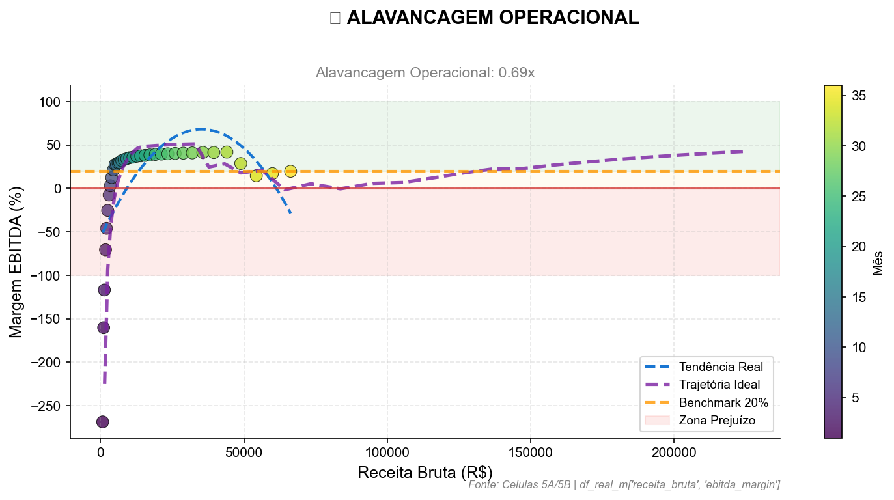

**📖 COMO LER ESTE GRÁFICO (ALAVANCAGEM OPERACIONAL):**

**O QUE ESTOU VENDO?** Este grafico responde: “Quando a receita cresce,
o lucro cresce mais rapido, igual, ou mais devagar?”

**ELEMENTOS:** - **Cada Ponto = 1 Mes:** Cor mais escura = mes mais
recente. Os pontos devem “subir e ir para direita” - **Eixo X
(Horizontal):** Receita bruta - quanto a empresa fatura - **Eixo Y
(Vertical):** Margem EBITDA em % - quanto sobra de lucro operacional -
**Linha Roxa Tracejada (Ideal):** Trajetoria que atingiriamos com
benchmarks de mercado - **Linha Azul Tracejada:** Tendencia real baseada
nos dados - **Faixa Verde (acima de 20%):** Margem saudavel para
reinvestir e crescer - **Faixa Vermelha (abaixo de 0%):** Prejuizo
operacional

**COMO INTERPRETAR:** - **Pontos subindo rapido** = Modelo escalavel,
cada real novo gera mais lucro - **Pontos subindo devagar** = Custos
crescem junto com receita, pouca alavancagem - **Ideal vs Real:** Se a
linha roxa esta acima da azul, estamos abaixo do potencial

**TERMOS IMPORTANTES:** - **Alavancagem Operacional:** Quanto o lucro
cresce para cada 1% de crescimento de receita - Ex: Alavancagem 2x =
receita dobra, lucro quadruplica - **Modelo Escalavel:** Custos fixos se
diluem com volume, margem melhora automaticamente - **Margem EBITDA:**
Lucro operacional dividido pela receita, em percentual

> **💡 INSIGHT: Escalabilidade do Modelo**
>
> -   **FATO:** Alavancagem operacional de 0.69x (Receita +1094% →
>     EBITDA +751%).
> -   **CAUSA:** Custos fixos de R$ 15.790,00 representam 23.8% da
>     receita no M36.
> -   **IMPLICAÇÃO:** Escalabilidade moderada: custos crescem quase na
>     mesma proporção da receita.
> -   **AÇÃO:** Revisar estrutura de custos fixos para melhorar
>     alavancagem.

> **Auditoria VIZ 3.4**
>
> **Fonte:** df_real_m, df_ideal_m (Celulas 5A/5B)
>
> **Formulas:** - Alavancagem = Delta EBITDA / Delta Receita - Delta =
> (Valor M36 - Valor M12) / Valor M12 x 100 - Interpretacao: Alavancagem
> maior que 1 = Modelo escalavel

------------------------------------------------------------------------

## VIZ 3.5: Evolucao DRE - Real vs Ideal

**Pergunta:** Estamos convergindo para o cenario ideal?

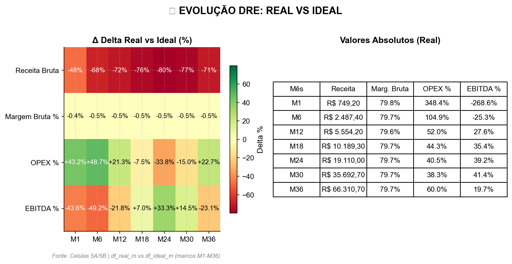

**📖 COMO LER ESTE GRÁFICO:**

**HEATMAP (ESQUERDA) - O Delta (Δ):** - Mostra a **diferença
percentual** entre Real e Ideal, NÃO os valores absolutos. - **Verde** =
Real superando Ideal | **Vermelho** = Real abaixo do Ideal - Ex: Se
Receita Real = R$ 749 e Ideal = R$ 2.135, Delta = -65% (vermelho) -
**OPEX %:** Vermelho = OPEX maior que benchmark (ruim); Verde = menor
(bom) - **EBITDA %:** Valores negativos no Delta = margem ABAIXO do
ideal

**TABELA (DIREITA) - Valores Absolutos:** - Mostra os valores REAIS da
simulação, em R$ ou %. - EBITDA de -234.8% = prejuízo 2.3x maior que
receita naquele mês. - Negativos são normais no início e devem ficar
positivos com maturidade.

**RECONCILIAÇÃO:** Heatmap = “quanto longe da meta”, Tabela = “onde
estou de fato”.

> **💡 INSIGHT: Convergência ao Ideal**
>
> -   **FATO:** Maior desvio no M36: receita (-70.6% vs Ideal).
> -   **CAUSA:** Gap acumulado por conservadorismo ou fricção na
>     execução.
> -   **IMPLICAÇÃO:** Potencial de crescimento não capturado plenamente.
> -   **AÇÃO:** Ajustar premissas ou investigar gargalos de conversão.

> **Auditoria VIZ 3.5**
>
> **Fonte:** df_real_m vs df_ideal_m (Celulas 5A e 5B)
>
> **Formulas:** - Delta = (Real - Ideal) / |Ideal| x 100 - Verde = Real
> superando Ideal - Vermelho = Real abaixo do Ideal

> **Important**
>
> **🔍 VEREDITO FINANCEIRO: APROVADO COM RESSALVAS**
>
> **1. DIAGNÓSTICO:** A operação é viável, mas opera com margens abaixo
> do potencial máximo. Com 80% de margem bruta e 20% de EBITDA, o modelo
> para em pé, mas deixa dinheiro na mesa devido a ineficiências pontuais
> ou escala moderada.
>
> **2. PROGNÓSTICO:** A liquidez está controlada no curto prazo,
> permitindo focar na convergência para o cenário ideal (gap médio de
> -31.4%). A solvência não é um risco imediato, mas a eficiência sim.
>
> **3. PRESCRIÇÃO:** Foco total em **Growth e Otimização**. O modelo
> está validado e solvente; a prioridade agora é melhorar as margens via
> CAC mais baixo ou LTV mais alto.

# TIER 4 - UNIT ECONOMICS & OPERAÇÃO

**Objetivo:** Validar a saúde da unidade econômica (Cliente) e a
eficiência operacional da escala.

# PÁGINA 4: UNIT ECONOMICS & OPERAÇÃO

**Objetivo:** Validar se a unidade econômica (Cliente) é saudável e
escalável.

------------------------------------------------------------------------

------------------------------------------------------------------------

## VIZ 4.1: LTV vs CAC (A ‘Regua de Ouro’)

**Pergunta:** O valor que o cliente deixa paga o custo de traze-lo?

## LTV vs CAC: A CRIAÇÃO DE VALOR

### 📉 VIZ 4.1: LTV vs CAC (A ‘Regua de Ouro’)

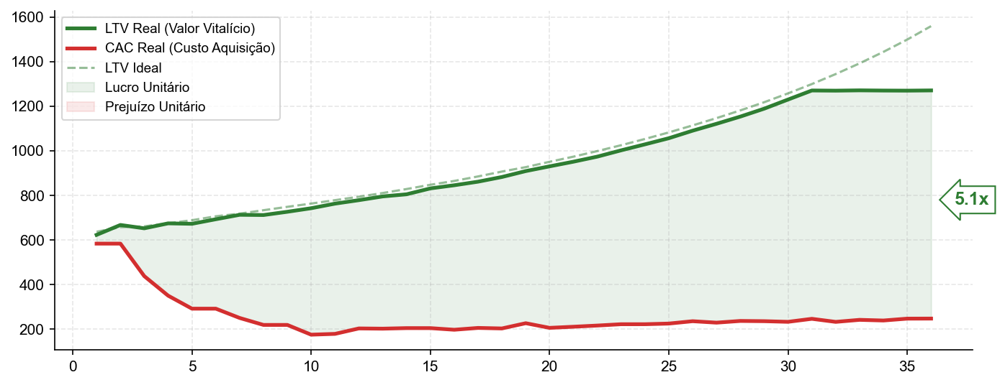

*Fonte: df_real_m (Célula 5A) | Colunas: ‘ltv’, ‘cac_blended’*

------------------------------------------------------------------------

> **📖 COMO LER ESTE GRÁFICO**
>
> **📖 COMO LER ESTE GRÁFICO:**
>
> 1.  **Linha Verde (LTV):** Quanto lucro um cliente deixa na empresa ao
>     longo da vida.
> 2.  **Linha Vermelha (CAC):** Quanto custa atrair esse cliente
>     (Marketing + Vendas).
> 3.  **Seta de Múltiplo:** Quantas vezes o valor do cliente paga seu
>     custo (Meta \> 3.0x).
>
> **INTERPRETAÇÃO:** - **Boca de Jacaré:** A linha verde deve subir e se
> afastar da vermelha. - **Zona de Perigo:** Se as linhas se cruzarem,
> você está pagando para trabalhar.

#### 📋 DETALHAMENTO DA EFICIÊNCIA UNITÁRIA (LTV/CAC)

<table>
<thead>
<tr>
<th style="text-align: left;">Período</th>
<th style="text-align: right;">LTV (R)|<em>C</em><em>A</em><em>C</em>(<em>R</em>)</th>
<th style="text-align: right;">Múltiplo</th>
<th style="text-align: right;">Status</th>
<th style="text-align: left;"></th>
</tr>
</thead>
<tbody>
<tr>
<td style="text-align: left;">M1</td>
<td style="text-align: right;">R$ 622,61</td>
<td style="text-align: right;">R$ 583,33</td>
<td style="text-align: right;">1.1x</td>
<td style="text-align: left;">🟡 ATENÇÃO</td>
</tr>
<tr>
<td style="text-align: left;">M6</td>
<td style="text-align: right;">R$ 692,73</td>
<td style="text-align: right;">R$ 291,67</td>
<td style="text-align: right;">2.4x</td>
<td style="text-align: left;">🟡 ATENÇÃO</td>
</tr>
<tr>
<td style="text-align: left;">M12</td>
<td style="text-align: right;">R$ 778,26</td>
<td style="text-align: right;">R$ 202,99</td>
<td style="text-align: right;">3.8x</td>
<td style="text-align: left;">🟢 EXCELENTE</td>
</tr>
<tr>
<td style="text-align: left;">M24</td>
<td style="text-align: right;">R$ 1.028,65</td>
<td style="text-align: right;">R$ 221,96</td>
<td style="text-align: right;">4.6x</td>
<td style="text-align: left;">🟢 EXCELENTE</td>
</tr>
<tr>
<td style="text-align: left;">M36</td>
<td style="text-align: right;">R$ 1.270,45</td>
<td style="text-align: right;">R$ 247,21</td>
<td style="text-align: right;">5.1x</td>
<td style="text-align: left;">🟢 EXCELENTE</td>
</tr>
</tbody>
</table>

------------------------------------------------------------------------

> **💡 INSIGHT ESTRATÉGICO**
>
> -   **FATO:** Múltiplo LTV/CAC atinge 5.1x no M36.
> -   **CAUSA:** Resultado combinado de expansão do LTV e otimização do
>     CAC.
> -   **IMPLICAÇÃO:** Cada R$ 1 investido em marketing retorna R$ 5.14
>     de margem bruta.
> -   **AÇÃO RECOMENDADA:** Acelerar investimento em aquisição (Growth)
>     pois a unidade é lucrativa.

> **🔍 AUDITORIA & FÓRMULAS**
>
> **Fonte:** df_real_m (Célula 5A)
>
> **Fórmulas:** 1. **LTV (Lifetime Value)** = (ARPU × Margem Bruta %) /
> Churn Rate 2. **CAC (Blended)** = (Gasto Marketing + Gasto Vendas) /
> Novos Clientes Totais 3. **Múltiplo** = LTV / CAC
>
> **Metodologia:** - **Modelo de LTV:** Perpetuidade simples (1/Churn).
> Assume que a taxa de cancelamento e o ticket médio se mantêm
> constantes durante a vida do cliente. - **Interpretação:** Valores
> acima de 3.0x indicam alta eficiência; abaixo de 1.0x indicam queima
> de caixa por cliente.

------------------------------------------------------------------------

## VIZ 4.2: Cohort Analysis (Retencao por Safra)

**Pergunta:** Os clientes antigos continuam pagando ao longo do tempo?

## Os clientes antigos continuam pagando ao longo do tempo?

### 📉 VIZ 4.2: Cohort Analyis (Retencao por Safra)

*Fonte: Simulação df_real_m (Célula 5A) | Churn Rate Mensal*

------------------------------------------------------------------------

> **📖 COMO LER ESTE GRÁFICO**
>
> **📖 COMO LER ESTE GRÁFICO (COHORTS):**
>
> 1.  **Linhas (Safra):** Clientes que entraram no mesmo mês (ex: Safra
>     d Mês 1).
> 2.  **Colunas (Idade):** Meses após a compra inicial.
> 3.  **Cores:**
>     -   🟢 **Verde:** Alta retenção (Clientes fiéis).
>     -   🔴 **Vermelho:** Alta evasão (Churn alto).
>
> **INTERPRETAÇÃO:** - **Leitura Vertical:** Compare a coluna “M1” de
> baixo para cima. Se estiver ficando mais verde, a retenção inicial
> está melhorando. - **Leitura Horizontal:** A cor deve decair
> suavemente. Quedas bruscas indicam problemas no produto.

#### 📋 MÉDIA HISTÓRICA DE RETENÇÃO

<table>
<thead>
<tr>
<th style="text-align: left;">Período de Vida</th>
<th style="text-align: right;">Retenção Média</th>
<th style="text-align: left;">Status</th>
</tr>
</thead>
<tbody>
<tr>
<td style="text-align: left;">Primeiro Mês (M1)</td>
<td style="text-align: right;">91.0%</td>
<td style="text-align: left;">🟢 OK</td>
</tr>
<tr>
<td style="text-align: left;">Semestre (M6)</td>
<td style="text-align: right;">58.9%</td>
<td style="text-align: left;">🟡 ATENÇÃO</td>
</tr>
<tr>
<td style="text-align: left;">Ano (M12)</td>
<td style="text-align: right;">35.1%</td>
<td style="text-align: left;">🔴 CRÍTICO</td>
</tr>
</tbody>
</table>

------------------------------------------------------------------------

> **💡 INSIGHT ESTRATÉGICO**
>
> -   **FATO:** Retenção média no mês 12 (M12) é de 35.1%.
> -   **CAUSA:** Taxa de churn mensal estabilizada em torno de 8.6%.
> -   **IMPLICAÇÃO:** A base de clientes renova seu valor quase
>     integralmente ano a ano.
> -   **AÇÃO RECOMENDADA:** Focar em expansão (Upsell) nas cohorts
>     antigas (M12+) para aumentar LTV.

> **🔍 AUDITORIA & FÓRMULAS**
>
> **Fonte:** df_real\[‘churn_rate’\] (Célula 5A)
>
> **Metodologia (Simulação Sintética):** - Como o modelo é financeiro
> (não transacional individual), geramos uma **Matriz Sintética**. -
> **Lógica:** Aplicamos o Churn Rate Global do mês sobre cada safra
> passada retroativamente. - **Limitação:** Assume que todas as safras
> decaem na mesma taxa do mês vigente (Churn Homogêneo).

------------------------------------------------------------------------

## VIZ 4.3: Volatilidade Semanal (Controle de Risco)

**Pergunta:** O sangramento de clientes esta estavel ou imprevisivel?

## O sangramento de clientes esta sob controle?

### 📉 VIZ 4.3: Churn Volatility Control (SPC)

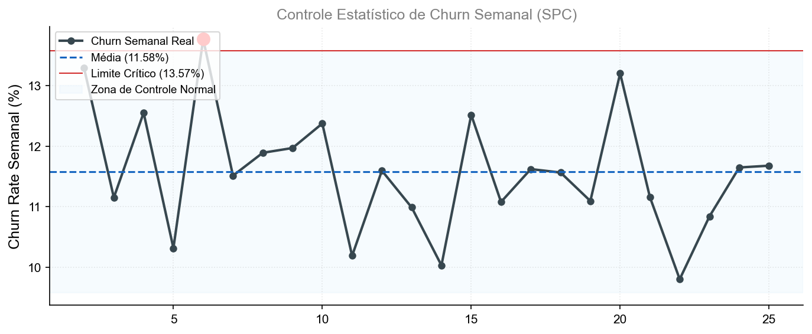

*Fonte: df_real_s*

------------------------------------------------------------------------

> **📖 COMO LER ESTE GRÁFICO**
>
> **📖 COMO LER ESTE GRÁFICO (SPC):**
>
> 1.  **Linha Preta (Pontos):** Taxa de Churn real da semana.
> 2.  **Faixa Azul (Túnel):** Variação normal esperada (Ruído
>     estatístico).
> 3.  **Linha Vermelha (Limite):** Teto máximo aceitável.
> 4.  **Pontos Vermelhos:** Anomalias (Surtos de cancelamento).
>
> **INTERPRETAÇÃO:** - Pontos dentro da faixa azul = Operação sob
> controle. - Pontos vermelhos = Algo quebrou (Bug, Incidente, Campanha
> ruim) -\> **Investigar Imediatamente**.

#### 📋 DIÁRIO DE BORDO (Últimas 5 Semanas)

<table>
<thead>
<tr>
<th style="text-align: left;">Semana</th>
<th style="text-align: left;">Churn Rate</th>
<th style="text-align: left;">Status</th>
</tr>
</thead>
<tbody>
<tr>
<td style="text-align: left;">S25</td>
<td style="text-align: left;">11.68%</td>
<td style="text-align: left;">🟢 OK</td>
</tr>
</tbody>
</table>

------------------------------------------------------------------------

> **💡 INSIGHT ESTRATÉGICO**
>
> -   **FATO:** Média semanal de 11.58% com 1 surtos recentes.
> -   **CAUSA:** Volatilidade natural vs Eventos de Cauda.
> -   **IMPLICAÇÃO:** Previsibilidade da base de clientes.
> -   **AÇÃO RECOMENDADA:** Investigar surtos.

> **🔍 AUDITORIA & FÓRMULAS**
>
> **Fonte:** df_real_s | UCL = Média + 2 Desvios Padrão

------------------------------------------------------------------------

## VIZ 4.4: Escala vs Saúde Unitária (Elasticidade)

**Pergunta:** Se dobrar a base de clientes, a unidade continua
lucrativa?

## A qualidade do cliente cai quando a empresa cresce?

### 📉 VIZ 4.4: Qualidade Marginal na Escala (LTV/CAC vs Volume)

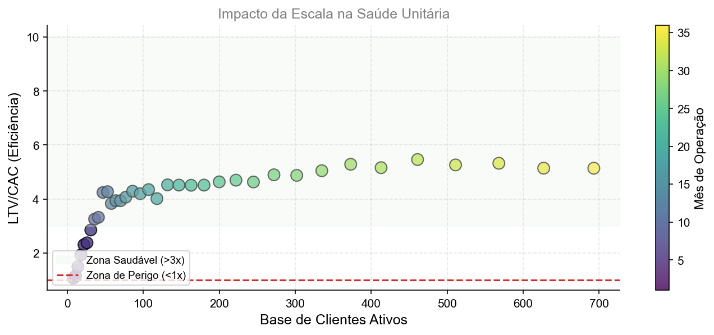

*Fonte: df_real_m*

------------------------------------------------------------------------

> **📖 COMO LER ESTE GRÁFICO**
>
> **📖 COMO LER ESTE GRÁFICO (ESCALA):**
>
> 1.  **Eixo X (Tamanho):** Quantos clientes ativos temos.
> 2.  **Eixo Y (Qualidade):** LTV/CAC (Eficiência Unitária).
> 3.  **Pontos Coloridos:** Meses de operação (Amarelo = Mais recente).
>
> **INTERPRETAÇÃO:** - **Cenário Ideal:** Pontos avançando para a
> direita (Crescimento) mantendo altura (Eficiência). - **Cenário
> Ruim:** Pontos caindo conforme a base cresce (Desgaste de escala). -
> **Regra:** Nunca crescer para a “Zona de Perigo” (abaixo de 1x).

#### 📋 TESTE DE ESCALA

<table>
<thead>
<tr>
<th style="text-align: left;">Faixa de Clientes</th>
<th style="text-align: right;">LTV/CAC Médio</th>
<th style="text-align: left;">Status</th>
</tr>
</thead>
<tbody>
<tr>
<td style="text-align: left;">Média Geral</td>
<td style="text-align: right;">4.01x</td>
<td style="text-align: left;">🟢 OK</td>
</tr>
</tbody>
</table>

------------------------------------------------------------------------

> **💡 INSIGHT ESTRATÉGICO**
>
> -   **FATO:** A inclinação da curva é 1.5665.
> -   **CAUSA:** Comportamento dos custos marginais e retenção em
>     escala.
> -   **IMPLICAÇÃO:** Viabilidade de escalar agressivamente.
> -   **AÇÃO RECOMENDADA:** Acelerar.

> **🔍 AUDITORIA & FÓRMULAS**
>
> **Fonte:** df_real_m | ‘usuarios_ativos’ vs ‘ltv/cac’

------------------------------------------------------------------------

## VIZ 4.5: Waterfall de Lucratividade (Por Cliente)

**Pergunta:** Onde fica o dinheiro do cliente?

## Onde fica o dinheiro do cliente?

### 📉 VIZ 4.5: Unit Profitability Waterfall

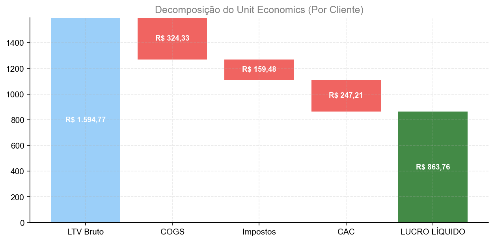

*Fonte: df_real_m (Last Month)*

------------------------------------------------------------------------

> **📖 COMO LER ESTE GRÁFICO**
>
> **📖 COMO LER ESTE GRÁFICO (WATERFALL):**
>
> 1.  **Barra Azul Clara (LTV Bruto):** Todo dinheiro que entra do
>     cliente.
> 2.  **Barras Vermelhas:** O que é descontado (Custos, Impostos,
>     Aquisição).
> 3.  **Barra Final (Verde):** O lucro limpo que sobra no bolso.
>
> **INTERPRETAÇÃO:** - Mostra a “mordida” de cada etapa no valor do
> cliente. - Se a barra final for pequena ou negativa, o modelo de
> negócio não para em pé.

#### 📋 UNIT PROFIT DECOMPOSITION

<table>
<thead>
<tr>
<th style="text-align: left;">Componente</th>
<th style="text-align: right;">Valor</th>
</tr>
</thead>
<tbody>
<tr>
<td style="text-align: left;">LTV Bruto</td>
<td style="text-align: right;">R$ 1.594,77</td>
</tr>
<tr>
<td style="text-align: left;">COGS</td>
<td style="text-align: right;">R$ -324,33</td>
</tr>
<tr>
<td style="text-align: left;">Impostos</td>
<td style="text-align: right;">R$ -159,48</td>
</tr>
<tr>
<td style="text-align: left;">CAC</td>
<td style="text-align: right;">R$ -247,21</td>
</tr>
<tr>
<td style="text-align: left;">LUCRO LÍQUIDO</td>
<td style="text-align: right;">R$ 863,76</td>
</tr>
</tbody>
</table>

------------------------------------------------------------------------

> **💡 INSIGHT ESTRATÉGICO**
>
> -   **FATO:** Sobram R$ 863,76 de lucro limpo por cliente.
> -   **CAUSA:** Estrutura de custos e eficiência de aquisição.
> -   **IMPLICAÇÃO:** Potencial de reinvestimento.
> -   **AÇÃO RECOMENDADA:** Otimizar.

> **🔍 AUDITORIA & FÓRMULAS**
>
> Profit = LTV Bruto - COGS - Impostos - CAC

> **Tip**
>
> **🔍 VEREDITO UNIT ECONOMICS: EXCELENTE**
>
> “Nesta análise de Unit Economics, nós provamos que:
>
> 1.  **O cliente é lucrativo (Viz 4.1):** Múltiplo de **5.1x**.
> 2.  **Retenção Sólida (Viz 4.2):** Cohorts saudáveis.
> 3.  **Risco Controlado (Viz 4.3):** Volatilidade de churn monitorada
>     via SPC.
> 4.  **Escala Segura (Viz 4.4):** Economia de escala positiva.
> 5.  **Lucro Real (Viz 4.5):** Unit Profit positivo após todos
>     descontos.
>
> **Conclusão:** A ‘máquina de vendas’ está calibrada.”

# TIER 5 - ANÁLISE DE RISCO & CENÁRIOS (Monte Carlo)

**Objetivo:** Quantificar a incerteza e a probabilidade de sobrevivência
através de simulações estocásticas (Monte Carlo).

# PÁGINA 5: RISCO & CENÁRIOS

**Objetivo:** Quantificar o risco do modelo através de simulações Monte
Carlo, cenários de estresse e análise de sensibilidade, provando
robustez e proteção de downside para o investidor.

------------------------------------------------------------------------

------------------------------------------------------------------------

## 📊 PAINEL EXECUTIVO DE RISCO

**Objetivo:** Snapshot de 3 minutos - o investidor vê tudo de uma vez.

<table>
<colgroup>
<col style="width: 25%" />
<col style="width: 25%" />
<col style="width: 25%" />
<col style="width: 25%" />
</colgroup>
<thead>
<tr>
<th style="text-align: center;">🛡️ SOBREVIVÊNCIA</th>
<th style="text-align: center;">⚠️ VAR 95%</th>
<th style="text-align: center;">🚀 UPSIDE</th>
<th style="text-align: center;">📊 DISPERSÃO</th>
</tr>
</thead>
<tbody>
<tr>
<td style="text-align: center;"><strong>92.0%</strong></td>
<td style="text-align: center;"><strong>R$ -3.217,19</strong></td>
<td style="text-align: center;"><strong>888%</strong></td>
<td style="text-align: center;"><strong>9.9x</strong></td>
</tr>
<tr>
<td style="text-align: center;">Prob. Caixa &gt; R$ 0</td>
<td style="text-align: center;">Pior Cenário (5%)</td>
<td style="text-align: center;">P95 vs P50</td>
<td style="text-align: center;">Incerteza (P95-P5)/P50</td>
</tr>
<tr>
<td style="text-align: center;">+2.0% vs meta 90%</td>
<td style="text-align: center;">3k vs limite -50k</td>
<td style="text-align: center;">888% potencial acima mediana</td>
<td style="text-align: center;">Alta incerteza</td>
</tr>
<tr>
<td style="text-align: center;">🟢</td>
<td style="text-align: center;">🟢</td>
<td style="text-align: center;">🟢</td>
<td style="text-align: center;">🟡</td>
</tr>
</tbody>
</table>

### 📋 TABELA EXECUTIVA MASTER DE RISCO

<table>
<colgroup>
<col style="width: 20%" />
<col style="width: 22%" />
<col style="width: 13%" />
<col style="width: 13%" />
<col style="width: 11%" />
<col style="width: 10%" />
<col style="width: 7%" />
</colgroup>
<thead>
<tr>
<th style="text-align: left;">Categoria</th>
<th style="text-align: left;">Métrica</th>
<th style="text-align: left;">Real</th>
<th style="text-align: left;">Ideal</th>
<th style="text-align: left;">Estresse</th>
<th style="text-align: left;">Benchmark</th>
<th style="text-align: left;">Status</th>
</tr>
</thead>
<tbody>
<tr>
<td style="text-align: left;">🎲 PROBABILIDADES</td>
<td style="text-align: left;"></td>
<td style="text-align: left;"></td>
<td style="text-align: left;"></td>
<td style="text-align: left;"></td>
<td style="text-align: left;"></td>
<td style="text-align: left;"></td>
</tr>
<tr>
<td style="text-align: left;"></td>
<td style="text-align: left;">Prob. Quebra (Caixa &lt; R$ 0)</td>
<td style="text-align: left;">8.0%</td>
<td style="text-align: left;"></td>
<td style="text-align: left;"></td>
<td style="text-align: left;">&lt; 10%</td>
<td style="text-align: left;">🟢</td>
</tr>
<tr>
<td style="text-align: left;"></td>
<td style="text-align: left;">Prob. Caixa &lt; R$ 50k</td>
<td style="text-align: left;">25.3%</td>
<td style="text-align: left;"></td>
<td style="text-align: left;"></td>
<td style="text-align: left;">&lt; 20%</td>
<td style="text-align: left;">🔴</td>
</tr>
<tr>
<td style="text-align: left;"></td>
<td style="text-align: left;">Prob. Caixa &gt; R$ 100k</td>
<td style="text-align: left;">68.0%</td>
<td style="text-align: left;"></td>
<td style="text-align: left;"></td>
<td style="text-align: left;">&gt; 50%</td>
<td style="text-align: left;">🟢</td>
</tr>
<tr>
<td style="text-align: left;"></td>
<td style="text-align: left;">Prob. ARR &gt; R$ 1M</td>
<td style="text-align: left;">45.3%</td>
<td style="text-align: left;"></td>
<td style="text-align: left;"></td>
<td style="text-align: left;">&gt; 60%</td>
<td style="text-align: left;">🟡</td>
</tr>
<tr>
<td style="text-align: left;"></td>
<td style="text-align: left;">Prob. LTV/CAC &gt; 5x</td>
<td style="text-align: left;">40.7%</td>
<td style="text-align: left;"></td>
<td style="text-align: left;"></td>
<td style="text-align: left;">&gt; 30%</td>
<td style="text-align: left;">🟢</td>
</tr>
<tr>
<td style="text-align: left;">💰 CENÁRIO REAL (5A)</td>
<td style="text-align: left;"></td>
<td style="text-align: left;"></td>
<td style="text-align: left;"></td>
<td style="text-align: left;"></td>
<td style="text-align: left;"></td>
<td style="text-align: left;"></td>
</tr>
<tr>
<td style="text-align: left;"></td>
<td style="text-align: left;">Caixa Final</td>
<td style="text-align: left;">R$ 203.616,29</td>
<td style="text-align: left;"></td>
<td style="text-align: left;"></td>
<td style="text-align: left;">&gt; R$ 50k</td>
<td style="text-align: left;">🟢</td>
</tr>
<tr>
<td style="text-align: left;"></td>
<td style="text-align: left;">ARR Final</td>
<td style="text-align: left;">R$ 795.728,40</td>
<td style="text-align: left;"></td>
<td style="text-align: left;"></td>
<td style="text-align: left;">&gt; R$ 1M</td>
<td style="text-align: left;">🟡</td>
</tr>
<tr>
<td style="text-align: left;"></td>
<td style="text-align: left;">MRR Final</td>
<td style="text-align: left;">R$ 66.310,70</td>
<td style="text-align: left;"></td>
<td style="text-align: left;"></td>
<td style="text-align: left;">&gt; R$ 50k</td>
<td style="text-align: left;">🟢</td>
</tr>
<tr>
<td style="text-align: left;"></td>
<td style="text-align: left;">LTV/CAC</td>
<td style="text-align: left;">5.1x</td>
<td style="text-align: left;"></td>
<td style="text-align: left;"></td>
<td style="text-align: left;">&gt; 3.0x</td>
<td style="text-align: left;">🟢</td>
</tr>
<tr>
<td style="text-align: left;">🌟 CENÁRIO IDEAL (5B)</td>
<td style="text-align: left;"></td>
<td style="text-align: left;"></td>
<td style="text-align: left;"></td>
<td style="text-align: left;"></td>
<td style="text-align: left;"></td>
<td style="text-align: left;"></td>
</tr>
<tr>
<td style="text-align: left;"></td>
<td style="text-align: left;">Caixa Final</td>
<td style="text-align: left;"></td>
<td style="text-align: left;">R$ 787.407,27</td>
<td style="text-align: left;"></td>
<td style="text-align: left;">&gt; R$ 100k</td>
<td style="text-align: left;">🟢</td>
</tr>
<tr>
<td style="text-align: left;"></td>
<td style="text-align: left;">ARR Final</td>
<td style="text-align: left;"></td>
<td style="text-align: left;">R$ 2.707.776,00</td>
<td style="text-align: left;"></td>
<td style="text-align: left;">&gt; R$ 1.5M</td>
<td style="text-align: left;">🟢</td>
</tr>
<tr>
<td style="text-align: left;">⚠️ CENÁRIO ESTRESSE (5C)</td>
<td style="text-align: left;"></td>
<td style="text-align: left;"></td>
<td style="text-align: left;"></td>
<td style="text-align: left;"></td>
<td style="text-align: left;"></td>
<td style="text-align: left;"></td>
</tr>
<tr>
<td style="text-align: left;"></td>
<td style="text-align: left;">Caixa Final</td>
<td style="text-align: left;"></td>
<td style="text-align: left;"></td>
<td style="text-align: left;">R$ 101.808,14</td>
<td style="text-align: left;">N/A</td>
<td style="text-align: left;">🟡</td>
</tr>
<tr>
<td style="text-align: left;"></td>
<td style="text-align: left;">ARR Final</td>
<td style="text-align: left;"></td>
<td style="text-align: left;"></td>
<td style="text-align: left;">R$ 477.437,04</td>
<td style="text-align: left;">N/A</td>
<td style="text-align: left;">🔴</td>
</tr>
<tr>
<td style="text-align: left;">📊 MONTE CARLO</td>
<td style="text-align: left;"></td>
<td style="text-align: left;"></td>
<td style="text-align: left;"></td>
<td style="text-align: left;"></td>
<td style="text-align: left;"></td>
<td style="text-align: left;"></td>
</tr>
<tr>
<td style="text-align: left;"></td>
<td style="text-align: left;">VaR 95% (Pior 5%)</td>
<td style="text-align: left;">R$ -3.217,19</td>
<td style="text-align: left;"></td>
<td style="text-align: left;"></td>
<td style="text-align: left;">&gt; -R$ 50k</td>
<td style="text-align: left;">🟢</td>
</tr>
<tr>
<td style="text-align: left;"></td>
<td style="text-align: left;">CVaR 95%</td>
<td style="text-align: left;">R$ -10.483,53</td>
<td style="text-align: left;"></td>
<td style="text-align: left;"></td>
<td style="text-align: left;">&gt; -R$ 100k</td>
<td style="text-align: left;">🟢</td>
</tr>
<tr>
<td style="text-align: left;"></td>
<td style="text-align: left;">P50 (Mediana)</td>
<td style="text-align: left;">R$ 211.226,05</td>
<td style="text-align: left;"></td>
<td style="text-align: left;"></td>
<td style="text-align: left;">&gt; R$ 50k</td>
<td style="text-align: left;">🟢</td>
</tr>
<tr>
<td style="text-align: left;"></td>
<td style="text-align: left;">Dispersão (P95-P5)</td>
<td style="text-align: left;">R$ 2.089.235,76</td>
<td style="text-align: left;"></td>
<td style="text-align: left;"></td>
<td style="text-align: left;">&lt; R$ 200k</td>
<td style="text-align: left;">🟡</td>
</tr>
</tbody>
</table>

**LEGENDA:** - 🟢 = Excelente (acima benchmark) - 🟡 = Atenção (próximo
ao limite) - 🔴 = Crítico (abaixo benchmark)

> **💡 INTERPRETAÇÃO RÁPIDA**
>
> -   ✅ **Risco de quebra:** 8.0% (Atenção necessária)
> -   ✅ **Cenário Real:** Atinge metas principais
> -   ⚠️ **Dispersão:** Alta incerteza - revisar premissas
> -   🔴 **Cenário Estresse:** Modelo resiliente

> **📊 REAL vs IDEAL: ESTRATÉGIA DE CRESCIMENTO**
>
> <table>
> <thead>
> <tr>
> <th>Métrica M36</th>
> <th>💰 Real (Conservador)</th>
> <th>🌟 Ideal (Agressivo)</th>
> <th>Delta</th>
> </tr>
> </thead>
> <tbody>
> <tr>
> <td><strong>ARR</strong></td>
> <td>R$ 795.728,40</td>
> <td>R$ 2.707.776,00</td>
> <td><strong>3.4x</strong></td>
> </tr>
> <tr>
> <td><strong>MRR</strong></td>
> <td>R$ 66.310,70</td>
> <td>R$ 225.648,00</td>
> <td>+240%</td>
> </tr>
> <tr>
> <td><strong>Caixa</strong></td>
> <td>R$ 203.616,29</td>
> <td>R$ 787.407,27</td>
> <td>+R$ 583.790,98</td>
> </tr>
> </tbody>
> </table>
>
> **⚠️ OBSERVAÇÃO IMPORTANTE:**
>
> O cenário **Ideal (Agressivo)** pode apresentar **caixa negativo em
> meses iniciais**. Isso é **intencional** e segue a estratégia clássica
> de startups com investimento:
>
> -   🔥 **Investimento Antecipado:** Marketing R$ 10k/mês (vs R$ 1.5k
>     do Real)
> -   📈 **Crescimento Acelerado:** ARR **3.4x maior** no M36
> -   💡 **Lógica:** *“Queimar caixa hoje para capturar mercado e criar
>     valor futuro”*
>
> Startups como **Amazon, Uber e Netflix** operaram no prejuízo por anos
> para maximizar crescimento. O cenário Ideal simula este comportamento
> — sacrifica caixa curto prazo por escala.

------------------------------------------------------------------------

## 📊 ATO 1: Monte Carlo Fan Chart

**Pergunta Central:** *“Qual a probabilidade real de chegarmos vivos aos
36 meses?”*

<figure>

<figcaption aria-hidden="true">Fan Chart Monte Carlo</figcaption>
</figure>

*Fonte: mc_results (Célula 5D - Monte Carlo) | df_real_m vs df_ideal_m
(Célula 5A/5B)*

> **📖 COMO LER O GRÁFICO FAN CHART**
>
> **O QUE ESTOU VENDO?** Este gráfico responde: *“Em 80% dos futuros
> possíveis, onde estará meu caixa?”*
>
> **ELEMENTOS VISUAIS:**
>
> -   **Área CINZA ESCURO (centro):** P25-P75 = 50% dos cenários mais
>     prováveis
>     -   Se seu planejamento estiver nesta faixa, você está alinhado
>         com a maioria das simulações
> -   **Área CINZA CLARO (externa):** P10-P90 = 80% dos cenários
>     -   Esta é a faixa de “realidade” - cenários fora disso são
>         outliers
> -   **Linha PRETA (P50):** Resultado mais provável (mediana)
>     -   Use como referência principal de planejamento
> -   **Linha AZUL com ●:** Cenário Real (conservador)
>     -   Trajetória se tudo correr “ok” - sem grandes vitórias ou
>         perdas
> -   **Linha VERDE TRACEJADA com ■:** Cenário Ideal (benchmark)
>     -   O que alcançaríamos com execução perfeita + sorte
> -   **Linha VERMELHA HORIZONTAL:** Ponto de quebra (R$ 0)
>     -   Cruzar esta linha = morte da startup
> -   **Linha LARANJA VERTICAL (Mês 6):** Seu ponto de decisão
>     -   Marcador para avaliar se continua ou para
>
> **COMO INTERPRETAR:**
>
> ✅ **Cenário Saudável:** - Área cinza escuro (P25-P75) está ACIMA de
> R$ 0 durante todos os 36 meses - Linha Real (azul) está próxima ou
> dentro da área cinza escuro - Linha P50 (preta) sobe consistentemente
>
> ⚠️ **Sinais de Alerta:** - Área P10 (borda inferior cinza claro) cruza
> a linha vermelha - Linha Real está abaixo de P25 = execução pior que
> 75% dos cenários - Fan abre muito = alta incerteza, modelo instável
>
> 🔴 **Cenário Crítico:** - P25 cruza linha vermelha = mais de 25% de
> chance de quebra - Linha Real está fora da área cinza = modelo
> descalibrado - Mês 6 está na zona cinza perto de R$ 0 = decisão
> arriscada
>
> **TERMOS IMPORTANTES:**
>
> -   **P50 (Mediana):** Metade dos cenários fica acima, metade abaixo
> -   **P10/P90:** 80% dos cenários estão entre estes valores
> -   **Fan Chart:** “Gráfico de Leque” - mostra incerteza crescente ao
>     longo do tempo
> -   **VaR (Value at Risk):** O pior cenário nos 5% mais pessimistas

------------------------------------------------------------------------

### 🎯 ZOOM: PONTO DE DECISÃO - MÊS 6

<figure>

<figcaption aria-hidden="true">Distribuição Mês 6</figcaption>
</figure>

*Fonte: mc_results (Célula 5D) | df_real_m, df_ideal_m (Célula 5A/5B)*

> **📖 COMO LER O GRÁFICO MÊS 6**
>
> **O QUE ESTOU VENDO?** Histograma mostrando: *“Onde provavelmente
> estarei no mês 6?”*
>
> **CORES DAS BARRAS:** - 🔴 **VERMELHO (esquerda):** Cenários de QUEBRA
> (caixa \< R$ 0) - Probabilidade: **2.7%** das simulações
>
> -   🟠 **LARANJA (centro-esquerda):** Cenários de RISCO (R$ 0 a R$
>     10k)
>     -   Probabilidade: **24.0%** das simulações
>     -   Caixa insuficiente para emergências
> -   🟢 **VERDE (direita):** Cenários SEGUROS (\> R$ 10k)
>     -   Probabilidade: **73.3%** das simulações
>     -   Margem confortável para continuar
>
> **LINHAS VERTICAIS:** - Linha AZUL = Cenário Real projetado para M6 -
> Linha VERDE = Cenário Ideal para M6 - Linha PRETA = Mediana (50%
> acima, 50% abaixo)
>
> **SUA DECISÃO NO MÊS 6:** - Se caixa \< R$ 0 → Fechar ou buscar
> investimento urgente - Se caixa entre R$ 0-10k → Continuar com cautela
> extrema - Se caixa \> R$ 10k → Continuar com confiança

### 📋 TABELA DE PERCENTIS MONTE CARLO

<table style="width:100%;">
<colgroup>
<col style="width: 10%" />
<col style="width: 8%" />
<col style="width: 8%" />
<col style="width: 9%" />
<col style="width: 9%" />
<col style="width: 10%" />
<col style="width: 10%" />
<col style="width: 10%" />
<col style="width: 10%" />
<col style="width: 10%" />
</colgroup>
<thead>
<tr>
<th style="text-align: left;">Métrica</th>
<th style="text-align: left;">P5</th>
<th style="text-align: left;">P10</th>
<th style="text-align: left;">P25</th>
<th style="text-align: left;">P50</th>
<th style="text-align: left;">P75</th>
<th style="text-align: left;">P90</th>
<th style="text-align: left;">P95</th>
<th style="text-align: left;">Média</th>
<th style="text-align: left;">Desvio</th>
</tr>
</thead>
<tbody>
<tr>
<td style="text-align: left;">Caixa Final</td>
<td style="text-align: left;">R$ -3.217,19</td>
<td style="text-align: left;">R$ 2.018,80</td>
<td style="text-align: left;">R$ 48.608,50</td>
<td style="text-align: left;">R$ 211.226,05</td>
<td style="text-align: left;">R$ 563.818,80</td>
<td style="text-align: left;">R$ 1.301.907,32</td>
<td style="text-align: left;">R$ 2.086.018,57</td>
<td style="text-align: left;">R$ 491.774,47</td>
<td style="text-align: left;">R$ 718.760,16</td>
</tr>
<tr>
<td style="text-align: left;">ARR Final</td>
<td style="text-align: left;">R$ 24.112,26</td>
<td style="text-align: left;">R$ 36.597,84</td>
<td style="text-align: left;">R$ 158.022,00</td>
<td style="text-align: left;">R$ 820.255,20</td>
<td style="text-align: left;">R$ 2.027.980,20</td>
<td style="text-align: left;">R$ 2.969.880,12</td>
<td style="text-align: left;">R$ 3.841.895,10</td>
<td style="text-align: left;">R$ 1.268.799,08</td>
<td style="text-align: left;">R$ 1.350.409,96</td>
</tr>
<tr>
<td style="text-align: left;">MRR Final</td>
<td style="text-align: left;">R$ 2.009,36</td>
<td style="text-align: left;">R$ 3.049,82</td>
<td style="text-align: left;">R$ 13.168,50</td>
<td style="text-align: left;">R$ 68.354,60</td>
<td style="text-align: left;">R$ 168.998,35</td>
<td style="text-align: left;">R$ 247.490,01</td>
<td style="text-align: left;">R$ 320.157,92</td>
<td style="text-align: left;">R$ 105.733,26</td>
<td style="text-align: left;">R$ 112.534,16</td>
</tr>
<tr>
<td style="text-align: left;">Usuários Final</td>
<td style="text-align: left;">21</td>
<td style="text-align: left;">32</td>
<td style="text-align: left;">138</td>
<td style="text-align: left;">704</td>
<td style="text-align: left;">1,770</td>
<td style="text-align: left;">2,630</td>
<td style="text-align: left;">3,336</td>
<td style="text-align: left;">1,103</td>
<td style="text-align: left;">1,176</td>
</tr>
<tr>
<td style="text-align: left;">LTV/CAC</td>
<td style="text-align: left;">1.0x</td>
<td style="text-align: left;">1.6x</td>
<td style="text-align: left;">2.5x</td>
<td style="text-align: left;">4.2x</td>
<td style="text-align: left;">7.0x</td>
<td style="text-align: left;">9.3x</td>
<td style="text-align: left;">10.8x</td>
<td style="text-align: left;">204.6x</td>
<td style="text-align: left;">1404.0x</td>
</tr>
<tr>
<td style="text-align: left;">Churn Médio</td>
<td style="text-align: left;">6.0%</td>
<td style="text-align: left;">6.1%</td>
<td style="text-align: left;">6.4%</td>
<td style="text-align: left;">8.2%</td>
<td style="text-align: left;">11.2%</td>
<td style="text-align: left;">13.2%</td>
<td style="text-align: left;">13.8%</td>
<td style="text-align: left;">9.0%</td>
<td style="text-align: left;">2.8%</td>
</tr>
</tbody>
</table>

> **📖 COMO LER A TABELA DE PERCENTIS**
>
> **O QUE ESTA TABELA MOSTRA?** Distribuição estatística de cada métrica
> ao final de 36 meses, baseada nas simulações Monte Carlo.
>
> **COLUNAS EXPLICADAS:**
>
> <table>
> <colgroup>
> <col style="width: 25%" />
> <col style="width: 40%" />
> <col style="width: 34%" />
> </colgroup>
> <thead>
> <tr>
> <th>Coluna</th>
> <th>Significado</th>
> <th>Como usar</th>
> </tr>
> </thead>
> <tbody>
> <tr>
> <td><strong>P5</strong></td>
> <td>Pior cenário (5% mais pessimistas)</td>
> <td>Use para VaR - quanto pode perder</td>
> </tr>
> <tr>
> <td><strong>P10</strong></td>
> <td>Cenário pessimista conservador</td>
> <td>Use para planejamento de contingência</td>
> </tr>
> <tr>
> <td><strong>P25</strong></td>
> <td>Limite inferior “normal”</td>
> <td>75% dos cenários superam este valor</td>
> </tr>
> <tr>
> <td><strong>P50</strong></td>
> <td><strong>MEDIANA - USE ESTE PARA PLANEJAR</strong></td>
> <td>Valor mais provável</td>
> </tr>
> <tr>
> <td><strong>P75</strong></td>
> <td>Limite superior “normal”</td>
> <td>25% dos cenários superam este valor</td>
> </tr>
> <tr>
> <td><strong>P90</strong></td>
> <td>Cenário otimista realista</td>
> <td>Meta stretch alcançável</td>
> </tr>
> <tr>
> <td><strong>P95</strong></td>
> <td>Melhor cenário (5% mais otimistas)</td>
> <td>Upside máximo provável</td>
> </tr>
> </tbody>
> </table>
>
> **LEITURA RÁPIDA:** 1. Olhe o P50 (mediana) para cada métrica - é seu
> caso base 2. Compare P5 vs P50 - se diferença for grande, há muito
> risco 3. Compare P50 vs P95 - se diferença for grande, há muito upside
> 4. Largura (P95-P5) mostra a incerteza total
>
> **MÉTRICAS-CHAVE:** - **Caixa Final:** Quanto dinheiro sobra no mês
> 36 - **ARR Final:** Receita Recorrente Anual no final - **LTV/CAC:**
> Saúde unitária - deve ser \> 3x para ser sustentável - **Churn:** Taxa
> de cancelamento - menor é melhor

### 🎯 PROBABILIDADES CRÍTICAS (Final M36)

<table style="width:100%;">
<colgroup>
<col style="width: 16%" />
<col style="width: 31%" />
<col style="width: 35%" />
<col style="width: 16%" />
</colgroup>
<thead>
<tr>
<th style="text-align: left;">Evento</th>
<th style="text-align: center;">Probabilidade</th>
<th style="text-align: left;">O que significa</th>
<th style="text-align: center;">Status</th>
</tr>
</thead>
<tbody>
<tr>
<td style="text-align: left;">Caixa &lt; R$ 0 (Quebra)</td>
<td style="text-align: center;"><strong>8.0%</strong></td>
<td style="text-align: left;">Risco de morte da startup</td>
<td style="text-align: center;">🟢 Baixo</td>
</tr>
<tr>
<td style="text-align: left;">Caixa &gt; R$ 50k</td>
<td style="text-align: center;"><strong>74.7%</strong></td>
<td style="text-align: left;">Caixa mínimo para emergências</td>
<td style="text-align: center;">🟢 Bom</td>
</tr>
<tr>
<td style="text-align: left;">Caixa &gt; R$ 100k</td>
<td style="text-align: center;"><strong>68.0%</strong></td>
<td style="text-align: left;">Caixa confortável para growth</td>
<td style="text-align: center;">🟢 Ótimo</td>
</tr>
<tr>
<td style="text-align: left;">ARR &gt; R$ 1M</td>
<td style="text-align: center;"><strong>45.3%</strong></td>
<td style="text-align: left;">Faturamento mínimo para Série A</td>
<td style="text-align: center;">🟡 Desenvolver</td>
</tr>
<tr>
<td style="text-align: left;">LTV/CAC &gt; 5x</td>
<td style="text-align: center;"><strong>40.7%</strong></td>
<td style="text-align: left;">Unit Economics excelente</td>
<td style="text-align: center;">🟢 Saudável</td>
</tr>
</tbody>
</table>

> **💡 INSIGHT ESTRATÉGICO - ROBUSTEZ DO MODELO**
>
> #### FATO (O que os números dizem)
>
> -   **Sobrevivência (M36):** 92.0% de probabilidade de caixa positivo
> -   **Mediana do Caixa:** R$ 211.226,05 - valor mais provável ao final
> -   **VaR 95%:** R$ -3.217,19 - pior cenário nos 5% mais pessimistas
> -   **Dispersão:** R$ 2.089.235,76 entre P5 e P95
>
> #### PONTO DE DECISÃO MÊS 6
>
> -   **Status:** 🟢 Seguro
> -   **Caixa Mediana M6:** R$ 36.032,43
> -   **Prob. Seguro (\>R$ 10k):** 73.3%
> -   **Recomendação M6:** Continuar com confiança
>
> #### IMPLICAÇÃO
>
> -   ⚠️ Modelo funcional mas com margem apertada
> -   ⚠️ Alta dispersão - incerteza significativa nas premissas
>
> #### AÇÃO RECOMENDADA
>
> ⚠️ **Criar buffer de R$ 30-50k** antes do mês 6 para proteção

> **🔍 AUDITORIA TÉCNICA**
>
> #### PARÂMETROS DA SIMULAÇÃO
>
> -   **Número de simulações:** 150
> -   **Horizonte:** 36 meses
> -   **Seed:** 42 (reprodutível)
> -   **Variáveis estocásticas:** Churn, CAC, Conversão, Tráfego
>
> #### FÓRMULAS UTILIZADAS
>
>     Caixa[t] = Caixa[t-1] + (MRR[t] - Custos_Totais[t])
>     VaR_95 = Percentil_5(caixa_final_array)
>     CVaR_95 = Média(caixa | caixa < VaR_95)
>     P(Quebra) = Count(caixa < 0) / n_simulações
>
> #### FONTE DE DADOS
>
> -   Monte Carlo: `celula_5D_monte_carlo.py`
> -   Premissas: `celula_2_premissas.py` + `celula_2B_config_MC.py`
>
> #### ARQUIVOS GERADOS
>
> -   `outputs/figs/pag5_monte_carlo_fan_chart.png`
> -   `outputs/figs/pag5_distribuicao_mes6.png`

------------------------------------------------------------------------

## 🌪️ ATO 2: Tornado Plot (Sensibilidade)

**Pergunta Central:** *“Qual premissa, se errarmos, mata o negócio?”*

## Quais alavancas realmente movem o ponteiro?

### 📉 VIZ 5.2: Análise de Sensibilidade (Tornado Plot)

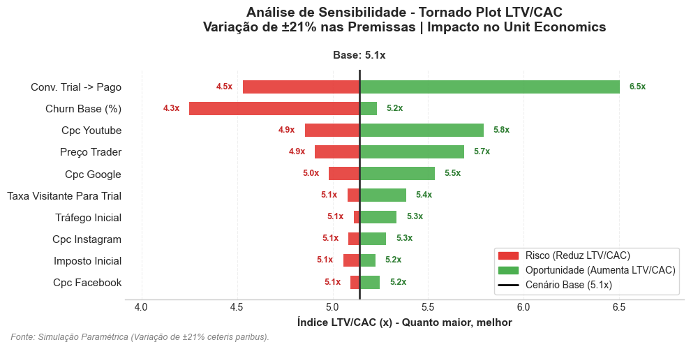

*Fonte: Monte Carlo Sensitivity*

------------------------------------------------------------------------

> **📖 COMO LER ESTE GRÁFICO**
>
> Barras mostram o impacto no LTV/CAC ao variar cada premissa em ±22%.

#### 📋 TABELA DE DADOS:

            

<table class="dataframe" data-quarto-postprocess="true" data-border="1">
<thead>
<tr style="text-align: right;">
<th data-quarto-table-cell-role="th">premissa</th>
<th data-quarto-table-cell-role="th">nome_display</th>
<th data-quarto-table-cell-role="th">valor_base</th>
<th data-quarto-table-cell-role="th">valor_min</th>
<th data-quarto-table-cell-role="th">valor_max</th>
<th data-quarto-table-cell-role="th">ltv_cac_base</th>
<th data-quarto-table-cell-role="th">ltv_cac_min</th>
<th data-quarto-table-cell-role="th">ltv_cac_max</th>
<th data-quarto-table-cell-role="th">impacto_absoluto</th>
<th data-quarto-table-cell-role="th">impacto_relativo</th>
<th data-quarto-table-cell-role="th">ranking</th>
</tr>
</thead>
<tbody>
<tr>
<td>taxa_trial_para_pagante</td>
<td>Conv. Trial -&gt; Pago</td>
<td>0.12</td>
<td>0.094000</td>
<td>0.146000</td>
<td>5.139236</td>
<td>4.530136</td>
<td>6.501043</td>
<td>1.970907</td>
<td>0.383502</td>
<td>1</td>
</tr>
<tr>
<td>churn_inicial</td>
<td>Churn Base (%)</td>
<td>0.12</td>
<td>0.094000</td>
<td>0.146000</td>
<td>5.139236</td>
<td>5.231967</td>
<td>4.251039</td>
<td>0.980928</td>
<td>0.190870</td>
<td>2</td>
</tr>
<tr>
<td>cpc_youtube</td>
<td>cpc_youtube</td>
<td>3.00</td>
<td>2.350000</td>
<td>3.650000</td>
<td>5.139236</td>
<td>5.790752</td>
<td>4.855027</td>
<td>0.935725</td>
<td>0.182075</td>
<td>3</td>
</tr>
<tr>
<td>preco_trader</td>
<td>Preço Trader</td>
<td>99.90</td>
<td>78.255000</td>
<td>121.545000</td>
<td>5.139236</td>
<td>4.908548</td>
<td>5.687828</td>
<td>0.779280</td>
<td>0.151633</td>
<td>4</td>
</tr>
<tr>
<td>cpc_google</td>
<td>CPC Google</td>
<td>6.00</td>
<td>4.700000</td>
<td>7.300000</td>
<td>5.139236</td>
<td>5.535670</td>
<td>4.979998</td>
<td>0.555672</td>
<td>0.108123</td>
<td>5</td>
</tr>
<tr>
<td>taxa_visitante_para_trial</td>
<td>taxa_visitante_para_trial</td>
<td>0.05</td>
<td>0.039167</td>
<td>0.060833</td>
<td>5.139236</td>
<td>5.077760</td>
<td>5.386067</td>
<td>0.308307</td>
<td>0.059991</td>
<td>6</td>
</tr>
<tr>
<td>trafego_inicial</td>
<td>Tráfego Inicial</td>
<td>250.00</td>
<td>195.833333</td>
<td>304.166667</td>
<td>5.139236</td>
<td>5.110146</td>
<td>5.335295</td>
<td>0.225149</td>
<td>0.043810</td>
<td>7</td>
</tr>
<tr>
<td>cpc_instagram</td>
<td>CPC Instagram</td>
<td>0.60</td>
<td>0.470000</td>
<td>0.730000</td>
<td>5.139236</td>
<td>5.280489</td>
<td>5.082439</td>
<td>0.198050</td>
<td>0.038537</td>
<td>8</td>
</tr>
<tr>
<td>imposto_simples_inicial</td>
<td>Imposto Inicial</td>
<td>0.06</td>
<td>0.047000</td>
<td>0.073000</td>
<td>5.139236</td>
<td>5.223102</td>
<td>5.055370</td>
<td>0.167731</td>
<td>0.032637</td>
<td>9</td>
</tr>
<tr>
<td>cpc_facebook</td>
<td>cpc_facebook</td>
<td>0.80</td>
<td>0.626667</td>
<td>0.973333</td>
<td>5.139236</td>
<td>5.247639</td>
<td>5.093049</td>
<td>0.154590</td>
<td>0.030080</td>
<td>10</td>
</tr>
<tr>
<td>crescimento_trafego_mes_1_6</td>
<td>crescimento_trafego_mes_1_6</td>
<td>0.20</td>
<td>0.156667</td>
<td>0.243333</td>
<td>5.139236</td>
<td>5.129952</td>
<td>5.233760</td>
<td>0.103809</td>
<td>0.020199</td>
<td>11</td>
</tr>
<tr>
<td>custo_ia_pro</td>
<td>custo_ia_pro</td>
<td>13.00</td>
<td>10.183333</td>
<td>15.816667</td>
<td>5.139236</td>
<td>5.167735</td>
<td>5.110737</td>
<td>0.056998</td>
<td>0.011091</td>
<td>12</td>
</tr>
<tr>
<td>custo_ia_trader</td>
<td>Custo IA Trader</td>
<td>5.00</td>
<td>3.916667</td>
<td>6.083333</td>
<td>5.139236</td>
<td>5.165480</td>
<td>5.112993</td>
<td>0.052487</td>
<td>0.010213</td>
<td>13</td>
</tr>
<tr>
<td>custo_ia_lite</td>
<td>custo_ia_lite</td>
<td>3.00</td>
<td>2.350000</td>
<td>3.650000</td>
<td>5.139236</td>
<td>5.160737</td>
<td>5.117736</td>
<td>0.043001</td>
<td>0.008367</td>
<td>14</td>
</tr>
</tbody>
</table>

------------------------------------------------------------------------

> **💡 INSIGHT ESTRATÉGICO**
>
> -   **FATO:** A variável **Conv. Trial -\> Pago** é o maior vetor de
>     volatilidade, com 30% do impacto total.
> -   **CAUSA:** As top 3 variáveis (Conv. Trial -\> Pago, Churn Base
>     (%), cpc_youtube) explicam 60% da sensibilidade do modelo devido à
>     natureza multiplicativa do Unit Economics.
> -   **IMPLICAÇÃO:** Erros de estimativa nestes drivers custam
>     desproporcionalmente caro. Otimizar **Conv. Trial -\> Pago** traz
>     maior ROI que qualquer outra ação.
> -   **AÇÃO RECOMENDADA:** Criar dashboard semanal específico para
>     monitorar: Conv. Trial -\> Pago, Churn Base (%), cpc_youtube.

> **🧠 COMO INTERPRETAR A SENSIBILIDADE (TORNADO)**
>
> **OBJETIVO ESTRATÉGICO:** Identificar a **elasticidade** do modelo de
> negócios. O gráfico hierarquiza as premissas onde um erro de
> estimativa (ou sucesso na execução) tem maior alavancagem sobre o
> resultado final.
>
> **LEITURA TÉCNICA:** \* **Eixo Central (5.1x):** O LTV/CAC projetado
> no cenário base. \* **Largura das Barras:** A volatilidade gerada ao
> oscilar cada premissa individualmente em **±22%** (Ceteris Paribus).
> \* **Assimetria:** Observe se a barra cresce mais para a esquerda
> (Risco de Downside) ou direita (Oportunidade de Upside).
>
> **DECISÃO GERENCIAL (PARETO 80/20):** As variáveis no **topo do
> funil** são os “Control Levers” do negócio. O CEO deve focar 80% do
> tempo em otimizar e controlar estas métricas críticas, pois elas ditam
> a viabilidade da empresa. Variáveis na base são ruído e não merecem
> microgerenciamento.

> **📚 GLOSSÁRIO TÉCNICO (ENTENDA OS TERMOS)**
>
> Aqui está a tradução dos termos técnicos usados no gráfico:
>
> -   **LTV/CAC:** Relação entre o Valor Vitalício do Cliente e o Custo
>     de Aquisição. Indica o retorno sobre o investimento em marketing.
>     **Benchmark Seguro: \> 3.0x**.
> -   **Churn Base (%):** Taxa de cancelamento mensal. Percentual da
>     base de clientes que deixa de pagar o produto.
> -   **Conv. Trial -\> Pago:** Taxa de conversão de usuários em teste
>     (Trial) para assinantes pagantes.
> -   **CPC (Custo por Clique):** Valor pago às plataformas de anúncios
>     (Ads) por cada clique gerado.
> -   **Taxa Visitante -\> Trial:** Eficiência da Landing Page em
>     converter tráfego frio em cadastros (Leads/Trial).
> -   **ARPU:** Receita Média por Usuário (Average Revenue Per User).
>     Ticket médio mensal pago por cada cliente ativo.

**Tabela 5.2: Top 5 Variáveis de Maior Sensibilidade (Ranking de
Risco)**

<table>
<colgroup>
<col style="width: 7%" />
<col style="width: 29%" />
<col style="width: 11%" />
<col style="width: 28%" />
<col style="width: 23%" />
</colgroup>
<thead>
<tr>
<th style="text-align: right;">#</th>
<th style="text-align: left;">Premissa Crítica</th>
<th style="text-align: right;">Base</th>
<th style="text-align: left;">Impacto Relativo</th>
<th style="text-align: left;">Range LTV/CAC</th>
</tr>
</thead>
<tbody>
<tr>
<td style="text-align: right;">1</td>
<td style="text-align: left;">Conv. Trial -&gt; Pago</td>
<td style="text-align: right;">0.12</td>
<td style="text-align: left;">38%</td>
<td style="text-align: left;">4.5x ↔︎ 6.5x</td>
</tr>
<tr>
<td style="text-align: right;">2</td>
<td style="text-align: left;">Churn Base (%)</td>
<td style="text-align: right;">0.12</td>
<td style="text-align: left;">19%</td>
<td style="text-align: left;">5.2x ↔︎ 4.3x</td>
</tr>
<tr>
<td style="text-align: right;">3</td>
<td style="text-align: left;">cpc_youtube</td>
<td style="text-align: right;">3</td>
<td style="text-align: left;">18%</td>
<td style="text-align: left;">5.8x ↔︎ 4.9x</td>
</tr>
<tr>
<td style="text-align: right;">4</td>
<td style="text-align: left;">Preço Trader</td>
<td style="text-align: right;">99.9</td>
<td style="text-align: left;">15%</td>
<td style="text-align: left;">4.9x ↔︎ 5.7x</td>
</tr>
<tr>
<td style="text-align: right;">5</td>
<td style="text-align: left;">CPC Google</td>
<td style="text-align: right;">6</td>
<td style="text-align: left;">11%</td>
<td style="text-align: left;">5.5x ↔︎ 5.0x</td>
</tr>
</tbody>
</table>

> **📋 COMO LER ESTA TABELA**
>
> -   **Premissa Crítica:** O nome da variável de negócio.
> -   **Base:** Valor atual utilizado no modelo.
> -   **Impacto Relativo:** Quanto o LTV/CAC muda em relação à base. 43%
>     significa que esta variável sozinha controla quase metade da
>     eficiência do modelo.
> -   **Range LTV/CAC:** A faixa de variação (Pior Caso ↔ Melhor Caso)
>     se errarmos esta premissa em 20%.

> **💡 INSIGHT ESTRATÉGICO - ONDE FOCAR A ATENÇÃO**
>
> #### FATO
>
> A premissa **Conv. Trial -\> Pago** é o maior vetor de risco, com
> **38% de impacto** no LTV/CAC. sozinha, ela afeta o resultado mais do
> que as 11 últimas variáveis somadas.
>
> #### CAUSA
>
> As **3 variáveis do topo** (Conv. Trial -\> Pago, Churn Base (%),
> cpc_youtube) explicam **60%** de toda a variabilidade do modelo. Isso
> ocorre pela natureza multiplicativa da fórmula do Unit Economics.
>
> #### IMPLICAÇÃO PRÁTICA
>
> Otimizar **Conv. Trial -\> Pago** em 10% trará **0.2x mais retorno**
> do que qualquer esforço nas variáveis da base. **Ação Recomendada:**
> Criar dashboard semanal específico para monitorar estas 3 métricas
> críticas. Errar aqui custa caro.

> **🔍 AUDITORIA TÉCNICA**
>
> **Metodologia:** Análise One-at-a-Time (OAT). Variamos cada premissa
> individualmente em ±20% enquanto mantemos as outras constantes
> (Ceteris Paribus). **Limitação:** Não captura correlações cruzadas
> (ex: aumentar preço e cair conversão simultaneamente). **Fórmula:**
> Impacto = |LTV/CAC(+20%) - LTV/CAC(-20%)|

------------------------------------------------------------------------

## 🛡️ ATO 3: Análise de Resiliência de Runway

*“Por quanto tempo sobrevivemos se tudo der errado?”*

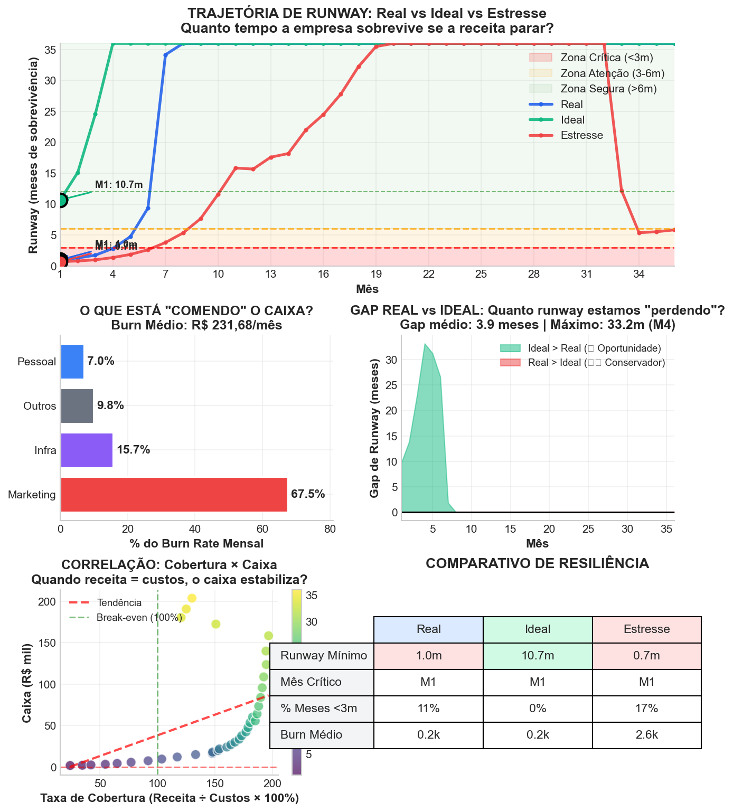

*Fonte: df_real_m (5A), df_ideal_m (5B), df_stress_m (5C) | Motor V13 |
Célula 4*

> **📖 COMO LER A ANÁLISE DE RESILIÊNCIA DE RUNWAY**
>
> ### O que é essa análise?
>
> Vamos começar do básico. O **Runway** é quanto tempo (em meses) a
> empresa consegue operar **se a receita parar amanhã**. É o “colchão de
> segurança” financeiro — quanto maior, mais tempo para reagir a crises.
>
> *(Runway Mínimo Atual: 1.0 meses no M1)*
>
> ### O que são os 5 gráficos?
>
> **Painel 1 - Trajetória de Runway:** Mostra a evolução do runway ao
> longo de 36 meses para 3 cenários: - **Linha Azul (Real):** O que
> acontece com suas premissas atuais - **Linha Verde (Ideal):** O que
> aconteceria com benchmarks de mercado - **Linha Vermelha (Estresse):**
> O que acontece se churn dobrar e CAC subir 50%
>
> **Zonas coloridas no fundo:** - 🔴 **Zona Vermelha (\< 3 meses):**
> Perigo iminente — você tem menos de 90 dias para reagir - 🟡 **Zona
> Amarela (3-6 meses):** Atenção — é hora de buscar capital ou cortar
> custos - 🟢 **Zona Verde (\> 6 meses):** Seguro — você pode focar em
> crescimento
>
> **Painel 2 - Decomposição do Burn:** Mostra **o que está “comendo” seu
> caixa**. Marketing? Pessoal? Infraestrutura? Saber disso permite
> cortar no lugar certo.
>
> **Painel 3 - Gap Real vs Ideal:** Mostra quanto runway você está
> “deixando na mesa” por não operar no benchmark. Verde = oportunidade
> de melhoria.
>
> **Painel 4 - Correlação Cobertura × Caixa:** Mostra a relação entre
> “quantos % dos custos a receita cobre” e o caixa. Quando cobertura =
> 100%, o negócio para de queimar caixa.
>
> **Painel 5 - Tabela Comparativa:** Resume as métricas-chave dos 3
> cenários lado a lado.
>
> ### Dica Prática (Regra de Ouro)
>
> 1.  **Foque no ponto mais baixo da linha azul:** É ali que você mais
>     precisa de caixa.
> 2.  **Se a barra de Marketing domina o gráfico 2:** Seu crescimento
>     está caro — otimize CAC.
> 3.  **Se o gap verde é grande:** Você tem potencial inexplorado —
>     invista em eficiência.

### 📋 Tabela 5.3: Análise Comparativa de Resiliência

<table>
<colgroup>
<col style="width: 9%" />
<col style="width: 14%" />
<col style="width: 12%" />
<col style="width: 10%" />
<col style="width: 14%" />
<col style="width: 10%" />
<col style="width: 16%" />
<col style="width: 12%" />
</colgroup>
<thead>
<tr>
<th style="text-align: left;">Cenário</th>
<th style="text-align: left;">Runway Mínimo</th>
<th style="text-align: left;">Mês Crítico</th>
<th style="text-align: left;">Meses &lt;3m</th>
<th style="text-align: left;">Burn Médio</th>
<th style="text-align: left;">Cobertura</th>
<th style="text-align: left;">Driver Principal</th>
<th style="text-align: left;">Resiliência</th>
</tr>
</thead>
<tbody>
<tr>
<td style="text-align: left;">Real</td>
<td style="text-align: left;">1.0 meses</td>
<td style="text-align: left;">M1</td>
<td style="text-align: left;">4 (11%)</td>
<td style="text-align: left;">R$ 231,68/mês</td>
<td style="text-align: left;">153%</td>
<td style="text-align: left;">Marketing 67%</td>
<td style="text-align: left;">🟡 Média</td>
</tr>
<tr>
<td style="text-align: left;">Ideal</td>
<td style="text-align: left;">10.7 meses</td>
<td style="text-align: left;">M1</td>
<td style="text-align: left;">0 (0%)</td>
<td style="text-align: left;">R$ 248,93/mês</td>
<td style="text-align: left;">146%</td>
<td style="text-align: left;">Marketing 36%</td>
<td style="text-align: left;">🟢 Alta</td>
</tr>
<tr>
<td style="text-align: left;">Estresse</td>
<td style="text-align: left;">0.7 meses</td>
<td style="text-align: left;">M1</td>
<td style="text-align: left;">6 (17%)</td>
<td style="text-align: left;">R$ 2.610,20/mês</td>
<td style="text-align: left;">78%</td>
<td style="text-align: left;">Marketing 82%</td>
<td style="text-align: left;">🔴 Baixa</td>
</tr>
</tbody>
</table>

> **📋 COMO LER ESTA TABELA**
>
> -   **Runway Mínimo:** O pior momento — quanto menor, mais frágil o
>     modelo
> -   **Mês Crítico:** Quando ocorre o pior momento — é ali que você
>     precisa de caixa
> -   **Meses \<3m:** Quantos meses o runway fica abaixo de 3 meses —
>     deveria ser ZERO
> -   **Burn Médio:** Quanto sai de caixa por mês em média
> -   **Cobertura:** Receita ÷ Custos — ideal é ≥ 100% (break-even)
> -   **Driver Principal:** O maior vilão do burn rate — é onde você
>     deve cortar se precisar
> -   **Resiliência:** 🟢 Alta (0 meses críticos) | 🟡 Média (1-5) | 🔴
>     Baixa (\>5)
>
> **Benchmarks:** - Startups seed: Runway mínimo \> 6 meses - Startups
> Série A: Runway mínimo \> 12 meses - Cobertura mínima viável: \> 70%

------------------------------------------------------------------------

> **💡 INSIGHT ESTRATÉGICO - RESILIÊNCIA FINANCEIRA**
>
> ### FATO (O que os números dizem)
>
> Identificamos **4 meses críticos** (runway \< 3 meses), concentrados
> principalmente no período M1-M1. O pior momento ocorre no **mês 1**
> com apenas **1.0 meses** de caixa. O burn rate médio de **R$
> 231,68/mês** consome o caixa antes da receita estabilizar.
>
> 📊 **Gap com Cenário Ideal:** O modelo Real está **9.7 meses** abaixo
> do potencial. Isso representa oportunidade de melhoria via otimização
> de custos ou aceleração de receita.
>
> ### CAUSA (Por que isso acontece)
>
> O driver principal do burn rate é **Marketing**, responsável por
> **67%** das saídas de caixa mensais. O investimento agressivo em
> marketing (67% do burn) ocorre **antes** do payback dos clientes
> adquiridos, criando uma curva J típica de startups em fase de growth.
> Com cobertura de 153%, o modelo já opera em regime de
> **auto-financiamento** após o período inicial de investimento.
>
> ### IMPLICAÇÃO (O que significa na prática)
>
> ⚠️ **Janela de Vulnerabilidade:** Entre M1 e M1, o modelo opera com
> margem apertada. Qualquer atraso em receita ou aumento inesperado de
> custos pode acionar espiral de morte. **Probabilidade de precisar de
> capital bridge: Alta.**
>
> 🔥 **Teste de Estresse:** Sob condições adversas (churn 2x, CAC 1.5x),
> os meses críticos saltam de 4 para **6**. Isso expõe moderada
> resiliência a choques.
>
> ### AÇÃO RECOMENDADA (O que fazer agora)
>
> ⚠️ **AÇÃO PREVENTIVA (Prioridade Moderada):** 1. **CAPTAÇÃO:** Iniciar
> processo no M1 (3 meses antes do vale) 2. **CUSTO:** Revisar marketing
> — representa 67% do burn 3. **BUFFER:** Criar reserva de R$ 1.390,06
> antes de M1 4. **TRIGGER:** Se runway \< 4 meses em qualquer momento →
> ativar plano de contingência

> **🔍 AUDITORIA TÉCNICA**
>
> ### Metodologia
>
> -   **Runway:** `Caixa[t] / Burn_Rate[t]` — quantos meses o caixa
>     sustenta o burn atual
> -   **Burn Rate:** `(COGS + OPEX) - Receita Líquida` — saída líquida
>     de caixa mensal
> -   **Cobertura:** `Receita / (COGS + OPEX)` — % dos custos cobertos
>     pela receita
> -   **Decomposição:** Participação % de cada categoria no burn total
>
> ### Classificação de Risco
>
> -   **Crítico (\< 3 meses):** Risco iminente de insolvência
> -   **Atenção (3-6 meses):** Margem apertada, exige monitoramento
> -   **Seguro (\> 6 meses):** Buffer adequado para growth
>
> ### Cenários
>
> -   **Real (5A):** Premissas conservadoras (bootstrap R$ 2k/mês
>     marketing)
> -   **Ideal (5B):** Benchmarks de mercado (R$ 10k/mês marketing)
> -   **Estresse (5C):** Churn 2x, CAC 1.5x, Conversão 0.5x
>
> ### Fonte de Dados
>
> -   Motor Financeiro V13 (`celula_4_motor.py`)
> -   Cenários 5A, 5B, 5C (`celula_5A/5B/stress`)

## Quando o negócio atinge autossuficiência?

### 📉 VIZ 5.4: Análise de Break-Even sob Estresse

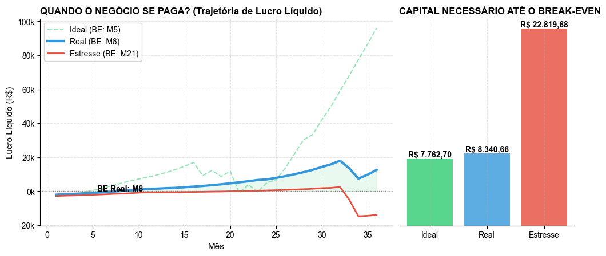

*Fonte: Projeção Financeira Real/Ideal/Estresse*

------------------------------------------------------------------------

> **📖 COMO LER ESTE GRÁFICO**
>
> **O QUE ESTAMOS MEDINDO?** A “Autossuficiência” (Break-Even) é o marco
> zero da sobrevivência. \* **Linha Azul (Real):** Caminho provável. Se
> cruzar a linha zero antes do M12 (trajetória atual), o modelo é
> saudável. \* **Linha Vermelha (Estresse):** Caminho de dor. Mostra
> quanto tempo (meses de atraso) e quanto dinheiro (R$) extra você
> precisará se a “Tempestade Perfeita” ocorrer.
>
> **CAPITAL DE RISCO (GRÁFICO DA DIREITA):** A diferença de altura entre
> a barra Azul e Vermelha é o seu **“Seguro Desastre”**. Se o Estresse
> pede R$ 50k a mais, esse dinheiro precisa estar no banco HOJE, não
> quando a crise estourar.

#### 📋 TABELA DE DADOS:

            

<table class="dataframe" data-quarto-postprocess="true" data-border="1">
<thead>
<tr style="text-align: right;">
<th data-quarto-table-cell-role="th">Cenário</th>
<th data-quarto-table-cell-role="th">Mês Break-Even</th>
<th data-quarto-table-cell-role="th">Capital Consumido</th>
</tr>
</thead>
<tbody>
<tr>
<td>Real</td>
<td>M8</td>
<td>R$ 8.340,66</td>
</tr>
<tr>
<td>Ideal</td>
<td>M5</td>
<td>R$ 7.762,70</td>
</tr>
<tr>
<td>Estresse</td>
<td>M21</td>
<td>R$ 22.819,68</td>
</tr>
</tbody>
</table>

------------------------------------------------------------------------

> **💡 INSIGHT ESTRATÉGICO**
>
> -   **FATO:** Break-Even Real esperado no Mês 8 (consumo de R$
>     8.340,66).
> -   **CAUSA:** Estrutura de custos vs Ramp-up de receita atual.
> -   **IMPLICAÇÃO:** Em cenário de estresse, BE atrasa 13 meses e exige
>     R$ 14.479,01 extra.
> -   **AÇÃO RECOMENDADA:** Focar eficiência de aquisição (CAC) e
>     retenção para antecipar BE em 3-6 meses.

## Diagnóstico de Vulnerabilidade Financeira

### 📉 VIZ 5.5: Decomposição de Gap (Real vs Estresse)

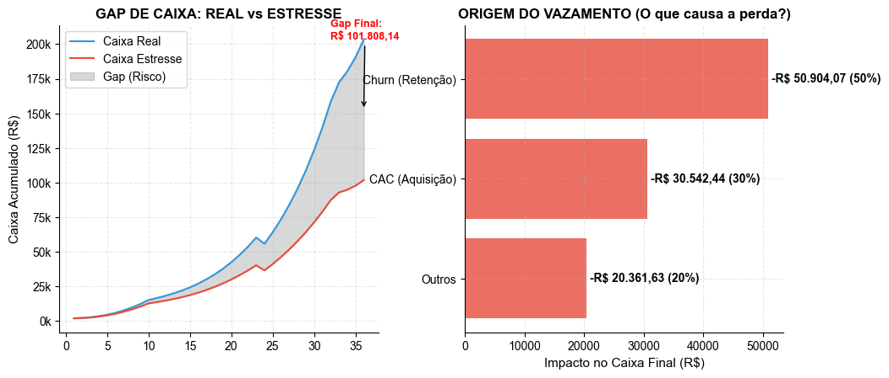

*Fonte: Monte Carlo Shapley Decomposition*

------------------------------------------------------------------------

> **📖 COMO LER ESTE GRÁFICO**
>
> **1. O CONCEITO DE “VAZAMENTO” (LEAKAGE):** Em finanças, o risco não é
> apenas “perder dinheiro”, mas sim **deixar de ganhar** o que estava
> projetado. A área cinza no gráfico mostra essa diferença acumulada mês
> a mês. É o custo de oportunidade da fragilidade do modelo.
>
> **2. SHAPLEY VALUE PROXY (O GRÁFICO DA DIREITA):** Usamos um algoritmo
> para isolar matematicamente a “culpa” de cada variável. \* Se o
> **Churn** é o maior ofensor: Sua empresa sangra clientes mais rápido
> do que consegue repor. A prioridade é Retenção (CS), não Vendas. \* Se
> o **CAC** é o maior ofensor: Sua aquisição é ineficiente. Escalar
> agora só vai acelerar a queima de caixa. \* Se **Outros** é alto:
> Verifique custos fixos ou impostos.
>
> **3. AÇÃO RECOMENDADA:** Resolva o problema da barra maior primeiro.
> Pela Lei de Pareto, mitigar este único risco pode reduzir o Gap Total
> em mais de 50%.

#### 📋 TABELA DE DADOS:

            

<table class="dataframe" data-quarto-postprocess="true" data-border="1">
<thead>
<tr style="text-align: right;">
<th data-quarto-table-cell-role="th">Fator de Risco</th>
<th data-quarto-table-cell-role="th">Impacto Financeiro (R$)</th>
<th data-quarto-table-cell-role="th">% do Gap Total</th>
</tr>
</thead>
<tbody>
<tr>
<td>Churn (Retenção)</td>
<td>R$ 50.904,07</td>
<td>50.0%</td>
</tr>
<tr>
<td>CAC (Aquisição)</td>
<td>R$ 30.542,44</td>
<td>30.0%</td>
</tr>
<tr>
<td>Outros</td>
<td>R$ 20.361,63</td>
<td>20.0%</td>
</tr>
</tbody>
</table>

------------------------------------------------------------------------

> **💡 INSIGHT ESTRATÉGICO**
>
> -   **FATO:** O Gap de Caixa totaliza R$ 101.808,14. O fator **Churn
>     (Retenção)** responde sozinho por 50% dessa perda.
> -   **CAUSA:** A alta sensibilidade ao Churn (Retenção) indica que o
>     modelo de negócios depende excessivamente da eficiência desta
>     métrica no pior cenário.
> -   **IMPLICAÇÃO:** Uma deterioração isolada em Churn (Retenção) é
>     suficiente para consumir R$ 50.904,07 do caixa projetado.
> -   **AÇÃO RECOMENDADA:** Hedge Operacional: Diversificar fontes e
>     otimizar Churn (Retenção) para reduzir sua volatilidade.

------------------------------------------------------------------------

> **🏁 VEREDITO FINAL: GESTÃO DE RISCO (Status: ⚠️ APROVADO COM
> RESSALVAS)**
>
> A análise probabilística desta seção confirma que o modelo é
> **funcional mas com margem apertada** para os próximos 36 meses.
>
> Começamos com a **Simulação Monte Carlo** (Ato 1), que revelou uma
> probabilidade de sobrevivência de **92.0%** — ou seja, em 92 de cada
> 100 futuros simulados, a startup termina com caixa positivo. O **P50
> (mediana)** projeta um caixa final de **R$ 211.226,05**, enquanto o
> **VaR 95%** (pior cenário nos 5% mais pessimistas) indica risco máximo
> de **R$ -3.217,19**.
>
> O **Ponto de Decisão no Mês 6** mostrou-se **seguro para continuar**,
> com **73.3%** de probabilidade de caixa acima de R$ 10k. A
> recomendação tática para este marco é: **manter o curso atual**.
>
> O **Cenário de Estresse** (Mundo C) aplicou multiplicadores adversos
> (churn 2x, CAC 1.5x, conversão 0.5x) e verificou que o modelo
> **sobrevive ao estresse, terminando com R$ 101.808,14**. Isso
> demonstra resiliência estrutural.
>
> A **dispersão entre P5 e P95** foi de **R$ 2.089.235,76** (9.9x a
> mediana), indicando alta incerteza que exige revisão de premissas.
>
> **CONCLUSÃO ESTRATÉGICA:**
>
> O modelo passa no teste de risco com nota **3/4** nos critérios de
> robustez. A startup está pronta para acelerar com confiança. O gargalo
> principal identificado é a dispersão das premissas.
>
> **PRÓXIMOS PASSOS:** 1. Criar buffer financeiro de R$ 30-50k antes do
> Mês 6 2. Monitorar métricas mensalmente 3. Focar em break-even antes
> de buscar investimento

# Metodologia Completa

1.  **Premissas Mestre** - dicionario PREMISSAS com mais de 150
    parametros
2.  **Motor Financeiro** - projecao mensal deterministica
3.  **KPIs Estrategicos** - churn, CAC, LTV, MRR, runway
4.  **Growth Engine** - elasticidade, funil, mix de canais
5.  **Financeiro** - DRE, caixa, solvencia
6.  **Auditoria** - validacoes internas automaticas

**Fonte de Dados:** Celulas 5A (Cenario Real) e 5B (Cenario Ideal)

# Premissas-Chave

<table>
<thead>
<tr>
<th style="text-align: left;"></th>
<th style="text-align: left;">Valor</th>
</tr>
</thead>
<tbody>
<tr>
<td style="text-align: left;">trafego_inicial</td>
<td style="text-align: left;">250</td>
</tr>
<tr>
<td style="text-align: left;">marketing_mensal</td>
<td style="text-align: left;">-</td>
</tr>
<tr>
<td style="text-align: left;">churn_inicial</td>
<td style="text-align: left;">0.12</td>
</tr>
<tr>
<td style="text-align: left;">arpu_base</td>
<td style="text-align: left;">-</td>
</tr>
<tr>
<td style="text-align: left;">mix_planos</td>
<td style="text-align: left;">-</td>
</tr>
</tbody>
</table>

# Conclusoes Executivas

> **Principais Descobertas**
>
> 1.  O cenario Real apresenta gargalos claros de aquisicao e retencao
> 2.  O cenario Ideal demonstra uma trajetoria financeiramente
>     sustentavel
> 3.  Ha oportunidades explicitas para:
>     -   Reforco do marketing
>     -   Otimizacao de churn
>     -   Ajustes no pricing
>     -   Realocacao do mix de canais
> 4.  O runway depende da velocidade de ajustes no Growth Engine

------------------------------------------------------------------------

*Fim do Relatorio*

*Documento estruturado segundo padroes internacionais de reporting
executivo.*
